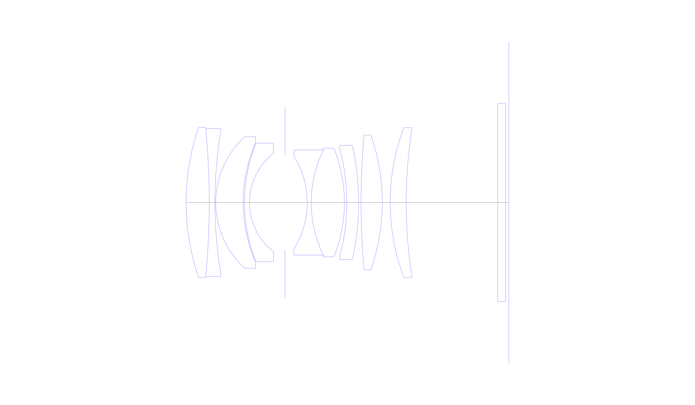
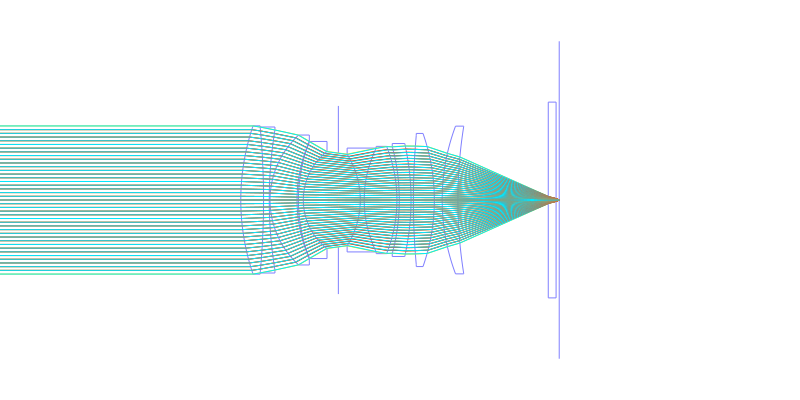
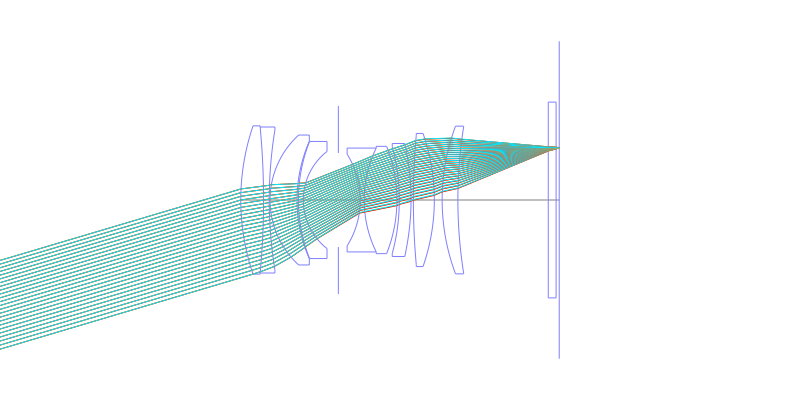
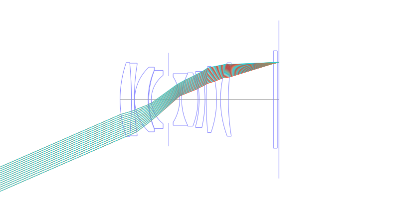
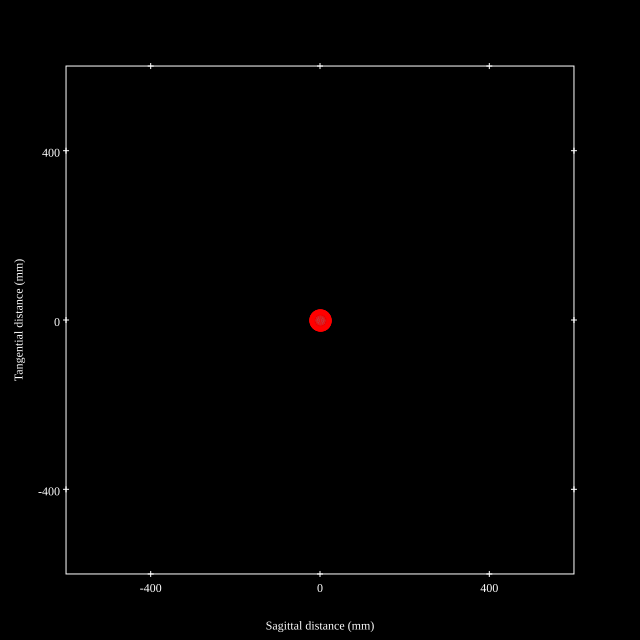
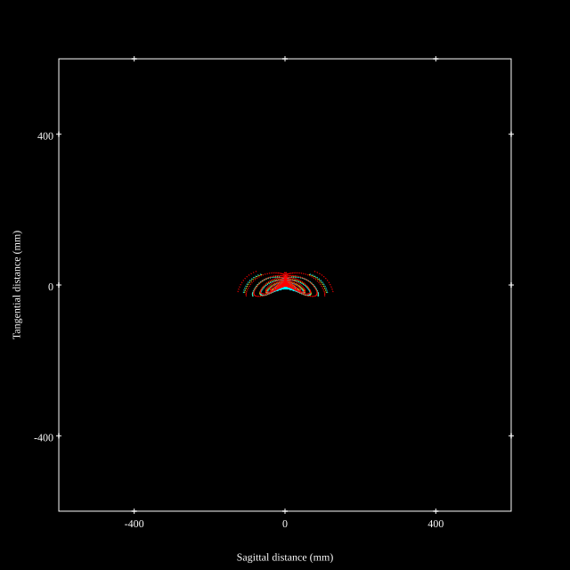
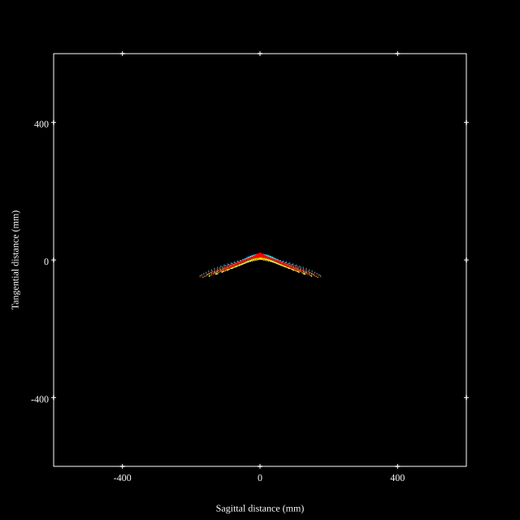
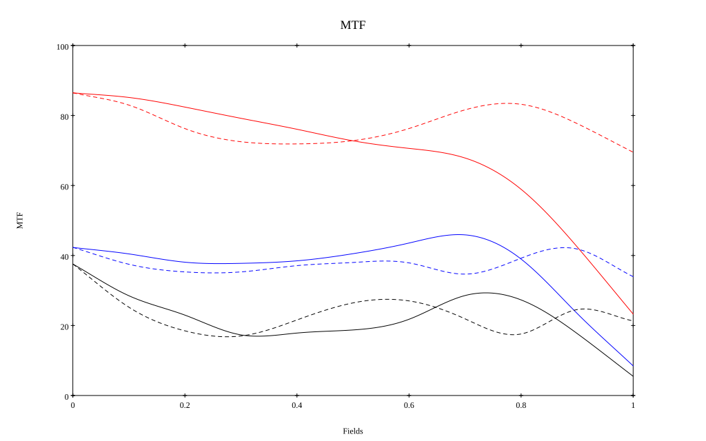
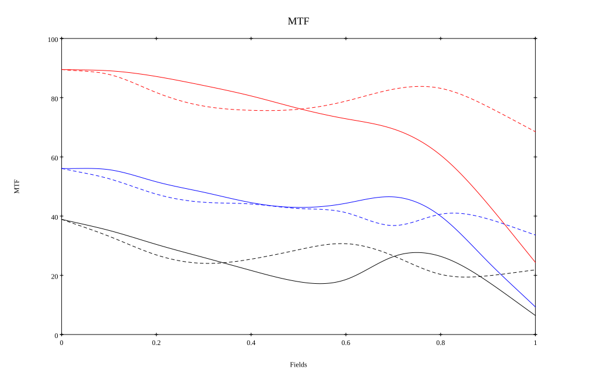

# Canon RF 45mm F1.2 STM
## Patent Information
| Country | Patent Number | Example | Year of Application | Inventors | Organisation | Link |
| ---     | ---           | ---     | ---                 | ---       | ---          | ---  |
|US | US20260194735 | 1 | 2025 | Natsuki Abe | canon Inc | [link](tbc) |
## Surface Data
Note that where glass types are shown the refractive index and abbe number is as per assigned glass type

| ID  | Radius | Thickness | Diameter | nd  | vd  | Glass Make | Glass |
| --- | ---    | ---       | ---      | --- | --- | ---        | ---   |
| 1 | 58.809 | 5.82 | 37.87 | 1.91082 | 35.25 | Hoya | TAFD35 |
| 2 | -199.152 | 1.45 | 37.29 | 1.68893 | 31.08 | Ohara | S-TIM28 |
| 3 | 111.296 | 0.2 | 35.82 |  |  |  |
| 4 | 22.473 | 6.9 | 33.18 | 1.95375 | 32.32 | Ohara | S-LAH98 |
| 5 | 37.446 | 0.35 | 30.0 |  |  |  |
| 6 | 40.746 | 1.25 | 29.91 | 1.84666 | 23.88 | Ohara | S-NPH53 |
| 7 | 15.729 | 8.95 | 24.8 |  |  |  |
| 8 | AS | 5.6 | 24.03 |  |  |  |
| 9 | -22.093 | 1.0 | 23.42 | 1.84666 | 23.88 | Ohara | S-NPH53 |
| 10 | 30.212 | 8.36 | 26.52 | 1.95375 | 32.32 | Ohara | S-LAH98 |
| 11 | -36.844 | 0.6 | 27.4 |  |  |  |
| 12 | -55.44 | 3.0 | 27.25 | 1.53504 | 55.7 |  |
| 13 | -64.575 | 0.6 | 28.85 |  |  |  |
| 14 | 185.451 | 5.35 | 33.03 | 1.83481 | 42.71 | Ohara | S-LAH55 |
| 15 | -51.445 | 2.0 | 34.0 |  |  |  |
| 16 | 53.806 | 4.02 | 37.73 | 1.6968 | 55.53 | Ohara | S-LAL14 |
| 17 | 119.308 | 23.08 | 37.61 |  |  |  |
| 18 | 0.0 | 2.0 | 50.0 | 1.51633 | 64.14 | Ohara | S-BSL7 |
| 19 | 0.0 | 0.8 | 50.0 |  |  |  |
## Aspherical Data
| ID  | Type | k   | P1 | P2 | P3 | P4 | P5 | P6 |
| --- | --- | --- | --- | --- | --- | --- | --- | --- |
| 12| EVEN | 0.0 | 0.0 | -4.13127E-6 | 3.26661E-8 | -3.30309E-10 | 1.45131E-12 | -2.20726E-15 |
| 13| EVEN | 0.0 | 0.0 | -1.05724E-6 | 2.61774E-8 | -2.11056E-10 | 8.70223E-13 | -1.17242E-15 |
## Layouts

## Spot Diagrams

## Paraxial Parameters
| parameter | value |
| ---       | ---   |
| effective_focal_length |46.352
| back_focal_length | 0.876
| optical_invariant | 8.28
| object_distance | 1.0E10
| image_distance | 0.876
| power | 0.022
| pp1_H | 45.554
| ppk_H' | -45.476
| ffl_F | -0.798
| fno | 1.224
| enp_dist_P | 30.707
| enp_radius | 18.939
| exp_dist_P' | -67.244
| exp_radius | 27.865
| m | -0
| red | -2.1574119098765722E8
| n_obj | 1
| n_img | 1
| img_ht | 20.265
| obj_ang | 23.615
| obj_na | 0
| img_na | -0.378|
## Spot Analysis
| Field | Spot Mean Radius | Spot Max Radius |
| ---   | ---              | ---             |
 | Field(x=0.0, y=0.0) | 11.953 | 24.673|
 | Field(x=0.0, y=0.1) | 13.405 | 41.689|
 | Field(x=0.0, y=0.2) | 16.037 | 60.345|
 | Field(x=0.0, y=0.3) | 18.523 | 71.463|
 | Field(x=0.0, y=0.4) | 20.035 | 73.264|
 | Field(x=0.0, y=0.5) | 20.994 | 84.131|
 | Field(x=0.0, y=0.6) | 22.945 | 99.511|
 | Field(x=0.0, y=0.7) | 27.782 | 127.016|
 | Field(x=0.0, y=0.8) | 35.089 | 154.729|
 | Field(x=0.0, y=0.9) | 43.715 | 176.768|
 | Field(x=0.0, y=1.0) | 52.493 | 182.378|
## Polychromatic Geometric MTF

* 10=red,30=blue,50=black cycles/mm
* Solid lines represent sagittal, dashed lines tangential
* To generate above, MTFs for wavelengths 587.5618(d), 486.1327(F), 656.2725(C) were calculated across 10 fields, and then averaged
## Polychromatic Geometric MTF (Weighted)

* 10=red,30=blue,50=black cycles/mm
* Solid lines represent sagittal, dashed lines tangential
* To generate above, MTFs for wavelengths 587.5618(d) wt(1.0), 656.2725(C) wt(0.475), 546.074(e) wt(0.98), 486.1327(F) wt(0.49), 435.8343(g) wt(0.15) were calculated across 10 fields, and then combined using weighted average
## Resources
* [OpticalBench Compatible Data File, tab delimited](./prescription.txt)
* [Zemax file](./US20260194735_Example01P.zmx)

Report / Zemax file generated using [Beam42](https://github.com/BeamFour/Beam42) on 2026-07-12
