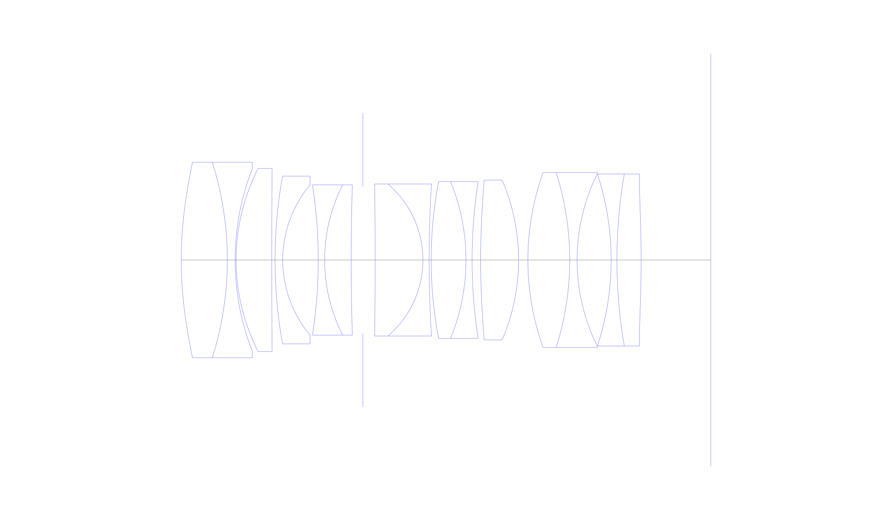
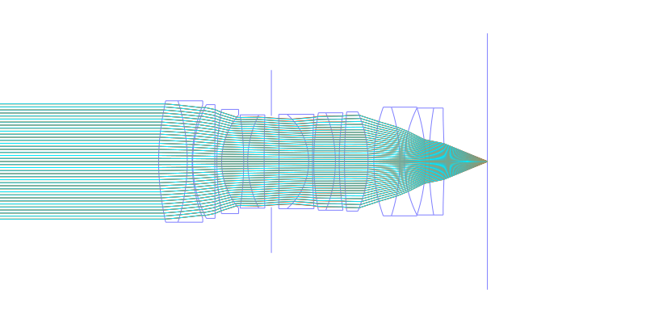
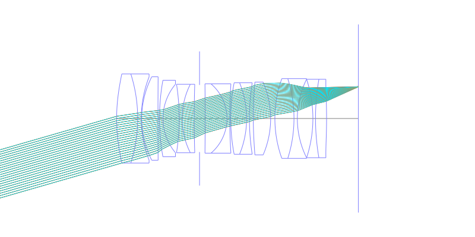
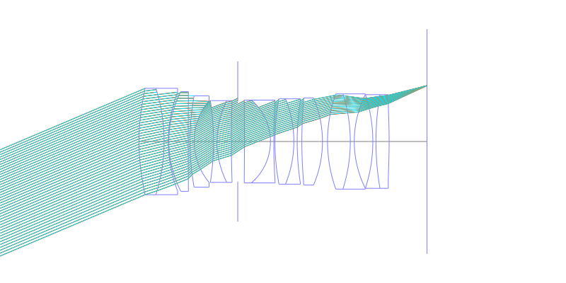
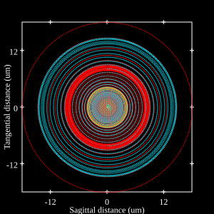
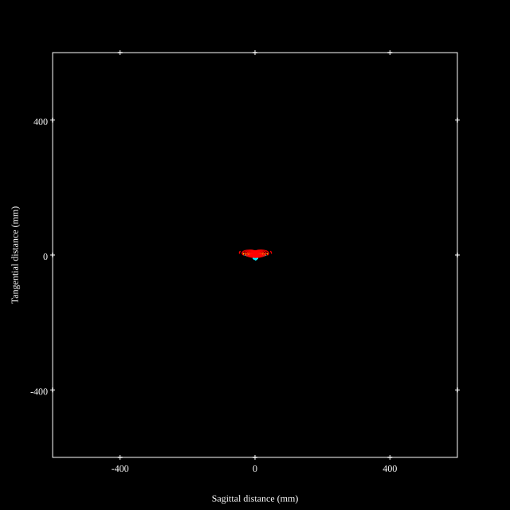
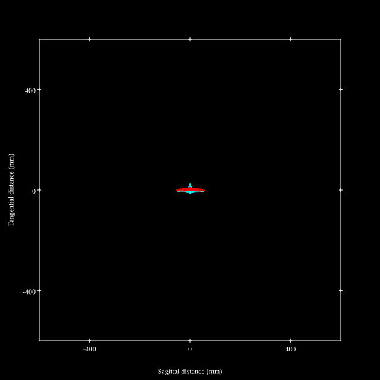
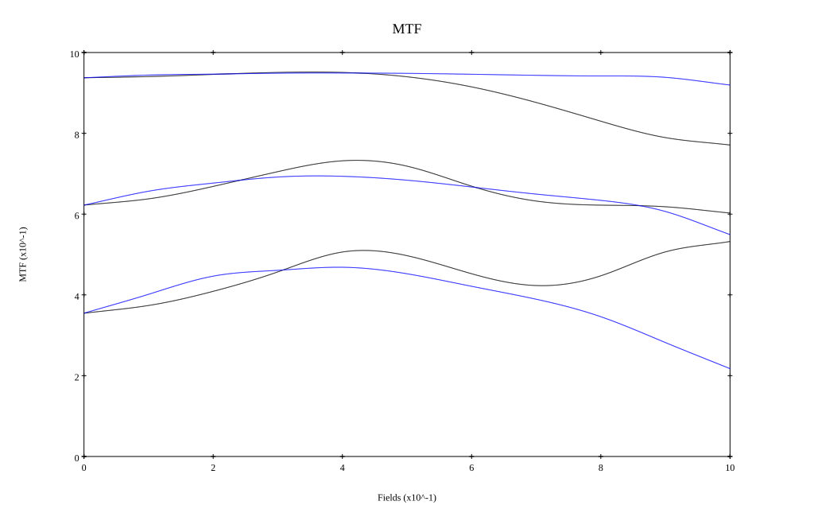
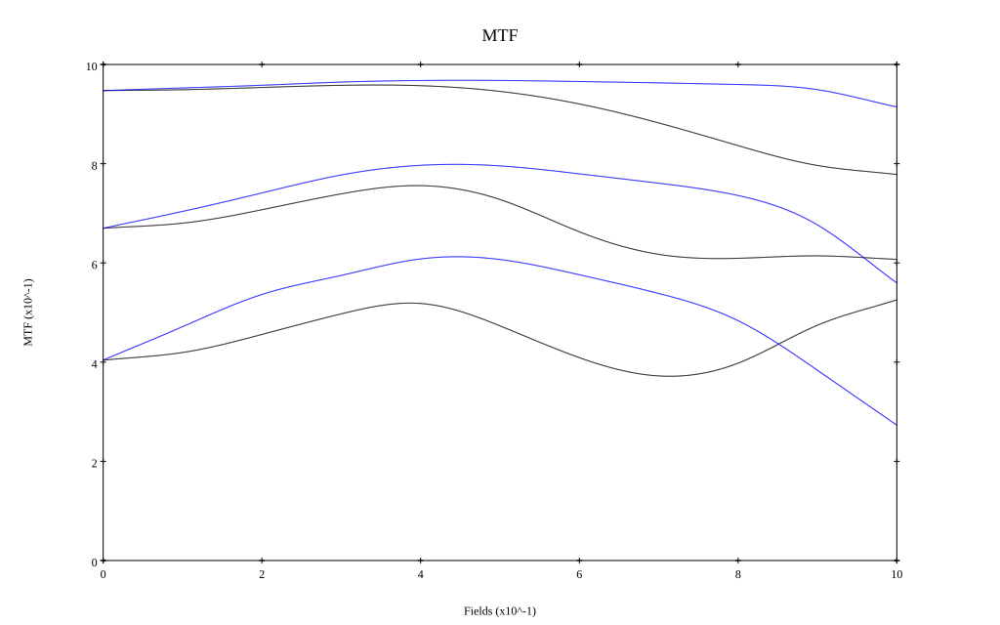

# Canon RF 50mm F1.2 L USM
## Patent Information
| Country | Patent Number | Example | Year of Application | Inventors | Organisation | Link |
| ---     | ---           | ---     | ---                 | ---       | ---          | ---  |
|US | US20190265441 | 2 | 2018 | Masato Katayose | canon Inc | [link](https://patents.google.com/patent/US20190265441A1/en) |
## Surface Data
Note that where glass types are shown the refractive index and abbe number is as per assigned glass type

| ID  | Radius | Thickness | Diameter | nd  | vd  | Glass Make | Glass |
| --- | ---    | ---       | ---      | --- | --- | ---        | ---   |
| 1 | 80.11 | 9.67 | 41.0 | 1.804 | 46.58 | Ohara | S-LAH65V |
| 2 | -68.243 | 1.64 | 41.0 | 1.68893 | 31.08 | Ohara | S-TIM28 |
| 3 | 52.862 | 0.2 | 38.29 |  |  |  |
| 4 | 42.184 | 7.47 | 38.4 | 2.001 | 29.14 | Ohara | S-LAH99 |
| 5 | 2510.58 | 0.7 | 38.4 |  |  |  |
| 6 | 99.979 | 1.6 | 35.2 | 1.65412 | 39.68 | Ohara | S-NBH5 |
| 7 | 24.508 | 7.45 | 31.52 |  |  |  |
| 8 | -101.919 | 1.34 | 31.51 | 1.66565 | 35.64 |  |
| 9 | 34.799 | 5.56 | 31.51 | 1.95375 | 32.32 | Ohara | S-LAH98 |
| 10 | 516.053 | 2.44 | 31.51 |  |  |  |
| 11 | AS | 2.58 | 30.871 |  |  |  |
| 12 | -1398.232 | 10.02 | 31.9 | 1.497 | 81.55 | Ohara | S-FPL51 |
| 13 | -20.985 | 1.29 | 31.9 | 1.738 | 32.33 | Ohara | S-NBH53V |
| 14 | 251.143 | 0.44 | 31.9 |  |  |  |
| 15 | 87.566 | 7.29 | 32.9 | 1.76385 | 48.49 | Ohara | S-LAH96 |
| 16 | -43.447 | 1.28 | 32.9 | 1.66565 | 35.64 |  |
| 17 | 105.692 | 1.79 | 32.9 |  |  |  |
| 18 | 161.695 | 7.96 | 33.5 | 1.883 | 40.77 | Ohara | S-LAH58 |
| 19 | -42.423 | 1.95 | 33.5 |  |  |  |
| 20 | 54.474 | 8.77 | 36.7 | 1.883 | 40.77 | Ohara | S-LAH58 |
| 21 | -60.531 | 1.54 | 36.7 | 1.59551 | 39.24 | Ohara | S-TIM8 |
| 22 | 40.56 | 7.14 | 36.1 |  |  |  |
| 23 | -58.17 | 1.21 | 36.1 | 1.673 | 38.26 | Ohara | S-NBH52V |
| 24 | 105.985 | 5.08 | 36.1 | 1.804 | 46.58 | Ohara | S-LAH65V |
| 25 | -216.191 | 14.6 | 36.1 |  |  |  |
## Aspherical Data
| ID  | Type | k   | P1 | P2 | P3 | P4 | P5 | P6 | P7 |
| --- | --- | --- | --- | --- | --- | --- | --- | --- | --- |
| 1| EVEN | 0.0 | 0.0 | -1.44652E-6 | -1.02693E-9 | 1.91678E-12 | -3.07794E-15 | 2.00476E-18 | 0  |
| 18| EVEN | 0.0 | 0.0 | -2.17027E-6 | 4.00496E-9 | -1.90948E-11 | 4.86536E-14 | -4.89586E-17 | 0.0 |
| 25| EVEN | 0.0 | 0.0 | 3.50064E-6 | -5.9867E-10 | 1.34319E-11 | -2.56798E-14 | 2.5993E-17 | 0  |
## Layouts

## Spot Diagrams

## Paraxial Parameters
| parameter | value |
| ---       | ---   |
| effective_focal_length |51.1
| back_focal_length | 14.6
| optical_invariant | 8.655
| object_distance | 1.0E10
| image_distance | 14.6
| power | 0.02
| pp1_H | 47.059
| ppk_H' | -36.5
| ffl_F | -4.04
| fno | 1.25
| enp_dist_P | 36.373
| enp_radius | 20.44
| exp_dist_P' | -50.012
| exp_radius | 25.845
| m | -0
| red | -1.956953247939985E8
| n_obj | 1
| n_img | 1
| img_ht | 21.638
| obj_ang | 22.95
| obj_na | 0
| img_na | -0.371|
## Spot Analysis
| Field | Spot Mean Radius | Spot Max Radius |
| ---   | ---              | ---             |
 | Field(x=0.0, y=0.0) | 7.332 | 14.949|
 | Field(x=0.0, y=0.1) | 7.001 | 17.349|
 | Field(x=0.0, y=0.2) | 6.835 | 17.84|
 | Field(x=0.0, y=0.3) | 6.695 | 27.05|
 | Field(x=0.0, y=0.4) | 6.741 | 30.916|
 | Field(x=0.0, y=0.5) | 7.259 | 35.851|
 | Field(x=0.0, y=0.6) | 8.353 | 41.461|
 | Field(x=0.0, y=0.7) | 9.89 | 48.029|
 | Field(x=0.0, y=0.8) | 11.73 | 54.666|
 | Field(x=0.0, y=0.9) | 13.437 | 59.111|
 | Field(x=0.0, y=1.0) | 14.257 | 57.055|
## Polychromatic Geometric MTF

* 10=red,30=blue,50=black cycles/mm
* Solid lines represent sagittal, dashed lines tangential
* To generate above, MTFs for wavelengths 587.5618(d), 486.1327(F), 656.2725(C) were calculated across 10 fields, and then averaged
## Polychromatic Geometric MTF (Weighted)

* 10=red,30=blue,50=black cycles/mm
* Solid lines represent sagittal, dashed lines tangential
* To generate above, MTFs for wavelengths 587.5618(d) wt(1.0), 656.2725(C) wt(0.475), 546.074(e) wt(0.98), 486.1327(F) wt(0.49), 435.8343(g) wt(0.15) were calculated across 10 fields, and then combined using weighted average
## Resources
* [OpticalBench Compatible Data File, tab delimited](./prescription.txt)
* [Zemax file](./canon-rf-50mmf1.2.zmx)

Report / Zemax file generated using [Beam42](https://github.com/BeamFour/Beam42) on 2026-07-12
