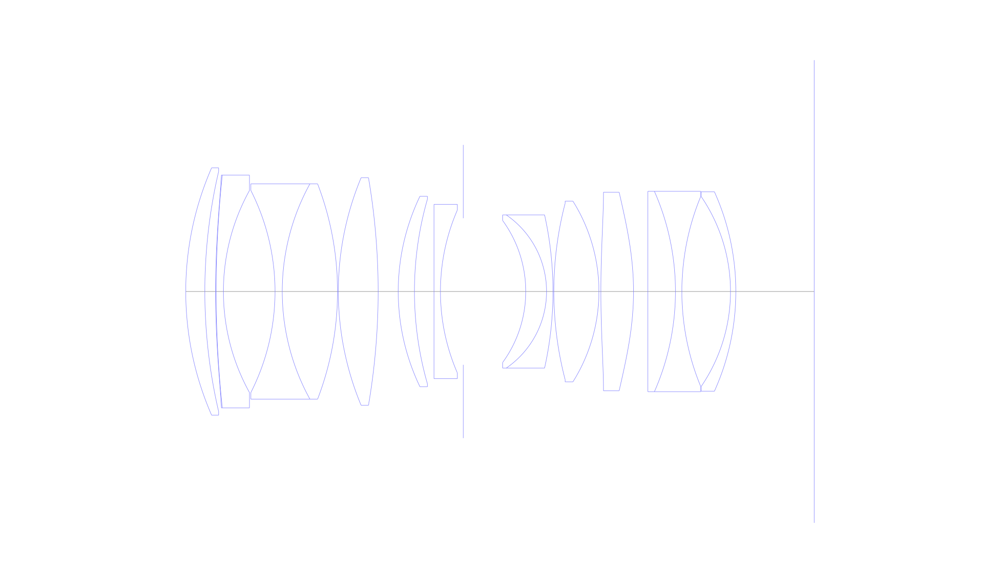
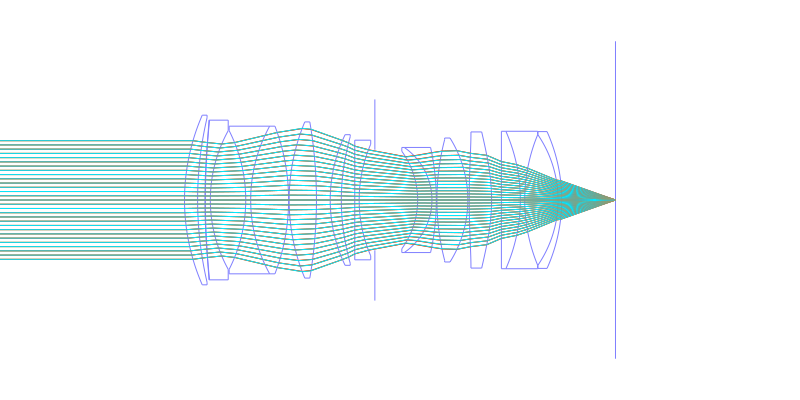
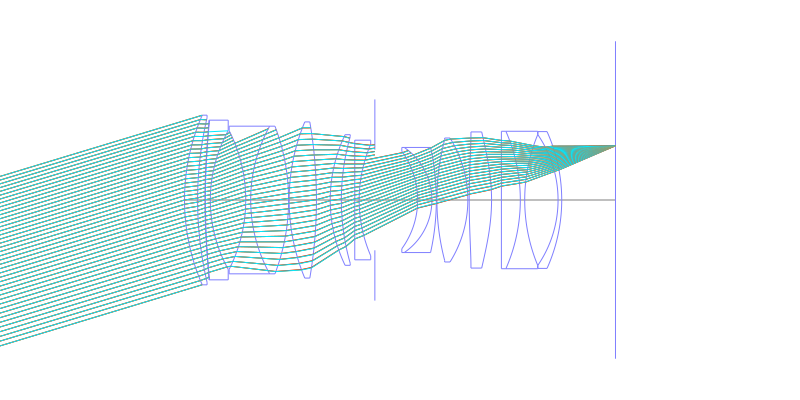
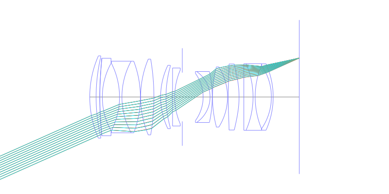
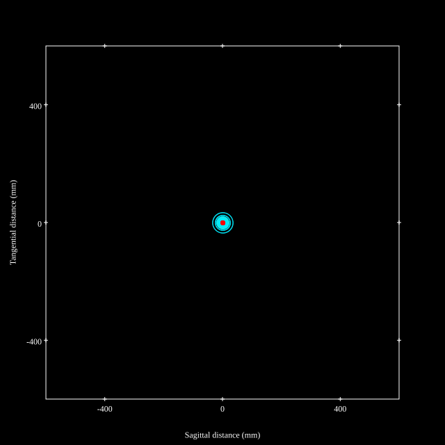
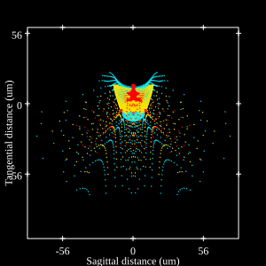
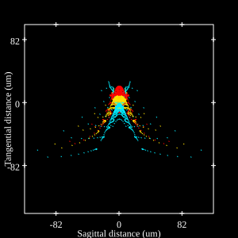
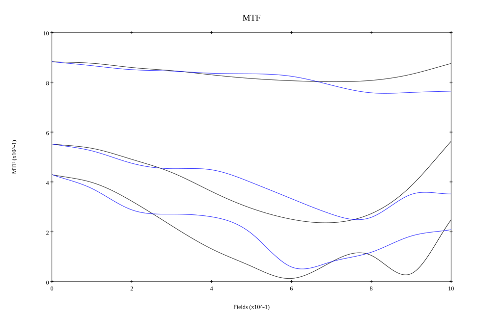
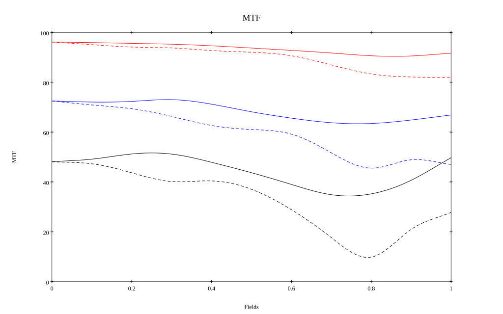

# Canon RF 50mm F1.4L VCM
## Patent Information
| Country | Patent Number | Example | Year of Application | Inventors | Organisation | Link |
| ---     | ---           | ---     | ---                 | ---       | ---          | ---  |
|US | US20250251576 | 1 | 2025 | INO TOMOHIRO | canon Inc | [link](https://worldwide.espacenet.com/patent/search?q=pn%3DUS2025251576A1) |
## Surface Data
Note that where glass types are shown the refractive index and abbe number is as per assigned glass type

| ID  | Radius | Thickness | Diameter | nd  | vd  | Glass Make | Glass |
| --- | ---    | ---       | ---      | --- | --- | ---        | ---   |
| 1 | 57.769 | 3.57 | 46.26 | 1.92286 | 20.88 | Hoya | M-FDS1 |
| 2 | 99.001 | 2.01 | 44.9 |  |  |  |
| 3 | 174.69 | 0.11 | 43.54 | 1.53352 | 52.8 |  |
| 4 | 207.351 | 1.35 | 43.54 | 1.65412 | 39.7 | Schott | N-KZFS5 |
| 5 | 39.088 | 9.65 | 37.8 |  |  |  |
| 6 | -41.799 | 1.35 | 37.8 | 1.77047 | 29.74 | Hoya | NBFD29 |
| 7 | 41.799 | 10.34 | 40.26 | 1.76385 | 48.49 | Ohara | S-LAH96 |
| 8 | -56.227 | 0.15 | 40.26 |  |  |  |
| 9 | 55.362 | 7.44 | 42.58 | 1.91082 | 35.25 | Hoya | TAFD35 |
| 10 | -126.226 | 3.76 | 42.58 |  |  |  |
| 11 | 41.162 | 3.03 | 35.62 | 1.90043 | 37.37 | Hoya | TAFD37 |
| 12 | 62.716 | 3.66 | 34.52 |  |  |  |
| 13 | 0.0 | 1.2 | 32.62 | 1.77047 | 29.74 | Hoya | NBFD29 |
| 14 | 38.312 | 4.28 | 30.42 |  |  |  |
| 15 | AS | 11.67 | 27.425 |  |  |  |
| 16 | -22.567 | 3.89 | 26.56 | 1.59522 | 67.74 | Ohara | S-FPM2 |
| 17 | -17.388 | 1.2 | 28.66 | 1.73037 | 32.23 | Hoya | NBFD32 |
| 18 | -66.069 | 0.16 | 28.66 |  |  |  |
| 19 | 65.372 | 8.43 | 32.94 | 1.497 | 81.61 | Hoya | FCD1 |
| 20 | -31.807 | 0.37 | 33.8 |  |  |  |
| 21 | 195.76 | 6.1 | 37.12 | 1.804 | 46.53 | Ohara | S-LAH65VS |
| 22 | -52.537 | 2.68 | 37.12 |  |  |  |
| 23 | 0.0 | 5.16 | 37.48 | 2.001 | 29.14 | Ohara | S-LAH99 |
| 24 | -46.593 | 1.2 | 37.48 | 1.58144 | 40.75 | Ohara | S-TIL25 |
| 25 | 46.593 | 9.09 | 35.56 |  |  |  |
| 26 | -31.535 | 1.0 | 35.56 | 1.72825 | 28.46 | Ohara | S-TIH10 |
| 27 | -45.428 | 14.62 | 37.3 |  |  |  |
## Aspherical Data
| ID  | Type | k   | P1 | P2 | P3 | P4 | P5 | P6 |
| --- | --- | --- | --- | --- | --- | --- | --- | --- |
| 3| EVEN | 0.0 | 0.0 | -3.43375E-7 | -2.73639E-9 | 6.57484E-12 | -1.50535E-14 | 9.835E-18 |
| 21| EVEN | 0.0 | 0.0 | -3.27084E-6 | 6.2245E-10 | 1.62557E-11 | -9.43111E-14 | 1.12652E-16 |
| 22| EVEN | 0.0 | 0.0 | 6.07848E-6 | -7.76772E-9 | 6.38476E-11 | -1.90658E-13 | 1.91577E-16 |
## Layouts

## Spot Diagrams

## Paraxial Parameters
| parameter | value |
| ---       | ---   |
| effective_focal_length |48.499
| back_focal_length | 14.66
| optical_invariant | 7.409
| object_distance | 1.0E10
| image_distance | 14.66
| power | 0.021
| pp1_H | 53.108
| ppk_H' | -33.839
| ffl_F | 4.609
| fno | 1.46
| enp_dist_P | 40.084
| enp_radius | 16.61
| exp_dist_P' | -51.605
| exp_radius | 22.708
| m | -0
| red | -2.061895910392099E8
| n_obj | 1
| n_img | 1
| img_ht | 21.634
| obj_ang | 24.04
| obj_na | 0
| img_na | -0.324|
## Spot Analysis
| Field | Spot Mean Radius | Spot Max Radius |
| ---   | ---              | ---             |
 | Field(x=0.0, y=0.0) | 6.719 | 19.668|
 | Field(x=0.0, y=0.1) | 7.52 | 33.368|
 | Field(x=0.0, y=0.2) | 8.388 | 41.385|
 | Field(x=0.0, y=0.3) | 8.384 | 44.831|
 | Field(x=0.0, y=0.4) | 7.943 | 50.212|
 | Field(x=0.0, y=0.5) | 8.561 | 56.269|
 | Field(x=0.0, y=0.6) | 9.996 | 65.115|
 | Field(x=0.0, y=0.7) | 11.732 | 71.564|
 | Field(x=0.0, y=0.8) | 13.143 | 89.841|
 | Field(x=0.0, y=0.9) | 14.587 | 101.045|
 | Field(x=0.0, y=1.0) | 15.323 | 98.526|
## Polychromatic Geometric MTF

* 10=red,30=blue,50=black cycles/mm
* Solid lines represent sagittal, dashed lines tangential
* To generate above, MTFs for wavelengths 587.5618(d), 486.1327(F), 656.2725(C) were calculated across 10 fields, and then averaged
## Polychromatic Geometric MTF (Weighted)

* 10=red,30=blue,50=black cycles/mm
* Solid lines represent sagittal, dashed lines tangential
* To generate above, MTFs for wavelengths 587.5618(d) wt(1.0), 656.2725(C) wt(0.475), 546.074(e) wt(0.98), 486.1327(F) wt(0.49), 435.8343(g) wt(0.15) were calculated across 10 fields, and then combined using weighted average
## Resources
* [OpticalBench Compatible Data File, tab delimited](./prescription.txt)
* [Zemax file](./US20250251576_Example01.zmx)

Report / Zemax file generated using [Beam42](https://github.com/BeamFour/Beam42) on 2026-07-12
