# Canon RF 70-200mm F2.8 L IS USM
## Surface Data
Note that where glass types are shown the refractive index and abbe number is as per assigned glass type

| ID  | Radius | Thickness | Diameter | nd  | vd  | Glass Make | Glass |
| --- | ---    | ---       | ---      | --- | --- | ---        | ---   |
| 1 | 99.618 | 7.7 | 70.22 | 1.497 | 81.55 | Ohara | S-FPL51 |
| 2 | 581.439 | 0.2 | 70.22 |  |  |  |
| 3 | 107.681 | 2.4 | 67.28 | 1.6134 | 44.27 | Ohara | S-NBM51 |
| 4 | 51.46 | 12.7 | 67.28 | 1.43875 | 94.66 | Ohara | S-FPL55 |
| 5 | 0.0 | d5 | 67.28 |  |  |  |
| 6 | FS | 3.67 | 35.02 |  |  |  |
| 7 | -617.95 | 1.45 | 34.4 | 1.59282 | 68.62 | Hoya | FCD505 |
| 8 | 66.515 | 3.79 | 33.11 |  |  |  |
| 9 | -81.698 | 1.3 | 33.11 | 1.76385 | 48.49 | Ohara | S-LAH96 |
| 10 | 42.75 | 4.4 | 34.24 | 1.85478 | 24.8 | Ohara | S-NBH56 |
| 11 | 285.171 | d11 | 34.24 |  |  |  |
| 12 | AS | 0.5 | a12 |  |  |  |
| 13 | 52.335 | 7.05 | 35.64 | 1.497 | 81.55 | Ohara | S-FPL51 |
| 14 | -87.607 | d14 | 35.64 |  |  |  |
| 15 | -34.35 | 1.2 | 31.3 | 1.5927 | 35.31 | Ohara | S-FTM16 |
| 16 | 51.821 | 5.0 | 31.44 | 1.72825 | 28.46 | Ohara | S-TIH10 |
| 17 | -93.944 | d17 | 31.6 |  |  |  |
| 18 | 126.864 | 1.35 | 32.08 | 2.0509 | 26.94 | Hoya | TAFD65 |
| 19 | 45.374 | 6.25 | 32.08 | 1.497 | 81.55 | Ohara | S-FPL51 |
| 20 | -64.472 | 0.15 | 32.08 |  |  |  |
| 21 | 114.577 | 5.8 | 33.78 | 1.497 | 81.55 | Ohara | S-FPL51 |
| 22 | -44.904 | 1.35 | 33.78 | 2.0509 | 26.94 | Hoya | TAFD65 |
| 23 | -77.708 | 0.15 | 33.78 |  |  |  |
| 24 | 61.735 | 4.45 | 34.78 | 1.90043 | 37.37 | Hoya | TAFD37 |
| 25 | -412.192 | d25 | 34.78 |  |  |  |
| 26 | 159.922 | 1.2 | 32.4 | 1.618 | 63.33 | Ohara | S-PHM52 |
| 27 | 27.965 | d27 | 32.0 |  |  |  |
| 28 | -113.431 | 3.2 | 34.78 | 1.85478 | 24.8 | Ohara | S-NBH56 |
| 29 | -46.333 | 6.54 | 34.78 |  |  |  |
| 30 | -23.301 | 1.9 | 35.38 | 1.58313 | 59.46 | Hoya | BACD12 |
| 31 | -70.381 | d31 | 37.16 |  |  |  |
## Aspherical Data
| ID  | Type | k   | P1 | P2 | P3 | P4 | P5 | P6 |
| --- | --- | --- | --- | --- | --- | --- | --- | --- |
| 13| EVEN | 0.0 | 0.0 | -1.09244E-6 | 1.04634E-9 | 2.02132E-13 | 0.0 | 0  |
| 30| EVEN | 0.0 | 0.0 | 1.0914E-5 | 1.43304E-8 | -2.5459E-11 | 1.38882E-13 | -1.1676E-16 |
## Variables
| Variable | 70mm f2.8 | 200mm f2.8 |
| --- | --- | --- |
| Focal length |72.13 |194.06 |
| F-Number |2.89 |2.91 |
| Angle of View |33.4 |12.72 |
| d5 | 1.5 | 59.94 |
| d11 | 10.41 | 2.9 |
| a12 | 25.337 | 33.489 |
| d14 | 9.57 | 18.11 |
| d17 | 9.69 | 1.15 |
| d25 | 13.8 | 1.21 |
| d27 | 17.06 | 21.22 |
| d31 | 15.798 | 31.795 |
# 70mm f2.8
## Layouts
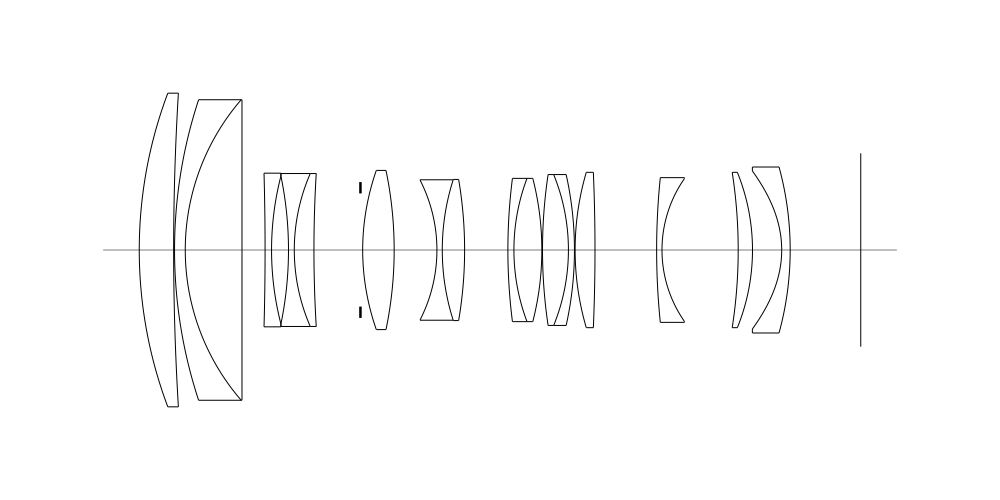
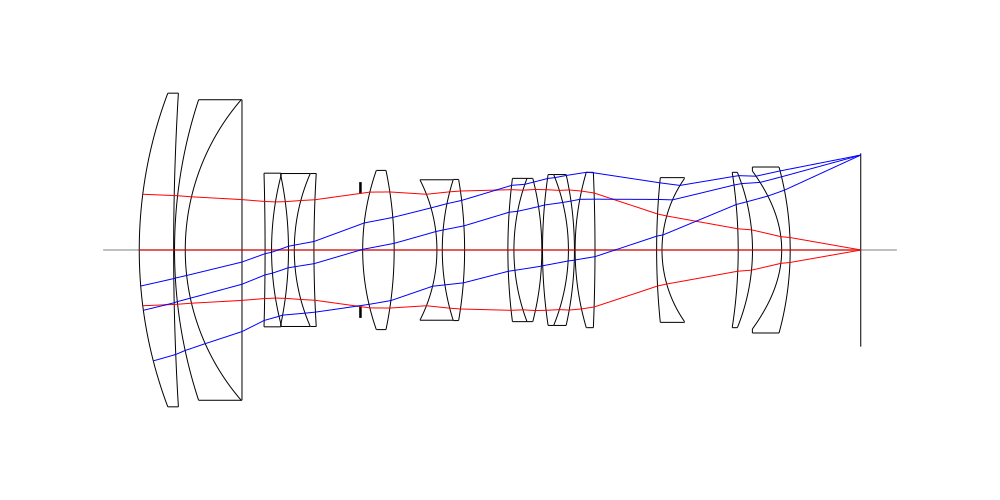
## Spot Diagrams
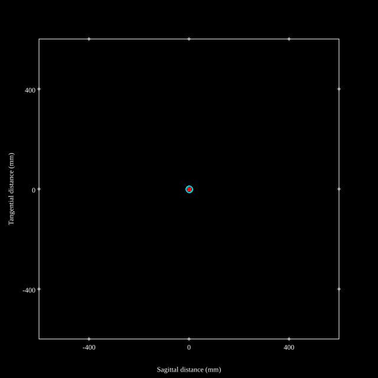
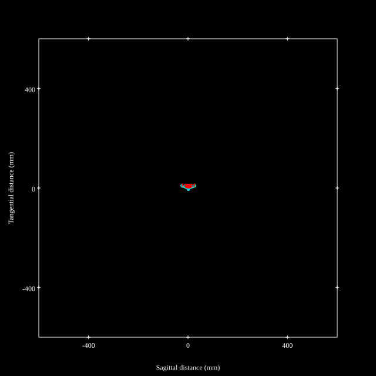
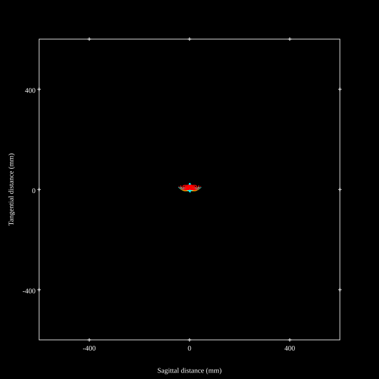
## Paraxial Parameters
| parameter | value |
| ---       | ---   |
| effective_focal_length |72.149
| back_focal_length | 15.879
| optical_invariant | 3.744
| object_distance | 1.0E10
| image_distance | 15.879
| power | 0.014
| pp1_H | 42.743
| ppk_H' | -56.269
| ffl_F | -29.405
| fno | 2.891
| enp_dist_P | 45.509
| enp_radius | 12.48
| exp_dist_P' | -53.525
| exp_radius | 12.019
| m | -0
| red | -1.386027476730177E8
| n_obj | 1
| n_img | 1
| img_ht | 21.646
| obj_ang | 16.7
| obj_na | 0
| img_na | -0.173|
## Spot Analysis
| Field | Spot Mean Radius | Spot Max Radius |
| ---   | ---              | ---             |
 | Field(x=0.0, y=0.0) | 3.091 | 12.788|
 | Field(x=0.0, y=0.1) | 3.24 | 17.494|
 | Field(x=0.0, y=0.2) | 3.96 | 23.578|
 | Field(x=0.0, y=0.3) | 5.075 | 29.427|
 | Field(x=0.0, y=0.4) | 5.211 | 24.62|
 | Field(x=0.0, y=0.5) | 5.758 | 24.431|
 | Field(x=0.0, y=0.6) | 6.522 | 27.356|
 | Field(x=0.0, y=0.7) | 7.284 | 31.968|
 | Field(x=0.0, y=0.8) | 8.174 | 38.496|
 | Field(x=0.0, y=0.9) | 9.455 | 46.007|
 | Field(x=0.0, y=1.0) | 10.342 | 47.594|
## Polychromatic Geometric MTF
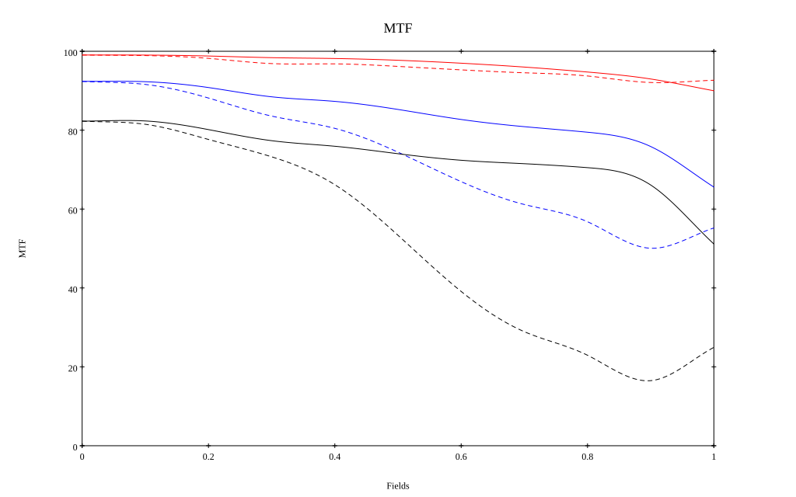
* 10=red,30=blue,50=black cycles/mm
* Solid lines represent sagittal, dashed lines tangential
* To generate above, MTFs for wavelengths 587.5618(d), 486.1327(F), 656.2725(C) were calculated across 10 fields, and then averaged
## Polychromatic Geometric MTF (Weighted)
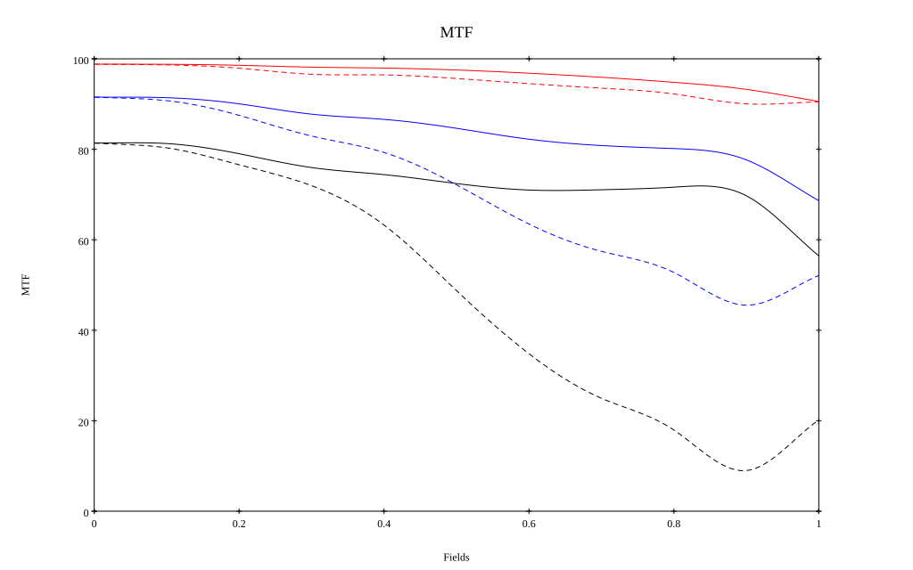
* 10=red,30=blue,50=black cycles/mm
* Solid lines represent sagittal, dashed lines tangential
* To generate above, MTFs for wavelengths 587.5618(d) wt(1.0), 656.2725(C) wt(0.475), 546.074(e) wt(0.98), 486.1327(F) wt(0.49), 435.8343(g) wt(0.15) were calculated across 10 fields, and then combined using weighted average
# 200mm f2.8
## Layouts
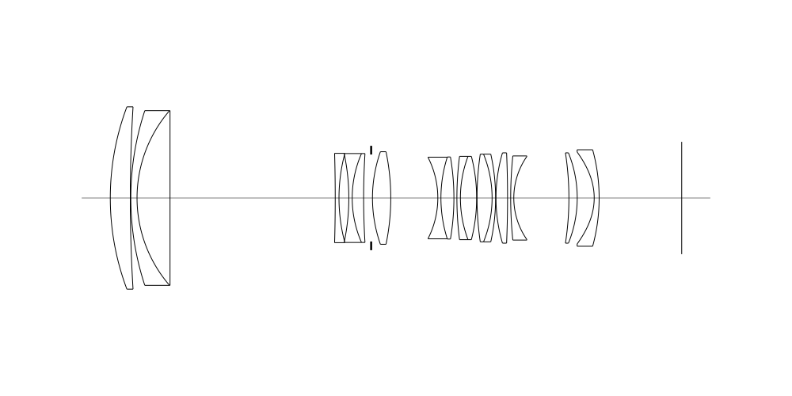
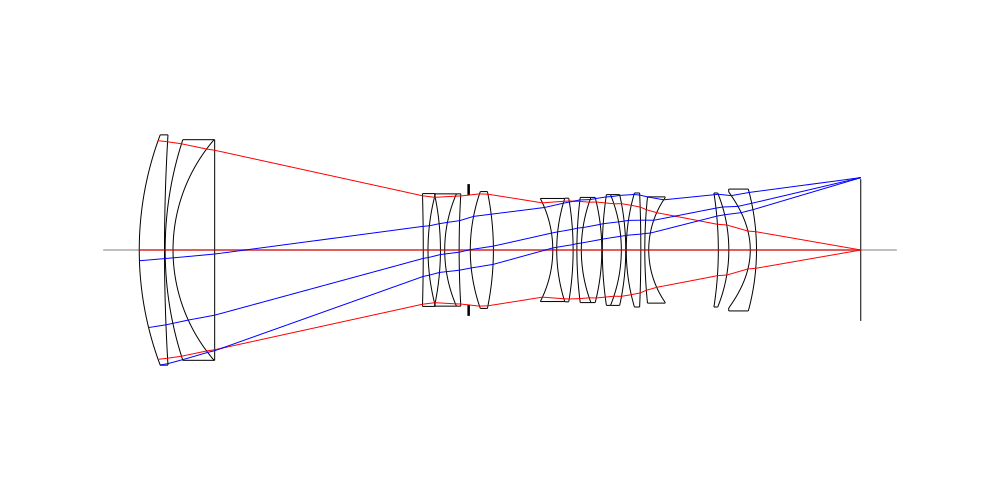
## Spot Diagrams
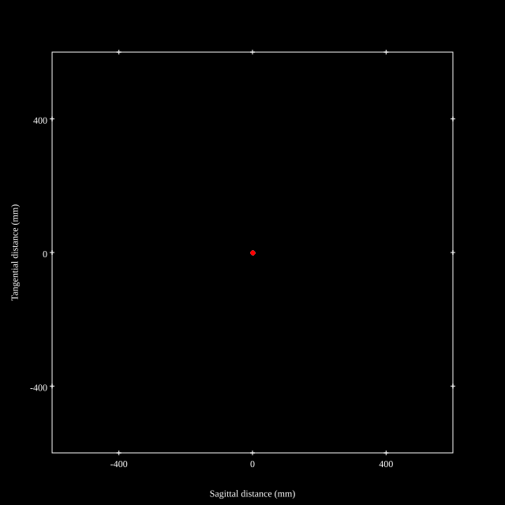
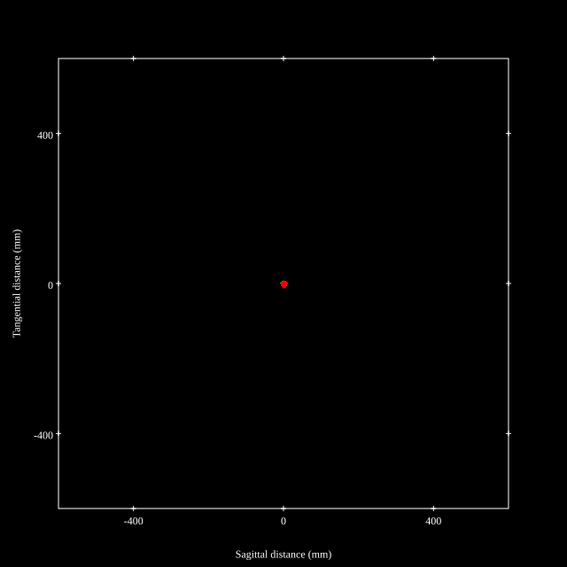
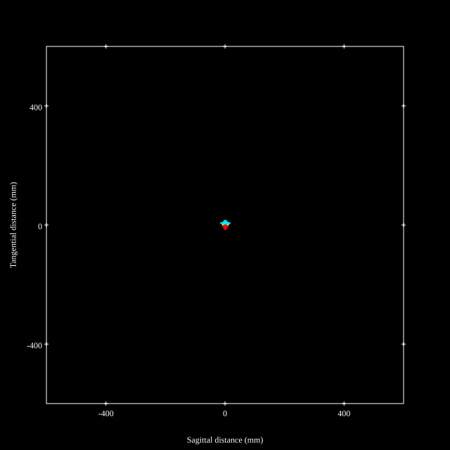
## Paraxial Parameters
| parameter | value |
| ---       | ---   |
| effective_focal_length |194.012
| back_focal_length | 31.788
| optical_invariant | 3.717
| object_distance | 1.0E10
| image_distance | 31.788
| power | 0.005
| pp1_H | -37.03
| ppk_H' | -162.224
| ffl_F | -231.042
| fno | 2.909
| enp_dist_P | 205.852
| enp_radius | 33.345
| exp_dist_P' | -54.375
| exp_radius | 14.808
| m | -0
| red | -5.154320781081482E7
| n_obj | 1
| n_img | 1
| img_ht | 21.625
| obj_ang | 6.36
| obj_na | 0
| img_na | -0.172|
## Spot Analysis
| Field | Spot Mean Radius | Spot Max Radius |
| ---   | ---              | ---             |
 | Field(x=0.0, y=0.0) | 2.726 | 5.03|
 | Field(x=0.0, y=0.1) | 2.833 | 5.733|
 | Field(x=0.0, y=0.2) | 3.022 | 7.33|
 | Field(x=0.0, y=0.3) | 3.118 | 7.416|
 | Field(x=0.0, y=0.4) | 3.255 | 6.952|
 | Field(x=0.0, y=0.5) | 3.581 | 7.416|
 | Field(x=0.0, y=0.6) | 4.028 | 8.774|
 | Field(x=0.0, y=0.7) | 4.454 | 9.445|
 | Field(x=0.0, y=0.8) | 5.021 | 12.427|
 | Field(x=0.0, y=0.9) | 5.993 | 16.096|
 | Field(x=0.0, y=1.0) | 6.566 | 17.777|
## Polychromatic Geometric MTF
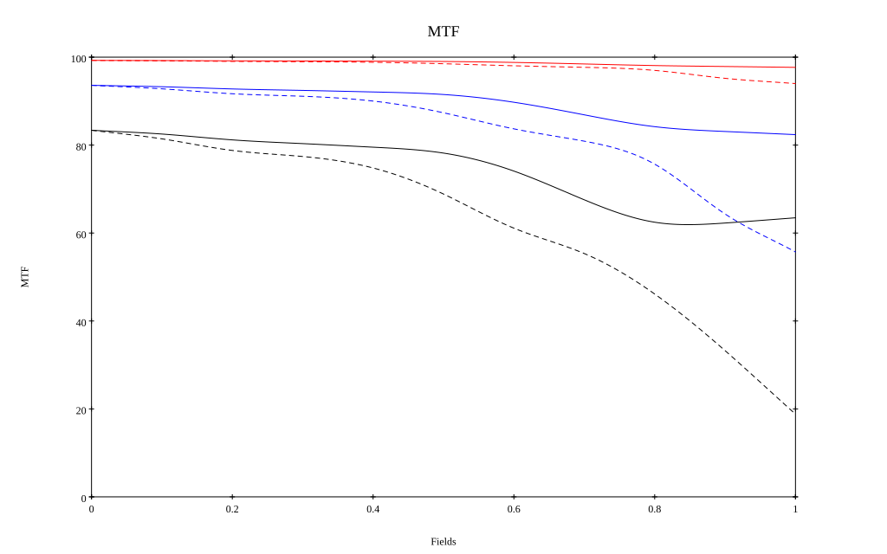
* 10=red,30=blue,50=black cycles/mm
* Solid lines represent sagittal, dashed lines tangential
* To generate above, MTFs for wavelengths 587.5618(d), 486.1327(F), 656.2725(C) were calculated across 10 fields, and then averaged
## Polychromatic Geometric MTF (Weighted)
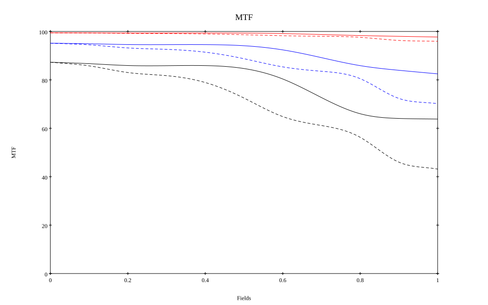
* 10=red,30=blue,50=black cycles/mm
* Solid lines represent sagittal, dashed lines tangential
* To generate above, MTFs for wavelengths 587.5618(d) wt(1.0), 656.2725(C) wt(0.475), 546.074(e) wt(0.98), 486.1327(F) wt(0.49), 435.8343(g) wt(0.15) were calculated across 10 fields, and then combined using weighted average
## Resources
* [OpticalBench Compatible Data File, tab delimited](./prescription.txt)
* [Zemax file](./JP2021-056407_Example03P.zmx)

Report / Zemax file generated using [Beam42](https://github.com/BeamFour/Beam42) on 2026-08-21
