# Canon RF 70-200mm F2.8 L IS USM Z
## Patent Information
| Country | Patent Number | Example | Year of Application | Inventors | Organisation | Link |
| ---     | ---           | ---     | ---                 | ---       | ---          | ---  |
|US | US 2025/0155694 | 1 | 2023 | Junya Ichimura | Canon Inc | [link](https://patents.google.com/patent/US20250155694A1/en) |
## Surface Data
Note that where glass types are shown the refractive index and abbe number is as per assigned glass type

| ID  | Radius | Thickness | Diameter | nd  | vd  | Glass Make | Glass |
| --- | ---    | ---       | ---      | --- | --- | ---        | ---   |
| 1 | 118.641 | 1.45 | 67.72 | 1.7495 | 35.28 | Ohara | S-LAM7 |
| 2 | 75.807 | 10.58 | 66.17 | 1.43875 | 94.66 | Ohara | S-FPL55 |
| 3 | -665.627 | 0.2 | 65.63 |  |  |  |
| 4 | 74.187 | 7.71 | 64.07 | 1.43875 | 94.66 | Ohara | S-FPL55 |
| 5 | 280.505 | d5 | 63.15 |  |  |  |
| 6 | 71.42 | 5.82 | 46.31 | 1.56732 | 42.84 | Hoya | E-FL6 |
| 7 | -798.337 | 0.2 | 44.7 |  |  |  |
| 8 | 233.29 | 1.4 | 41.82 | 1.6516 | 58.54 | Ohara | S-LAL7Q |
| 9 | 38.096 | d9 | 36.43 |  |  |  |
| 10 | -74.807 | 1.4 | 34.56 | 1.53775 | 74.7 | Ohara | S-FPM3 |
| 11 | 61.389 | d11 | 33.04 |  |  |  |
| 12 | 52.538 | 3.55 | 33.57 | 1.85478 | 24.8 | Ohara | S-NBH56 |
| 13 | 149.814 | 3.46 | 33.25 |  |  |  |
| 14 | -62.946 | 1.4 | 33.21 | 1.59349 | 67.0 | Hoya | PCD51 |
| 15 | 283.696 | d15 | 33.65 |  |  |  |
| 16 | AS | 0.4 | 34.39 |  |  |  |
| 17 | 31.136 | 10.95 | 35.88 | 1.497 | 81.55 | Ohara | S-FPL51 |
| 18 | -70.106 | 0.2 | 35.11 |  |  |  |
| 19 | 321.201 | 1.4 | 33.74 | 1.77047 | 29.74 | Hoya | NBFD29 |
| 20 | 35.344 | 4.34 | 32.1 |  |  |  |
| 21 | 69.827 | 1.05 | 32.51 | 1.85478 | 24.8 | Ohara | S-NBH56 |
| 22 | 36.387 | 6.37 | 32.14 | 1.804 | 46.53 | Ohara | S-LAH65VS |
| 23 | -336.651 | 0.07 | 31.9 | 1.58946 | 30.6 |  |
| 24 | -302.04 | 3.01 | 31.89 |  |  |  |
| 25 | 44.773 | 5.1 | 30.31 | 1.59522 | 67.74 | Ohara | S-FPM2 |
| 26 | -541.557 | d26 | 29.34 |  |  |  |
| 27 | 795.915 | 2.78 | 27.23 | 1.92286 | 20.88 | Hoya | E-FDS1 |
| 28 | -86.227 | 1.1 | 26.99 | 1.62299 | 58.12 | Hoya | BACD15 |
| 29 | 26.939 | d29 | 25.8 |  |  |  |
| 30 | -154.619 | 4.65 | 30.94 | 1.58313 | 59.46 | Hoya | BACD12 |
| 31 | -41.311 | d31 | 31.4 |  |  |  |
| 32 | -48.413 | 1.3 | 31.25 | 1.77047 | 29.74 | Hoya | NBFD29 |
| 33 | 0.0 | d33 | 32.25 |  |  |  |
| 34 | 126.157 | 3.1 | 38.91 | 2.001 | 29.13 | Hoya | TAFD55 |
| 35 | -1961.022 | d35 | 39.01 |  |  |  |
## Aspherical Data
| ID  | Type | k   | P1 | P2 | P3 | P4 | P5 | P6 |
| --- | --- | --- | --- | --- | --- | --- | --- | --- |
| 17| EVEN | 0.0 | 0.0 | -4.11423E-6 | -4.02996E-10 | -4.42991E-12 | 5.14141E-16 | 0  |
| 18| EVEN | 0.0 | 0.0 | 3.38559E-6 | -7.98271E-10 | -3.40353E-12 | 4.45865E-15 | 0  |
| 24| EVEN | 0.0 | 0.0 | 5.60156E-7 | 5.19683E-10 | -2.15534E-13 | -1.04557E-15 | 0  |
| 30| EVEN | 0.0 | 0.0 | 7.95991E-6 | -1.42359E-8 | 1.09768E-10 | -4.12759E-13 | 5.90882E-16 |
| 31| EVEN | 0.0 | 0.0 | 6.06354E-6 | -1.52294E-8 | 1.0885E-10 | -4.00403E-13 | 5.48878E-16 |
## Variables
| Variable | 70mm f2.8 | 200mm f2.8 |
| --- | --- | --- |
| Focal length |72.0 |194.0 |
| F-Number |2.9 |2.9 |
| Angle of View |33.44 |12.72 |
| d5 | 1.48 | 42.97 |
| d9 | 8.46 | 13.14 |
| d11 | 20.31 | 1.81 |
| d15 | 31.22 | 3.55 |
| d26 | 1.88 | 1.54 |
| d29 | 18.6 | 18.94 |
| d31 | 5.56 | 2.28 |
| d33 | 9.48 | 12.76 |
| d35 | 37.13 | 37.115 |
# 70mm f2.8
## Layouts
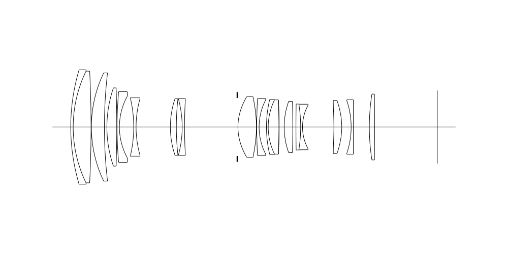
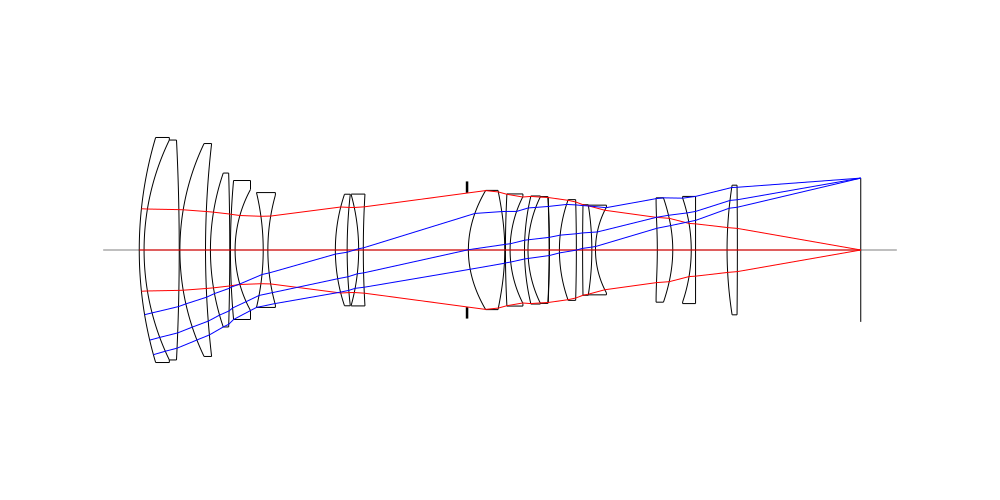
## Spot Diagrams
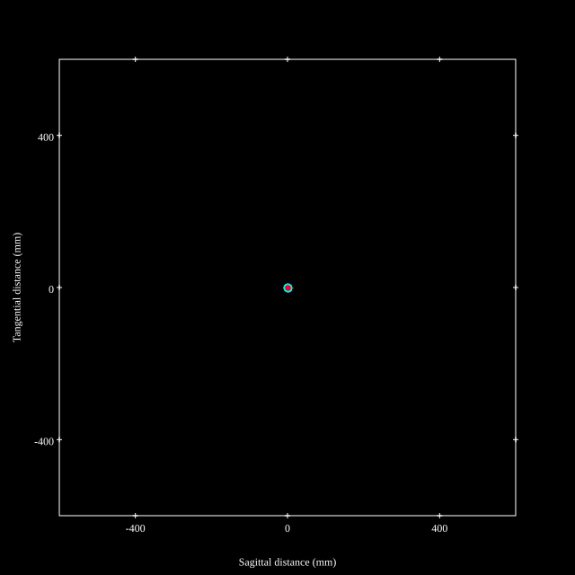
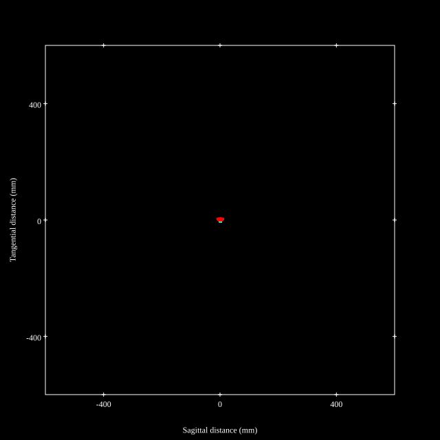
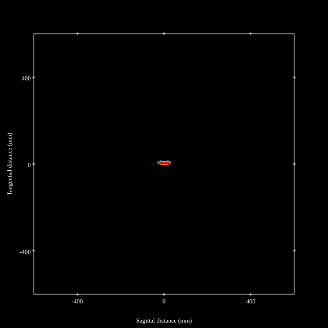
## Paraxial Parameters
| parameter | value |
| ---       | ---   |
| effective_focal_length |71.995
| back_focal_length | 37.131
| optical_invariant | 3.742
| object_distance | 1.0E10
| image_distance | 37.131
| power | 0.014
| pp1_H | 115.948
| ppk_H' | -34.864
| ffl_F | 43.953
| fno | 2.89
| enp_dist_P | 87.999
| enp_radius | 12.457
| exp_dist_P' | -80.546
| exp_radius | 20.362
| m | -0
| red | -1.3889818842317054E8
| n_obj | 1
| n_img | 1
| img_ht | 21.627
| obj_ang | 16.72
| obj_na | 0
| img_na | -0.173|
## Spot Analysis
| Field | Spot Mean Radius | Spot Max Radius |
| ---   | ---              | ---             |
 | Field(x=0.0, y=0.0) | 3.444 | 9.824|
 | Field(x=0.0, y=0.1) | 3.448 | 14.618|
 | Field(x=0.0, y=0.2) | 3.618 | 17.237|
 | Field(x=0.0, y=0.3) | 3.828 | 18.269|
 | Field(x=0.0, y=0.4) | 4.035 | 17.725|
 | Field(x=0.0, y=0.5) | 4.154 | 15.09|
 | Field(x=0.0, y=0.6) | 4.139 | 11.167|
 | Field(x=0.0, y=0.7) | 4.29 | 13.875|
 | Field(x=0.0, y=0.8) | 4.817 | 17.695|
 | Field(x=0.0, y=0.9) | 6.15 | 23.923|
 | Field(x=0.0, y=1.0) | 8.576 | 33.299|
## Polychromatic Geometric MTF
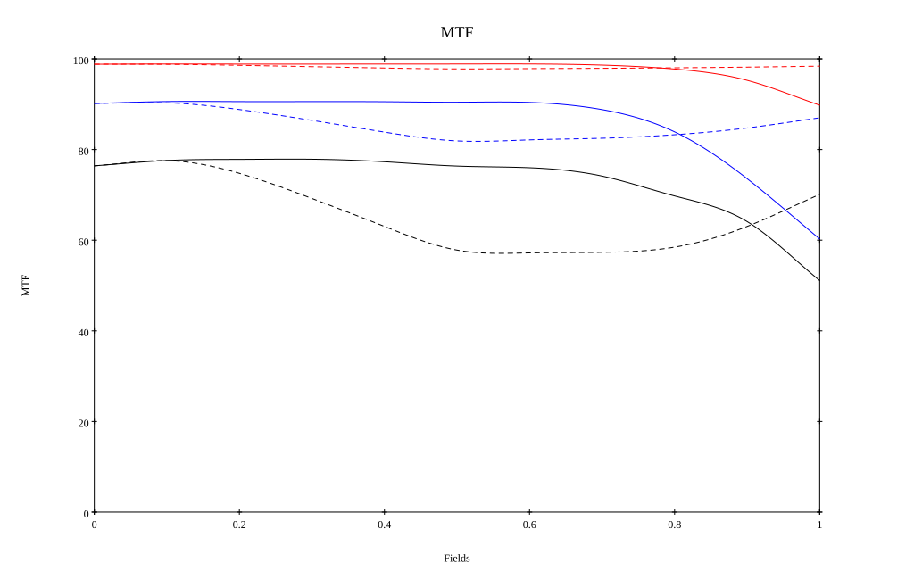
* 10=red,30=blue,50=black cycles/mm
* Solid lines represent sagittal, dashed lines tangential
* To generate above, MTFs for wavelengths 587.5618(d), 486.1327(F), 656.2725(C) were calculated across 10 fields, and then averaged
## Polychromatic Geometric MTF (Weighted)
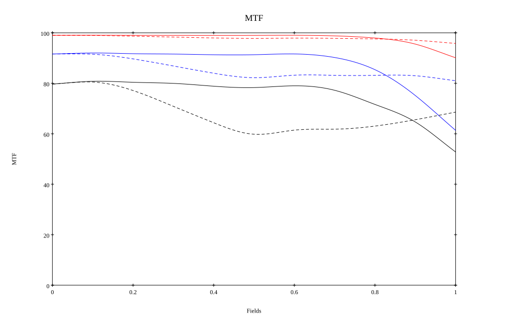
* 10=red,30=blue,50=black cycles/mm
* Solid lines represent sagittal, dashed lines tangential
* To generate above, MTFs for wavelengths 587.5618(d) wt(1.0), 656.2725(C) wt(0.475), 546.074(e) wt(0.98), 486.1327(F) wt(0.49), 435.8343(g) wt(0.15) were calculated across 10 fields, and then combined using weighted average
# 200mm f2.8
## Layouts
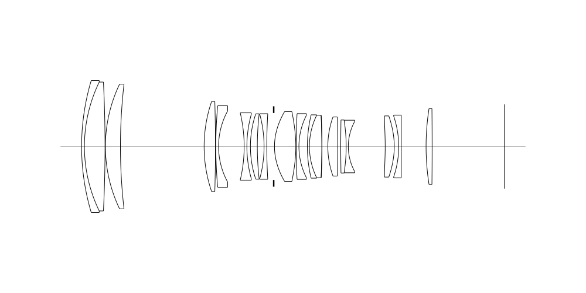
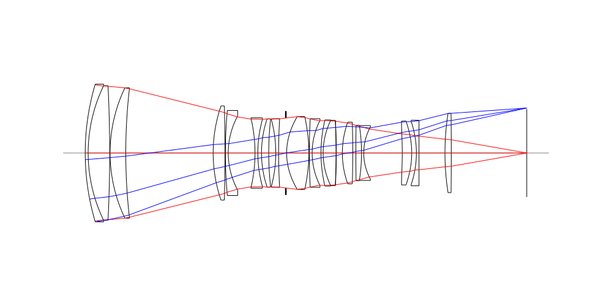
## Spot Diagrams
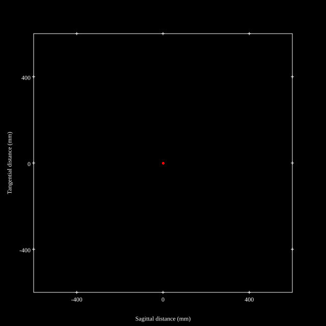

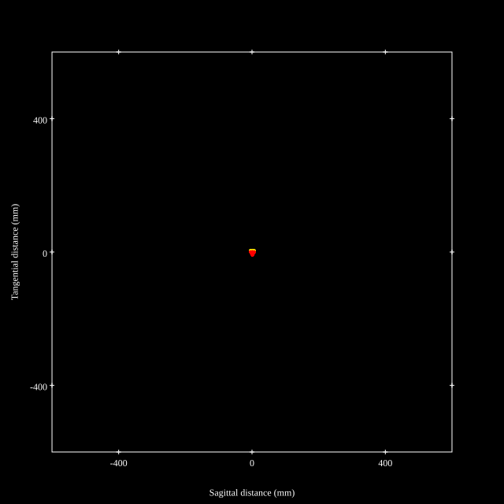
## Paraxial Parameters
| parameter | value |
| ---       | ---   |
| effective_focal_length |193.984
| back_focal_length | 37.117
| optical_invariant | 3.729
| object_distance | 1.0E10
| image_distance | 37.117
| power | 0.005
| pp1_H | 94.383
| ppk_H' | -156.867
| ffl_F | -99.601
| fno | 2.899
| enp_dist_P | 199.151
| enp_radius | 33.454
| exp_dist_P' | -88.837
| exp_radius | 21.722
| m | -0
| red | -5.1550617653176606E7
| n_obj | 1
| n_img | 1
| img_ht | 21.622
| obj_ang | 6.36
| obj_na | 0
| img_na | -0.172|
## Spot Analysis
| Field | Spot Mean Radius | Spot Max Radius |
| ---   | ---              | ---             |
 | Field(x=0.0, y=0.0) | 1.517 | 3.746|
 | Field(x=0.0, y=0.1) | 1.944 | 8.666|
 | Field(x=0.0, y=0.2) | 2.363 | 11.729|
 | Field(x=0.0, y=0.3) | 2.513 | 12.528|
 | Field(x=0.0, y=0.4) | 2.585 | 11.204|
 | Field(x=0.0, y=0.5) | 2.73 | 9.287|
 | Field(x=0.0, y=0.6) | 3.066 | 7.183|
 | Field(x=0.0, y=0.7) | 3.737 | 6.407|
 | Field(x=0.0, y=0.8) | 4.535 | 8.143|
 | Field(x=0.0, y=0.9) | 5.221 | 9.978|
 | Field(x=0.0, y=1.0) | 5.733 | 10.916|
## Polychromatic Geometric MTF
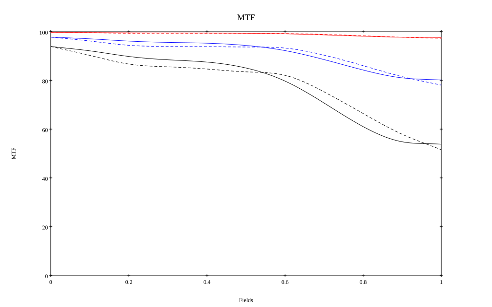
* 10=red,30=blue,50=black cycles/mm
* Solid lines represent sagittal, dashed lines tangential
* To generate above, MTFs for wavelengths 587.5618(d), 486.1327(F), 656.2725(C) were calculated across 10 fields, and then averaged
## Polychromatic Geometric MTF (Weighted)
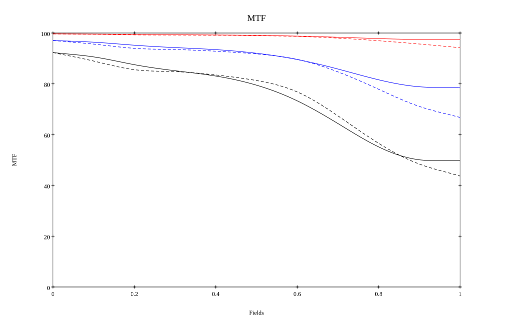
* 10=red,30=blue,50=black cycles/mm
* Solid lines represent sagittal, dashed lines tangential
* To generate above, MTFs for wavelengths 587.5618(d) wt(1.0), 656.2725(C) wt(0.475), 546.074(e) wt(0.98), 486.1327(F) wt(0.49), 435.8343(g) wt(0.15) were calculated across 10 fields, and then combined using weighted average
## Resources
* [OpticalBench Compatible Data File, tab delimited](./prescription.txt)
* [Zemax file](./US20250155694_Example01P.zmx)

Report / Zemax file generated using [Beam42](https://github.com/BeamFour/Beam42) on 2026-08-26
