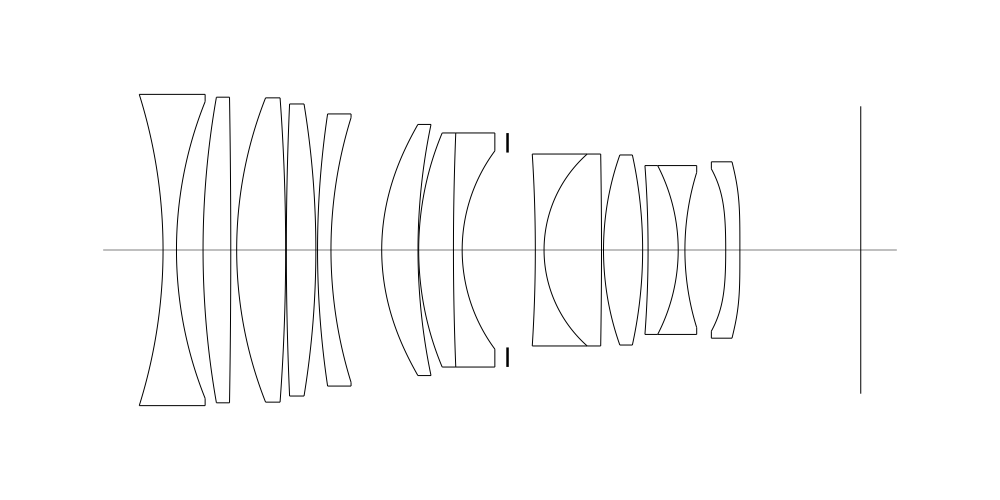
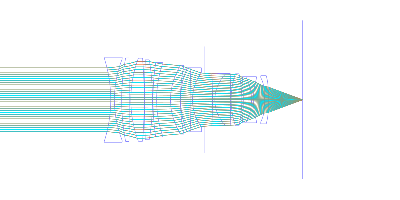
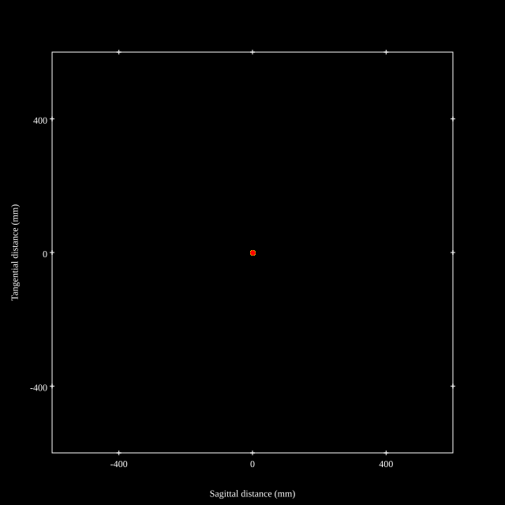
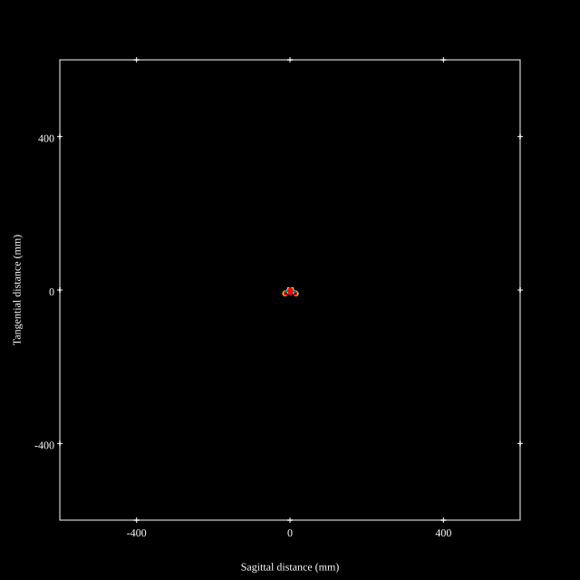
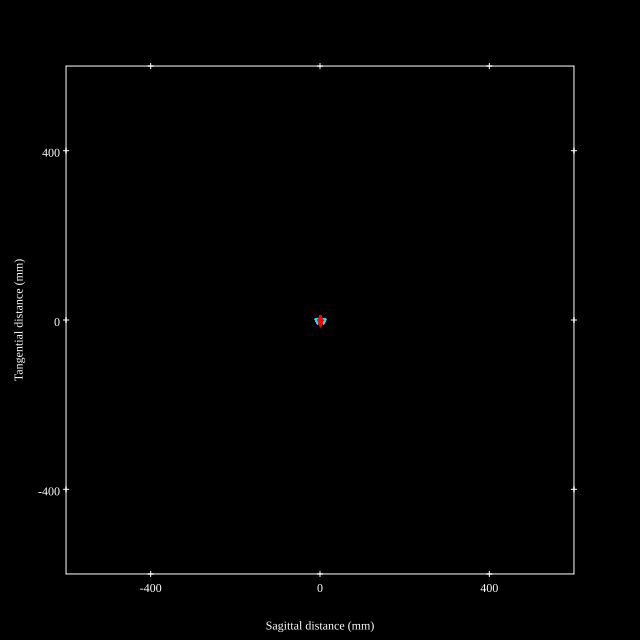
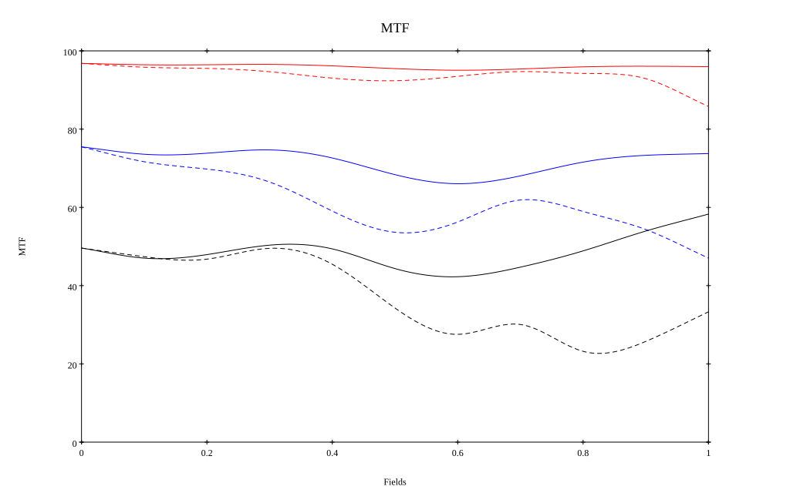
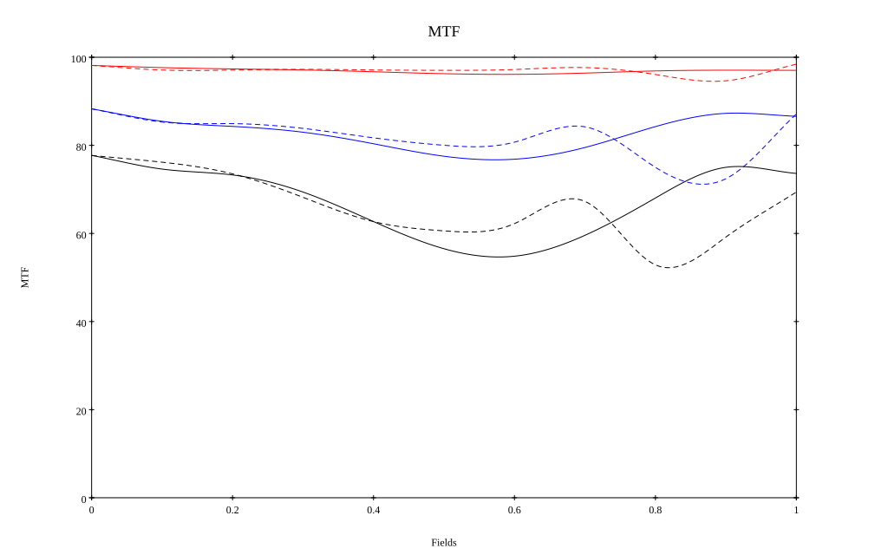

# Zeiss Otus ML 50mm f1.4 (Reoptimized)
## Patent Information
| Country | Patent Number | Example | Year of Application | Inventors | Organisation | Link |
| ---     | ---           | ---     | ---                 | ---       | ---          | ---  |
|JP | JP2026-105585 | 1 | 2024 | Tatsuya Moriyama | Cosina Inc | [link](https://www.j-platpat.inpit.go.jp/c1801/PU/JP-2026-105585/11/en) |
## Surface Data
Note that where glass types are shown the refractive index and abbe number is as per assigned glass type

| ID  | Radius | Thickness | Diameter | nd  | vd  | Glass Make | Glass |
| --- | ---    | ---       | ---      | --- | --- | ---        | ---   |
| 1 | -74.952 | 2.0 | 46.38 | 1.72047 | 34.71 | Ohara | S-NBH8 |
| 2 | 60.086 | 3.96 | 44.22 |  |  |  |
| 3 | 120.162 | 4.13 | 45.54 | 1.80809 | 22.76 | Hoya | FD225 |
| 4 | -2009.077 | 0.88 | 45.54 |  |  |  |
| 5 | 64.48 | 7.3 | 45.34 | 1.76385 | 48.49 | Ohara | S-LAH96 |
| 6 | -279.549 | 0.1 | 45.34 |  |  |  |
| 7 | 488.902 | 4.4 | 43.52 | 1.62846 | 59.18 | Hikari | J-PSKH8 |
| 8 | -135.168 | 0.25 | 43.52 |  |  |  |
| 9 | 136.308 | 2.0 | 40.55 | 1.55298 | 55.07 | Hikari | J-KZFH4 |
| 10 | 60.751 | 7.56 | 39.44 |  |  |  |
| 11 | 33.013 | 5.41 | 37.42 | 1.85135 | 40.1 | Hoya | M-TAFD305 |
| 12 | 93.55 | 0.1 | 37.42 |  |  |  |
| 13 | 44.175 | 5.18 | 34.88 | 1.497 | 81.61 | Hoya | FCD1 |
| 14 | 362.698 | 1.3 | 34.88 | 1.77047 | 29.74 | Hoya | NBFD29 |
| 15 | 24.858 | 6.76 | 29.54 |  |  |  |
| 16 | AS | 4.14 | 29.037 |  |  |  |
| 17 | -295.005 | 1.3 | 28.6 | 1.77047 | 29.74 | Hoya | NBFD29 |
| 18 | 19.849 | 8.56 | 28.6 | 1.76385 | 48.49 | Ohara | S-LAH96 |
| 19 | -639.817 | 0.3 | 28.6 |  |  |  |
| 20 | 44.522 | 5.83 | 28.32 | 2.001 | 29.13 | Hoya | TAFD55 |
| 21 | -65.473 | 0.81 | 28.32 |  |  |  |
| 22 | -148.38 | 4.49 | 25.16 | 1.95375 | 32.32 | Hoya | TAFD45 |
| 23 | -26.533 | 1.0 | 25.16 | 1.77047 | 29.74 | Hoya | NBFD29 |
| 24 | 40.707 | 6.08 | 23.14 |  |  |  |
| 25 | -113.598 | 2.11 | 24.18 | 1.80835 | 40.55 | Ohara | L-LAH84 |
| 26 | 0.0 | 18.665 | 26.28 |  |  |  |
## Aspherical Data
| ID  | Type | k   | P1 | P2 | P3 | P4 | P5 | P6 | P7 | P8 | P9 |
| --- | --- | --- | --- | --- | --- | --- | --- | --- | --- | --- | --- |
| 11| EVEN | 0.0 | 0.0 | -1.9551E-6 | -3.6039E-9 | 1.7572E-12 | -9.2051E-15 | -5.2524E-18 | 8.4241E-22 | -6.4123E-24 | 0  |
| 25| EVEN | 0.0 | 0.0 | -8.3587E-5 | 2.3742E-7 | -2.1119E-9 | 1.218E-11 | -2.447E-14 | 3.9679E-18 | 2.0037E-20 | 3.4759E-23 |
| 26| EVEN | 0.0 | 0.0 | -6.6648E-5 | 3.0363E-7 | -2.4798E-9 | 1.6564E-11 | -5.291E-14 | 6.3909E-17 | 7.1911E-21 | 0  |
## Layouts

## Spot Diagrams

## Paraxial Parameters
| parameter | value |
| ---       | ---   |
| effective_focal_length |50.137
| back_focal_length | 18.692
| optical_invariant | 7.461
| object_distance | 1.0E10
| image_distance | 18.692
| power | 0.02
| pp1_H | 25.348
| ppk_H' | -31.445
| ffl_F | -24.789
| fno | 1.435
| enp_dist_P | 38.146
| enp_radius | 17.475
| exp_dist_P' | -21.222
| exp_radius | 13.921
| m | -0
| red | -1.9945535128432494E8
| n_obj | 1
| n_img | 1
| img_ht | 21.406
| obj_ang | 23.12
| obj_na | 0
| img_na | -0.329|
## Spot Analysis
| Field | Spot Mean Radius | Spot Max Radius |
| ---   | ---              | ---             |
 | Field(x=0.0, y=0.0) | 8.195 | 23.419|
 | Field(x=0.0, y=0.1) | 9.48 | 38.31|
 | Field(x=0.0, y=0.2) | 10.35 | 39.618|
 | Field(x=0.0, y=0.3) | 12.474 | 42.311|
 | Field(x=0.0, y=0.4) | 15.855 | 53.556|
 | Field(x=0.0, y=0.5) | 20.186 | 63.112|
 | Field(x=0.0, y=0.6) | 26.215 | 79.042|
 | Field(x=0.0, y=0.7) | 35.528 | 124.465|
 | Field(x=0.0, y=0.8) | 49.454 | 146.911|
 | Field(x=0.0, y=0.9) | 61.918 | 171.893|
 | Field(x=0.0, y=1.0) | 78.809 | 209.953|
## Polychromatic Geometric MTF

* 10=red,30=blue,50=black cycles/mm
* Solid lines represent sagittal, dashed lines tangential
* To generate above, MTFs for wavelengths 587.5618(d), 486.1327(F), 656.2725(C) were calculated across 10 fields, and then averaged
## Polychromatic Geometric MTF (Weighted)

* 10=red,30=blue,50=black cycles/mm
* Solid lines represent sagittal, dashed lines tangential
* To generate above, MTFs for wavelengths 587.5618(d) wt(1.0), 656.2725(C) wt(0.475), 546.074(e) wt(0.98), 486.1327(F) wt(0.49), 435.8343(g) wt(0.15) were calculated across 10 fields, and then combined using weighted average
## Resources
* [OpticalBench Compatible Data File, tab delimited](./prescription.txt)
* [Zemax file](./JP2026-105585_Example01-optimized.zmx)

Report / Zemax file generated using [Beam42](https://github.com/BeamFour/Beam42) on 2026-08-09
