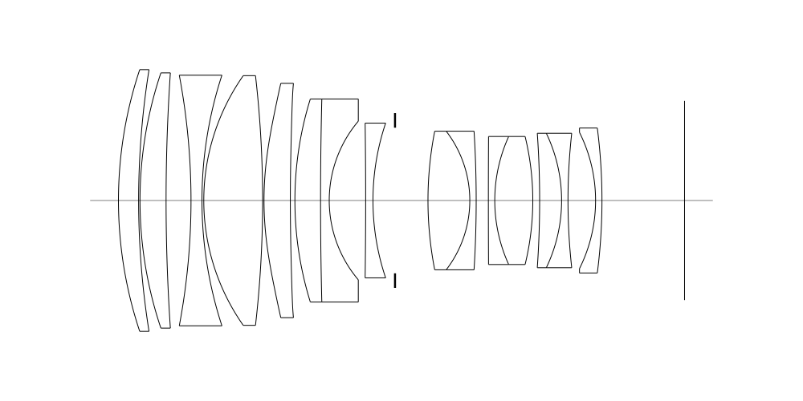
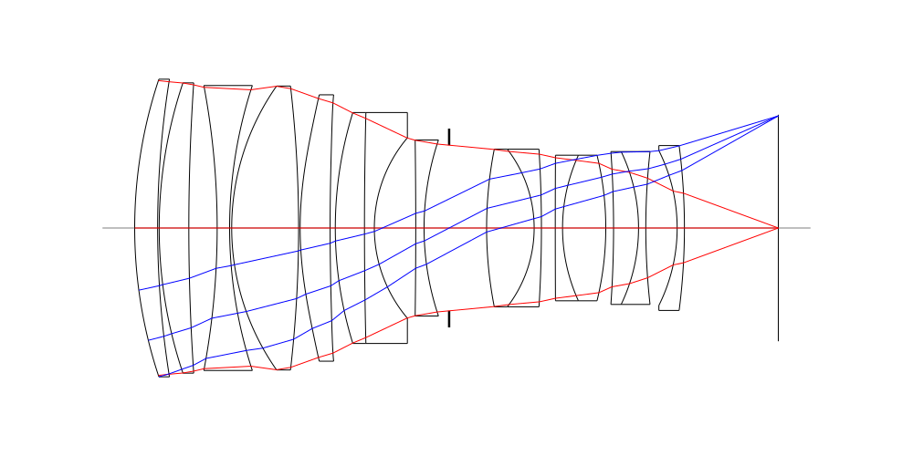
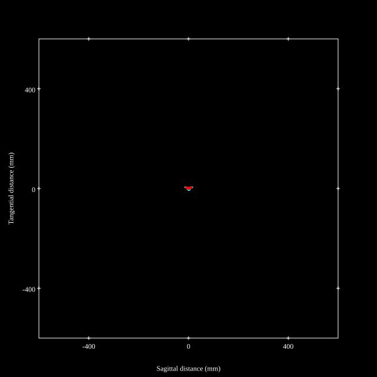
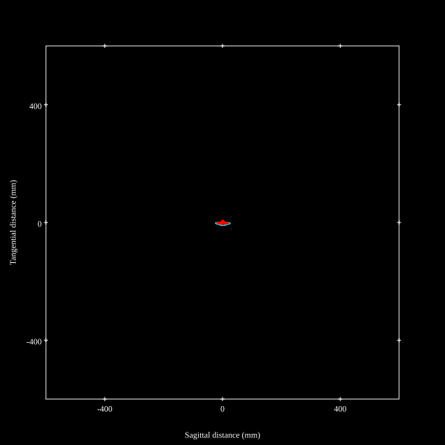
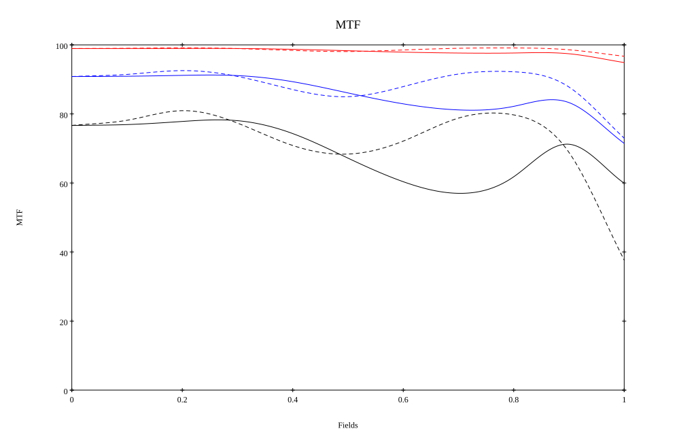
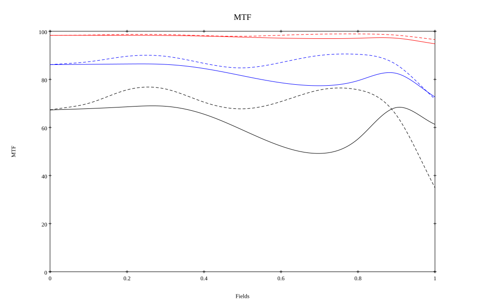

## Surface Data
Note that where glass types are shown the refractive index and abbe number is as per assigned glass type

| ID  | Radius | Thickness | Diameter | nd  | vd  | Glass Make | Glass |
| --- | ---    | ---       | ---      | --- | --- | ---        | ---   |
| 1 | 90.782 | 4.42 | 57.4 | 1.5186 | 69.89 | Hikari | J-PKH1 |
| 2 | 182.228 | 0.3 | 57.4 |  |  |  |
| 3 | 87.959 | 5.71 | 55.98 | 1.55032 | 75.5 | Hoya | FCD705 |
| 4 | 416.78 | 5.46 | 55.98 |  |  |  |
| 5 | -148.441 | 2.4 | 54.96 | 1.72047 | 34.71 | Ohara | S-NBH8 |
| 6 | 88.576 | 0.4 | 54.96 |  |  |  |
| 7 | 47.692 | 12.89 | 54.76 | 1.59282 | 68.62 | Hoya | FCD515 |
| 8 | -240.587 | 0.3 | 54.76 |  |  |  |
| 9 | 70.945 | 5.77 | 51.38 | 1.7645 | 49.1 | Ohara | L-LAH91 |
| 10 | 437.707 | 1.0 | 51.38 |  |  |  |
| 11 | 75.094 | 5.62 | 44.54 | 1.80809 | 22.76 | Ohara | S-NPH1 |
| 12 | 906.18 | 1.9 | 44.54 | 1.6134 | 44.27 | Ohara | S-NBM51 |
| 13 | 26.946 | 7.98 | 34.79 |  |  |  |
| 14 | -1236.778 | 1.6 | 33.94 | 1.55298 | 55.07 | Hikari | J-KZFH4 |
| 15 | 53.28 | 4.83 | 33.94 |  |  |  |
| 16 | AS | 7.22 | 31.946 |  |  |  |
| 17 | 79.0 | 9.16 | 30.4 | 1.76385 | 48.49 | Ohara | S-LAH96 |
| 18 | -24.936 | 1.4 | 30.4 | 1.85883 | 30.0 | Hoya | NBFD30 |
| 19 | -246.375 | 2.67 | 30.4 |  |  |  |
| 20 | 2587.307 | 1.4 | 28.08 | 1.738 | 32.33 | Ohara | S-NBH53V |
| 21 | 33.836 | 8.33 | 28.08 | 1.76385 | 48.49 | Ohara | S-LAH96 |
| 22 | -59.261 | 1.5 | 28.08 |  |  |  |
| 23 | -211.045 | 4.81 | 29.48 | 2.001 | 29.13 | Hoya | TAFD55 |
| 24 | -34.117 | 1.4 | 29.48 | 1.6134 | 44.27 | Ohara | S-NBM51 |
| 25 | 133.785 | 6.04 | 29.48 |  |  |  |
| 26 | -33.411 | 1.4 | 29.86 | 1.55298 | 55.07 | Hikari | J-KZFH4 |
| 27 | -124.57 | 18.09 | 31.8 |  |  |  |
## Aspherical Data
| ID  | Type | k   | P1 | P2 | P3 | P4 | P5 |
| --- | --- | --- | --- | --- | --- | --- | --- |
| 9| EVEN | -0.030969 | 0.0 | -2.47019E-6 | -6.05731E-11 | -2.05766E-12 | 2.81337E-15 |
| 10| EVEN | 0.0 | 0.0 | -7.56527E-7 | 7.31747E-10 | -1.60283E-12 | 2.74862E-15 |
## Layouts

## Spot Diagrams

## Paraxial Parameters
| parameter | value |
| ---       | ---   |
| effective_focal_length |82.446
| back_focal_length | 18.091
| optical_invariant | 7.533
| object_distance | 1.0E10
| image_distance | 18.091
| power | 0.012
| pp1_H | 24.51
| ppk_H' | -64.355
| ffl_F | -57.937
| fno | 1.45
| enp_dist_P | 82.142
| enp_radius | 28.43
| exp_dist_P' | -30.433
| exp_radius | 16.733
| m | -0
| red | -1.2129129833715968E8
| n_obj | 1
| n_img | 1
| img_ht | 21.845
| obj_ang | 14.84
| obj_na | 0
| img_na | -0.326|
## Spot Analysis
| Field | Spot Mean Radius | Spot Max Radius |
| ---   | ---              | ---             |
 | Field(x=0.0, y=0.0) | 3.257 | 6.823|
 | Field(x=0.0, y=0.1) | 3.198 | 8.565|
 | Field(x=0.0, y=0.2) | 3.079 | 10.161|
 | Field(x=0.0, y=0.3) | 3.271 | 10.807|
 | Field(x=0.0, y=0.4) | 3.824 | 13.483|
 | Field(x=0.0, y=0.5) | 4.292 | 14.045|
 | Field(x=0.0, y=0.6) | 4.273 | 15.798|
 | Field(x=0.0, y=0.7) | 4.137 | 17.231|
 | Field(x=0.0, y=0.8) | 4.104 | 18.727|
 | Field(x=0.0, y=0.9) | 4.595 | 20.944|
 | Field(x=0.0, y=1.0) | 6.701 | 24.496|
## Polychromatic Geometric MTF

* 10=red,30=blue,50=black cycles/mm
* Solid lines represent sagittal, dashed lines tangential
* To generate above, MTFs for wavelengths 587.5618(d), 486.1327(F), 656.2725(C) were calculated across 10 fields, and then averaged
## Polychromatic Geometric MTF (Weighted)

* 10=red,30=blue,50=black cycles/mm
* Solid lines represent sagittal, dashed lines tangential
* To generate above, MTFs for wavelengths 587.5618(d) wt(1.0), 656.2725(C) wt(0.475), 546.074(e) wt(0.98), 486.1327(F) wt(0.49), 435.8343(g) wt(0.15) were calculated across 10 fields, and then combined using weighted average
## Resources
* [OpticalBench Compatible Data File, tab delimited](./prescription.txt)
* [Zemax file](./JP2026-093473_Example01.zmx)

Report / Zemax file generated using [Beam42](https://github.com/BeamFour/Beam42) on 2026-08-17
