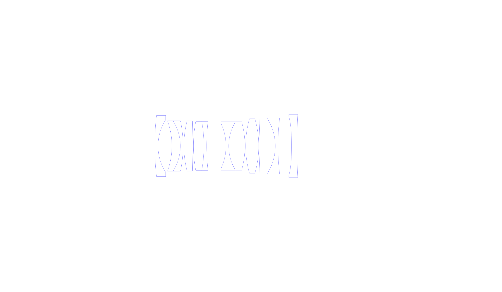
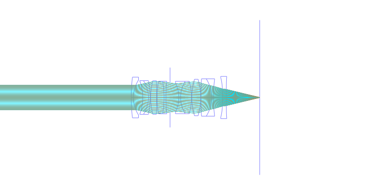
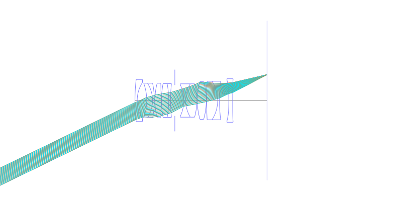
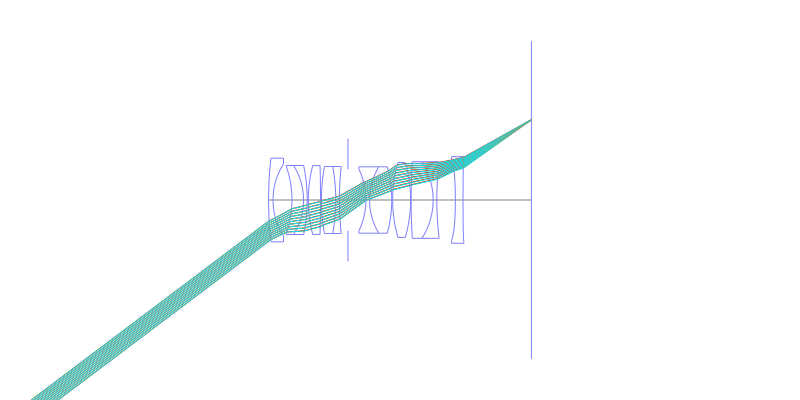
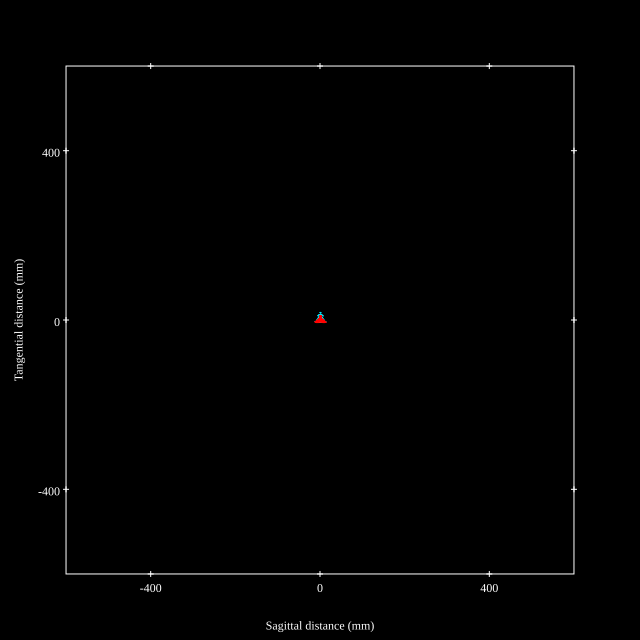
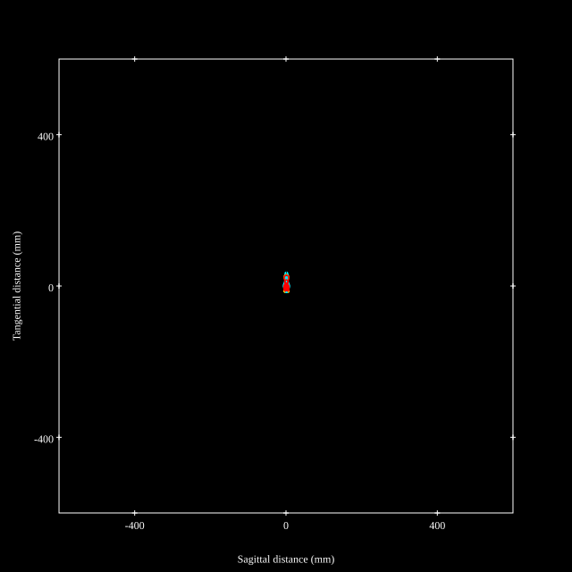
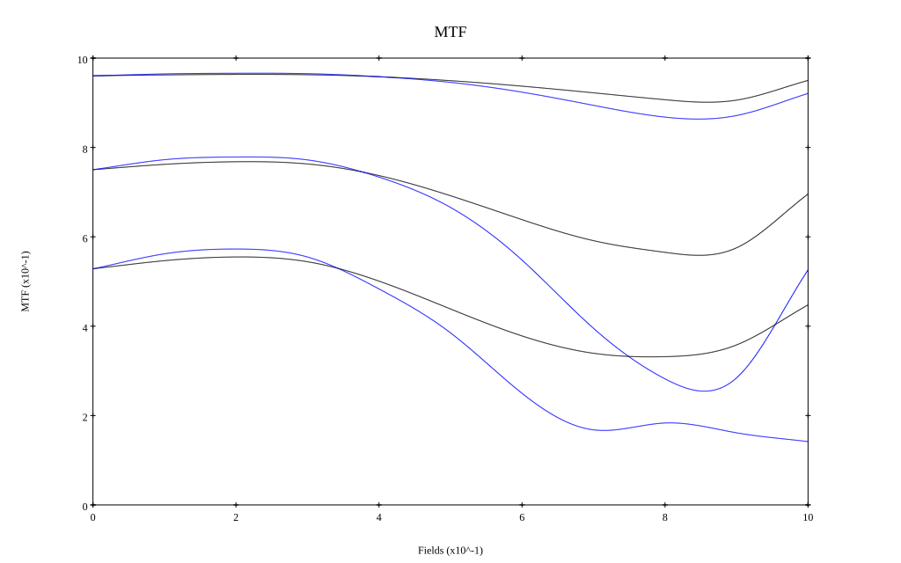
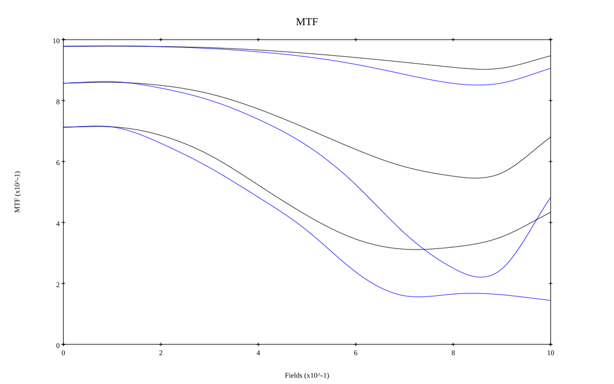

# Cosina Voigtlander APO-Lanthar 28mm F2.0
## Patent Information
| Country | Patent Number | Example | Year of Application | Inventors | Organisation | Link |
| ---     | ---           | ---     | ---                 | ---       | ---          | ---  |
|JP | JP2026-098935 | 1 | 2024 | Nozomu Mishima | Cosina Inc | [link](https://www.j-platpat.inpit.go.jp/c1801/PU/JP-2026-098935/11/en) |
## Surface Data
Note that where glass types are shown the refractive index and abbe number is as per assigned glass type

| ID  | Radius | Thickness | Diameter | nd  | vd  | Glass Make | Glass |
| --- | ---    | ---       | ---      | --- | --- | ---        | ---   |
| 1 | 125.894 | 1.2 | 22.78 | 1.5168 | 64.2 | Hoya | BSC7 |
| 2 | 18.861 | 5.17 | 19.6 |  |  |  |
| 3 | -27.573 | 3.15 | 18.8 | 1.76385 | 48.49 | Ohara | S-LAH96 |
| 4 | -17.55 | 1.0 | 18.8 | 1.77047 | 29.74 | Hoya | NBFD29 |
| 5 | -46.06 | 0.3 | 18.8 |  |  |  |
| 6 | 37.274 | 3.32 | 18.76 | 2.001 | 29.13 | Hoya | TAFD55 |
| 7 | -351.499 | 0.25 | 18.76 |  |  |  |
| 8 | 50.074 | 3.91 | 18.26 | 1.883 | 40.81 | Hoya | TAFD30 |
| 9 | -50.074 | 1.0 | 18.26 | 1.7888 | 28.43 | Ohara | S-NBH58 |
| 10 | 85.847 | 2.32 | 18.26 |  |  |  |
| 11 | AS | 4.89 | 16.727 |  |  |  |
| 12 | -19.573 | 1.0 | 16.84 | 1.72047 | 34.71 | Ohara | S-NBH8 |
| 13 | 17.542 | 6.05 | 18.09 | 1.62846 | 59.18 | Hikari | J-PSKH8 |
| 14 | -33.858 | 0.25 | 18.09 |  |  |  |
| 15 | 36.867 | 4.88 | 20.4 | 1.90525 | 35.04 | Ohara | S-LAH93 |
| 16 | -36.867 | 0.15 | 20.4 |  |  |  |
| 17 | 175.405 | 6.0 | 20.88 | 1.55032 | 75.5 | Hoya | FCD705 |
| 18 | -19.4 | 1.0 | 20.88 | 1.72047 | 34.71 | Ohara | S-NBH8 |
| 19 | 85.713 | 5.05 | 20.88 |  |  |  |
| 20 | -145.641 | 2.1 | 22.02 | 1.8061 | 40.73 | Hoya | NBFD13 |
| 21 | 1000.0 | 18.62 | 23.6 |  |  |  |
## Aspherical Data
| ID  | Type | k   | P1 | P2 | P3 | P4 | P5 | P6 |
| --- | --- | --- | --- | --- | --- | --- | --- | --- |
| 1| EVEN | 0.0 | 0.0 | 2.0224E-5 | -2.3758E-7 | 2.0808E-9 | -1.0332E-11 | 2.1614E-14 |
| 2| EVEN | 1.199 | 0.0 | 1.5538E-6 | -3.9504E-7 | 2.525E-9 | -1.6498E-11 | 0  |
| 20| EVEN | 88.638 | 0.0 | -3.5111E-5 | 0.0 | 0.0 | 0.0 | 0  |
| 21| EVEN | 0.0 | 0.0 | 2.1066E-6 | 4.081E-8 | 9.9222E-12 | 8.7513E-13 | -4.3204E-15 |
## Layouts

## Spot Diagrams

## Paraxial Parameters
| parameter | value |
| ---       | ---   |
| effective_focal_length |28.996
| back_focal_length | 18.591
| optical_invariant | 5.338
| object_distance | 1.0E10
| image_distance | 18.591
| power | 0.034
| pp1_H | 21.148
| ppk_H' | -10.405
| ffl_F | -7.847
| fno | 2.047
| enp_dist_P | 12.017
| enp_radius | 7.084
| exp_dist_P' | -23.763
| exp_radius | 10.34
| m | -0
| red | -3.448764271073942E8
| n_obj | 1
| n_img | 1
| img_ht | 21.85
| obj_ang | 37
| obj_na | 0
| img_na | -0.237|
## Spot Analysis
| Field | Spot Mean Radius | Spot Max Radius |
| ---   | ---              | ---             |
 | Field(x=0.0, y=0.0) | 5.502 | 12.6|
 | Field(x=0.0, y=0.1) | 5.314 | 14.345|
 | Field(x=0.0, y=0.2) | 5.364 | 14.032|
 | Field(x=0.0, y=0.3) | 5.79 | 17.173|
 | Field(x=0.0, y=0.4) | 6.503 | 20.585|
 | Field(x=0.0, y=0.5) | 7.397 | 23.168|
 | Field(x=0.0, y=0.6) | 8.39 | 24.791|
 | Field(x=0.0, y=0.7) | 9.504 | 26.13|
 | Field(x=0.0, y=0.8) | 10.42 | 28.883|
 | Field(x=0.0, y=0.9) | 10.325 | 30.684|
 | Field(x=0.0, y=1.0) | 8.323 | 28.983|
## Polychromatic Geometric MTF

* 10,30,50 cycles/mm
* Black lines represent sagittal, blue tangential
* To generate above, MTFs for wavelengths 587.5618(d), 486.1327(F), 656.2725(C) were calculated across 10 fields, and then averaged
## Polychromatic Geometric MTF (Weighted)

* 10,30,50 cycles/mm
* Black lines represent sagittal, blue tangential
* To generate above, MTFs for wavelengths 587.5618(d) wt(1.0), 656.2725(C) wt(0.475), 546.074(e) wt(0.98), 486.1327(F) wt(0.49), 435.8343(g) wt(0.15) were calculated across 10 fields, and then combined using weighted average
## Resources
* [OpticalBench Compatible Data File, tab delimited](./prescription.txt)
* [Zemax file](./JP2026-098935_Example01a.zmx)

Report / Zemax file generated using [Beam42](https://github.com/BeamFour/Beam42) on 2026-06-27
