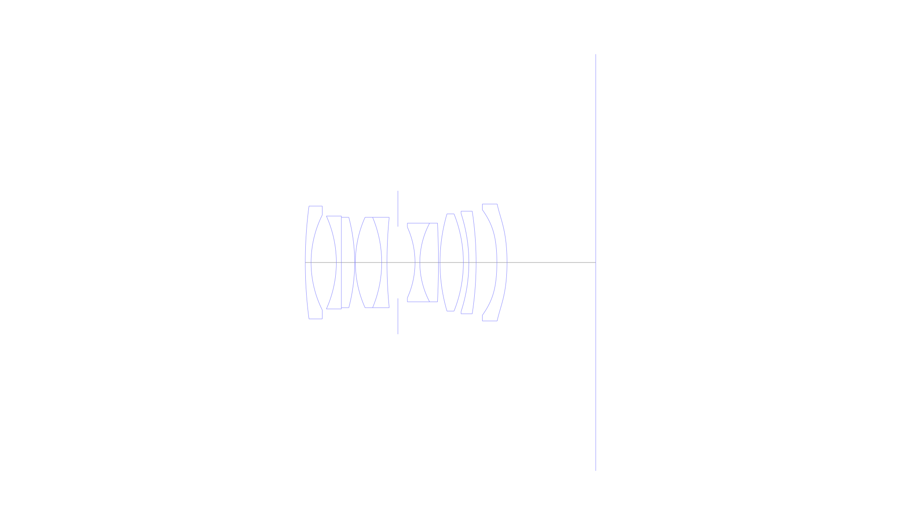
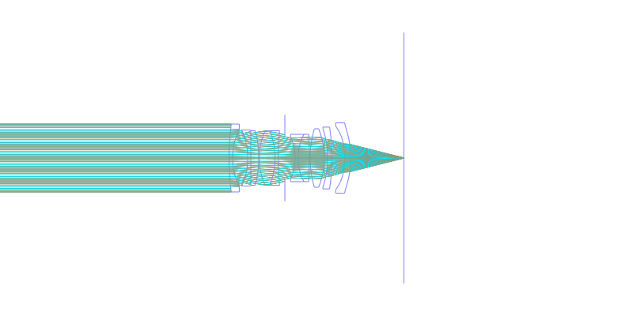
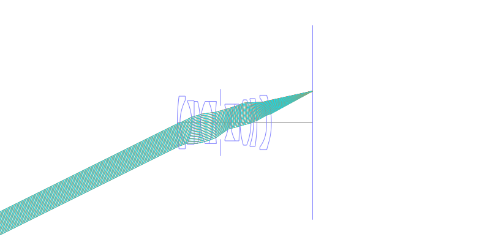
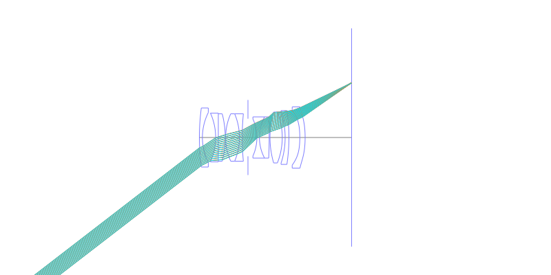
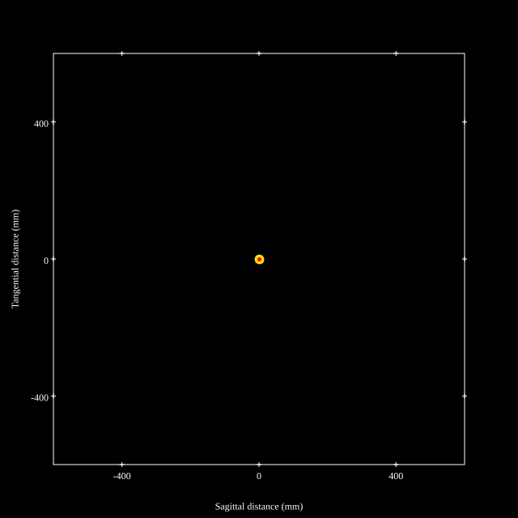
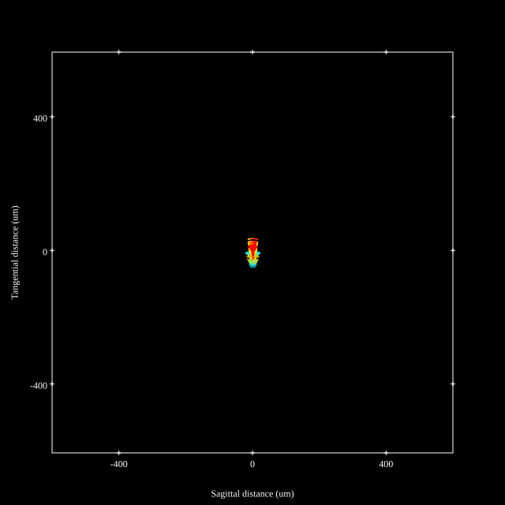
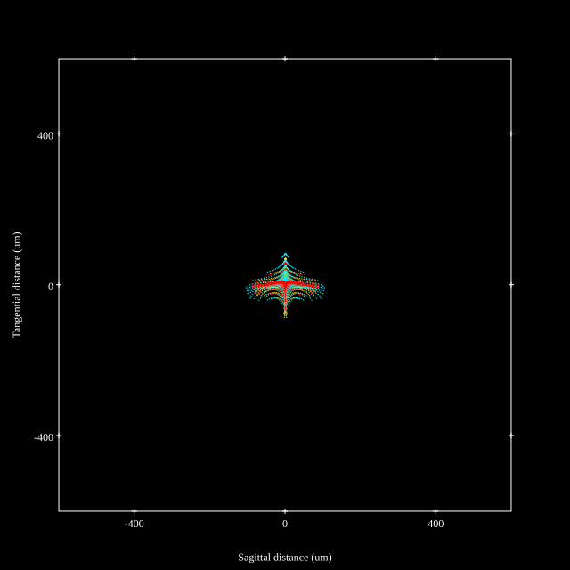

# Cosina Voigtlander Ultron Vintage Line 28mm F2 Aspherical
## Patent Information
| Country | Patent Number | Example | Year of Application | Inventors | Organisation | Link |
| ---     | ---           | ---     | ---                 | ---       | ---          | ---  |
|JP | JP2022-100641 | EX 1 | 2020 | Yoshihisa Yomogida, Yuki Shibata | Cosina Co Ltd | [link](https://patents.google.com/patent/JP2022100641A/en) |
## Surface Data
Note that where glass types are shown the refractive index and abbe number is as per assigned glass type

| ID  | Radius | Thickness | Diameter | nd  | vd  | Glass Make | Glass |
| --- | ---    | ---       | ---      | --- | --- | ---        | ---   |
| 1 | 89.943 | 1.2 | 23.42 | 1.5168 | 64.2 | Hoya | BSC7 |
| 2 | 22.131 | 5.24 | 19.74 |  |  |  |
| 3 | -23.578 | 1.05 | 19.3 | 1.64769 | 33.84 | Hoya | E-FD2 |
| 4 | 0.0 | 2.75 | 18.78 | 1.91082 | 35.25 | Hoya | TAFD35 |
| 5 | -36.797 | 0.15 | 18.78 |  |  |  |
| 6 | 22.947 | 5.46 | 18.78 | 1.91082 | 35.25 | Hoya | TAFD35 |
| 7 | -24.267 | 1.1 | 18.78 | 1.76182 | 26.55 | Hoya | FD14 |
| 8 | 97.122 | 2.27 | 18.78 |  |  |  |
| 9 | AS | 3.54 | 14.89 |  |  |  |
| 10 | -17.809 | 1.0 | 14.68 | 1.71736 | 29.5 | Hoya | FD1 |
| 11 | 17.5 | 3.86 | 16.34 | 1.6968 | 55.46 | Hoya | LAC14 |
| 12 | -171.048 | 0.32 | 16.34 |  |  |  |
| 13 | 35.878 | 4.85 | 20.18 | 1.883 | 40.81 | Hoya | TAFD30 |
| 14 | -27.184 | 1.14 | 20.18 |  |  |  |
| 15 | -32.873 | 1.5 | 20.36 | 1.62299 | 58.12 | Hoya | BACD15 |
| 16 | -70.814 | 4.31 | 21.32 |  |  |  |
| 17 | -38.03 | 2.1 | 21.92 | 1.8061 | 40.74 | Hoya | M-NBFD13 |
| 18 | -43.027 | 18.4 | 24.28 |  |  |  |
## Aspherical Data
| ID  | k   | A4  | A6  | A8  | A10 | A12 | A14 | A16 | A18 |
| --- | --- | --- | --- | --- | --- | --- | --- | --- | --- |
| 17 | 0.0 | -9.97E-5 | -5.86E-7 | 7.76E-9 | -2.26E-11 | 0.0 | 0.0 | 0.0 | 0.0 |
| 18 | 0.0 | -4.13E-5 | -3.36E-7 | 6.38E-9 | -2.06E-11 | 9.67E-15 | 0.0 | 0.0 | 0.0 |
## Layouts

## Spot Diagrams

## Paraxial Parameters
| parameter | value |
| ---       | ---   |
| effective_focal_length |28.5
| back_focal_length | 18.394
| optical_invariant | 5.507
| object_distance | 1.0E10
| image_distance | 18.4
| power | 0.035
| pp1_H | 19.882
| ppk_H' | 10.107
| ffl_F | -8.618
| fno | 2
| enp_dist_P | 12.108
| enp_radius | 7.125
| exp_dist_P' | -20.797
| exp_radius | 9.798
| m | -0
| red | -3.5087392602990854E8
| n_obj | 1
| n_img | 1
| img_ht | 22.028
| obj_ang | 37.7
| obj_na | 0
| img_na | -0.243|
## Spot Analysis
| Field | Spot Mean Radius | Spot Max Radius |
| ---   | ---              | ---             |
 | 0.0 | 5.533 | 16.624|
 | 0.7 | 13.786 | 49.458|
 | 1.0 | 35.437 | 103.689|
## Resources
* [OpticalBench Compatible Data File, tab delimited](./JP2022-100641_Example01P.txt)
* [Zemax file](./JP2022-100641_Example01P.zmx)
