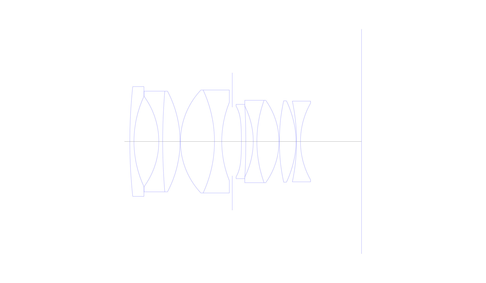
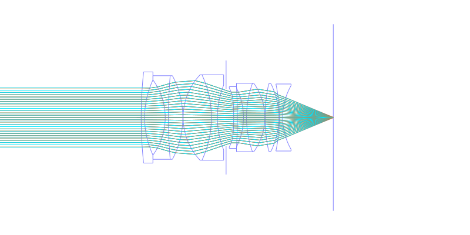
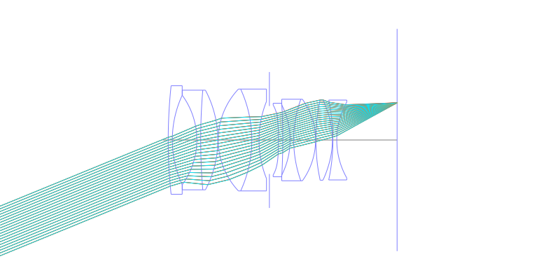
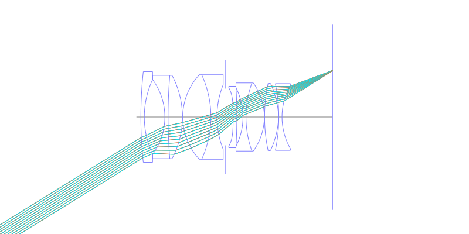
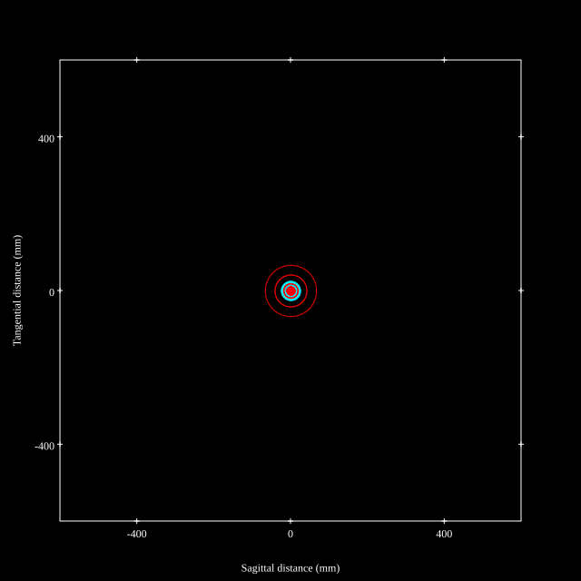
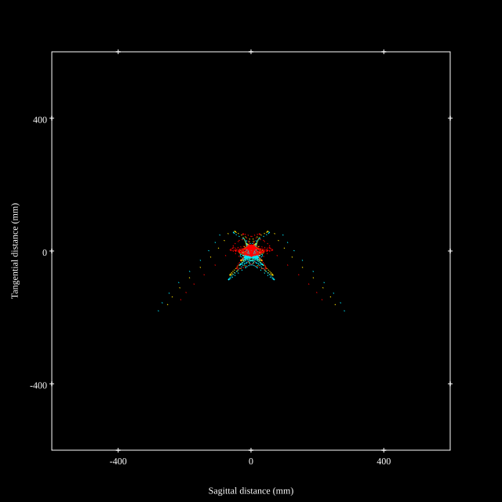
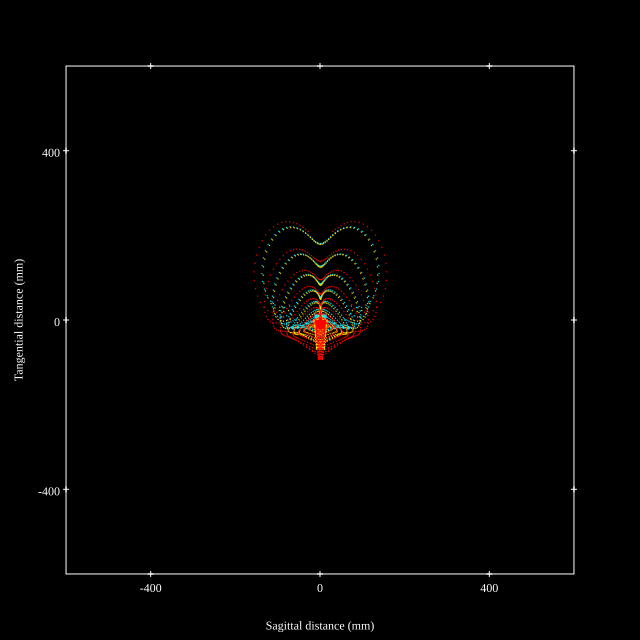
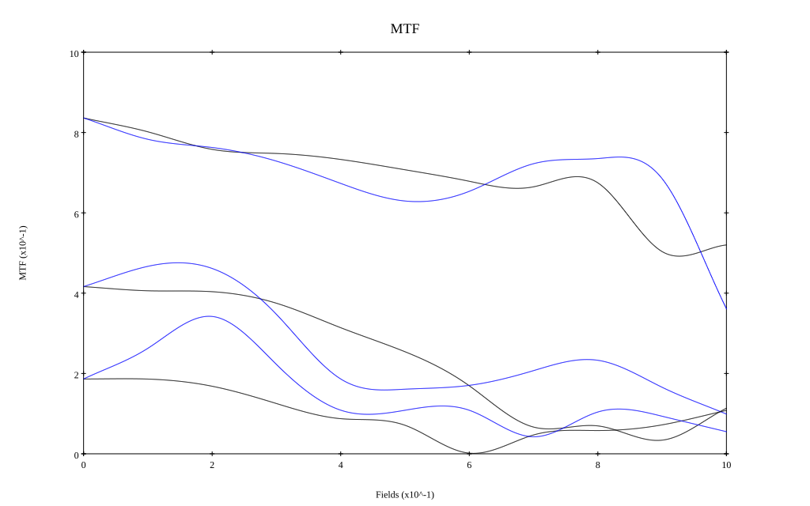

# Cosina Voigtlander Nokton 35mm F1.2 Aspherical I / II
## Patent Information
| Country | Patent Number | Example | Year of Application | Inventors | Organisation | Link |
| ---     | ---           | ---     | ---                 | ---       | ---          | ---  |
|JP | JP2004-101880 | EX 2 | 2002 | Yoshihisa Yomogida | Cosina Co Ltd | [link](https://patents.google.com/patent/JP2004101880A/en) |
## Surface Data
Note that where glass types are shown the refractive index and abbe number is as per assigned glass type

| ID  | Radius | Thickness | Diameter | nd  | vd  | Glass Make | Glass |
| --- | ---    | ---       | ---      | --- | --- | ---        | ---   |
| 1 | 200.0 | 1.6 | 42.3 | 1.48749 | 70.44 | Hoya | FC5 |
| 2 | 41.361 | 9.55 | 34.82 |  |  |  |
| 3 | -29.539 | 1.5 | 34.82 | 1.56732 | 42.84 | Hoya | E-FL6 |
| 4 | 233.985 | 6.67 | 38.8 | 1.8042 | 46.5 | Hoya | TAF3D |
| 5 | -41.35 | 0.15 | 38.8 |  |  |  |
| 6 | 28.934 | 13.1 | 39.68 | 1.8042 | 46.5 | Hoya | TAF3D |
| 7 | -47.262 | 2.8 | 39.68 | 1.64769 | 33.84 | Hoya | E-FD2 |
| 8 | 40.326 | 4.04 | 30.06 |  |  |  |
| 9 | AS | 3.51 | 26.474 |  |  |  |
| 10 | -200.0 | 1.7 | 27.22 | 1.8061 | 40.73 | Hoya | NBFD13 |
| 11 | -254.022 | 2.86 | 28.64 |  |  |  |
| 12 | -30.236 | 1.4 | 27.32 | 1.80518 | 25.46 | Hoya | FD60 |
| 13 | 46.963 | 8.51 | 31.76 | 1.8042 | 46.5 | Hoya | TAF3D |
| 14 | -27.172 | 0.15 | 31.76 |  |  |  |
| 15 | 81.004 | 6.41 | 31.32 | 1.8061 | 40.73 | Hoya | NBFD13 |
| 16 | -31.428 | 0.2 | 31.32 |  |  |  |
| 17 | -75.075 | 1.5 | 31.1 | 1.54814 | 45.82 | Hoya | E-FEL1 |
| 18 | 30.0 | 23.5 | 29.58 |  |  |  |
## Aspherical Data
| ID  | k   | P1  | P2  | P3  | P3 | P5 | P6 | P7 | P8 | P9 | P10 |
| --- | --- | --- | --- | --- | --- | --- | --- | --- | --- | --- | --- |
| 10 | 0.0 | 0.0 | -3.46513E-5 | -5.82425E-8 | -3.01558E-11 | 7.98551E-14 | 0.0 | 0.0 | 0.0 | 0.0 | 0.0 |
| 15 | 0.0 | 0.0 | 3.63823E-6 | -2.57284E-8 | 2.13341E-10 | -5.87072E-13 | 0.0 | 0.0 | 0.0 | 0.0 | 0.0 |
| 16 | 0.0 | 0.0 | 1.17867E-5 | -3.91138E-8 | 2.32768E-10 | -5.55678E-13 | 0.0 | 0.0 | 0.0 | 0.0 | 0.0 |
## Layouts

## Spot Diagrams

## Paraxial Parameters
| parameter | value |
| ---       | ---   |
| effective_focal_length |35.808
| back_focal_length | 23.51
| optical_invariant | 8.952
| object_distance | 1.0E10
| image_distance | 23.51
| power | 0.028
| pp1_H | 35.508
| ppk_H' | -12.298
| ffl_F | -0.3
| fno | 1.24
| enp_dist_P | 25.797
| enp_radius | 14.439
| exp_dist_P' | -25.613
| exp_radius | 19.812
| m | -0
| red | -2.792656369821491E8
| n_obj | 1
| n_img | 1
| img_ht | 22.202
| obj_ang | 31.8
| obj_na | 0
| img_na | -0.374|
## Spot Analysis
| Field | Spot Mean Radius | Spot Max Radius |
| ---   | ---              | ---             |
 | Field(x=0.0, y=0.0) | 17.46 | 66.585|
 | Field(x=0.0, y=0.1) | 20.093 | 96.442|
 | Field(x=0.0, y=0.2) | 30.085 | 246.905|
 | Field(x=0.0, y=0.3) | 65.761 | 527|
 | Field(x=0.0, y=0.4) | 64.284 | 399.757|
 | Field(x=0.0, y=0.5) | 57.931 | 314.351|
 | Field(x=0.0, y=0.6) | 40.682 | 314.37|
 | Field(x=0.0, y=0.7) | 31.491 | 332.418|
 | Field(x=0.0, y=0.8) | 27.78 | 327.229|
 | Field(x=0.0, y=0.9) | 42.147 | 243.786|
 | Field(x=0.0, y=1.0) | 67.616 | 245.654|
## Geometric MTF

* 10,30,50 cycles/mm
* Black lines represent sagittal, blue tangential
## Resources
* [OpticalBench Compatible Data File, tab delimited](./Cosina-35mm-f1.2.txt)
* [Zemax file](./Cosina-35mm-f1.2.zmx)
