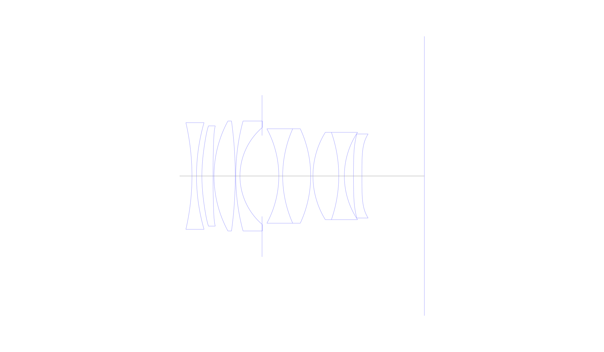
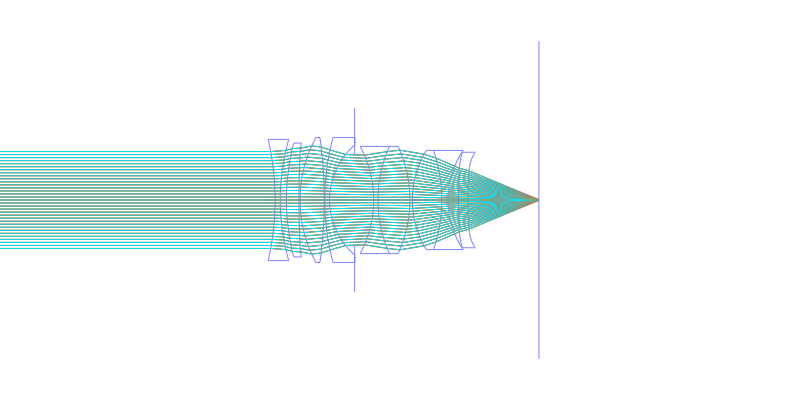
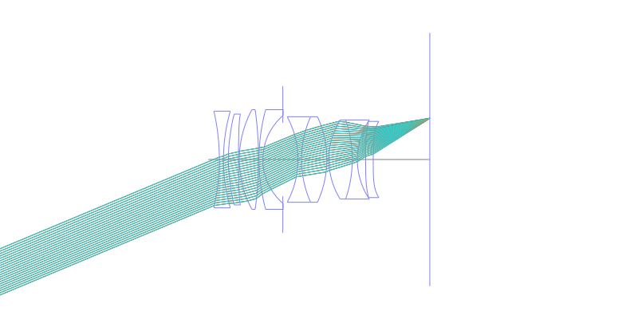
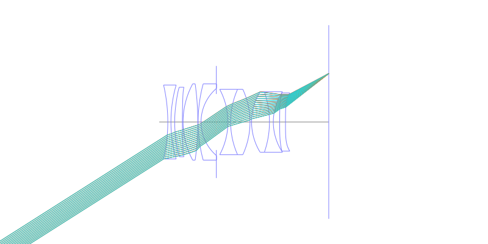
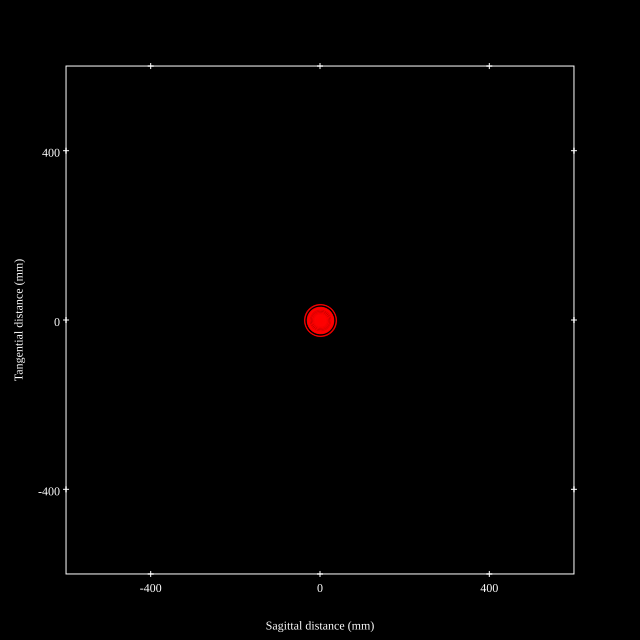
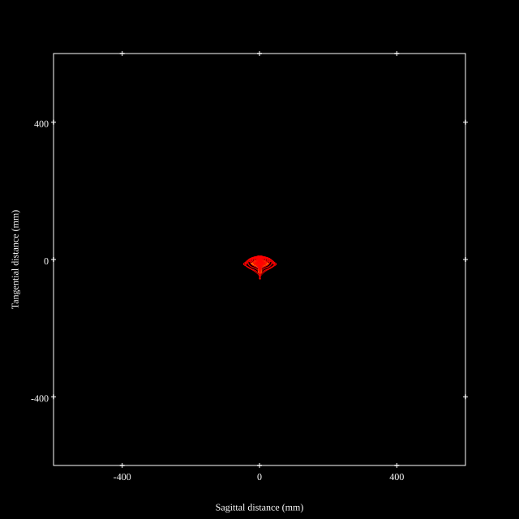
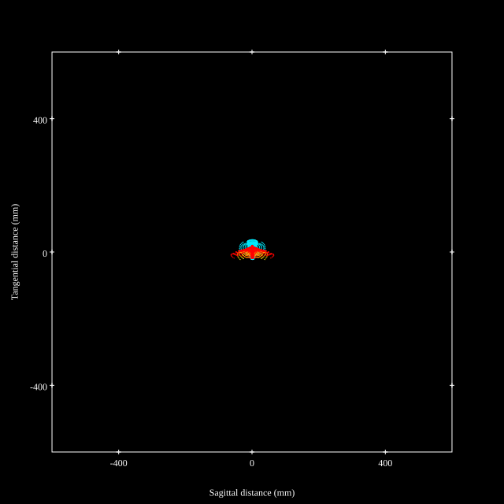
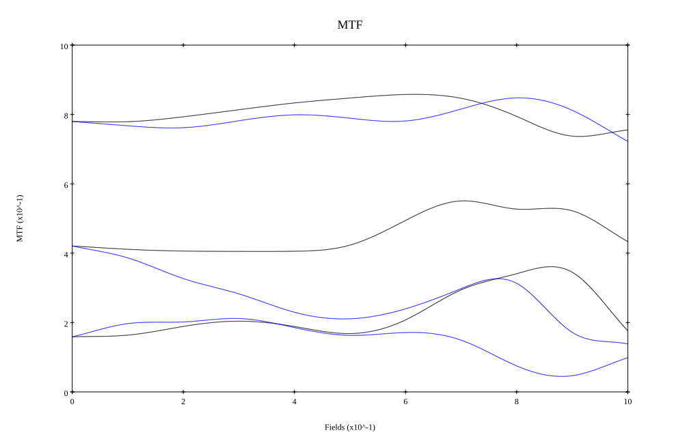
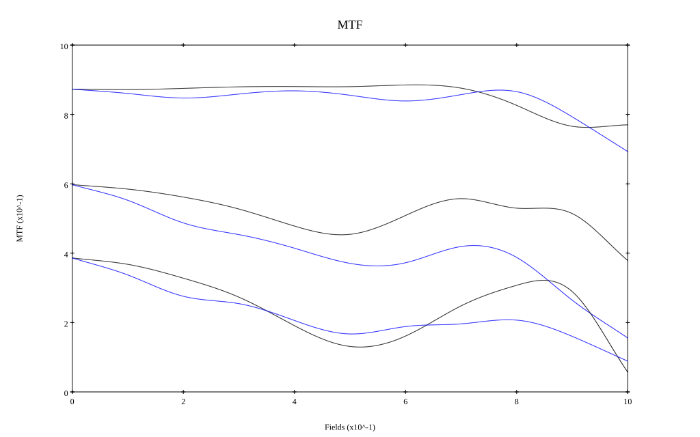

# Cosina Voigtlander Nokton 35mm F1.2 Aspherical III / IV
## Patent Information
| Country | Patent Number | Example | Year of Application | Inventors | Organisation | Link |
| ---     | ---           | ---     | ---                 | ---       | ---          | ---  |
|JP | JP2023-090337 | EX 3 | 2021 | Tatsuya Moriyama,Keisuke Nagasawa,Yuki Shibata | Cosina Co Ltd | [link](https://patents.google.com/patent/JP2023090337A/en) |
## Surface Data
Note that where glass types are shown the refractive index and abbe number is as per assigned glass type

| ID  | Radius | Thickness | Diameter | nd  | vd  | Glass Make | Glass |
| --- | ---    | ---       | ---      | --- | --- | ---        | ---   |
| 1 | -73.298 | 1.4 | 33.0 | 1.6727 | 32.19 | Hikari | J-SF5 |
| 2 | 59.602 | 1.67 | 33.0 |  |  |  |
| 3 | 53.473 | 3.44 | 31.0 | 1.80835 | 40.55 | Ohara | L-LAH84 |
| 4 | 300.0 | 0.3 | 31.0 |  |  |  |
| 5 | 35.831 | 6.57 | 34.0 | 1.883 | 40.77 | Ohara | S-LAH58 |
| 6 | -124.204 | 0.15 | 34.0 |  |  |  |
| 7 | 65.311 | 1.3 | 34.0 | 1.55298 | 55.07 | Hikari | J-KZFH4 |
| 8 | 19.769 | 6.82 | 30.06 |  |  |  |
| 9 | AS | 5.18 | 25.0 |  |  |  |
| 10 | -30.795 | 1.2 | 29.2 | 1.74077 | 27.74 | Hikari | J-SF13 |
| 11 | 35.973 | 8.65 | 29.2 | 1.883 | 40.77 | Ohara | S-LAH58 |
| 12 | -34.717 | 0.7 | 29.2 |  |  |  |
| 13 | 25.787 | 7.98 | 27.0 | 1.883 | 40.77 | Ohara | S-LAH58 |
| 14 | -41.123 | 1.72 | 27.0 | 1.69895 | 30.13 | Hikari | J-SF15 |
| 15 | 24.361 | 2.83 | 27.0 |  |  |  |
| 16 | 390.478 | 2.6 | 26.0 | 1.80835 | 40.55 | Ohara | L-LAH84 |
| 17 | 1000.0 | 19.3 | 26.0 |  |  |  |
## Aspherical Data
| ID  | k   | P1  | P2  | P3  | P3 | P5 | P6 | P7 | P8 | P9 | P10 |
| --- | --- | --- | --- | --- | --- | --- | --- | --- | --- | --- | --- |
| 3 | 0.0 | 0.0 | -7.3569E-6 | -4.7521E-8 | 4.618E-10 | -2.0004E-12 | 6.1215E-15 | -6.354E-18 | 0.0 | 0.0 | 0.0 |
| 4 | 0.0 | 0.0 | 3.8085E-7 | -4.8035E-8 | 5.6919E-10 | -2.7176E-12 | 8.1885E-15 | -7.9627E-18 | 0.0 | 0.0 | 0.0 |
| 16 | 0.0 | 0.0 | 2.5689E-5 | -3.8791E-8 | 1.8226E-9 | -1.6532E-11 | 5.9212E-14 | -8.8416E-17 | 0.0 | 0.0 | 0.0 |
| 17 | 0.0 | 0.0 | 5.5238E-5 | -2.2665E-7 | 5.2647E-9 | -3.9864E-11 | 1.4805E-13 | -2.29E-16 | 0.0 | 0.0 | 0.0 |
## Layouts

## Spot Diagrams

## Paraxial Parameters
| parameter | value |
| ---       | ---   |
| effective_focal_length |34.294
| back_focal_length | 19.291
| optical_invariant | 8.993
| object_distance | 1.0E10
| image_distance | 19.291
| power | 0.029
| pp1_H | 23.069
| ppk_H' | -15.002
| ffl_F | -11.225
| fno | 1.21
| enp_dist_P | 16.643
| enp_radius | 14.171
| exp_dist_P' | -22.919
| exp_radius | 17.439
| m | -0
| red | -2.9159933346971136E8
| n_obj | 1
| n_img | 1
| img_ht | 21.763
| obj_ang | 32.4
| obj_na | 0
| img_na | -0.382|
## Spot Analysis
| Field | Spot Mean Radius | Spot Max Radius |
| ---   | ---              | ---             |
 | Field(x=0.0, y=0.0) | 14.804 | 37.327|
 | Field(x=0.0, y=0.1) | 15.822 | 48.95|
 | Field(x=0.0, y=0.2) | 16.076 | 53.456|
 | Field(x=0.0, y=0.3) | 14.996 | 48.783|
 | Field(x=0.0, y=0.4) | 13.616 | 43.307|
 | Field(x=0.0, y=0.5) | 13.513 | 40.217|
 | Field(x=0.0, y=0.6) | 13.845 | 41.513|
 | Field(x=0.0, y=0.7) | 13.712 | 48.253|
 | Field(x=0.0, y=0.8) | 14.65 | 55.555|
 | Field(x=0.0, y=0.9) | 17.244 | 62.927|
 | Field(x=0.0, y=1.0) | 18.703 | 64.294|
## Polychromatic Geometric MTF

* 10,30,50 cycles/mm
* Black lines represent sagittal, blue tangential
* To generate above, MTFs for wavelengths 587.5618(d), 486.1327(F), 656.2725(C) were calculated across 10 fields, and then averaged
## Polychromatic Geometric MTF (Weighted)

* 10,30,50 cycles/mm
* Black lines represent sagittal, blue tangential
* To generate above, MTFs for wavelengths 587.5618(d) wt(1.0), 656.2725(C) wt(0.475), 546.074(e) wt(0.98), 486.1327(F) wt(0.49), 435.8343(g) wt(0.15) were calculated across 10 fields, and then combined using weighted average
## Resources
* [OpticalBench Compatible Data File, tab delimited](./Cosina-35mm-f1.2.txt)
* [Zemax file](./Cosina-35mm-f1.2.zmx)
