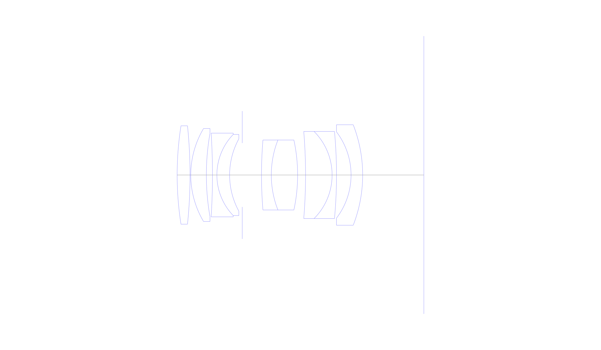
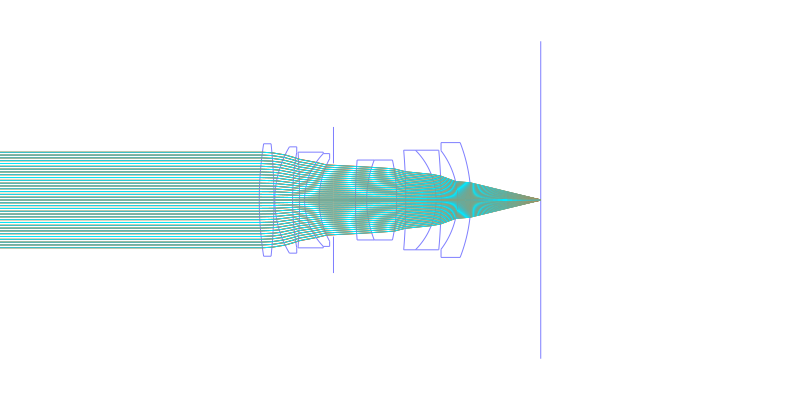
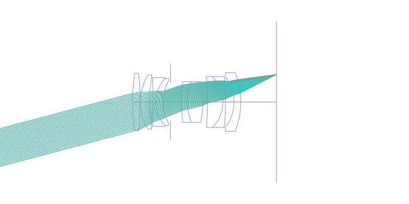
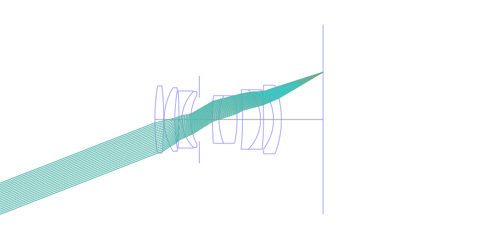
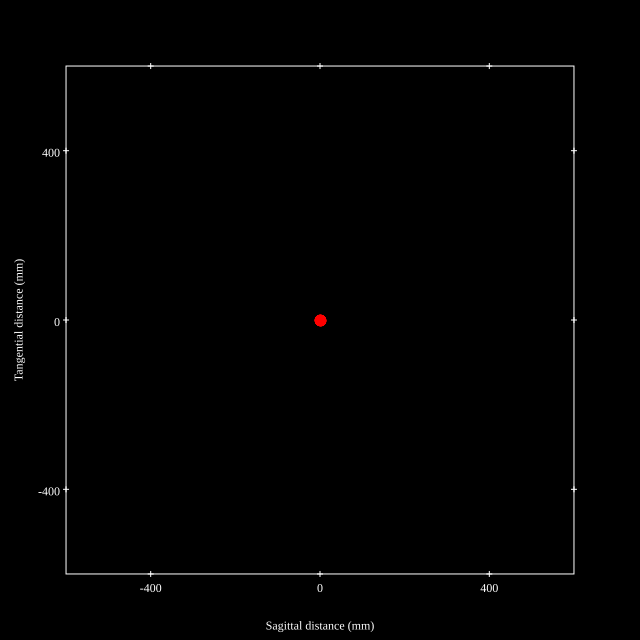
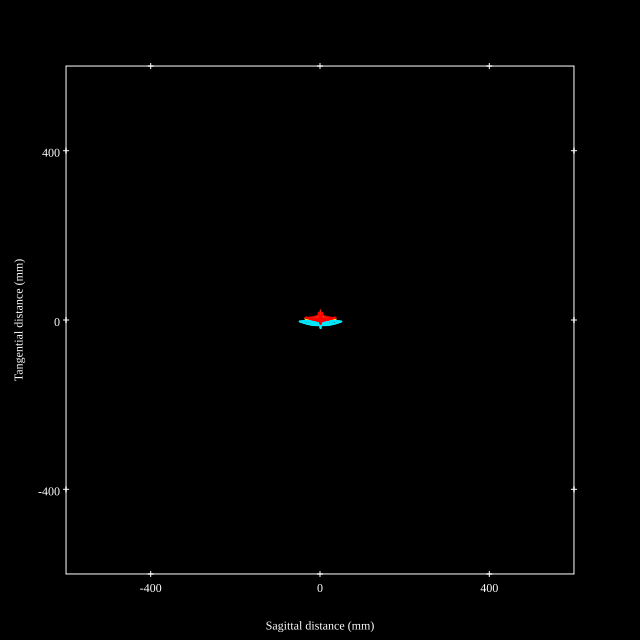
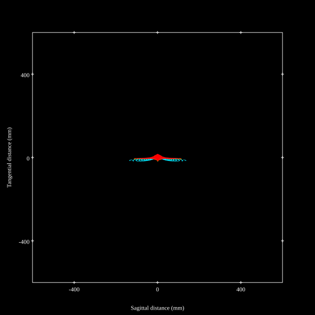
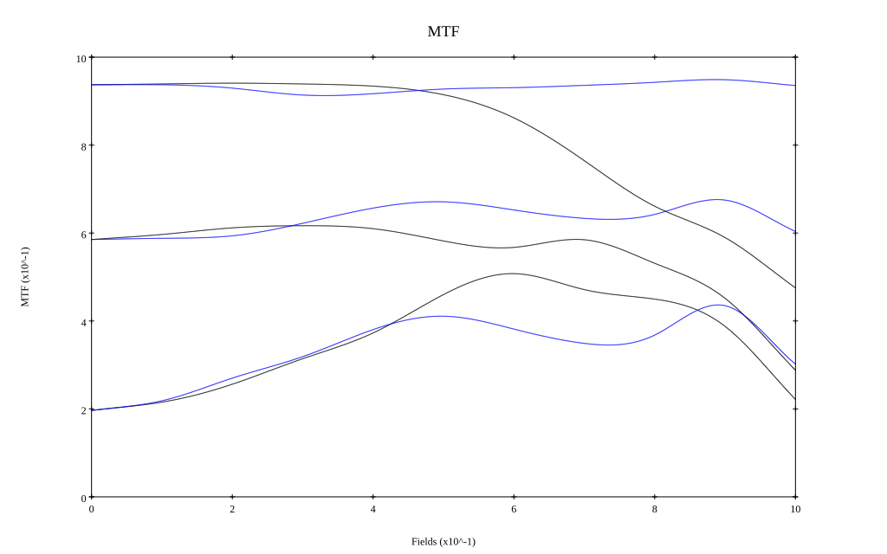
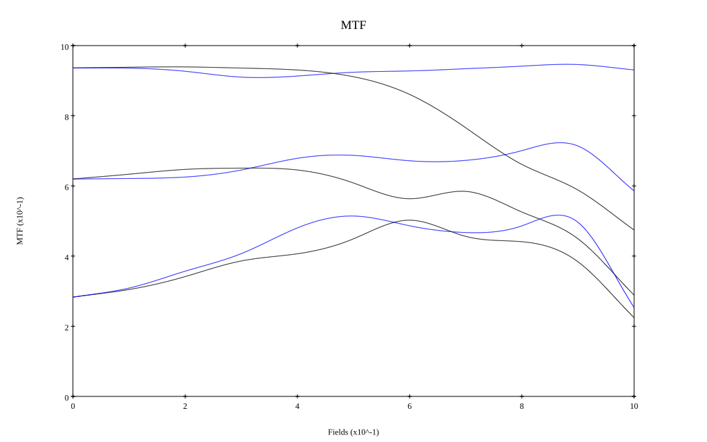

# Cosina Voigtlander Macro Apo-Ultron 35mm f2
## Patent Information
| Country | Patent Number | Example | Year of Application | Inventors | Organisation | Link |
| ---     | ---           | ---     | ---                 | ---       | ---          | ---  |
|JP | JP2026-008235 | EX 3 | 2024 | Shibata | Cosina Inc | [link](https://www.j-platpat.inpit.go.jp/c1801/PU/JP-2026-008235/11/en) |
## Surface Data
Note that where glass types are shown the refractive index and abbe number is as per assigned glass type

| ID  | Radius | Thickness | Diameter | nd  | vd  | Glass Make | Glass |
| --- | ---    | ---       | ---      | --- | --- | ---        | ---   |
| 1 | 65.073 | 2.63 | 20.12 | 1.72916 | 54.67 | Hoya | TAC8 |
| 2 | -97.646 | 0.15 | 20.12 |  |  |  |
| 3 | 18.627 | 3.18 | 19.02 | 1.72916 | 54.67 | Hoya | TAC8 |
| 4 | 49.26 | 1.25 | 17.06 |  |  |  |
| 5 | -136.133 | 0.9 | 17.12 | 1.74077 | 27.74 | Hikari | J-SF13 |
| 6 | 11.986 | 2.6 | 16.6 | 1.92286 | 20.88 | Hoya | M-FDS1 |
| 7 | 15.451 | 2.57 | 14.78 |  |  |  |
| 8 | AS | 3.94 | 13.071 |  |  |  |
| 9 | 88.056 | 2.0 | 14.3 | 1.69895 | 30.13 | Ohara | S-TIM35 |
| 10 | 19.657 | 5.37 | 14.3 | 1.76385 | 48.49 | Ohara | S-LAH96 |
| 11 | -33.978 | 1.62 | 14.3 |  |  |  |
| 12 | -107.829 | 5.42 | 17.82 | 2.001 | 29.13 | Hoya | TAFD55 |
| 13 | -12.612 | 0.9 | 17.82 | 1.738 | 32.33 | Ohara | S-NBH53V |
| 14 | -95.579 | 2.97 | 17.82 |  |  |  |
| 15 | -14.556 | 2.37 | 17.64 | 1.80809 | 22.76 | Hoya | FD225 |
| 16 | -28.294 | 12.49 | 20.54 |  |  |  |
## Layouts

## Spot Diagrams

## Paraxial Parameters
| parameter | value |
| ---       | ---   |
| effective_focal_length |36.087
| back_focal_length | 12.507
| optical_invariant | 3.496
| object_distance | 1.0E10
| image_distance | 12.507
| power | 0.028
| pp1_H | 7.01
| ppk_H' | -23.58
| ffl_F | -29.077
| fno | 2.01
| enp_dist_P | 13.646
| enp_radius | 8.975
| exp_dist_P' | -17.958
| exp_radius | 7.581
| m | -0
| red | -2.771102010920843E8
| n_obj | 1
| n_img | 1
| img_ht | 14.055
| obj_ang | 21.28
| obj_na | 0
| img_na | -0.241|
## Spot Analysis
| Field | Spot Mean Radius | Spot Max Radius |
| ---   | ---              | ---             |
 | Field(x=0.0, y=0.0) | 7.595 | 12.08|
 | Field(x=0.0, y=0.1) | 7.414 | 20.025|
 | Field(x=0.0, y=0.2) | 7.508 | 32.043|
 | Field(x=0.0, y=0.3) | 9 | 36.865|
 | Field(x=0.0, y=0.4) | 9.048 | 35.682|
 | Field(x=0.0, y=0.5) | 8.602 | 34.28|
 | Field(x=0.0, y=0.6) | 10.328 | 32.168|
 | Field(x=0.0, y=0.7) | 13.669 | 49.774|
 | Field(x=0.0, y=0.8) | 18.619 | 75.581|
 | Field(x=0.0, y=0.9) | 25.05 | 105.541|
 | Field(x=0.0, y=1.0) | 33.676 | 135.815|
## Polychromatic Geometric MTF

* 10,30,50 cycles/mm
* Black lines represent sagittal, blue tangential
* To generate above, MTFs for wavelengths 587.5618(d), 486.1327(F), 656.2725(C) were calculated across 10 fields, and then averaged
## Polychromatic Geometric MTF (Weighted)

* 10,30,50 cycles/mm
* Black lines represent sagittal, blue tangential
* To generate above, MTFs for wavelengths 587.5618(d) wt(1.0), 656.2725(C) wt(0.475), 546.074(e) wt(0.98), 486.1327(F) wt(0.49), 435.8343(g) wt(0.15) were calculated across 10 fields, and then combined using weighted average
## Resources
* [OpticalBench Compatible Data File, tab delimited](./JP2026-008235_Example03.txt)
* [Zemax file](./JP2026-008235_Example03.zmx)

Report / Zemax file generated using [Beam42](https://github.com/BeamFour/Beam42) on 2026-01-21
