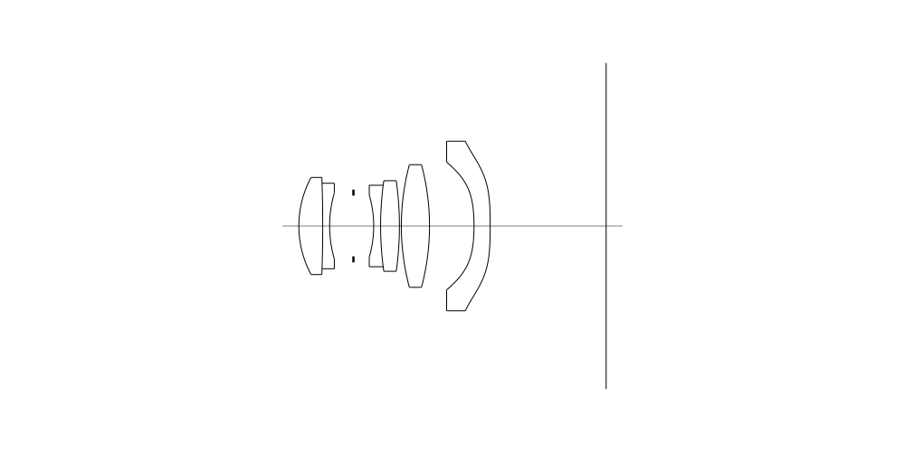
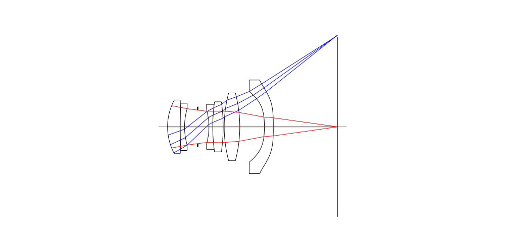
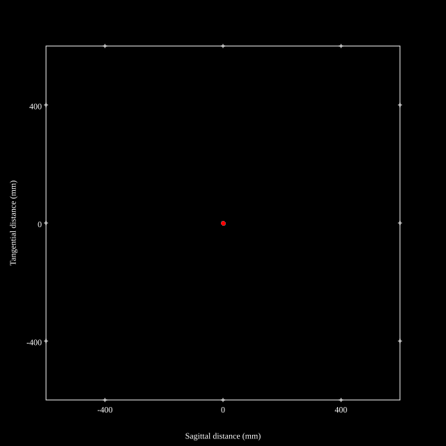
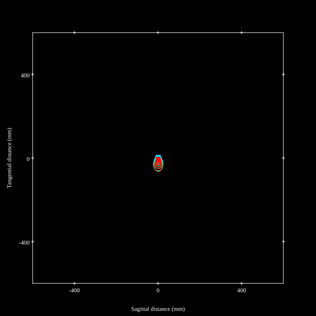
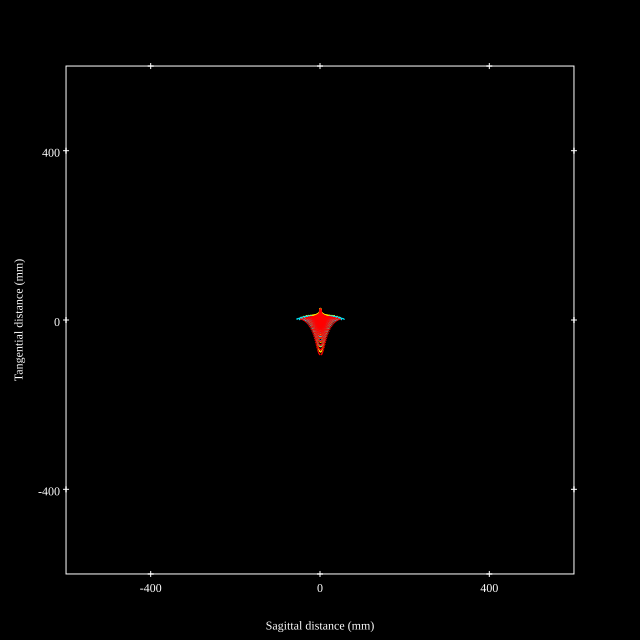
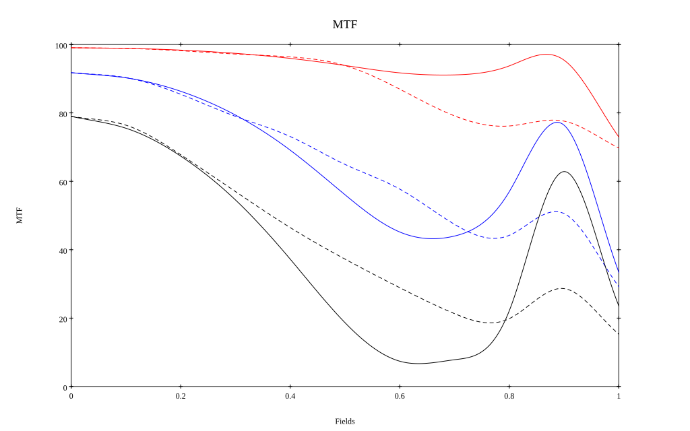
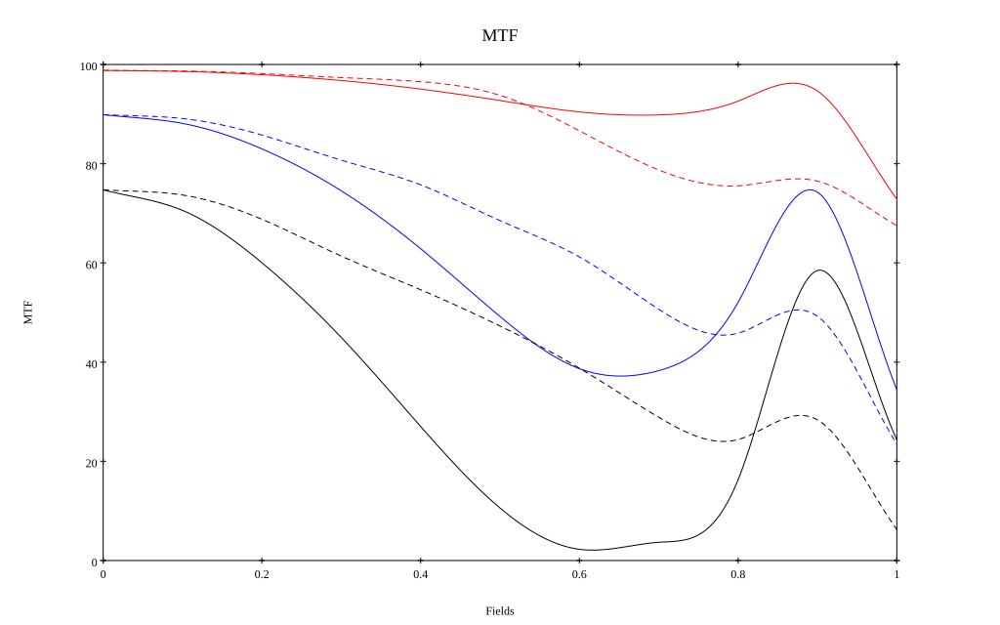

# Cosina Voigtlander COLOR-SKOPAR 35mm F3.5 Aspherical
## Patent Information
| Country | Patent Number | Example | Year of Application | Inventors | Organisation | Link |
| ---     | ---           | ---     | ---                 | ---       | ---          | ---  |
|JP | JP 2026-098935 | 2 | 2025 | Nozomu Mishima | Cosina Inc | [link](https://www.j-platpat.inpit.go.jp/c1801/PU/JP-2026-121744/11/en) |
## Surface Data
Note that where glass types are shown the refractive index and abbe number is as per assigned glass type

| ID  | Radius | Thickness | Diameter | nd  | vd  | Glass Make | Glass |
| --- | ---    | ---       | ---      | --- | --- | ---        | ---   |
| 1 | 13.403 | 3.11 | 12.66 | 1.91082 | 35.25 | Hoya | TAFD35 |
| 2 | -179.549 | 0.9 | 11.15 | 1.80809 | 22.76 | Ohara | S-NPH1 |
| 3 | 15.453 | 3.1 | 8.61 |  |  |  |
| 4 | AS | 2.64 | 7.919 |  |  |  |
| 5 | -14.459 | 0.9 | 8.09 | 1.6134 | 44.27 | Ohara | S-NBM51 |
| 6 | 42.264 | 2.45 | 10.62 | 1.883 | 40.81 | Hoya | TAFD30 |
| 7 | -42.264 | 0.25 | 11.81 |  |  |  |
| 8 | 31.099 | 3.67 | 15.99 | 1.497 | 81.61 | Hoya | FCD1 |
| 9 | -31.099 | 5.8 | 15.99 |  |  |  |
| 10 | -25.356 | 2.1 | 16.69 | 1.51633 | 64.07 | Ohara | L-BSL7 |
| 11 | -100.0 | 15.11 | 22.11 |  |  |  |
## Aspherical Data
| ID  | Type | k   | P1 | P2 | P3 | P4 | P5 | P6 |
| --- | --- | --- | --- | --- | --- | --- | --- | --- |
| 10| EVEN | 0.0 | 0.0 | -5.5781E-4 | 2.2937E-6 | -6.1771E-8 | 1.0322E-9 | -4.0737E-12 |
| 11| EVEN | 0.0 | 0.0 | -4.1509E-4 | 2.7671E-6 | -2.4381E-8 | 2.5192E-10 | -8.7175E-13 |
## Layouts

## Spot Diagrams

## Paraxial Parameters
| parameter | value |
| ---       | ---   |
| effective_focal_length |35.741
| back_focal_length | 15.108
| optical_invariant | 2.969
| object_distance | 1.0E10
| image_distance | 15.108
| power | 0.028
| pp1_H | -1.585
| ppk_H' | -20.633
| ffl_F | -37.326
| fno | 3.581
| enp_dist_P | 7.121
| enp_radius | 4.99
| exp_dist_P' | -13.634
| exp_radius | 4.012
| m | -0
| red | -2.7979059777126515E8
| n_obj | 1
| n_img | 1
| img_ht | 21.264
| obj_ang | 30.75
| obj_na | 0
| img_na | -0.138|
## Spot Analysis
| Field | Spot Mean Radius | Spot Max Radius |
| ---   | ---              | ---             |
 | Field(x=0.0, y=0.0) | 3.006 | 5.72|
 | Field(x=0.0, y=0.1) | 3.334 | 8.684|
 | Field(x=0.0, y=0.2) | 4.152 | 11.908|
 | Field(x=0.0, y=0.3) | 5.245 | 14.131|
 | Field(x=0.0, y=0.4) | 6.409 | 17.295|
 | Field(x=0.0, y=0.5) | 8.378 | 29.573|
 | Field(x=0.0, y=0.6) | 11.846 | 47.189|
 | Field(x=0.0, y=0.7) | 15.22 | 62.285|
 | Field(x=0.0, y=0.8) | 16.035 | 67.993|
 | Field(x=0.0, y=0.9) | 16.688 | 81.255|
 | Field(x=0.0, y=1.0) | 21.979 | 80.561|
## Polychromatic Geometric MTF

* 10=red,30=blue,50=black cycles/mm
* Solid lines represent sagittal, dashed lines tangential
* To generate above, MTFs for wavelengths 587.5618(d), 486.1327(F), 656.2725(C) were calculated across 10 fields, and then averaged
## Polychromatic Geometric MTF (Weighted)

* 10=red,30=blue,50=black cycles/mm
* Solid lines represent sagittal, dashed lines tangential
* To generate above, MTFs for wavelengths 587.5618(d) wt(1.0), 656.2725(C) wt(0.475), 546.074(e) wt(0.98), 486.1327(F) wt(0.49), 435.8343(g) wt(0.15) were calculated across 10 fields, and then combined using weighted average
## Resources
* [OpticalBench Compatible Data File, tab delimited](./prescription.txt)
* [Zemax file](./JP2026-121744_Example03P.zmx)

Report / Zemax file generated using [Beam42](https://github.com/BeamFour/Beam42) on 2026-08-08
