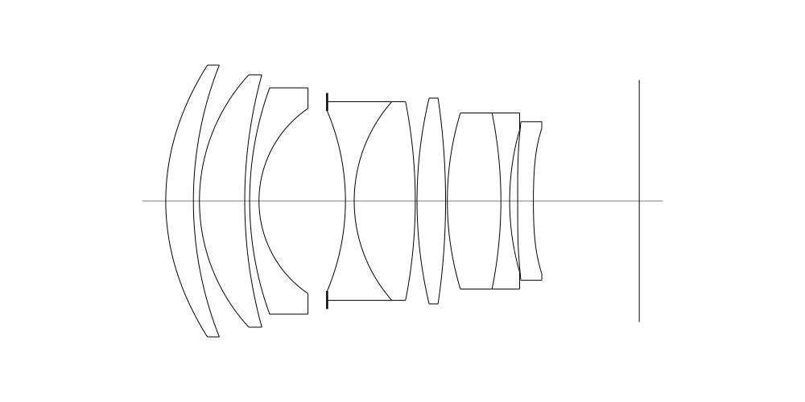
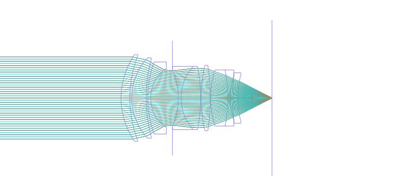
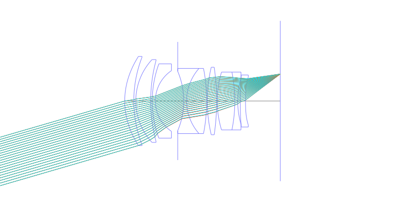
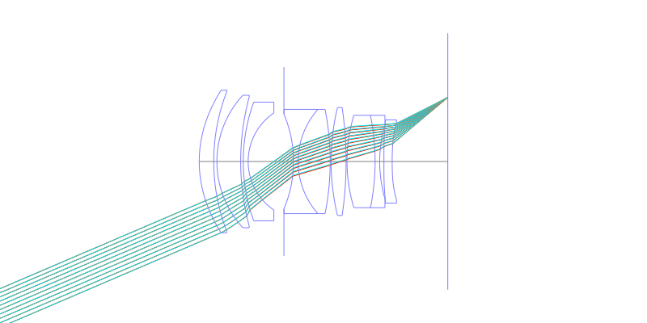
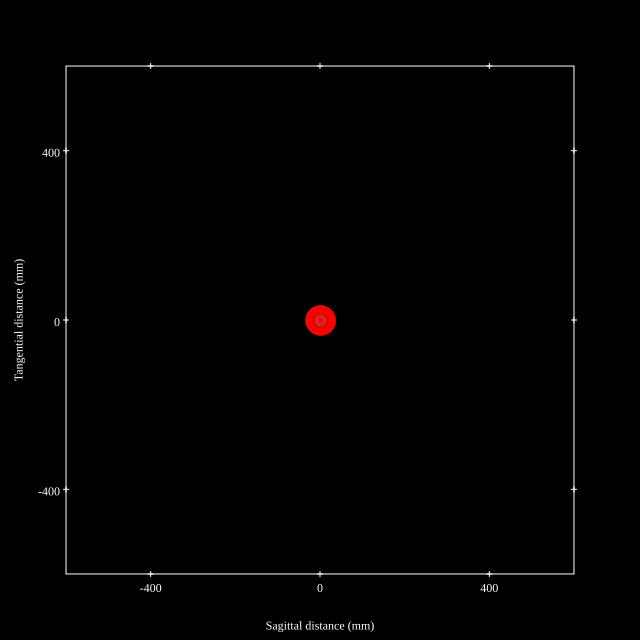
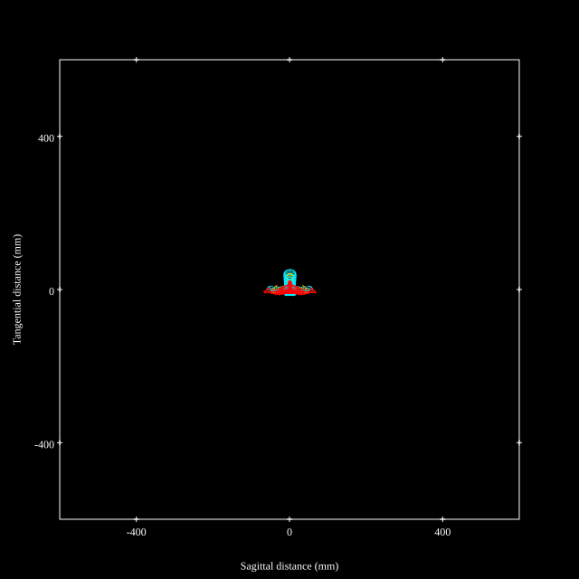
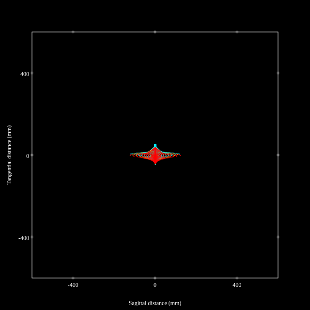
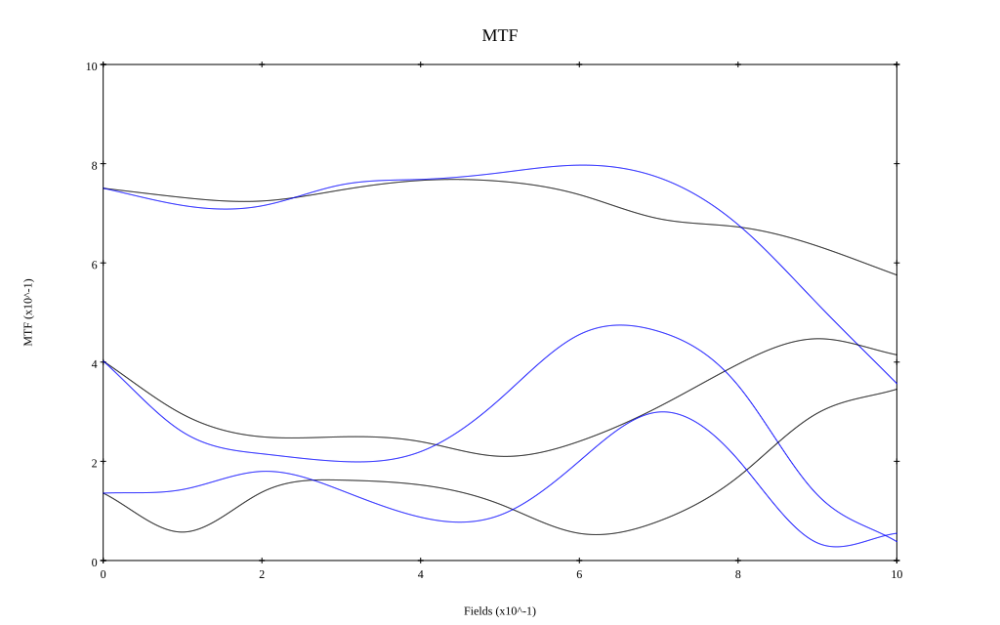

# Voigtlander NOKTON 50mm f1.0 Aspherical
## Patent Information
| Country | Patent Number | Example | Year of Application | Inventors | Organisation | Link |
| ---     | ---           | ---     | ---                 | ---       | ---          | ---  |
|JP | JP2023-063766 | EX 1 | 2021 | Kazuhiro Ogino | Cosina Co Ltd | [link](https://patents.google.com/patent/JP2023063766A/en) |
## Surface Data
Note that where glass types are shown the refractive index and abbe number is as per assigned glass type

| ID  | Radius | Thickness | Diameter | nd  | vd  | Glass Make | Glass |
| --- | ---    | ---       | ---      | --- | --- | ---        | ---   |
| 1 | 40.765 | 4.89 | 48.12 | 1.90525 | 35.04 | Ohara | S-LAH93 |
| 2 | 65.488 | 1.07 | 47.32 |  |  |  |
| 3 | 32.975 | 8.01 | 44.69 | 1.90043 | 37.37 | Hoya | TAFD37 |
| 4 | 84.15 | 0.87 | 43.61 |  |  |  |
| 5 | 58.596 | 1.65 | 40.08 | 1.80518 | 25.46 | Hoya | FD60 |
| 6 | 19.835 | 12.05 | 32.78 |  |  |  |
| 7 | AS | 3.24 | 31.881 |  |  |  |
| 8 | -40.995 | 1.55 | 31.89 | 1.76182 | 26.61 | Hoya | FD140 |
| 9 | 26.578 | 10.8 | 35.18 | 1.883 | 40.81 | Hoya | TAFD30 |
| 10 | -90.702 | 0.31 | 35.18 |  |  |  |
| 11 | 78.611 | 5.05 | 36.44 | 1.883 | 40.81 | Hoya | TAFD30 |
| 12 | -125.199 | 0.31 | 36.44 |  |  |  |
| 13 | 53.736 | 9.47 | 31.18 | 1.883 | 40.81 | Hoya | TAFD30 |
| 14 | -78.407 | 1.55 | 31.18 | 1.55298 | 55.07 | Hikari | J-KZFH4 |
| 15 | 45.846 | 1.42 | 25.18 |  |  |  |
| 16 | 3376.612 | 2.78 | 28.08 | 1.80835 | 40.55 | Ohara | L-LAH84 |
| 17 | 120.496 | 18.74 | 25.76 |  |  |  |
## Aspherical Data
| ID  | k   | P1  | P2  | P3  | P3 | P5 | P6 | P7 | P8 | P9 | P10 |
| --- | --- | --- | --- | --- | --- | --- | --- | --- | --- | --- | --- |
| 1 | -0.02238 | 0.0 | -1.0281E-6 | 6.04388E-10 | -4.31143E-12 | 5.62572E-15 | -3.29805E-18 | -5.97602E-23 | 0.0 | 0.0 | 0.0 |
| 16 | -20.0 | 0.0 | 2.4371E-5 | -9.23649E-8 | 1.14851E-9 | -1.18851E-11 | 5.37423E-14 | -9.17045E-17 | 0.0 | 0.0 | 0.0 |
| 17 | 20.0 | 0.0 | 3.37528E-5 | -2.40831E-8 | -1.16539E-10 | 1.9524E-13 | -7.7965E-16 | 2.20734E-18 | 0.0 | 0.0 | 0.0 |
## Layouts

## Spot Diagrams

## Paraxial Parameters
| parameter | value |
| ---       | ---   |
| effective_focal_length |49.998
| back_focal_length | 18.732
| optical_invariant | 10.712
| object_distance | 1.0E10
| image_distance | 18.732
| power | 0.02
| pp1_H | 28.84
| ppk_H' | -31.265
| ffl_F | -21.158
| fno | 1
| enp_dist_P | 38.303
| enp_radius | 24.999
| exp_dist_P' | -23.316
| exp_radius | 21.02
| m | -0
| red | -2.0000928296044186E8
| n_obj | 1
| n_img | 1
| img_ht | 21.424
| obj_ang | 23.195
| obj_na | 0
| img_na | -0.447|
## Spot Analysis
| Field | Spot Mean Radius | Spot Max Radius |
| ---   | ---              | ---             |
 | Field(x=0.0, y=0.0) | 13.716 | 25.793|
 | Field(x=0.0, y=0.1) | 15.39 | 42.36|
 | Field(x=0.0, y=0.2) | 16.558 | 58.379|
 | Field(x=0.0, y=0.3) | 17.09 | 61.7|
 | Field(x=0.0, y=0.4) | 18.013 | 64.859|
 | Field(x=0.0, y=0.5) | 17.911 | 65.873|
 | Field(x=0.0, y=0.6) | 17.903 | 60.729|
 | Field(x=0.0, y=0.7) | 20.162 | 59.706|
 | Field(x=0.0, y=0.8) | 25.556 | 84.275|
 | Field(x=0.0, y=0.9) | 33.473 | 124.898|
 | Field(x=0.0, y=1.0) | 36.798 | 123.086|
## Geometric MTF

* 10,30,50 cycles/mm
* Black lines represent sagittal, blue tangential
## Resources
* [OpticalBench Compatible Data File, tab delimited](./JP2023-063766_Example01P.txt)
* [Zemax file](./JP2023-063766_Example01P.zmx)
