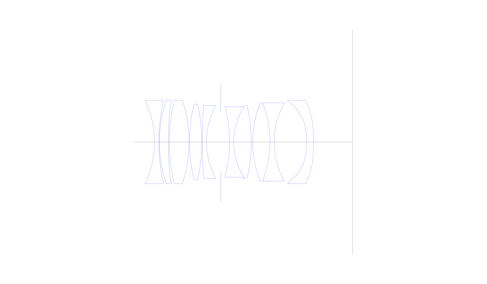
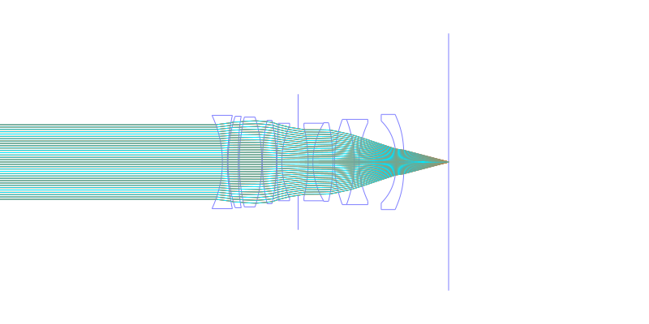
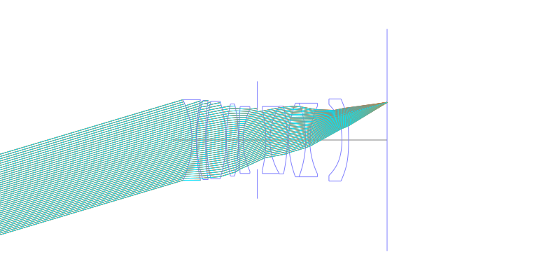
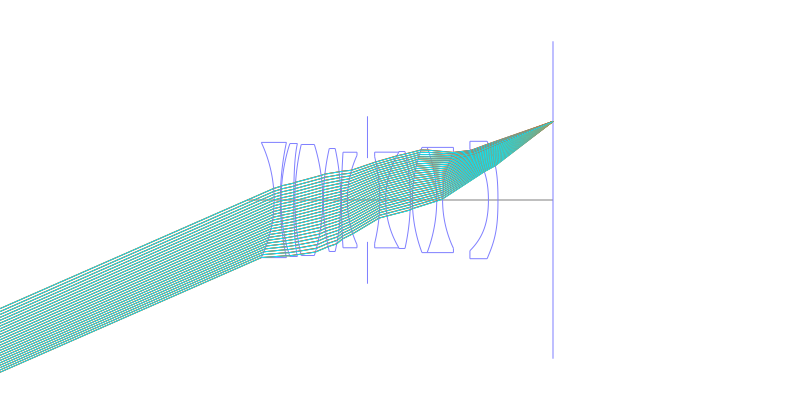
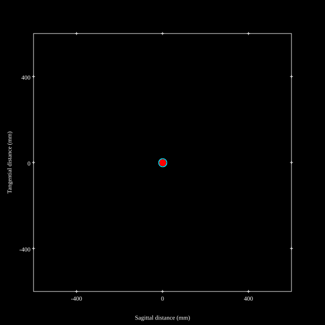
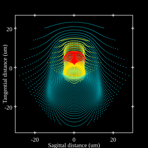
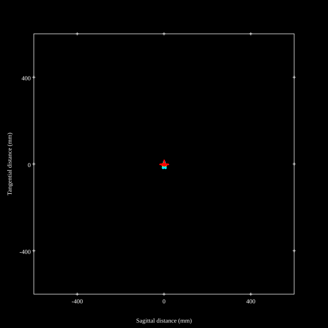

# Voigtlander APO Lanthar 50mm f2.0
## Patent Information
| Country | Patent Number | Example | Year of Application | Inventors | Organisation | Link |
| ---     | ---           | ---     | ---                 | ---       | ---          | ---  |
|JP | JP2021-043376 | EX 5 | 2019 | Nakano-shi, Nagano | Cosina Inc | [link](https://www.j-platpat.inpit.go.jp/c1801/PU/JP-2021-043376/11/en) |
## Surface Data
Note that where glass types are shown the refractive index and abbe number is as per assigned glass type

| ID  | Radius | Thickness | Diameter | nd  | vd  | Glass Make | Glass |
| --- | ---    | ---       | ---      | --- | --- | ---        | ---   |
| 1 | -37.07 | 1.7 | 31.4 | 1.54373 | 47.65 |  |
| 2 | 75.394 | 0.2 | 31.4 |  |  |  |
| 3 | 50.421 | 3.46 | 30.78 | 1.85249 | 42.08 |  |
| 4 | 236.595 | 0.32 | 30.78 |  |  |  |
| 5 | 67.642 | 7.57 | 30.26 | 1.497 | 81.61 | Hoya | FCD1 |
| 6 | -51.349 | 0.2 | 30.26 |  |  |  |
| 7 | 63.022 | 4.71 | 28.06 | 1.59282 | 68.62 | Hoya | FCD515 |
| 8 | -65.678 | 0.2 | 28.06 |  |  |  |
| 9 | 200.0 | 1.6 | 26.04 | 1.51322 | 57.22 |  |
| 10 | 29.49 | 5.49 | 24.36 |  |  |  |
| 11 | AS | 3.36 | 22.819 |  |  |  |
| 12 | -50.154 | 1.6 | 23.54 | 1.70269 | 34.84 |  |
| 13 | 25.432 | 6.72 | 26.08 | 1.79334 | 47.18 |  |
| 14 | -60.434 | 0.56 | 26.42 |  |  |  |
| 15 | 40.672 | 6.63 | 28.68 | 1.80258 | 46.6 |  |
| 16 | -40.724 | 1.6 | 28.68 | 1.55362 | 45.38 |  |
| 17 | 30.835 | 12.49 | 26.34 |  |  |  |
| 18 | -34.164 | 2.6 | 27.64 | 1.51633 | 64.06 |  |
| 19 | -112.348 | 15.0 | 32.0 |  |  |  |
## Aspherical Data
| ID  | k   | A4  | A6  | A8  | A10 | A12 | A14 | A16 | A18 |
| --- | --- | --- | --- | --- | --- | --- | --- | --- | --- |
| 3 | 0.0 | -1.6435E-6 | 7.0442E-10 | 2.7291E-11 | -2.2674E-15 | 0.0 | 0.0 | 0.0 | 0.0 |
| 4 | 0.0 | 6.4457E-6 | 1.9943E-9 | 2.8907E-11 | -4.7319E-15 | 0.0 | 0.0 | 0.0 | 0.0 |
| 18 | 0.0 | -7.6822E-5 | 1.9445E-7 | -8.3803E-10 | 1.7349E-12 | 0.0 | 0.0 | 0.0 | 0.0 |
| 19 | 0.0 | -5.6981E-5 | 1.8942E-7 | -4.8687E-10 | 7.6837E-13 | 0.0 | 0.0 | 0.0 | 0.0 |
## Layouts

## Spot Diagrams

## Paraxial Parameters
| parameter | value |
| ---       | ---   |
| effective_focal_length |49.283
| back_focal_length | 14.999
| optical_invariant | 5.605
| object_distance | 1.0E10
| image_distance | 15
| power | 0.02
| pp1_H | 3.821
| ppk_H' | 34.283
| ffl_F | -45.462
| fno | 1.93
| enp_dist_P | 19.294
| enp_radius | 12.768
| exp_dist_P' | -22.507
| exp_radius | 9.717
| m | -0
| red | -2.02910594983977E8
| n_obj | 1
| n_img | 1
| img_ht | 21.634
| obj_ang | 23.7
| obj_na | 0
| img_na | -0.251|
## Spot Analysis
| Field | Spot Mean Radius | Spot Max Radius |
| ---   | ---              | ---             |
 | 0.0 | 7.268 | 16.233|
 | 0.7 | 10.014 | 30.662|
 | 1.0 | 8.796 | 26.36|
## Resources
* [OpticalBench Compatible Data File, tab delimited](./JP2021-043376_Example.txt)
* [Zemax file](./JP2021-043376_Example.zmx)
