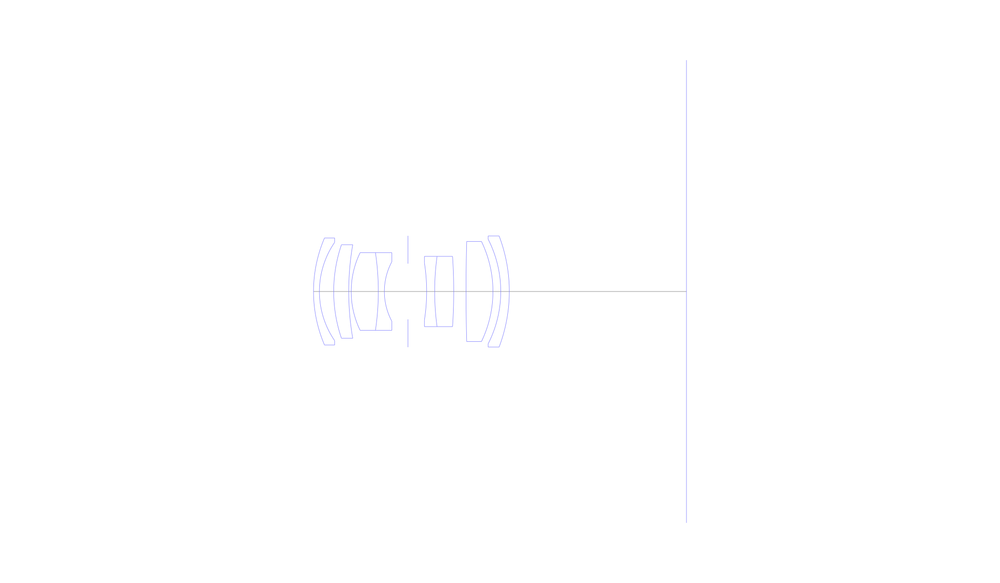
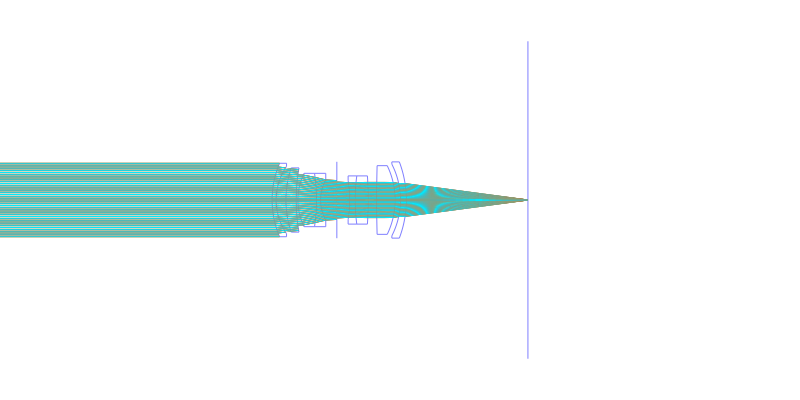
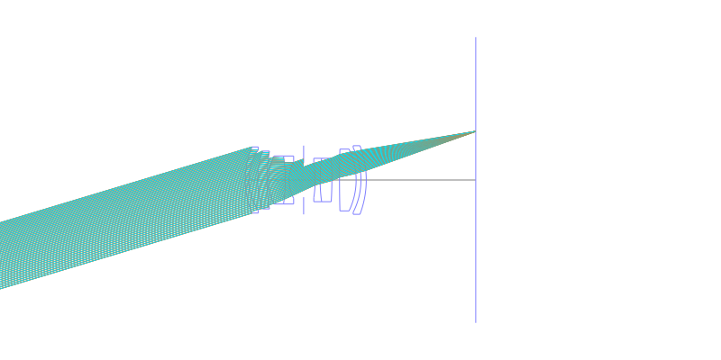
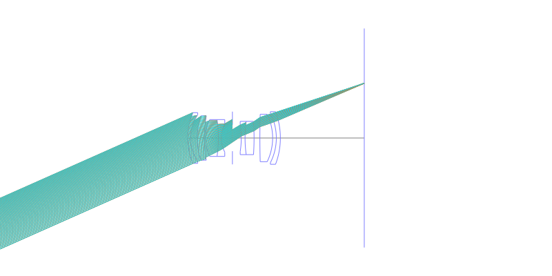
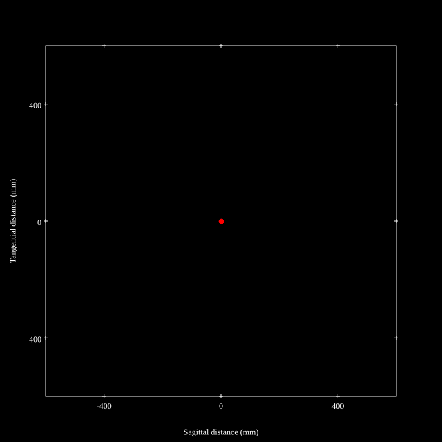
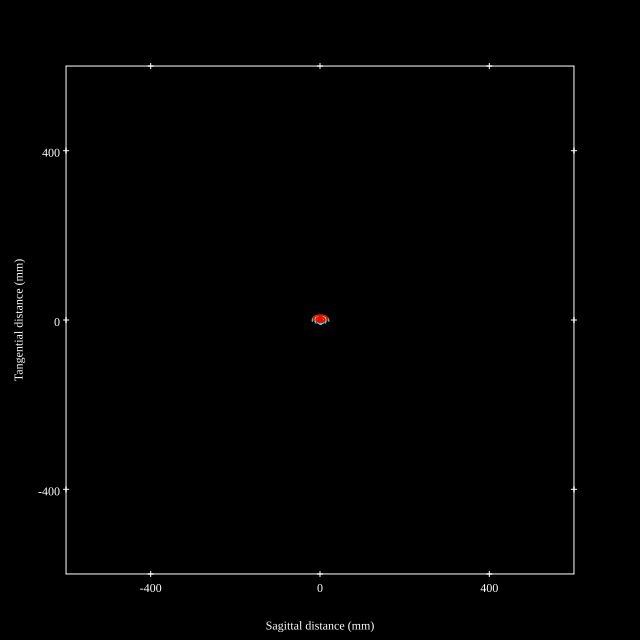
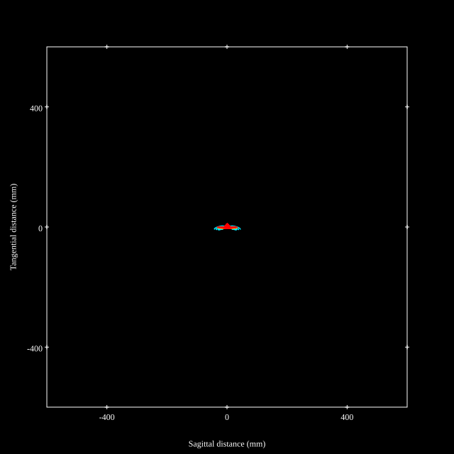
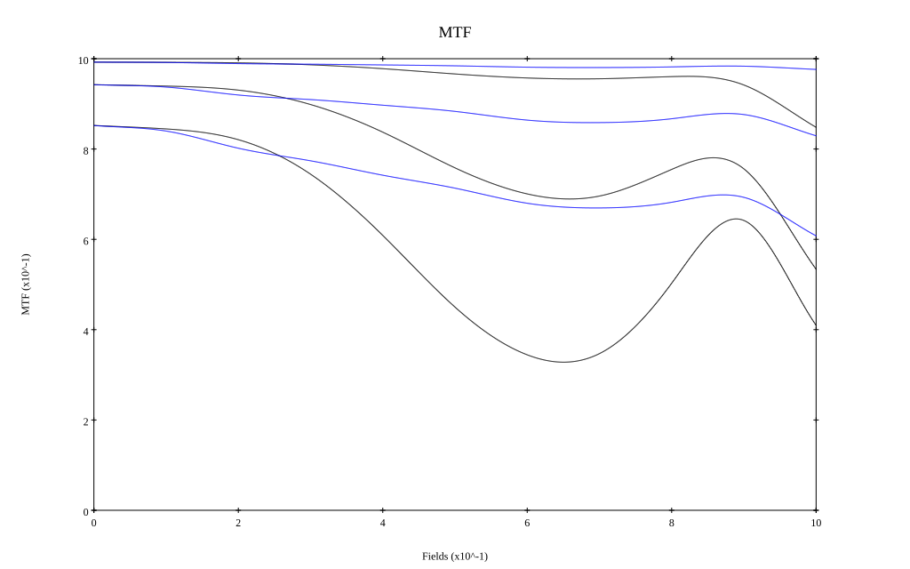
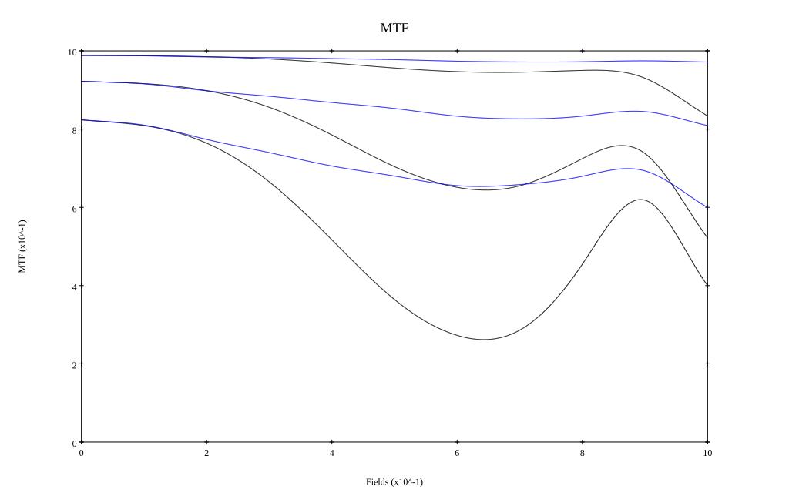

# Voigtlander APO Lanthar 50mm f3.5
## Patent Information
| Country | Patent Number | Example | Year of Application | Inventors | Organisation | Link |
| ---     | ---           | ---     | ---                 | ---       | ---          | ---  |
|JP | JP 2025-108279 | EX 1 | 2025 | Shoju Yomogita, Shibata | Cosina Inc | [link](https://www.j-platpat.inpit.go.jp/c1801/PU/JP-2025-108279/11/en) |
## Surface Data
Note that where glass types are shown the refractive index and abbe number is as per assigned glass type

| ID  | Radius | Thickness | Diameter | nd  | vd  | Glass Make | Glass |
| --- | ---    | ---       | ---      | --- | --- | ---        | ---   |
| 1 | 25.402 | 1.1 | 20.02 | 1.48749 | 70.44 | Hoya | FC5 |
| 2 | 16.246 | 2.67 | 18.36 |  |  |  |
| 3 | 27.07 | 2.81 | 17.5 | 1.883 | 40.81 | Hoya | TAFD30 |
| 4 | 51.591 | 0.46 | 17.5 |  |  |  |
| 5 | 16.622 | 5.07 | 14.54 | 1.72916 | 54.67 | Hoya | TAC8 |
| 6 | -49.139 | 1.13 | 14.54 | 1.60342 | 38.01 | Hoya | E-F5 |
| 7 | 11.798 | 4.41 | 11.11 |  |  |  |
| 8 | AS | 3.49 | 10.414 |  |  |  |
| 9 | -34.603 | 1.5 | 10.66 | 1.56732 | 42.84 | Hoya | E-FL6 |
| 10 | 48.429 | 3.56 | 13.14 | 1.497 | 81.61 | Hoya | FCD1 |
| 11 | -98.252 | 2.3 | 13.14 |  |  |  |
| 12 | 344.13 | 5.03 | 18.72 | 1.713 | 53.94 | Hoya | LAC8 |
| 13 | -21.462 | 1.46 | 18.72 |  |  |  |
| 14 | -21.458 | 1.6 | 19.52 | 1.68893 | 31.16 | Hoya | E-FD8 |
| 15 | -29.225 | 33.11 | 20.78 |  |  |  |
## Layouts

## Spot Diagrams

## Paraxial Parameters
| parameter | value |
| ---       | ---   |
| effective_focal_length |49.101
| back_focal_length | 33.142
| optical_invariant | 3.062
| object_distance | 1.0E10
| image_distance | 33.142
| power | 0.02
| pp1_H | 21.662
| ppk_H' | -15.959
| ffl_F | -27.439
| fno | 3.56
| enp_dist_P | 17.393
| enp_radius | 6.896
| exp_dist_P' | -20.602
| exp_radius | 7.553
| m | -0
| red | -2.0366113068824634E8
| n_obj | 1
| n_img | 1
| img_ht | 21.8
| obj_ang | 23.94
| obj_na | 0
| img_na | -0.139|
## Spot Analysis
| Field | Spot Mean Radius | Spot Max Radius |
| ---   | ---              | ---             |
 | Field(x=0.0, y=0.0) | 2.768 | 6.878|
 | Field(x=0.0, y=0.1) | 2.925 | 10.495|
 | Field(x=0.0, y=0.2) | 3.293 | 13.303|
 | Field(x=0.0, y=0.3) | 3.567 | 12.683|
 | Field(x=0.0, y=0.4) | 4.071 | 12.469|
 | Field(x=0.0, y=0.5) | 4.668 | 12.959|
 | Field(x=0.0, y=0.6) | 5.281 | 14.932|
 | Field(x=0.0, y=0.7) | 5.607 | 19.376|
 | Field(x=0.0, y=0.8) | 5.537 | 25|
 | Field(x=0.0, y=0.9) | 6.683 | 33.481|
 | Field(x=0.0, y=1.0) | 10.241 | 43.544|
## Polychromatic Geometric MTF

* 10,30,50 cycles/mm
* Black lines represent sagittal, blue tangential
* To generate above, MTFs for wavelengths 587.5618(d), 486.1327(F), 656.2725(C) were calculated across 10 fields, and then averaged
## Polychromatic Geometric MTF (Weighted)

* 10,30,50 cycles/mm
* Black lines represent sagittal, blue tangential
* To generate above, MTFs for wavelengths 587.5618(d) wt(1.0), 656.2725(C) wt(0.475), 546.074(e) wt(0.98), 486.1327(F) wt(0.49), 435.8343(g) wt(0.15) were calculated across 10 fields, and then combined using weighted average
## Resources
* [OpticalBench Compatible Data File, tab delimited](./JP2025-108279_Example01.txt)
* [Zemax file](./JP2025-108279_Example01.zmx)
