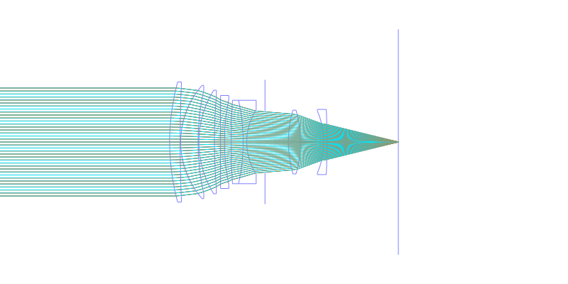
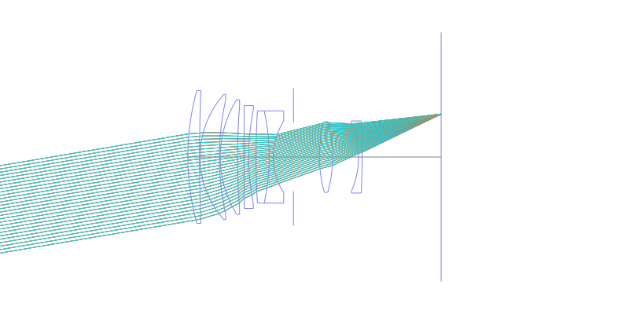
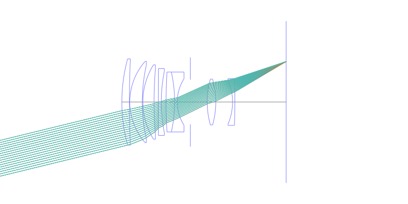
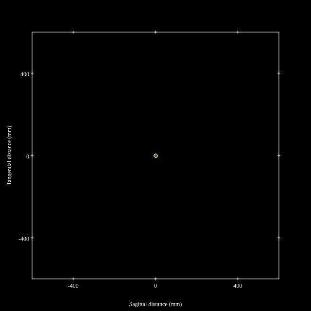
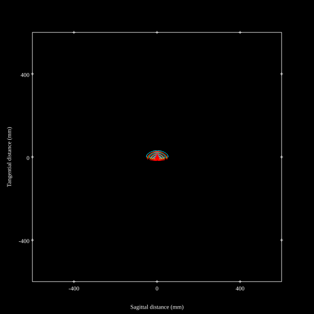
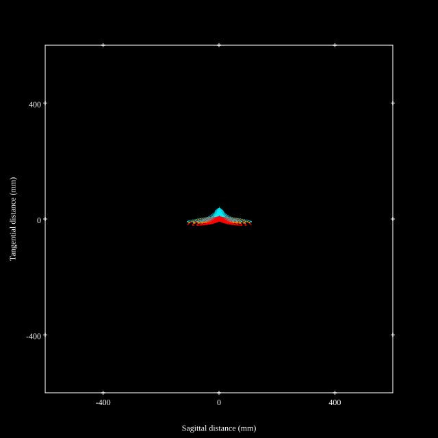
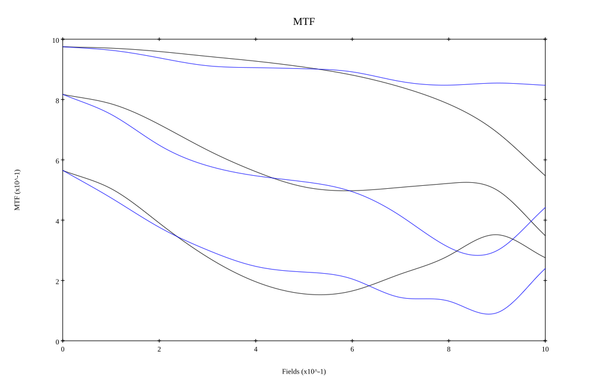
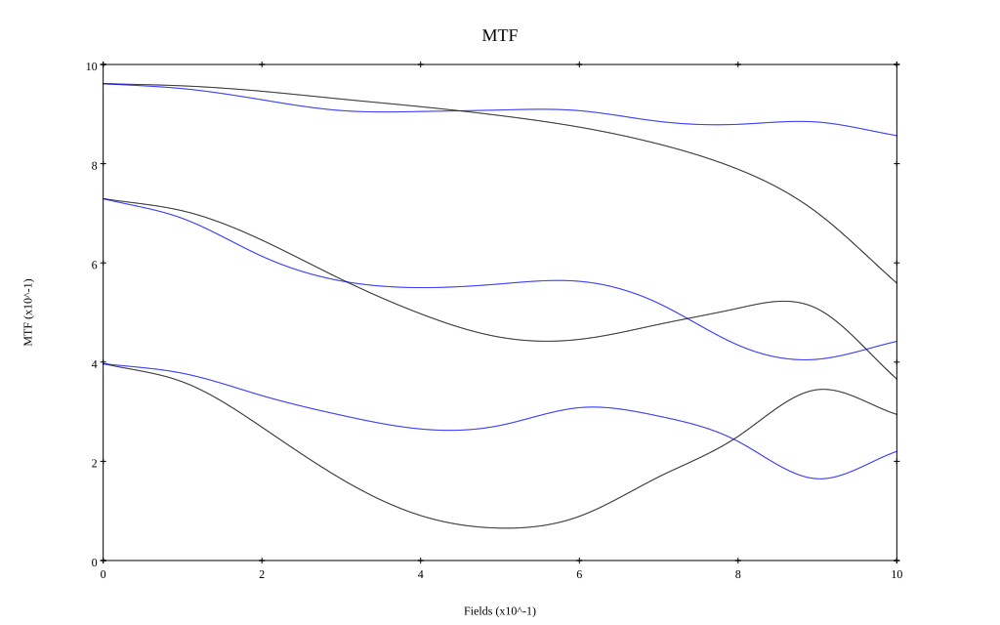

# Cosina Voigtlander Apo-Ultron 90mm f2
## Patent Information
| Country | Patent Number | Example | Year of Application | Inventors | Organisation | Link |
| ---     | ---           | ---     | ---                 | ---       | ---          | ---  |
|JP | JP2026-008235 | EX 1 | 2024 | Shibata | Cosina Inc | [link](https://www.j-platpat.inpit.go.jp/c1801/PU/JP-2026-008235/11/en) |
## Surface Data
Note that where glass types are shown the refractive index and abbe number is as per assigned glass type

| ID  | Radius | Thickness | Diameter | nd  | vd  | Glass Make | Glass |
| --- | ---    | ---       | ---      | --- | --- | ---        | ---   |
| 1 | 87.907 | 4.04 | 46.1 | 1.60311 | 60.69 | Hoya | BACD14 |
| 2 | 534.257 | 0.2 | 46.1 |  |  |  |
| 3 | 32.865 | 6.68 | 43.48 | 1.497 | 81.61 | Hoya | FCD1 |
| 4 | 90.48 | 0.3 | 39.45 |  |  |  |
| 5 | 37.52 | 5.99 | 39.78 | 1.497 | 81.61 | Hoya | FCD1 |
| 6 | 218.824 | 2.27 | 35.48 |  |  |  |
| 7 | 2532.276 | 1.6 | 35.7 | 1.68893 | 31.16 | Hoya | M-FD80 |
| 8 | 83.415 | 2.56 | 32.74 |  |  |  |
| 9 | 270.511 | 4.56 | 32.04 | 1.92286 | 20.88 | Hoya | M-FDS1 |
| 10 | -73.97 | 1.4 | 32.04 | 1.77047 | 29.74 | Hoya | NBFD29 |
| 11 | 23.216 | 7.0 | 24.88 |  |  |  |
| 12 | AS | 9.01 | 23.86 |  |  |  |
| 13 | 45.076 | 4.58 | 24.5 | 1.51823 | 58.82 | Hikari | J-K3 |
| 14 | -45.076 | 8.95 | 24.5 |  |  |  |
| 15 | -30.274 | 1.25 | 23.7 | 1.437 | 95.1 | Hoya | FCD100 |
| 16 | -300.0 | 27.39997 | 25.02 |  |  |  |
## Layouts

## Spot Diagrams

## Paraxial Parameters
| parameter | value |
| ---       | ---   |
| effective_focal_length |87.265
| back_focal_length | 27.383
| optical_invariant | 5.194
| object_distance | 1.0E10
| image_distance | 27.383
| power | 0.011
| pp1_H | -18.056
| ppk_H' | -59.882
| ffl_F | -105.321
| fno | 2.049
| enp_dist_P | 57.427
| enp_radius | 21.29
| exp_dist_P' | -19.426
| exp_radius | 11.416
| m | -0
| red | -1.1459356311333188E8
| n_obj | 1
| n_img | 1
| img_ht | 21.289
| obj_ang | 13.71
| obj_na | 0
| img_na | -0.237|
## Spot Analysis
| Field | Spot Mean Radius | Spot Max Radius |
| ---   | ---              | ---             |
 | Field(x=0.0, y=0.0) | 4.731 | 7.664|
 | Field(x=0.0, y=0.1) | 5.405 | 17.666|
 | Field(x=0.0, y=0.2) | 6.992 | 27.993|
 | Field(x=0.0, y=0.3) | 8.623 | 36.584|
 | Field(x=0.0, y=0.4) | 9.297 | 33.424|
 | Field(x=0.0, y=0.5) | 10.037 | 33.812|
 | Field(x=0.0, y=0.6) | 11.256 | 41.117|
 | Field(x=0.0, y=0.7) | 13.53 | 52.293|
 | Field(x=0.0, y=0.8) | 16.216 | 67.394|
 | Field(x=0.0, y=0.9) | 20.881 | 87.007|
 | Field(x=0.0, y=1.0) | 29.009 | 110.777|
## Polychromatic Geometric MTF

* 10,30,50 cycles/mm
* Black lines represent sagittal, blue tangential
* To generate above, MTFs for wavelengths 587.5618(d), 486.1327(F), 656.2725(C) were calculated across 10 fields, and then averaged
## Polychromatic Geometric MTF (Weighted)

* 10,30,50 cycles/mm
* Black lines represent sagittal, blue tangential
* To generate above, MTFs for wavelengths 587.5618(d) wt(1.0), 656.2725(C) wt(0.475), 546.074(e) wt(0.98), 486.1327(F) wt(0.49), 435.8343(g) wt(0.15) were calculated across 10 fields, and then combined using weighted average
## Resources
* [OpticalBench Compatible Data File, tab delimited](./JP2026-008235_Example01.txt)
* [Zemax file](./JP2026-008235_Example01.zmx)

This report / Zemax file generated using [Beam42](https://github.com/BeamFour/Beam42) on 2026-01-21
