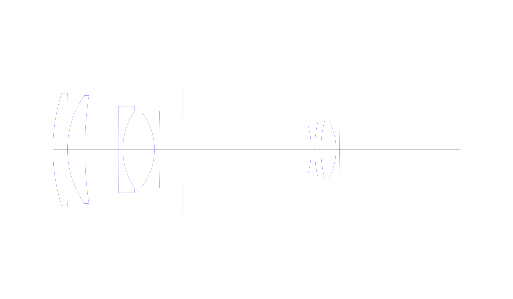
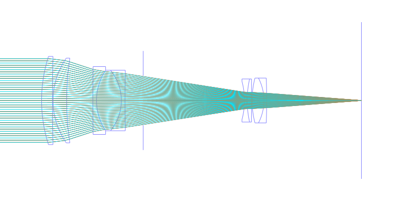
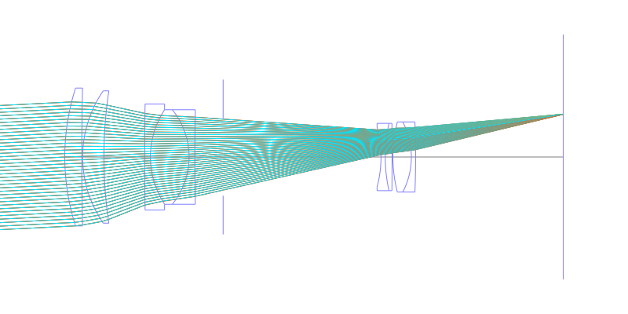
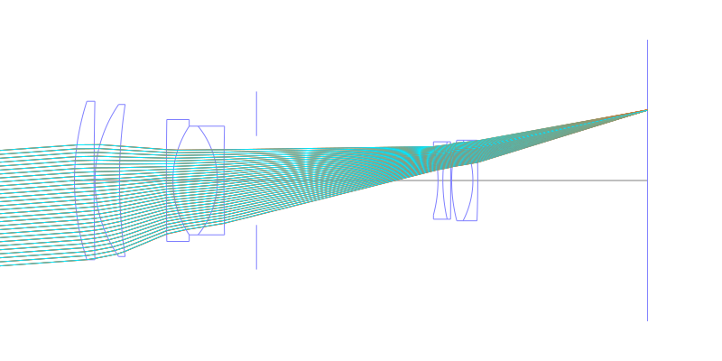
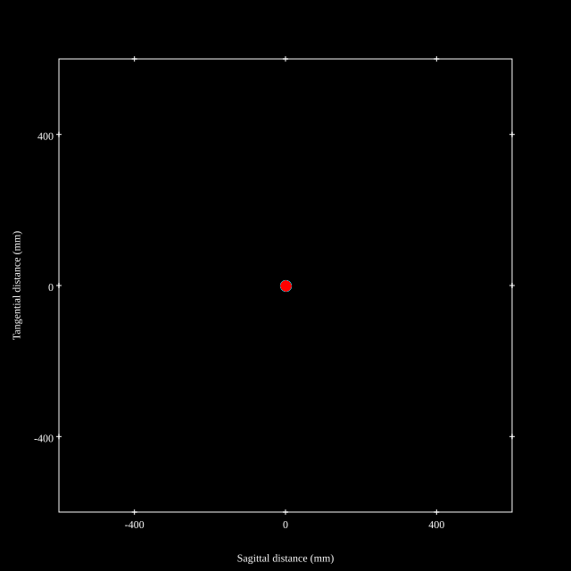
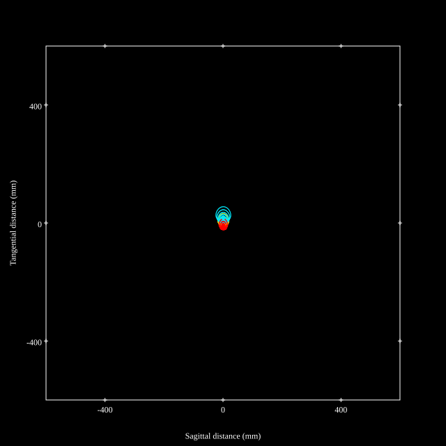
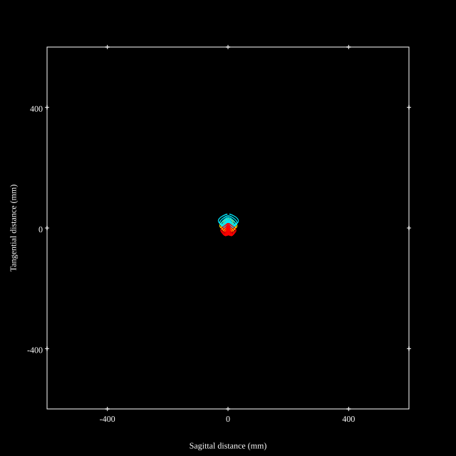
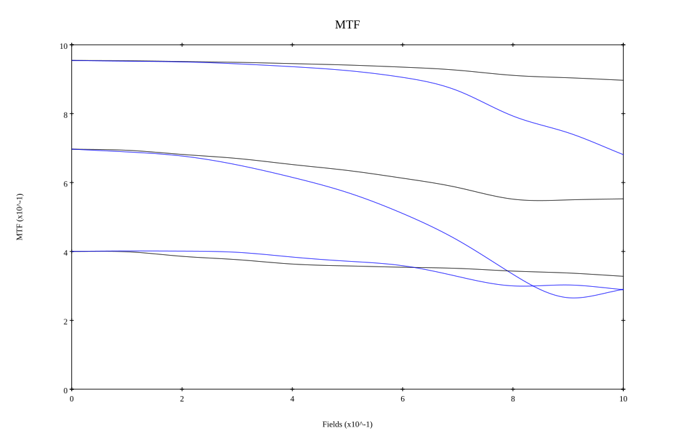
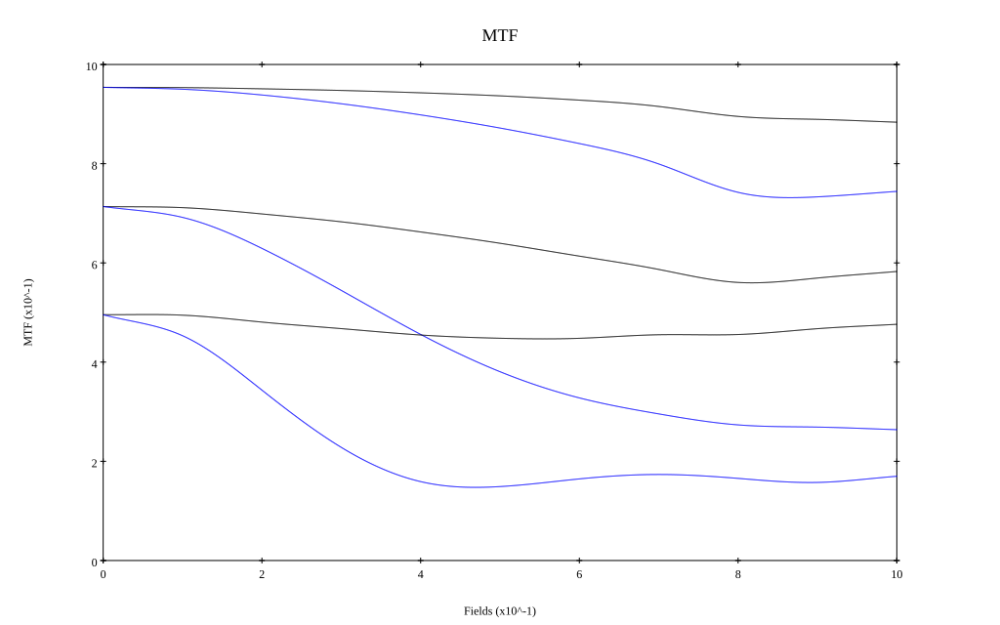

## Surface Data
Note that where glass types are shown the refractive index and abbe number is as per assigned glass type

| ID  | Radius | Thickness | Diameter | nd  | vd  | Glass Make | Glass |
| --- | ---    | ---       | ---      | --- | --- | ---        | ---   |
| 1 | 79.74 | 6.0 | 48.64 | 1.43384 | 95.26 | Hikari | NICF-A |
| 2 | 1141.935 | 0.3 | 48.64 |  |  |  |
| 3 | 41.205 | 7.5 | 46.68 | 1.43384 | 95.26 | Hikari | NICF-A |
| 4 | 156.816 | 14.4 | 46.68 |  |  |  |
| 5 | 1320.0 | 2.01 | 37.4 | 1.8044 | 39.59 | Ohara | S-LAH63 |
| 6 | 30.306 | 13.65 | 33.36 | 1.51118 | 51.02 | Ohara | FTL8 |
| 7 | -26.4 | 2.01 | 33.36 | 1.49831 | 65.03 | Ohara | BSL3 |
| 8 | 826.65 | 10.0 | 33.36 |  |  |  |
| 9 | AS | 55.7 | 27.31 |  |  |  |
| 10 | -40.95 | 1.5 | 21.12 | 1.7865 | 50.0 | Ohara | S-YGH52 |
| 11 | 54.051 | 2.4 | 23.76 | 1.5927 | 35.31 | Ohara | S-FTM16 |
| 12 | -1606.815 | 0.3 | 23.76 |  |  |  |
| 13 | 49.5 | 6.51 | 24.74 | 1.5927 | 35.31 | Ohara | S-FTM16 |
| 14 | -26.85 | 1.5 | 24.74 | 1.81554 | 44.36 | Ohara | S-LAH54 |
| 15 | -321.579 | 52.08 | 24.74 |  |  |  |
## Layouts

## Spot Diagrams

## Paraxial Parameters
| parameter | value |
| ---       | ---   |
| effective_focal_length |300.107
| back_focal_length | 52.112
| optical_invariant | 1.709
| object_distance | 1.0E10
| image_distance | 52.112
| power | 0.003
| pp1_H | -628.501
| ppk_H' | -247.995
| ffl_F | -928.608
| fno | 6.303
| enp_dist_P | 87.667
| enp_radius | 23.807
| exp_dist_P' | -36.478
| exp_radius | 7.03
| m | -0
| red | -3.3321491793169256E7
| n_obj | 1
| n_img | 1
| img_ht | 21.538
| obj_ang | 4.105
| obj_na | 0
| img_na | -0.079|
## Spot Analysis
| Field | Spot Mean Radius | Spot Max Radius |
| ---   | ---              | ---             |
 | Field(x=0.0, y=0.0) | 6.342 | 15.433|
 | Field(x=0.0, y=0.1) | 6.617 | 18.106|
 | Field(x=0.0, y=0.2) | 7.394 | 21.086|
 | Field(x=0.0, y=0.3) | 8.46 | 26.167|
 | Field(x=0.0, y=0.4) | 9.658 | 31.511|
 | Field(x=0.0, y=0.5) | 10.935 | 37.74|
 | Field(x=0.0, y=0.6) | 12.346 | 45.674|
 | Field(x=0.0, y=0.7) | 14.089 | 56.343|
 | Field(x=0.0, y=0.8) | 16.594 | 71.061|
 | Field(x=0.0, y=0.9) | 16.426 | 60.736|
 | Field(x=0.0, y=1.0) | 15.746 | 47.142|
## Polychromatic Geometric MTF

* 10,30,50 cycles/mm
* Black lines represent sagittal, blue tangential
* To generate above, MTFs for wavelengths 587.5618(d), 486.1327(F), 656.2725(C) were calculated across 10 fields, and then averaged
## Polychromatic Geometric MTF (Weighted)

* 10,30,50 cycles/mm
* Black lines represent sagittal, blue tangential
* To generate above, MTFs for wavelengths 587.5618(d) wt(1.0), 656.2725(C) wt(0.475), 546.074(e) wt(0.98), 486.1327(F) wt(0.49), 435.8343(g) wt(0.15) were calculated across 10 fields, and then combined using weighted average
## Resources
* [OpticalBench Compatible Data File, tab delimited](./JP1974-023892_Example01P.txt)
* [Zemax file](./JP1974-023892_Example01P.zmx)

Report / Zemax file generated using [Beam42](https://github.com/BeamFour/Beam42) on 2026-01-23
