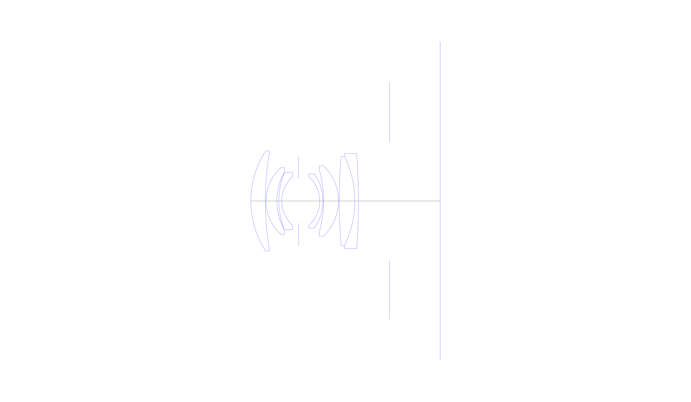
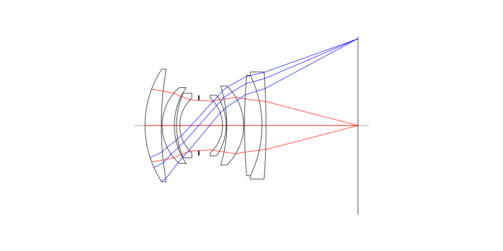
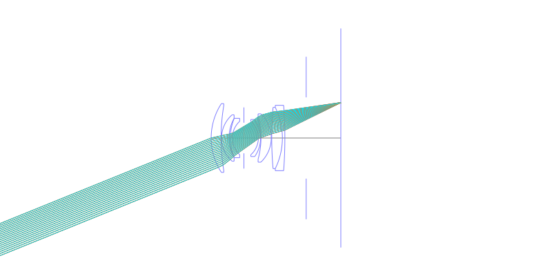
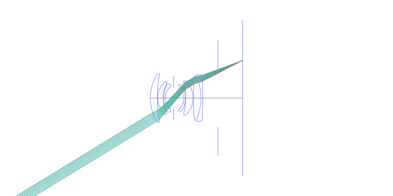
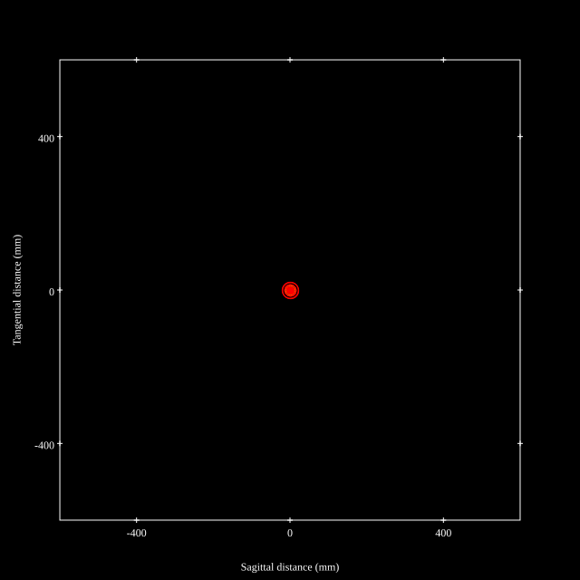
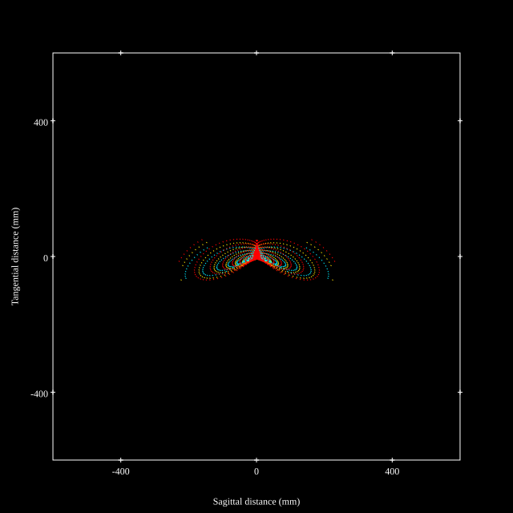
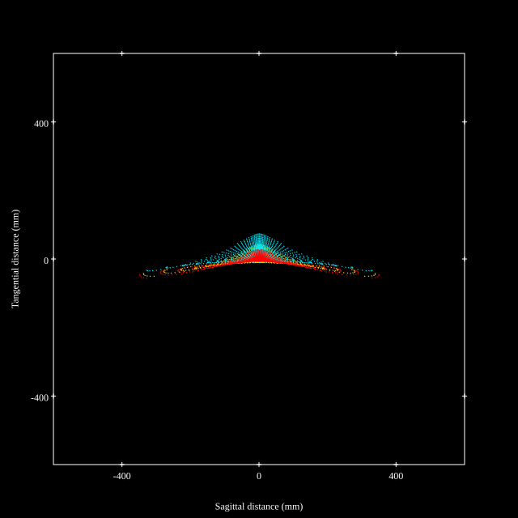
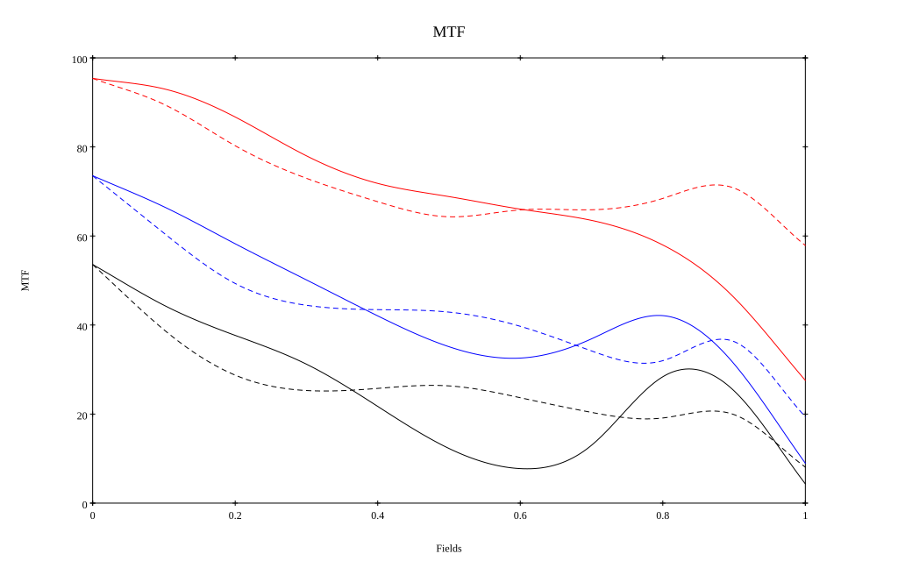
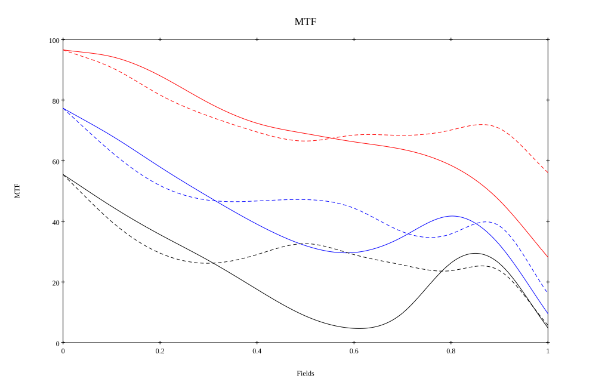

# Konica Hexanon 35mm F2.0
## Patent Information
| Country | Patent Number | Example | Year of Application | Inventors | Organisation | Link |
| ---     | ---           | ---     | ---                 | ---       | ---          | ---  |
|JP | JP1993-164961 | EX 1 | 1991 | SHIMAZAKI YOSHIO | KONICA CORP | [link](https://www.j-platpat.inpit.go.jp/c1801/PU/JP-H05-164961/11/en) |
## Surface Data
Note that where glass types are shown the refractive index and abbe number is as per assigned glass type

| ID  | Radius | Thickness | Diameter | nd  | vd  | Glass Make | Glass |
| --- | ---    | ---       | ---      | --- | --- | ---        | ---   |
| 1 | 24.9025 | 3.913 | 27.16 | 1.7725 | 49.6 | Ohara | S-LAH66 |
| 2 | 77.49 | 0.19565 | 25.63 |  |  |  |
| 3 | 12.159 | 2.93475 | 18.27 | 1.741 | 52.64 | Ohara | S-LAL61 |
| 4 | 16.0475 | 0.53795 | 15.56 |  |  |  |
| 5 | 20.4645 | 0.7826 | 15.56 | 1.71736 | 29.52 | Ohara | S-TIH1 |
| 6 | 8.939 | 4.57 | 13.18 |  |  |  |
| 7 | AS | 5.7025 | 12.084 |  |  |  |
| 8 | -8.8305 | 0.8806 | 13.23 | 1.5927 | 35.31 | Ohara | S-FTM16 |
| 9 | -12.747 | 0.14665 | 14.63 |  |  |  |
| 10 | -31.5245 | 4.06 | 16.68 | 1.741 | 52.64 | Ohara | S-LAL61 |
| 11 | -13.174 | 0.19565 | 19.09 |  |  |  |
| 12 | 140.175 | 4.207 | 24.17 | 1.7725 | 49.6 | Ohara | S-LAH66 |
| 13 | -27.391 | 0.97825 | 24.17 | 1.72825 | 28.46 | Ohara | S-TIH10 |
| 14 | -174.3 | 8.42 | 25.81 |  |  |  |
| 15 | FS | 13.69 | 32.09 |  |  |  |
## Layouts

## Spot Diagrams

## Paraxial Parameters
| parameter | value |
| ---       | ---   |
| effective_focal_length |34.988
| back_focal_length | 13.785
| optical_invariant | 5.36
| object_distance | 1.0E10
| image_distance | 13.785
| power | 0.029
| pp1_H | 21.196
| ppk_H' | -21.203
| ffl_F | -13.793
| fno | 2
| enp_dist_P | 15.35
| enp_radius | 8.747
| exp_dist_P' | -28.126
| exp_radius | 10.502
| m | -0
| red | -2.858105376227053E8
| n_obj | 1
| n_img | 1
| img_ht | 21.441
| obj_ang | 31.5
| obj_na | 0
| img_na | -0.243|
## Spot Analysis
| Field | Spot Mean Radius | Spot Max Radius |
| ---   | ---              | ---             |
 | Field(x=0.0, y=0.0) | 6.25 | 21.08|
 | Field(x=0.0, y=0.1) | 9.536 | 41.688|
 | Field(x=0.0, y=0.2) | 15.977 | 80.753|
 | Field(x=0.0, y=0.3) | 26.305 | 119.713|
 | Field(x=0.0, y=0.4) | 29.782 | 123.315|
 | Field(x=0.0, y=0.5) | 32.989 | 144.368|
 | Field(x=0.0, y=0.6) | 38.427 | 185.011|
 | Field(x=0.0, y=0.7) | 50.163 | 233.223|
 | Field(x=0.0, y=0.8) | 66.639 | 334.294|
 | Field(x=0.0, y=0.9) | 81.252 | 367.697|
 | Field(x=0.0, y=1.0) | 84.352 | 351.689|
## Polychromatic Geometric MTF

* 10,30,50 cycles/mm
* Black lines represent sagittal, blue tangential
* To generate above, MTFs for wavelengths 587.5618(d), 486.1327(F), 656.2725(C) were calculated across 10 fields, and then averaged
## Polychromatic Geometric MTF (Weighted)

* 10,30,50 cycles/mm
* Black lines represent sagittal, blue tangential
* To generate above, MTFs for wavelengths 587.5618(d) wt(1.0), 656.2725(C) wt(0.475), 546.074(e) wt(0.98), 486.1327(F) wt(0.49), 435.8343(g) wt(0.15) were calculated across 10 fields, and then combined using weighted average
## Resources
* [OpticalBench Compatible Data File, tab delimited](./JP1993-164961_Example01P.txt)
* [Zemax file](./JP1993-164961_Example01P.zmx)
