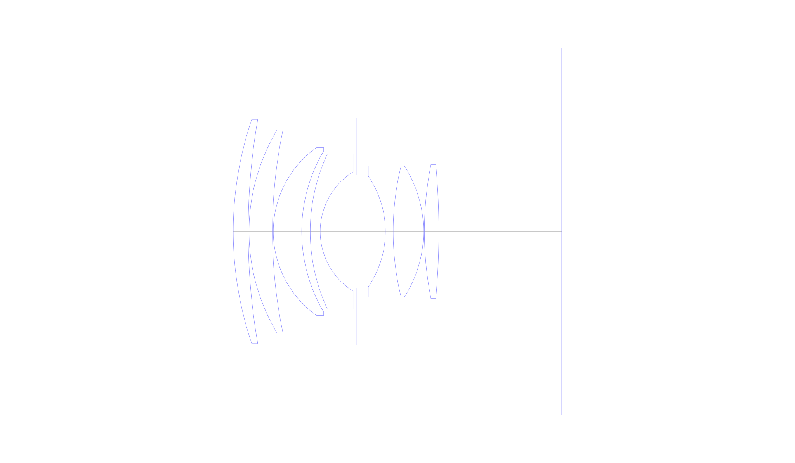
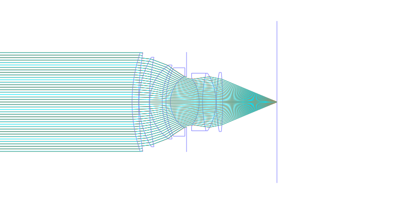
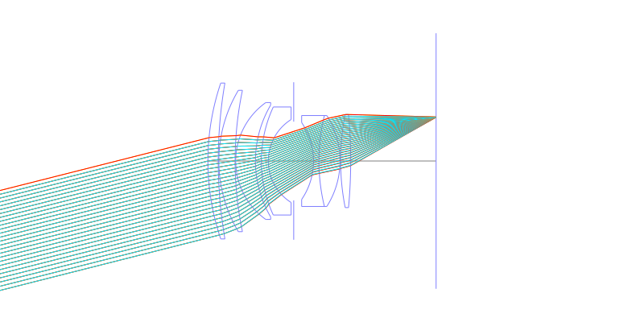
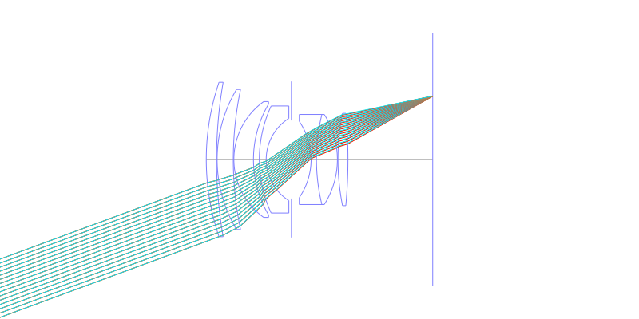
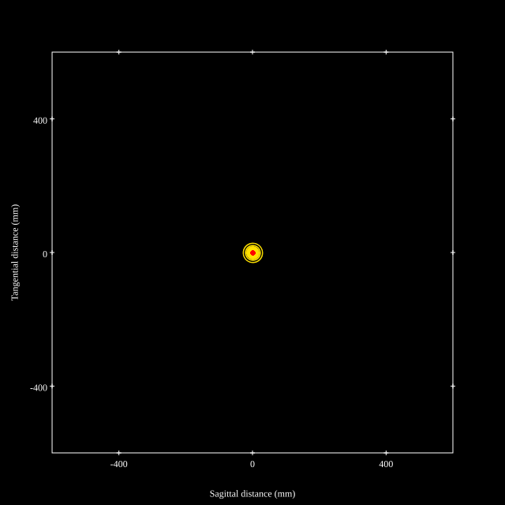
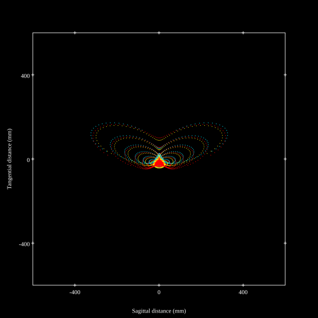
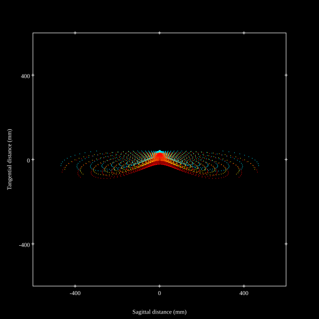
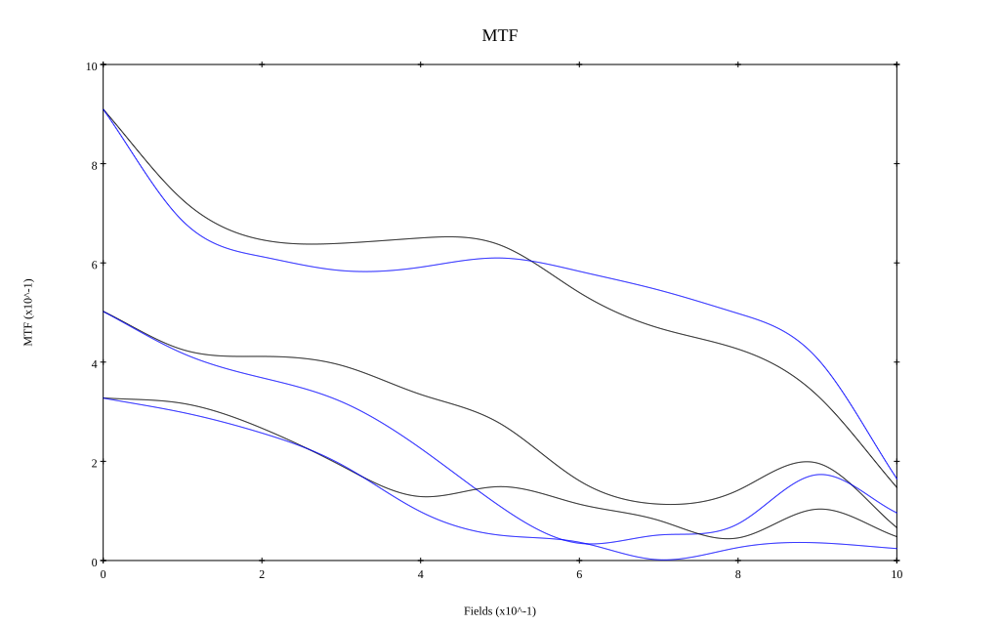
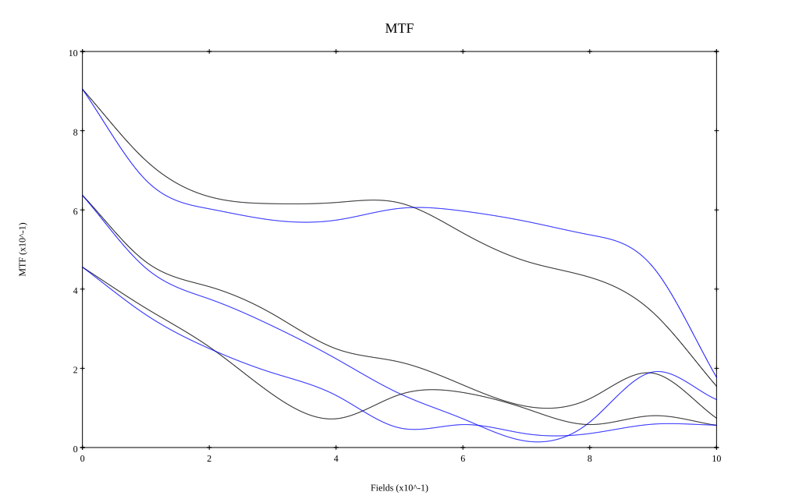

# Konica Hexanon 60mm F1.2 M
## Patent Information
| Country | Patent Number | Example | Year of Application | Inventors | Organisation | Link |
| ---     | ---           | ---     | ---                 | ---       | ---          | ---  |
|JP | JP1999-160615 | EX 1 | 1997 | YAMASHITA ATSUSHI | Konica Corp  | [link](https://patentscope.wipo.int/search/en/detail.jsf?docId=JP267945437) |
## Surface Data
Note that where glass types are shown the refractive index and abbe number is as per assigned glass type

| ID  | Radius | Thickness | Diameter | nd  | vd  | Glass Make | Glass |
| --- | ---    | ---       | ---      | --- | --- | ---        | ---   |
| 1 | 82.212 | 3.5 | 52.7 | 1.7725 | 49.62 | Hoya | TAF1 |
| 2 | 155.652 | 0.2 | 52.7 |  |  |  |
| 3 | 46.616 | 5.5 | 47.78 | 1.7725 | 49.62 | Hoya | TAF1 |
| 4 | 116.453 | 0.2 | 47.78 |  |  |  |
| 5 | 24.282 | 6.67 | 39.51 | 1.7725 | 49.62 | Hoya | TAF1 |
| 6 | 37.324 | 2.0 | 37.84 |  |  |  |
| 7 | 43.35 | 2.34 | 36.52 | 1.84666 | 23.78 | Hoya | FDS90 |
| 8 | 16.599 | 8.6 | 28.05 |  |  |  |
| 9 | AS | 6.7 | 26.628 |  |  |  |
| 10 | -23.022 | 1.83 | 25.98 | 1.69895 | 30.13 | Hikari | J-SF15 |
| 11 | 64.89 | 7.13 | 30.74 | 1.8044 | 39.61 | Hikari | J-LASF013 |
| 12 | -28.656 | 0.2 | 30.74 |  |  |  |
| 13 | 80.976 | 3.4 | 31.5 | 1.8061 | 40.73 | Hoya | NBFD13 |
| 14 | -170.243 | 28.84 | 31.5 |  |  |  |
## Layouts

## Spot Diagrams

## Paraxial Parameters
| parameter | value |
| ---       | ---   |
| effective_focal_length |58.264
| back_focal_length | 28.878
| optical_invariant | 8.673
| object_distance | 1.0E10
| image_distance | 28.878
| power | 0.017
| pp1_H | 34.01
| ppk_H' | -29.386
| ffl_F | -24.254
| fno | 1.24
| enp_dist_P | 42.169
| enp_radius | 23.49
| exp_dist_P' | -22.191
| exp_radius | 20.605
| m | -0
| red | -1.71634040190583E8
| n_obj | 1
| n_img | 1
| img_ht | 21.512
| obj_ang | 20.265
| obj_na | 0
| img_na | -0.374|
## Spot Analysis
| Field | Spot Mean Radius | Spot Max Radius |
| ---   | ---              | ---             |
 | Field(x=0.0, y=0.0) | 9.204 | 15.835|
 | Field(x=0.0, y=0.1) | 28.144 | 142.368|
 | Field(x=0.0, y=0.2) | 53.245 | 271.208|
 | Field(x=0.0, y=0.3) | 76.13 | 398.987|
 | Field(x=0.0, y=0.4) | 90.524 | 428.11|
 | Field(x=0.0, y=0.5) | 95.664 | 397.838|
 | Field(x=0.0, y=0.6) | 88.746 | 377.478|
 | Field(x=0.0, y=0.7) | 83.043 | 364.895|
 | Field(x=0.0, y=0.8) | 88.165 | 377.843|
 | Field(x=0.0, y=0.9) | 105.134 | 420.92|
 | Field(x=0.0, y=1.0) | 132.144 | 481.742|
## Polychromatic Geometric MTF

* 10,30,50 cycles/mm
* Black lines represent sagittal, blue tangential
* To generate above, MTFs for wavelengths 587.5618(d), 486.1327(F), 656.2725(C) were calculated across 10 fields, and then averaged
## Polychromatic Geometric MTF (Weighted)

* 10,30,50 cycles/mm
* Black lines represent sagittal, blue tangential
* To generate above, MTFs for wavelengths 587.5618(d) wt(1.0), 656.2725(C) wt(0.475), 546.074(e) wt(0.98), 486.1327(F) wt(0.49), 435.8343(g) wt(0.15) were calculated across 10 fields, and then combined using weighted average
## Resources
* [OpticalBench Compatible Data File, tab delimited](./JP1999-160615_Example01.txt)
* [Zemax file](./JP1999-160615_Example01.zmx)

Report / Zemax file generated using [Beam42](https://github.com/BeamFour/Beam42) on 2026-01-23
