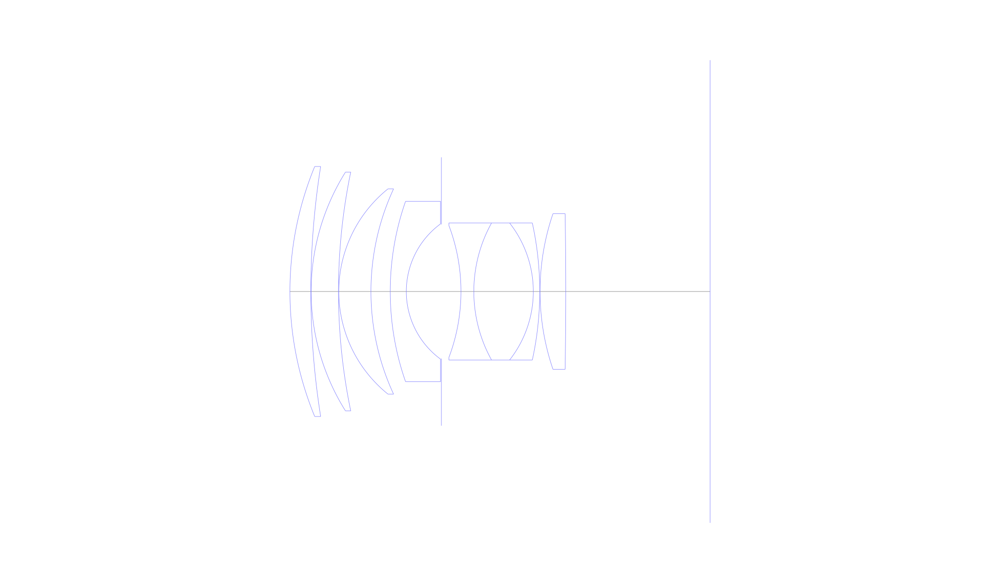
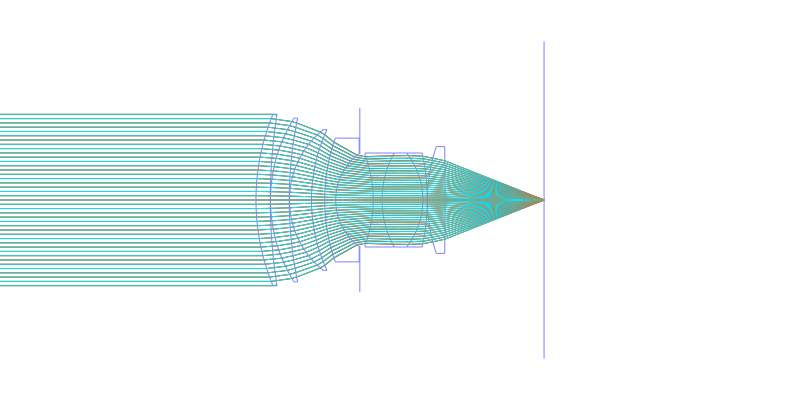
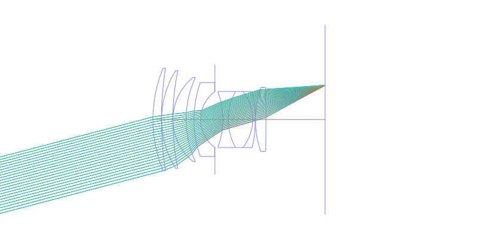
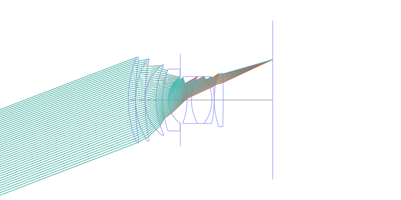
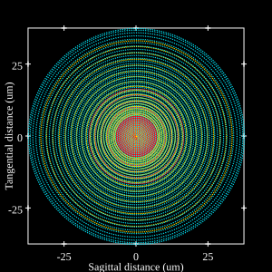
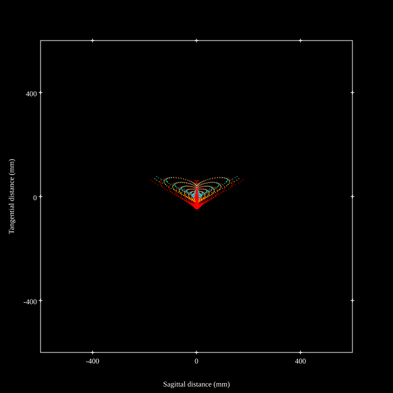
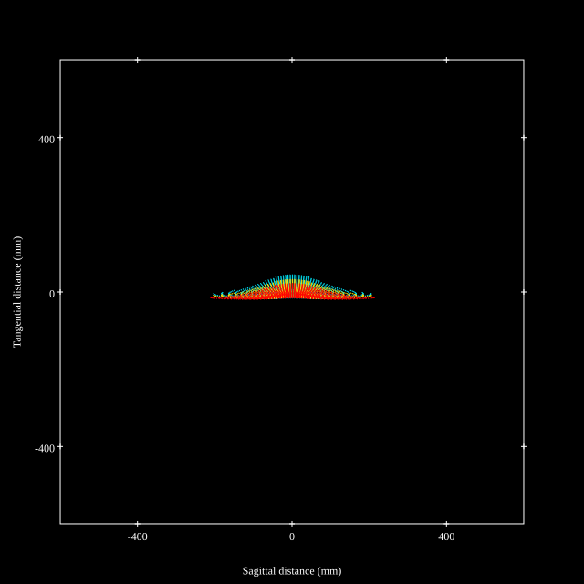
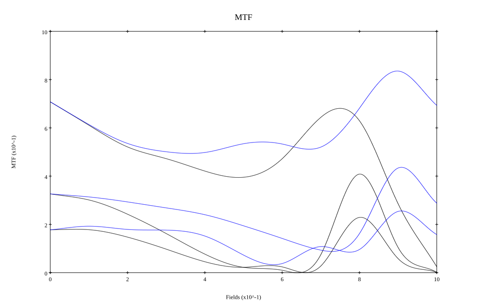
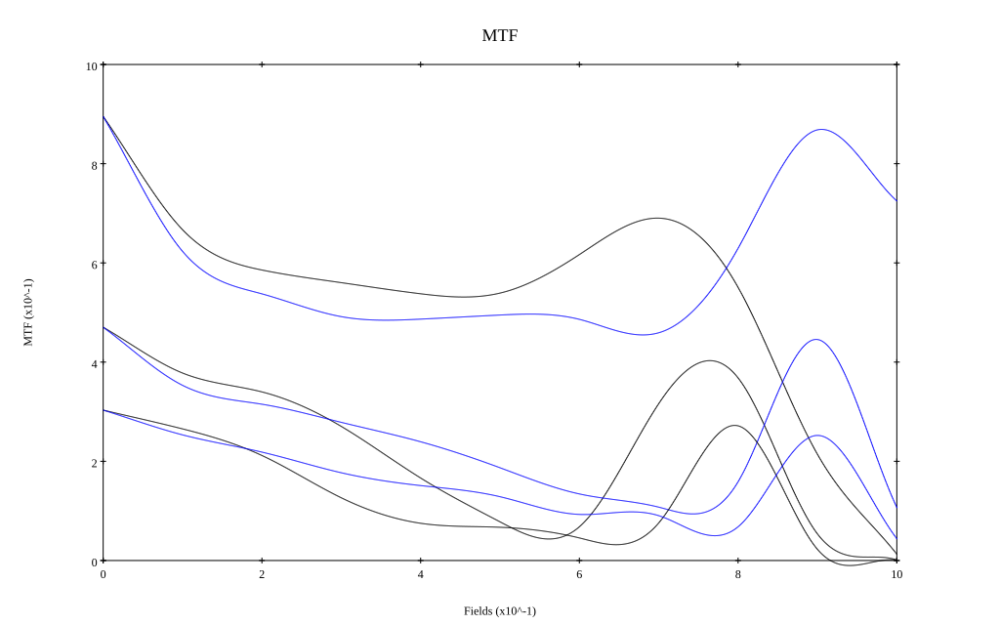

## Surface Data
Note that where glass types are shown the refractive index and abbe number is as per assigned glass type

| ID  | Radius | Thickness | Diameter | nd  | vd  | Glass Make | Glass |
| --- | ---    | ---       | ---      | --- | --- | ---        | ---   |
| 1 | 61.2 | 3.9 | 46.68 | 1.62035 | 60.2 |  |
| 2 | 149.4 | 0.06 | 46.68 |  |  |  |
| 3 | 42.0 | 5.1 | 44.59 | 1.62035 | 60.2 |  |
| 4 | 109.8 | 0.06 | 44.59 |  |  |  |
| 5 | 24.6 | 6.0 | 38.32 | 1.67042 | 47.1 |  |
| 6 | 45.6 | 3.6 | 38.32 |  |  |  |
| 7 | 51.0 | 3.0 | 33.68 | 1.80515 | 25.5 |  |
| 8 | 15.678 | 6.55 | 25.25 |  |  |  |
| 9 | AS | 3.65 | 25.058 |  |  |  |
| 10 | -34.8 | 2.4 | 24.66 | 1.60342 | 38.0 |  |
| 11 | 26.4 | 11.1 | 25.58 | 1.67042 | 47.1 |  |
| 12 | -20.7 | 1.2 | 25.58 | 1.53358 | 51.6 |  |
| 13 | -59.76 | 0.06 | 25.58 |  |  |  |
| 14 | 45.0 | 4.8 | 29.06 | 1.67042 | 47.1 |  |
| 15 | -848.226 | 26.88 | 29.06 |  |  |  |
## Layouts

## Spot Diagrams

## Paraxial Parameters
| parameter | value |
| ---       | ---   |
| effective_focal_length |59.999
| back_focal_length | 26.927
| optical_invariant | 8.858
| object_distance | 1.0E10
| image_distance | 26.927
| power | 0.017
| pp1_H | 30.955
| ppk_H' | -33.072
| ffl_F | -29.044
| fno | 1.3
| enp_dist_P | 42.989
| enp_radius | 23.075
| exp_dist_P' | -23.001
| exp_radius | 19.22
| m | -0
| red | -1.6666875022553477E8
| n_obj | 1
| n_img | 1
| img_ht | 23.032
| obj_ang | 21
| obj_na | 0
| img_na | -0.359|
## Spot Analysis
| Field | Spot Mean Radius | Spot Max Radius |
| ---   | ---              | ---             |
 | Field(x=0.0, y=0.0) | 11.422 | 18.58|
 | Field(x=0.0, y=0.1) | 27.585 | 117.6|
 | Field(x=0.0, y=0.2) | 39.227 | 187.128|
 | Field(x=0.0, y=0.3) | 44.267 | 199.711|
 | Field(x=0.0, y=0.4) | 44.51 | 177.427|
 | Field(x=0.0, y=0.5) | 42.983 | 161.378|
 | Field(x=0.0, y=0.6) | 40.383 | 164.522|
 | Field(x=0.0, y=0.7) | 39.213 | 188.44|
 | Field(x=0.0, y=0.8) | 45.204 | 198.476|
 | Field(x=0.0, y=0.9) | 61.351 | 213.065|
 | Field(x=0.0, y=1.0) | 78.006 | 225.369|
## Polychromatic Geometric MTF

* 10,30,50 cycles/mm
* Black lines represent sagittal, blue tangential
* To generate above, MTFs for wavelengths 587.5618(d), 486.1327(F), 656.2725(C) were calculated across 10 fields, and then averaged
## Polychromatic Geometric MTF (Weighted)

* 10,30,50 cycles/mm
* Black lines represent sagittal, blue tangential
* To generate above, MTFs for wavelengths 587.5618(d) wt(1.0), 656.2725(C) wt(0.475), 546.074(e) wt(0.98), 486.1327(F) wt(0.49), 435.8343(g) wt(0.15) were calculated across 10 fields, and then combined using weighted average
## Resources
* [OpticalBench Compatible Data File, tab delimited](./JP1954-002028_Example01.txt)
* [Zemax file](./JP1954-002028_Example01.zmx)

Report / Zemax file generated using [Beam42](https://github.com/BeamFour/Beam42) on 2026-01-23
