# Venus Laowa 10-18mm f4.5-5.6 Zoom
## Patent Information
| Country | Patent Number | Example | Year of Application | Inventors | Organisation | Link |
| ---     | ---           | ---     | ---                 | ---       | ---          | ---  |
|CN | CN108535851 | 1 | 2018 | TBC | Anhui Changgeng Optics Technology Co ltd | [link](https://patents.google.com/patent/CN108535851A/en) |
## Surface Data
Note that where glass types are shown the refractive index and abbe number is as per assigned glass type

| ID  | Radius | Thickness | Diameter | nd  | vd  | Glass Make | Glass |
| --- | ---    | ---       | ---      | --- | --- | ---        | ---   |
| 1 | 33.7325 | 2.0 | 49.37 | 1.91082 | 35.25 | CDGM | H-ZLAF4LA |
| 2 | 22.6355 | 4.4476 | 40.09 |  |  |  |
| 3 | 29.9307 | 1.8 | 41.09 | 1.83481 | 42.73 | CDGM | H-ZLAF55D |
| 4 | 17.7595 | 3.5252 | 31.18 |  |  |  |
| 5 | 40.9292 | 2.0 | 33.36 | 1.80781 | 40.96 |  |
| 6 | 14.8056 | 8.2179 | 25.93 |  |  |  |
| 7 | -55.5394 | 4.1 | 25.93 | 1.83481 | 42.73 | CDGM | H-ZLAF55D |
| 8 | 16.8593 | 2.2379 | 21.76 |  |  |  |
| 9 | 22.5368 | 5.8 | 23.05 | 1.76182 | 26.61 | CDGM | H-ZF12 |
| 10 | -63.0414 | d10 | 23.05 |  |  |  |
| 11 | 15.6634 | 1.0 | 15.16 | 1.92286 | 20.88 | CDGM | H-ZF62 |
| 12 | 9.0124 | 6.0 | 13.55 | 1.69895 | 30.05 | Hoya | E-FD15 |
| 13 | 62.5247 | d13 | 13.55 |  |  |  |
| 14 | AS | 1.0 | a14 |  |  |  |
| 15 | 15.2532 | 2.5 | 9.55 | 1.497 | 81.61 | CDGM | D-FK61 |
| 16 | -15.2532 | 0.4 | 9.55 |  |  |  |
| 17 | -14.5972 | 1.0 | 9.55 | 1.91082 | 35.25 | CDGM | H-ZLAF4LA |
| 18 | 21.1899 | 0.0 | 10.55 |  |  |  |
| 19 | 21.1899 | 2.2 | 10.55 | 1.84666 | 23.78 | CDGM | H-ZF52 |
| 20 | -33.1616 | 0.15 | 10.55 |  |  |  |
| 21 | 15.7172 | 1.0 | 14.24 | 1.83481 | 42.73 | CDGM | H-ZLAF55D |
| 22 | 8.3575 | 5.6 | 12.79 | 1.497 | 81.61 | CDGM | D-FK61 |
| 23 | -16.6469 | 0.7122 | 12.79 |  |  |  |
| 24 | -24.257 | 1.0 | 12.41 | 1.91082 | 35.25 | CDGM | H-ZLAF4LA |
| 25 | 12.7315 | 4.9 | 16.3 | 1.58313 | 59.46 | CDGM | H-ZK2 |
| 26 | -54.5147 | d26 | 16.3 |  |  |  |
| 27 | 0.0 | 4.0 | 47.42 | 1.5168 | 64.2 | CDGM | H-K9L |
| 28 | 0.0 | 1.0 | 47.42 |  |  |  |
## Aspherical Data
| ID  | Type | k   | P1 | P2 | P3 | P4 | P5 | P6 |
| --- | --- | --- | --- | --- | --- | --- | --- | --- |
| 5| EVEN | 0.0 | 0.0 | 1.12593E-4 | -5.34499E-7 | 1.25066E-9 | 4.81464E-14 | -3.23476E-15 |
| 6| EVEN | 0.0 | 0.0 | 7.44656E-5 | -4.56847E-8 | -9.5163E-9 | 6.27332E-11 | -1.63264E-13 |
| 26| EVEN | 0.0 | 0.0 | 1.04231E-4 | -5.33107E-8 | 3.70988E-9 | -8.96419E-11 | -1.80041E-14 |
## Variables
| Variable | 10mm f4.5 | 18mm f5.6 |
| --- | --- | --- |
| Focal length |10.4 |17.472 |
| F-Number |4.6 |5.8 |
| Angle of View |131.0 |101.6 |
| d10 | 12.1801 | 1.5 |
| d13 | 5.9744 | 3.8391 |
| a14 | 7.725 | 8.486 |
| d26 | 16.0 | 28.0319 |
# 10mm f4.5
## Layouts
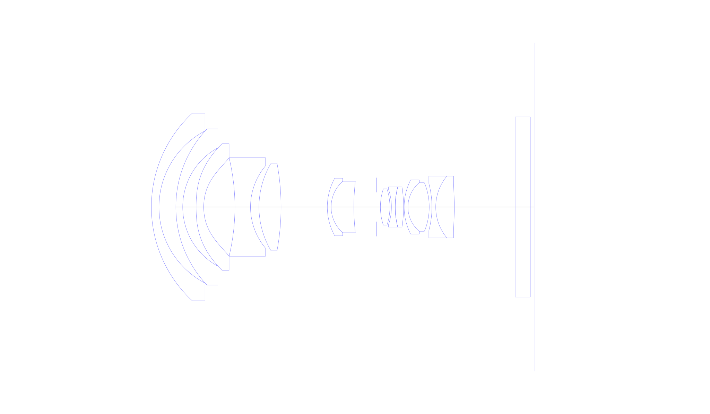
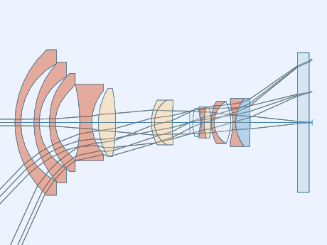
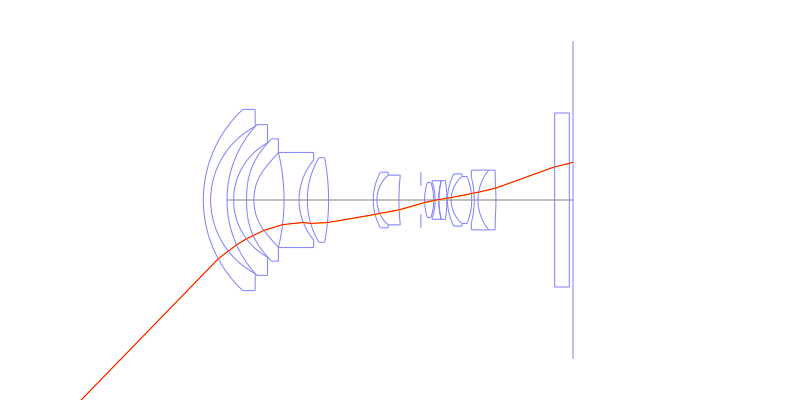
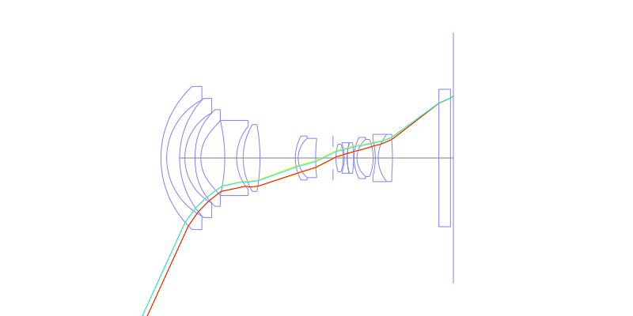
## Spot Diagrams

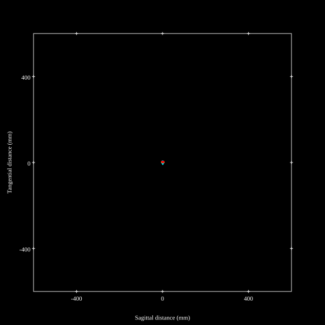
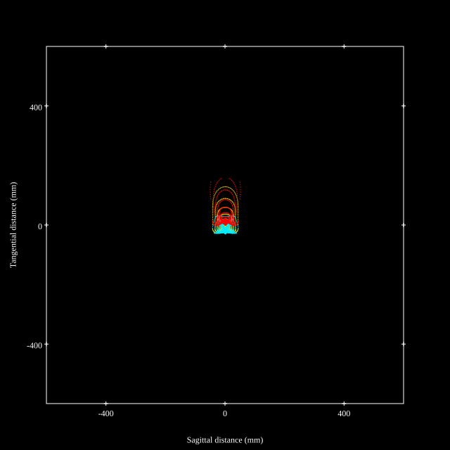
## Paraxial Parameters
| parameter | value |
| ---       | ---   |
| effective_focal_length |10.399
| back_focal_length | 1.048
| optical_invariant | 2.48
| object_distance | 1.0E10
| image_distance | 1.048
| power | 0.096
| pp1_H | 25.526
| ppk_H' | -9.351
| ffl_F | 15.127
| fno | 4.602
| enp_dist_P | 18.502
| enp_radius | 1.13
| exp_dist_P' | -30.942
| exp_radius | 3.481
| m | -0
| red | -9.615963153042291E8
| n_obj | 1
| n_img | 1
| img_ht | 22.819
| obj_ang | 65.5
| obj_na | 0
| img_na | -0.108|
## Spot Analysis
| Field | Spot Mean Radius | Spot Max Radius |
| ---   | ---              | ---             |
 | Field(x=0.0, y=0.0) | 1.178 | 3.941|
 | Field(x=0.0, y=0.1) | 2.07 | 7.847|
 | Field(x=0.0, y=0.2) | 3.227 | 7.499|
 | Field(x=0.0, y=0.3) | 4.253 | 8.431|
 | Field(x=0.0, y=0.4) | 5.029 | 9.516|
 | Field(x=0.0, y=0.5) | 5.35 | 10.126|
 | Field(x=0.0, y=0.6) | 5.253 | 9.77|
 | Field(x=0.0, y=0.7) | 4.677 | 8.406|
 | Field(x=0.0, y=0.8) | 6.52 | 28.582|
 | Field(x=0.0, y=0.9) | 15.401 | 79.274|
 | Field(x=0.0, y=1.0) | 30.643 | 158.019|
## Polychromatic Geometric MTF
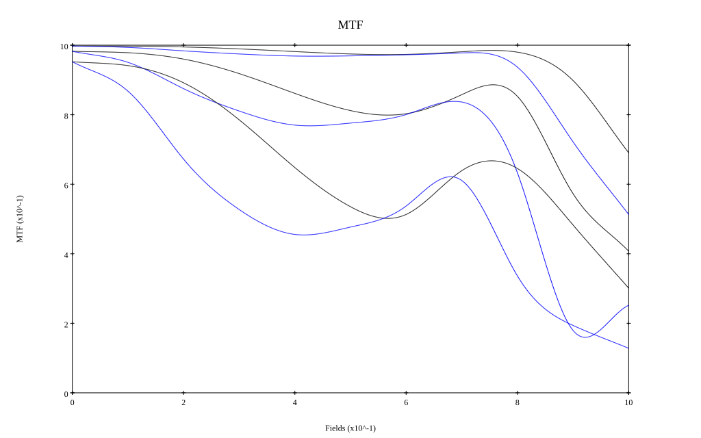
* 10,30,50 cycles/mm
* Black lines represent sagittal, blue tangential
* To generate above, MTFs for wavelengths 587.5618(d), 486.1327(F), 656.2725(C) were calculated across 10 fields, and then averaged
## Polychromatic Geometric MTF (Weighted)
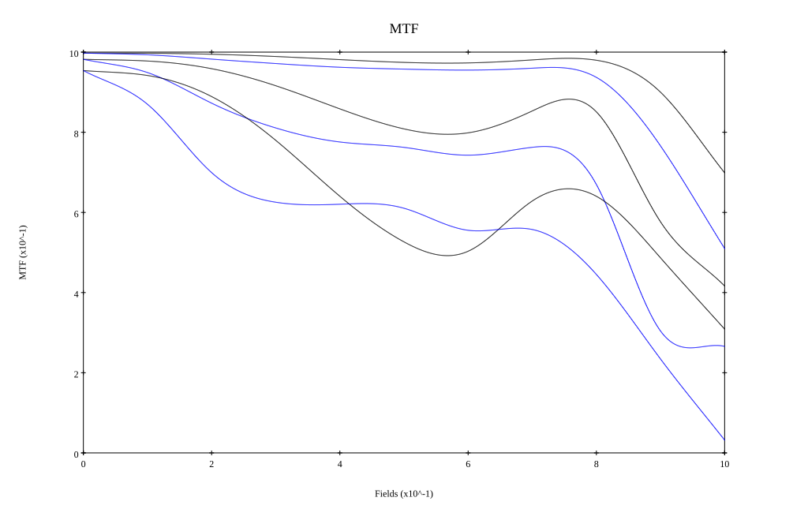
* 10,30,50 cycles/mm
* Black lines represent sagittal, blue tangential
* To generate above, MTFs for wavelengths 587.5618(d) wt(1.0), 656.2725(C) wt(0.475), 546.074(e) wt(0.98), 486.1327(F) wt(0.49), 435.8343(g) wt(0.15) were calculated across 10 fields, and then combined using weighted average
# 18mm f5.6
## Layouts
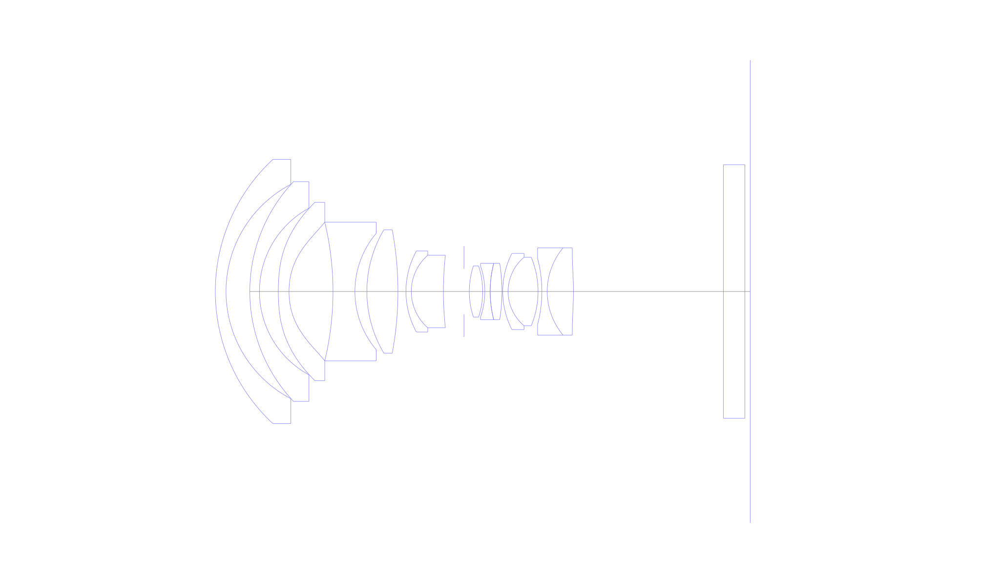
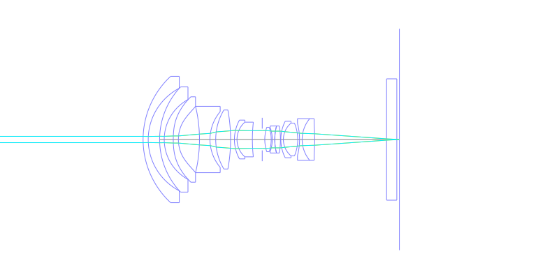
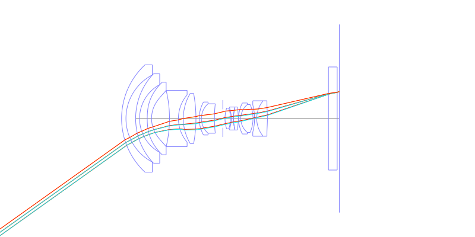
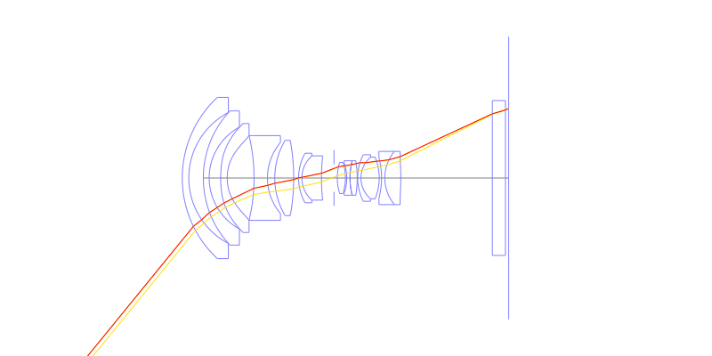
## Spot Diagrams
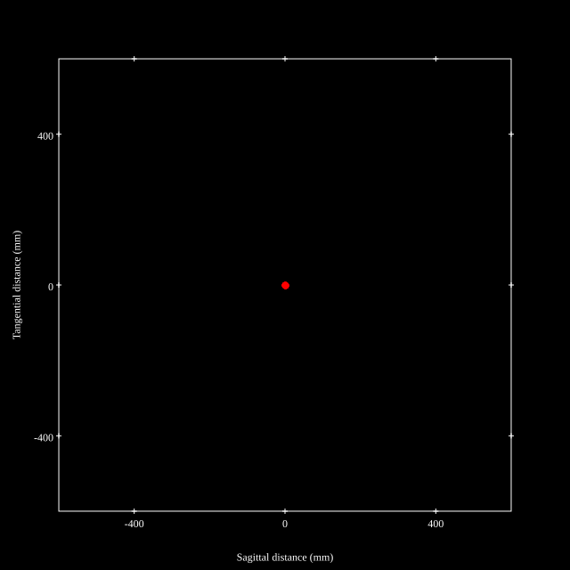
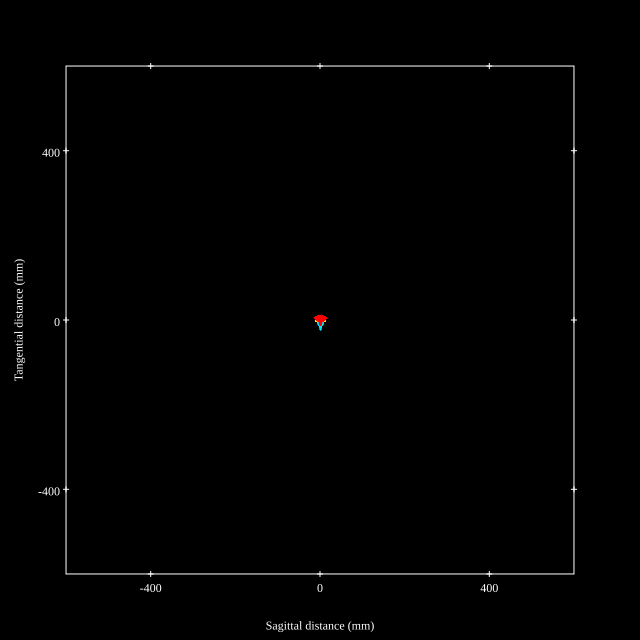
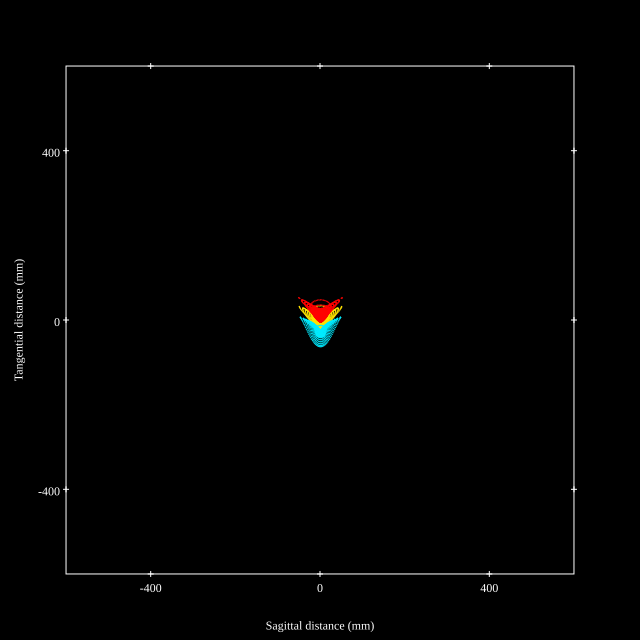
## Paraxial Parameters
| parameter | value |
| ---       | ---   |
| effective_focal_length |17.47
| back_focal_length | 1.073
| optical_invariant | 1.845
| object_distance | 1.0E10
| image_distance | 1.073
| power | 0.057
| pp1_H | 28.229
| ppk_H' | -16.397
| ffl_F | 10.759
| fno | 5.804
| enp_dist_P | 17.68
| enp_radius | 1.505
| exp_dist_P' | -42.949
| exp_radius | 3.799
| m | -0
| red | -5.723935572928516E8
| n_obj | 1
| n_img | 1
| img_ht | 21.421
| obj_ang | 50.8
| obj_na | 0
| img_na | -0.086|
## Spot Analysis
| Field | Spot Mean Radius | Spot Max Radius |
| ---   | ---              | ---             |
 | Field(x=0.0, y=0.0) | 3.503 | 7.752|
 | Field(x=0.0, y=0.1) | 3.978 | 9.758|
 | Field(x=0.0, y=0.2) | 4.986 | 10.658|
 | Field(x=0.0, y=0.3) | 5.701 | 11.501|
 | Field(x=0.0, y=0.4) | 6.095 | 12.32|
 | Field(x=0.0, y=0.5) | 6.429 | 12.466|
 | Field(x=0.0, y=0.6) | 6.685 | 13.355|
 | Field(x=0.0, y=0.7) | 7.338 | 21.725|
 | Field(x=0.0, y=0.8) | 10.014 | 38.424|
 | Field(x=0.0, y=0.9) | 15.388 | 51.762|
 | Field(x=0.0, y=1.0) | 26.037 | 74.426|
## Polychromatic Geometric MTF
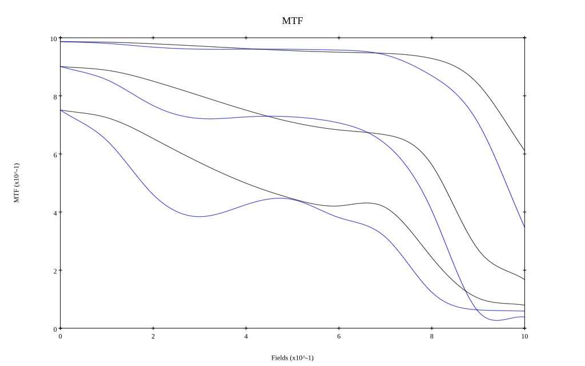
* 10,30,50 cycles/mm
* Black lines represent sagittal, blue tangential
* To generate above, MTFs for wavelengths 587.5618(d), 486.1327(F), 656.2725(C) were calculated across 10 fields, and then averaged
## Polychromatic Geometric MTF (Weighted)
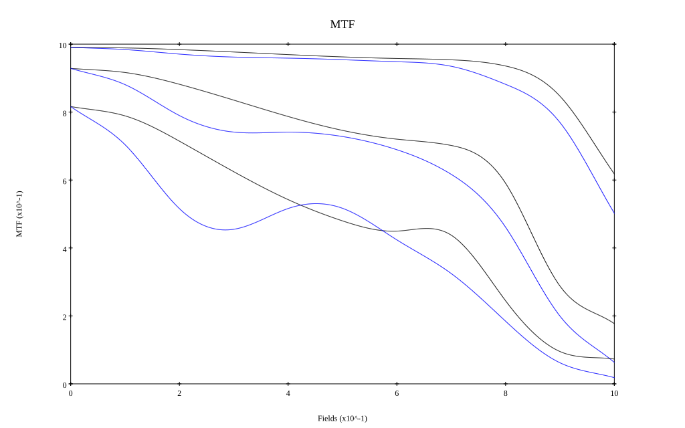
* 10,30,50 cycles/mm
* Black lines represent sagittal, blue tangential
* To generate above, MTFs for wavelengths 587.5618(d) wt(1.0), 656.2725(C) wt(0.475), 546.074(e) wt(0.98), 486.1327(F) wt(0.49), 435.8343(g) wt(0.15) were calculated across 10 fields, and then combined using weighted average
## Resources
* [OpticalBench Compatible Data File, tab delimited](./prescription.txt)
* [Zemax file](./CN108535851_Example01P.zmx)

Report / Zemax file generated using [Beam42](https://github.com/BeamFour/Beam42) on 2026-02-11
