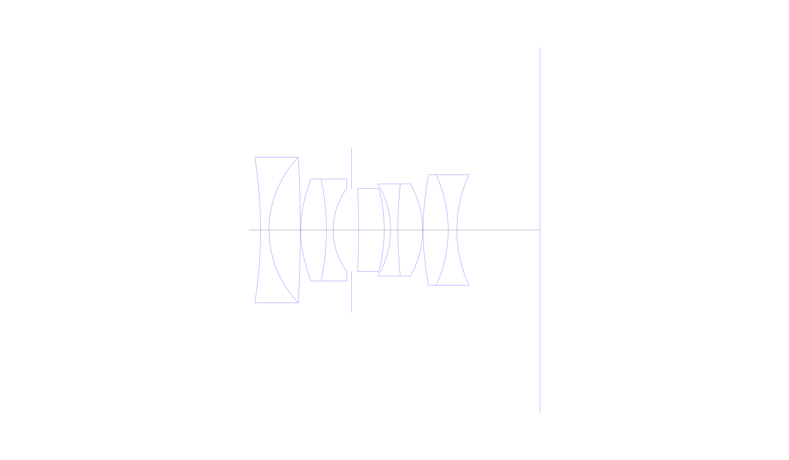
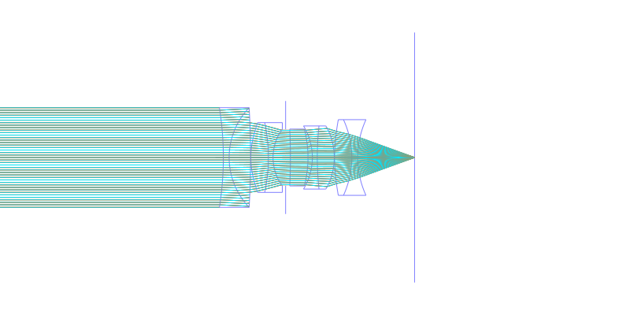
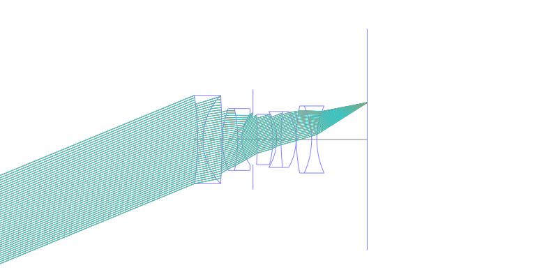
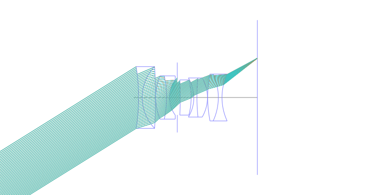
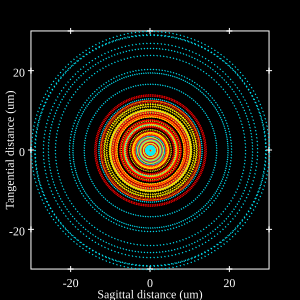
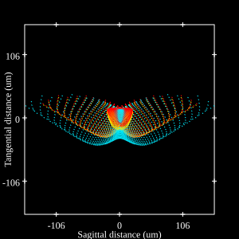
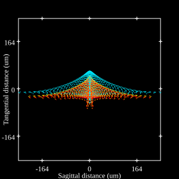

## Surface Data
Note that where glass types are shown the refractive index and abbe number is as per assigned glass type

| ID  | Radius | Thickness | Diameter | nd  | vd  | Glass Make | Glass |
| --- | ---    | ---       | ---      | --- | --- | ---        | ---   |
| 1 | -110.114 | 2.01 | 34.45 | 1.50137 | 56.42 | Ohara | S-FTL10 |
| 2 | 24.92 | 7.4 | 34.45 | 1.816 | 46.62 | Ohara | S-LAH59 |
| 3 | -305.0 | 0.1 | 34.45 |  |  |  |
| 4 | 28.346 | 6.07 | 24.12 | 1.816 | 46.62 | Ohara | S-LAH59 |
| 5 | -57.56 | 1.61 | 24.12 | 1.68893 | 31.08 | Ohara | S-TIM28 |
| 6 | 16.624 | 4.34 | 19.61 |  |  |  |
| 7 | AS | 1.66 | 19.521 |  |  |  |
| 8 | -197.204 | 6.07 | 19.64 | 1.78831 | 47.47 | Schott | LAFN21 |
| 9 | -38.628 | 1.5 | 19.64 |  |  |  |
| 10 | -21.142 | 1.72 | 21.82 | 1.64769 | 33.79 | Ohara | S-TIM22 |
| 11 | 101.985 | 5.86 | 21.82 | 1.816 | 46.62 | Ohara | S-LAH59 |
| 12 | -21.905 | 0.11 | 21.82 |  |  |  |
| 13 | 60.026 | 5.94 | 26.16 | 1.816 | 46.62 | Ohara | S-LAH59 |
| 14 | -31.325 | 2.05 | 26.16 | 1.62004 | 36.26 | Ohara | S-TIM2 |
| 15 | 31.325 | 19.659 | 26.16 |  |  |  |
## Aspherical Data
| ID  | k   | A4  | A6  | A8  | A10 | A12 | A14 | A16 | A18 |
| --- | --- | --- | --- | --- | --- | --- | --- | --- | --- |
| 4 | 0.0 | -1.01662E-5 | -3.85859E-8 | -5.57379E-12 | 0.0 | 0.0 | 0.0 | 0.0 | 0.0 |
| 13 | 0.0 | -5.31166E-6 | -6.51374E-9 | 3.61001E-11 | 0.0 | 0.0 | 0.0 | 0.0 | 0.0 |
## Layouts

## Spot Diagrams

## Paraxial Parameters
| parameter | value |
| ---       | ---   |
| effective_focal_length |35.423
| back_focal_length | 19.654
| optical_invariant | 7.905
| object_distance | 1.0E10
| image_distance | 19.659
| power | 0.028
| pp1_H | 21.022
| ppk_H' | 15.768
| ffl_F | -14.4
| fno | 1.4
| enp_dist_P | 18.085
| enp_radius | 12.651
| exp_dist_P' | -18.971
| exp_radius | 13.795
| m | -0
| red | -2.823059005664594E8
| n_obj | 1
| n_img | 1
| img_ht | 22.134
| obj_ang | 32
| obj_na | 0
| img_na | -0.336|
## Spot Analysis
| Field | Spot Mean Radius | Spot Max Radius |
| ---   | ---              | ---             |
 | 0.0 | 11.715 | 30.057|
 | 0.7 | 33.086 | 159.629|
 | 1.0 | 63.891 | 245.291|
## Resources
* [OpticalBench Compatible Data File, tab delimited](./US005161060_Example01.txt)
* [Zemax file](./US005161060_Example01.zmx)
