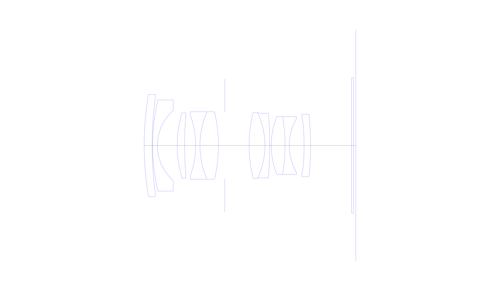
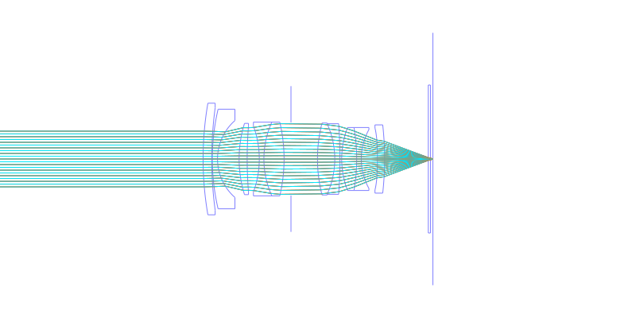
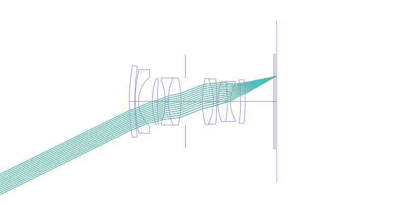
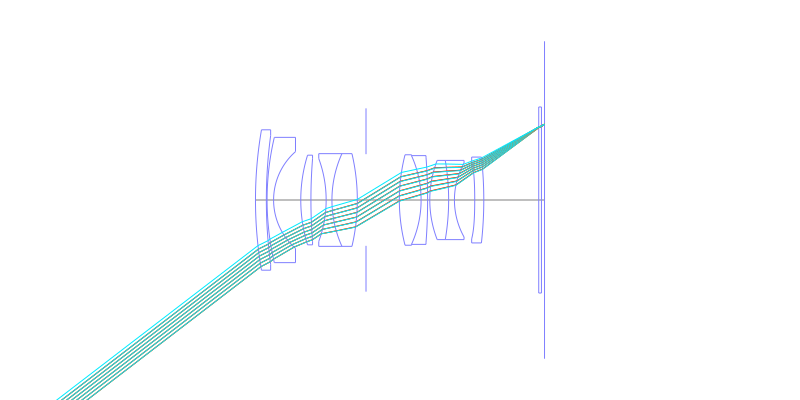
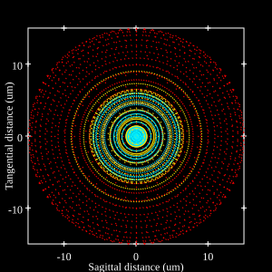
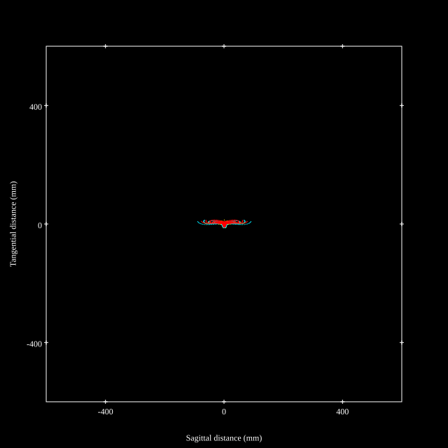
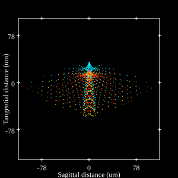

## Surface Data
Note that where glass types are shown the refractive index and abbe number is as per assigned glass type

| ID  | Radius | Thickness | Diameter | nd  | vd  | Glass Make | Glass |
| --- | ---    | ---       | ---      | --- | --- | ---        | ---   |
| 1 | 114.16285283225395 | 3.0 | 38.74 | 1.51633 | 64.14 | Ohara | S-BSL7 |
| 2 | 133.76678435303467 | 0.2 | 35.52 |  |  |  |
| 3 | 75.68610236726732 | 1.8 | 34.57 | 1.43875 | 94.95 | Ohara | S-FPL53 |
| 4 | 17.75641894780808 | 7.5 | 26.69 |  |  |  |
| 5 | 41.81705677495893 | 2.8 | 24.74 | 1.883 | 40.77 | Ohara | S-LAH58 |
| 6 | 144.51390455303192 | 4.2 | 22.75 |  |  |  |
| 7 | -33.04799324162237 | 1.6 | 22.85 | 1.6727 | 32.1 | Ohara | S-TIM25 |
| 8 | 31.06197738857803 | 7.0 | 25.58 | 1.883 | 40.77 | Ohara | S-LAH58 |
| 9 | -55.98963233475594 | 2.4 | 25.58 |  |  |  |
| 10 | AS | 9.2 | 25.292 |  |  |  |
| 11 | 50.44063285822865 | 6.0 | 24.96 | 1.816 | 46.62 | Ohara | S-LAH59 |
| 12 | -29.608100033783227 | 1.8 | 24.49 | 1.78472 | 25.68 | Ohara | S-TIH11 |
| 13 | -156.43323477179382 | 0.6 | 23.61 |  |  |  |
| 14 | 30.323337146024294 | 5.2 | 21.86 | 1.883 | 40.77 | Ohara | S-LAH58 |
| 15 | -64.64899750161047 | 1.6 | 21.86 | 1.6727 | 32.1 | Ohara | S-TIM25 |
| 16 | 20.98026846538385 | 5.6 | 20.42 |  |  |  |
| 17 | -131.72159493837344 | 2.5 | 21.47 | 1.834 | 37.16 | Ohara | S-LAH60 |
| 18 | -107.0034882139063 | 15.16 | 23.69 |  |  |  |
| 19 | 0.0 | 0.75 | 51.34 | 1.51633 | 64.14 | Ohara | S-BSL7 |
| 20 | 0.0 | 0.85 | 51.34 |  |  |  |
## Aspherical Data
| ID  | k   | A4  | A6  | A8  | A10 | A12 | A14 | A16 | A18 |
| --- | --- | --- | --- | --- | --- | --- | --- | --- | --- |
| 17 | 0.0 | -2.3075006361596798E-5 | -6.730153494841237E-8 | 1.5353017393500655E-10 | -1.198515151920225E-12 | 0.0 | 0.0 | 0.0 | 0.0 |
## Layouts

## Spot Diagrams

## Paraxial Parameters
| parameter | value |
| ---       | ---   |
| effective_focal_length |28.071
| back_focal_length | 0.927
| optical_invariant | 7.693
| object_distance | 1.0E10
| image_distance | 0.85
| power | 0.036
| pp1_H | 29.921
| ppk_H' | 27.144
| ffl_F | 1.851
| fno | 1.4
| enp_dist_P | 20.117
| enp_radius | 10.025
| exp_dist_P' | -42.211
| exp_radius | 15.407
| m | 0.003
| red | -3.5624276373037934E8
| n_obj | 1
| n_img | 1
| img_ht | 21.539
| obj_ang | 37.5
| obj_na | 0
| img_na | -0.336|
## Spot Analysis
| Field | Spot Mean Radius | Spot Max Radius |
| ---   | ---              | ---             |
 | 0.0 | 7.579 | 15.093|
 | 0.7 | 17.318 | 87.211|
 | 1.0 | 31.584 | 117.56|
## Resources
* [OpticalBench Compatible Data File, tab delimited](./US20160070086_Example01D.txt)
* [Zemax file](./US20160070086_Example01D.zmx)
