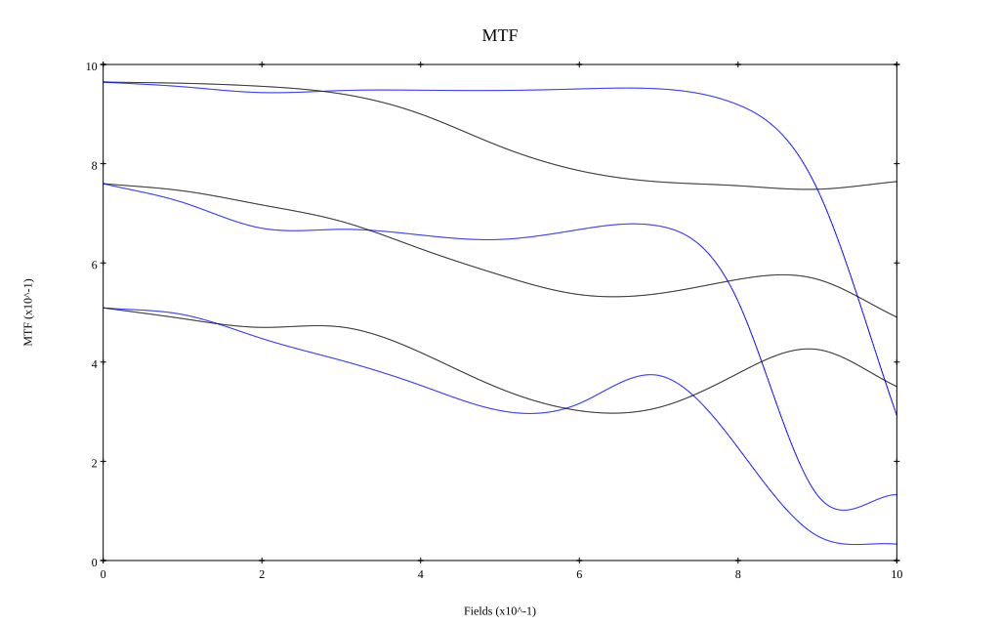
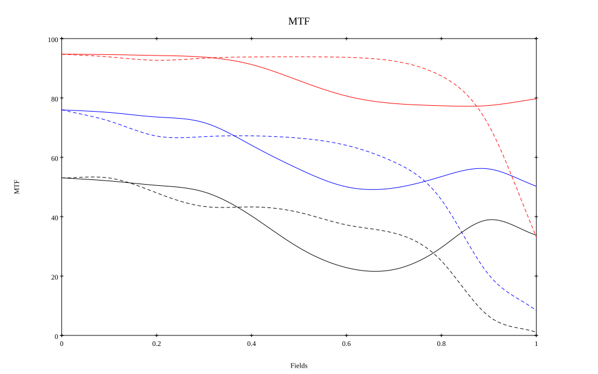

# Leica Summilux-M 28mm F1.4 Asph
## Patent Information
| Country | Patent Number | Example | Year of Application | Inventors | Organisation | Link |
| ---     | ---           | ---     | ---                 | ---       | ---          | ---  |
|US | US9703072 | EX 1 | 2014 | Alexander Martin | Leica Camera AG | [link](https://patents.google.com/patent/US9703072B2/en) |
## Surface Data
Note that where glass types are shown the refractive index and abbe number is as per assigned glass type

| ID  | Radius | Thickness | Diameter | nd  | vd  | Glass Make | Glass |
| --- | ---    | ---       | ---      | --- | --- | ---        | ---   |
| 1 | 114.565 | 3.0 | 38.74 | 1.51633 | 64.14 | Ohara | S-BSL7 |
| 2 | 133.393 | 0.2 | 35.52 |  |  |  |
| 3 | 83.265 | 1.8 | 34.57 | 1.43875 | 94.95 | Ohara | S-FPL53 |
| 4 | 17.764 | 7.5 | 26.69 |  |  |  |
| 5 | 43.33 | 2.8 | 24.74 | 1.883 | 40.77 | Ohara | S-LAH58 |
| 6 | 169.242 | 4.2 | 22.75 |  |  |  |
| 7 | -33.437 | 1.6 | 24.0 | 1.6727 | 32.1 | Ohara | S-TIM25 |
| 8 | 31.0 | 7.0 | 25.58 | 1.883 | 40.77 | Ohara | S-LAH58 |
| 9 | -55.0 | 2.4 | 26.0 |  |  |  |
| 10 | AS | 9.2 | 23.345 |  |  |  |
| 11 | 48.164 | 6.0 | 24.0 | 1.816 | 46.62 | Ohara | S-LAH59 |
| 12 | -28.617 | 1.8 | 24.0 | 1.78472 | 25.68 | Ohara | S-TIH11 |
| 13 | -159.92 | 0.6 | 24.0 |  |  |  |
| 14 | 32.591 | 5.2 | 23.0 | 1.883 | 40.77 | Ohara | S-LAH58 |
| 15 | -64.0 | 1.6 | 20.42 | 1.6727 | 32.1 | Ohara | S-TIM25 |
| 16 | 21.48 | 5.6 | 20.42 |  |  |  |
| 17 | -131.916 | 2.5 | 21.47 | 1.834 | 37.16 | Ohara | S-LAH60 |
| 18 | -106.689 | 15.492 | 23.69 |  |  |  |
| 19 | 0.0 | 0.75 | 51.34 | 1.51633 | 64.14 | Ohara | S-BSL7 |
| 20 | 0.0 | 0.85 | 51.34 |  |  |  |
## Aspherical Data
| ID  | k   | P1  | P2  | P3  | P3 | P5 | P6 | P7 | P8 | P9 | P10 |
| --- | --- | --- | --- | --- | --- | --- | --- | --- | --- | --- | --- |
| 17 | 0.0 | 0.0 | -2.778044655486926E-5 | -7.615830586788472E-9 | -2.25882359921312E-10 | -3.398029568324213E-13 | 0.0 | 0.0 | 0.0 | 0.0 | 0.0 |
## Layouts

## Spot Diagrams

## Paraxial Parameters
| parameter | value |
| ---       | ---   |
| effective_focal_length |28.328
| back_focal_length | 0.88
| optical_invariant | 7.096
| object_distance | 1.0E10
| image_distance | 0.88
| power | 0.035
| pp1_H | 29.707
| ppk_H' | -27.448
| ffl_F | 1.379
| fno | 1.532
| enp_dist_P | 19.947
| enp_radius | 9.248
| exp_dist_P' | -42.307
| exp_radius | 14.109
| m | -0
| red | -3.5300821810896975E8
| n_obj | 1
| n_img | 1
| img_ht | 21.737
| obj_ang | 37.5
| obj_na | 0
| img_na | -0.31|
## Spot Analysis
| Field | Spot Mean Radius | Spot Max Radius |
| ---   | ---              | ---             |
 | Field(x=0.0, y=0.0) | 5.677 | 10.949|
 | Field(x=0.0, y=0.1) | 6.25 | 20.311|
 | Field(x=0.0, y=0.2) | 6.866 | 21.724|
 | Field(x=0.0, y=0.3) | 7.452 | 29.3|
 | Field(x=0.0, y=0.4) | 9.095 | 41.347|
 | Field(x=0.0, y=0.5) | 11.75 | 60.019|
 | Field(x=0.0, y=0.6) | 14.655 | 81.632|
 | Field(x=0.0, y=0.7) | 16.592 | 90.169|
 | Field(x=0.0, y=0.8) | 17.594 | 90.841|
 | Field(x=0.0, y=0.9) | 19.471 | 80.057|
 | Field(x=0.0, y=1.0) | 26.108 | 56.652|
## Polychromatic Geometric MTF

* 10,30,50 cycles/mm
* Black lines represent sagittal, blue tangential
* To generate above, MTFs for wavelengths 587.5618(d), 486.1327(F), 656.2725(C) were calculated across 10 fields, and then averaged
## Polychromatic Geometric MTF (Weighted)

* 10,30,50 cycles/mm
* Black lines represent sagittal, blue tangential
* To generate above, MTFs for wavelengths 587.5618(d) wt(1.0), 656.2725(C) wt(0.475), 546.074(e) wt(0.98), 486.1327(F) wt(0.49), 435.8343(g) wt(0.15) were calculated across 10 fields, and then combined using weighted average
## Resources
* [OpticalBench Compatible Data File, tab delimited](./US20160070086_Example01Z.txt)
* [Zemax file](./US20160070086_Example01Z.zmx)
