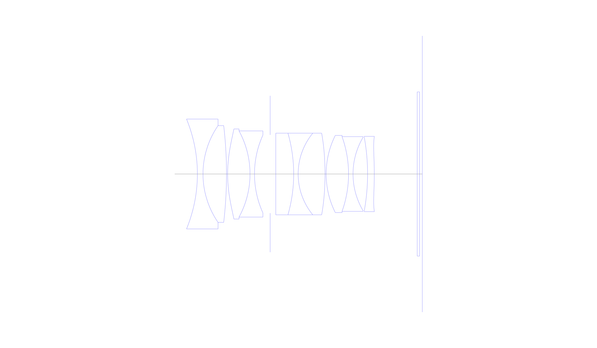
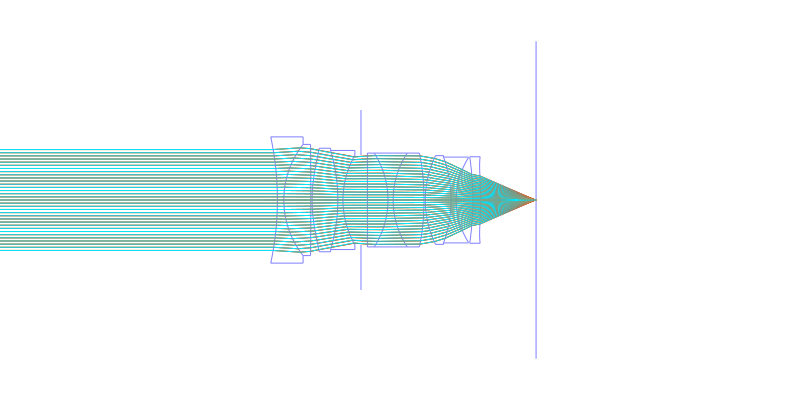
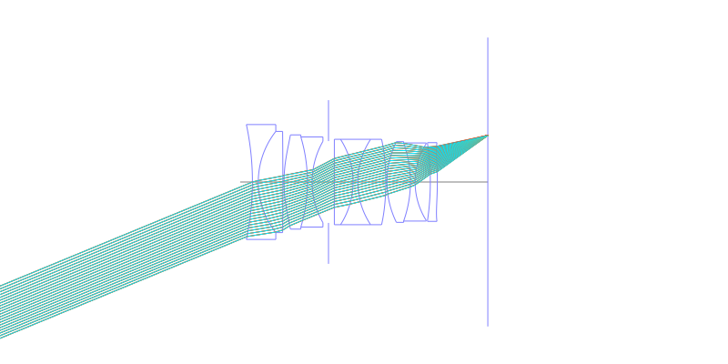
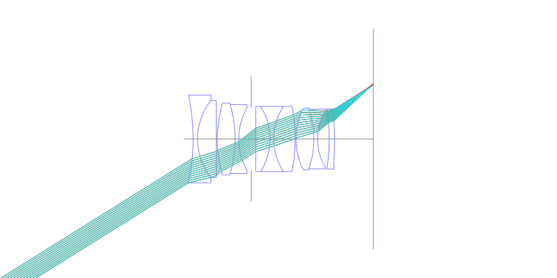
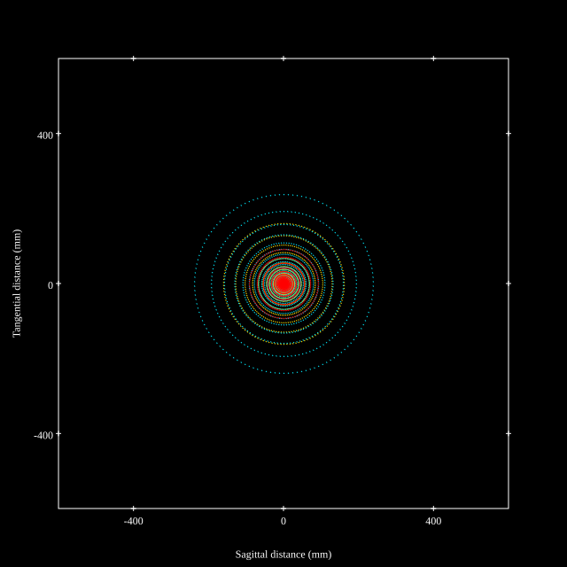
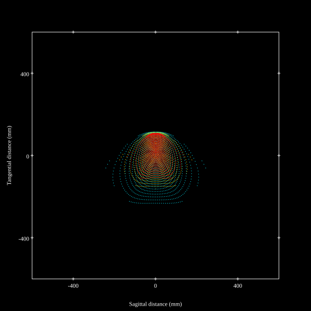
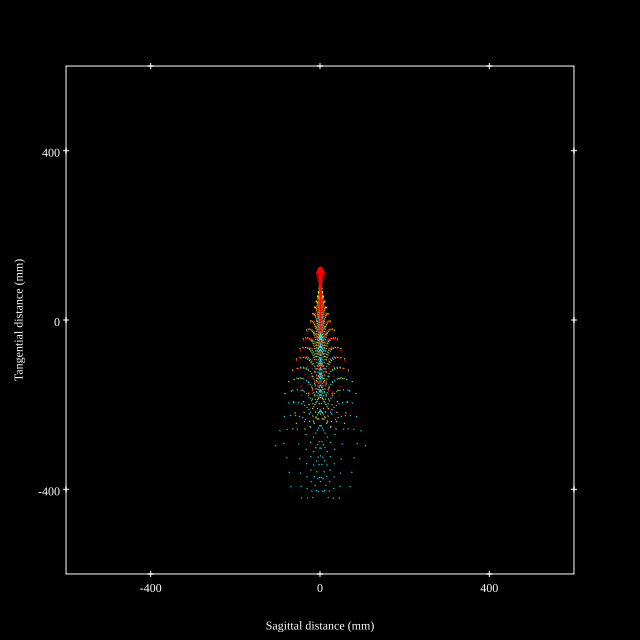
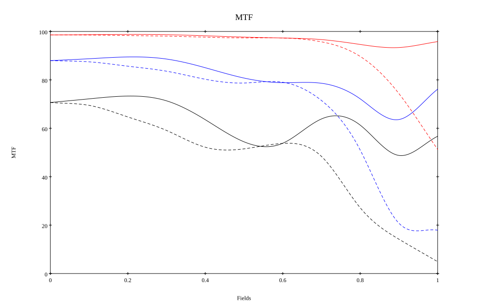
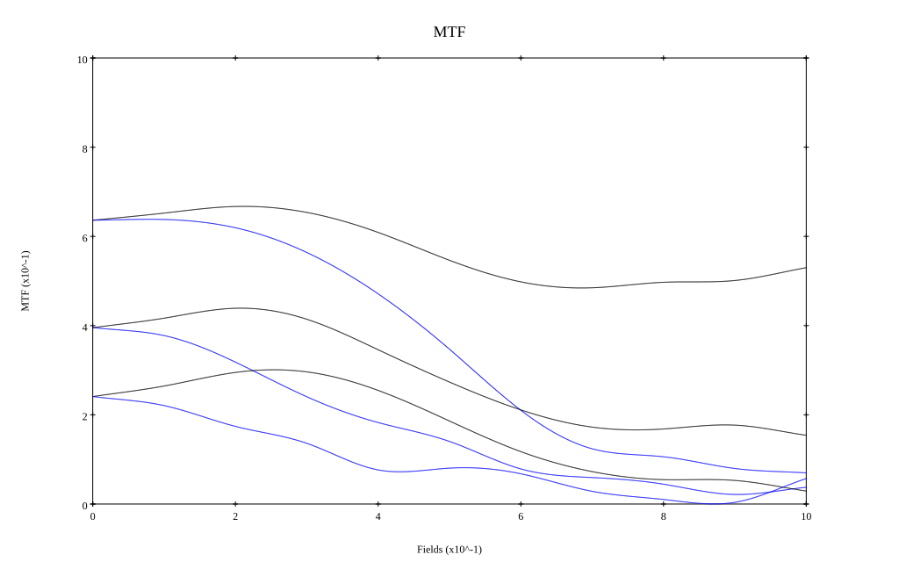

# Leica Noctilux-M 35 f/1.2 ASPH (Reoptimized)
## Patent Information
| Country | Patent Number | Example | Year of Application | Inventors | Organisation | Link |
| ---     | ---           | ---     | ---                 | ---       | ---          | ---  |
|US | US 20250271647 | 2 | 2023 | Stefan Roth | Leica Camera AG | [link](https://patents.google.com/patent/US20250271647A1/en) |
## Surface Data
Note that where glass types are shown the refractive index and abbe number is as per assigned glass type

| ID  | Radius | Thickness | Diameter | nd  | vd  | Glass Make | Glass |
| --- | ---    | ---       | ---      | --- | --- | ---        | ---   |
| 1 | -45.14130257097362 | 1.75 | 34.36 | 1.59551 | 39.21 | Hikari | J-F8 |
| 2 | 26.66682265149467 | 7.35 | 30.26 | 2.001 | 29.14 | Ohara | S-LAH99 |
| 3 | -130.9917091612707 | 0.35 | 30.26 |  |  |  |
| 4 | 42.02963060611184 | 7.0 | 28.18 | 1.7432 | 49.34 | Ohara | S-LAM60 |
| 5 | -28.1701844466078 | 1.4 | 26.96 | 1.7552 | 27.51 | Ohara | S-TIH4 |
| 6 | 29.4692182045642 | 4.9 | 24.34 |  |  |  |
| 7 | AS | 1.75 | 24.472 |  |  |  |
| 8 | 0.0 | 5.6 | 25.54 | 1.883 | 40.77 | Ohara | S-LAH58 |
| 9 | -46.30545505257408 | 1.4 | 25.54 | 1.738 | 32.26 | Ohara | S-NBH53 |
| 10 | 20.12057945420811 | 8.4 | 25.54 | 1.7432 | 49.34 | Ohara | S-LAM60 |
| 11 | -84.69250364918614 | 0.35 | 25.54 |  |  |  |
| 12 | 26.8952212503084 | 7.0 | 24.14 | 1.95375 | 32.32 | Ohara | S-LAH98 |
| 13 | -34.57503522198205 | 1.4 | 23.36 | 1.64769 | 33.79 | Ohara | S-TIM22 |
| 14 | 22.52864175656453 | 4.55 | 23.02 |  |  |  |
| 15 | -64.54680580236648 | 2.1 | 23.02 | 1.92286 | 18.9 | Ohara | S-NPH2 |
| 16 | -103.3490119292906 | 13.41 | 23.54 |  |  |  |
| 17 | 0.0 | 0.75 | 51.34 | 1.51633 | 64.14 | Ohara | S-BSL7 |
| 18 | 0.0 | 0.85 | 51.34 |  |  |  |
## Aspherical Data
| ID  | Type | k   | P1 | P2 | P3 | P4 | P5 | P6 |
| --- | --- | --- | --- | --- | --- | --- | --- | --- |
| 4| EVEN | 0.0 | 0.0 | -8.62921617782276E-6 | -1.342558971929082E-8 | -1.531947083630983E-11 | 0  | 0  |
| 11| EVEN | 0.0 | 0.0 | -2.261846981549454E-6 | -1.018542454232524E-8 | 1.530069013720622E-11 | 6.691202976300796E-14 | 0  |
| 16| EVEN | 0.0 | 0.0 | 2.847103618026058E-5 | -3.275822424549171E-8 | 1.171196274655365E-9 | -5.500563523310379E-12 | 1.234593736675926E-14 |
## Layouts

## Spot Diagrams

## Paraxial Parameters
| parameter | value |
| ---       | ---   |
| effective_focal_length |35.487
| back_focal_length | 0.845
| optical_invariant | 8.533
| object_distance | 1.0E10
| image_distance | 0.845
| power | 0.028
| pp1_H | 16.856
| ppk_H' | -34.642
| ffl_F | -18.631
| fno | 1.282
| enp_dist_P | 17.206
| enp_radius | 13.843
| exp_dist_P' | -34.3
| exp_radius | 13.708
| m | -0
| red | -2.8179441833637726E8
| n_obj | 1
| n_img | 1
| img_ht | 21.874
| obj_ang | 31.65
| obj_na | 0
| img_na | -0.363|
## Spot Analysis
| Field | Spot Mean Radius | Spot Max Radius |
| ---   | ---              | ---             |
 | Field(x=0.0, y=0.0) | 3.784 | 6.929|
 | Field(x=0.0, y=0.1) | 3.755 | 7.8|
 | Field(x=0.0, y=0.2) | 3.826 | 7.745|
 | Field(x=0.0, y=0.3) | 4.074 | 8.021|
 | Field(x=0.0, y=0.4) | 4.575 | 9.017|
 | Field(x=0.0, y=0.5) | 4.984 | 14.281|
 | Field(x=0.0, y=0.6) | 5.179 | 16.418|
 | Field(x=0.0, y=0.7) | 6.371 | 21.619|
 | Field(x=0.0, y=0.8) | 9.619 | 36.107|
 | Field(x=0.0, y=0.9) | 14.367 | 49.798|
 | Field(x=0.0, y=1.0) | 20.847 | 72.084|
## Polychromatic Geometric MTF

* 10=red,30=blue,50=black cycles/mm
* Solid lines represent sagittal, dashed lines tangential
* To generate above, MTFs for wavelengths 587.5618(d), 486.1327(F), 656.2725(C) were calculated across 10 fields, and then averaged
## Polychromatic Geometric MTF (Weighted)

* 10=red,30=blue,50=black cycles/mm
* Solid lines represent sagittal, dashed lines tangential
* To generate above, MTFs for wavelengths 587.5618(d) wt(1.0), 656.2725(C) wt(0.475), 546.074(e) wt(0.98), 486.1327(F) wt(0.49), 435.8343(g) wt(0.15) were calculated across 10 fields, and then combined using weighted average
## Resources
* [OpticalBench Compatible Data File, tab delimited](./prescription.txt)
* [Zemax file](./US20250271647_Example02i.zmx)

Report / Zemax file generated using [Beam42](https://github.com/BeamFour/Beam42) on 2026-07-08
