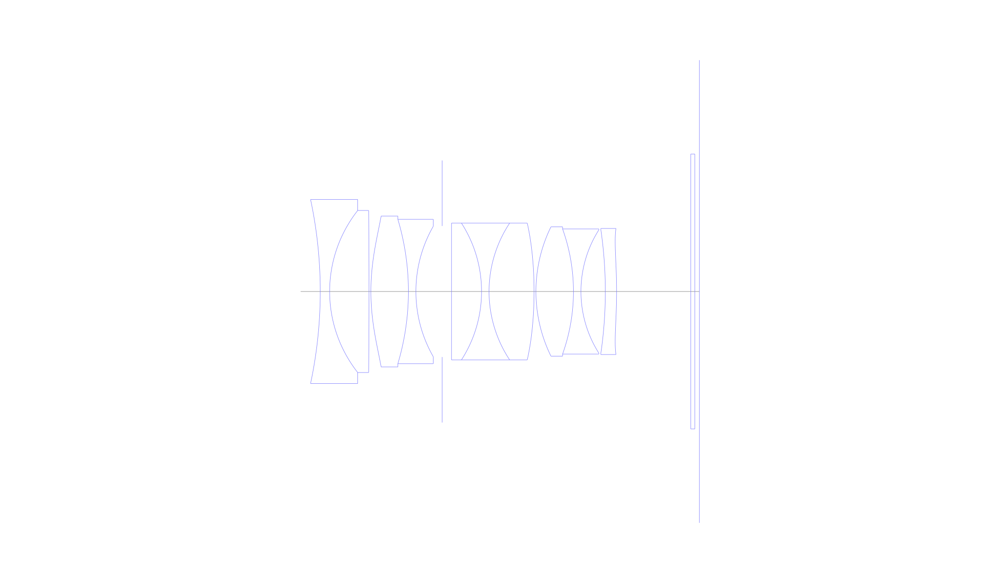
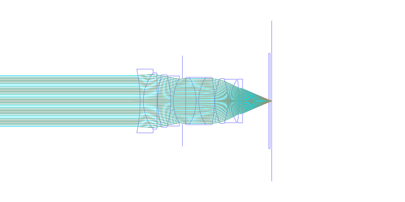
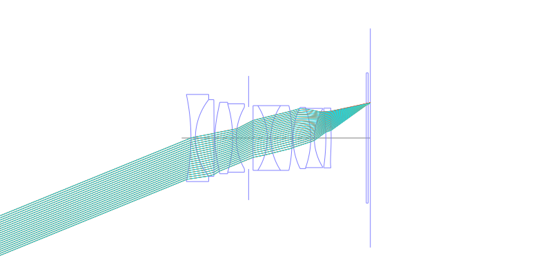
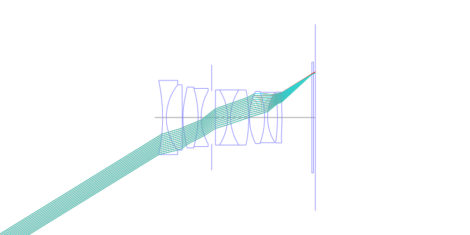
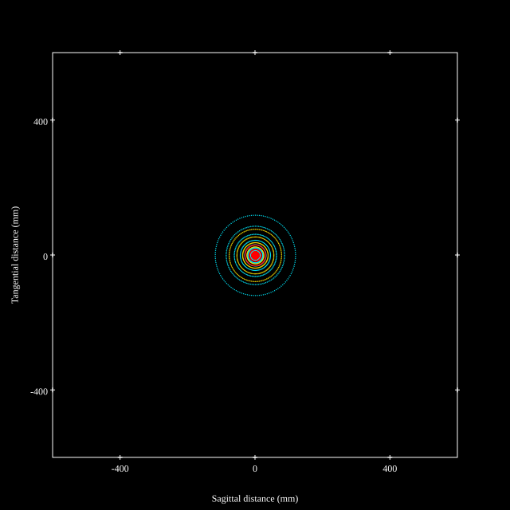
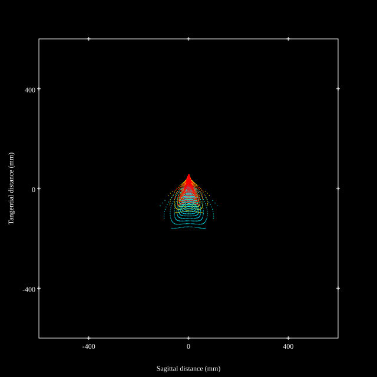
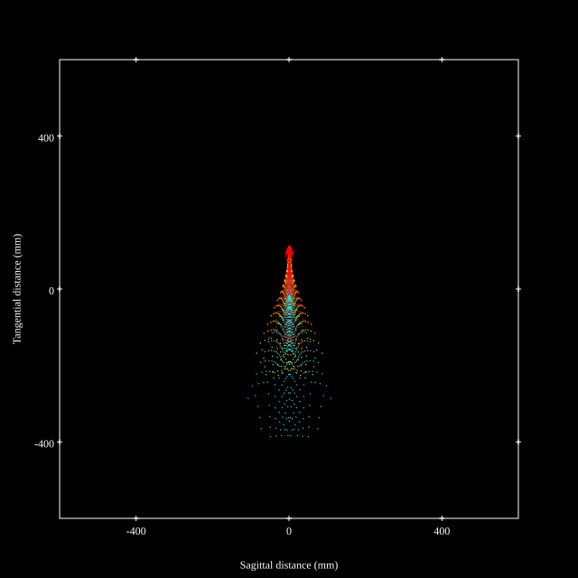
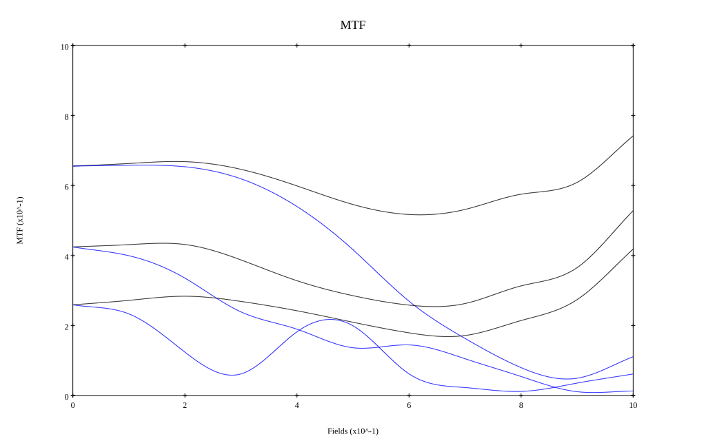
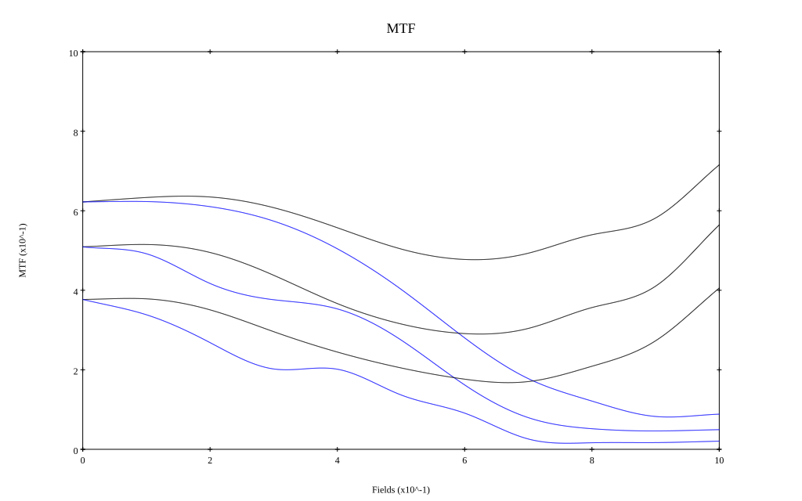

## Surface Data
Note that where glass types are shown the refractive index and abbe number is as per assigned glass type

| ID  | Radius | Thickness | Diameter | nd  | vd  | Glass Make | Glass |
| --- | ---    | ---       | ---      | --- | --- | ---        | ---   |
| 1 | -82.42455768530645 | 1.75 | 34.36 | 1.60342 | 38.03 | Ohara | S-TIM5 |
| 2 | 24.466700216398284 | 7.35 | 30.26 | 2.001 | 29.14 | Ohara | S-LAH99 |
| 3 | -1577.3799955794912 | 0.35 | 30.26 |  |  |  |
| 4 | 41.125 | 7.0 | 28.18 | 1.741 | 52.64 | Ohara | S-LAL61 |
| 5 | -47.14510437228584 | 1.4 | 26.96 | 1.7552 | 27.51 | Ohara | S-TIH4 |
| 6 | 24.50090686117901 | 4.9 | 24.34 |  |  |  |
| 7 | AS | 1.75 | 24.472 |  |  |  |
| 8 | 0.0 | 5.6 | 25.54 | 1.883 | 40.77 | Ohara | S-LAH58 |
| 9 | -23.625697223504492 | 1.4 | 25.54 | 1.738 | 32.26 | Ohara | S-NBH53 |
| 10 | 23.13501599456063 | 8.4 | 25.54 | 1.741 | 52.64 | Ohara | S-LAL61 |
| 11 | -72.62526906838033 | 0.35 | 25.54 |  |  |  |
| 12 | 27.406032668439465 | 7.0 | 24.14 | 1.95375 | 32.32 | Ohara | S-LAH98 |
| 13 | -34.65341155967488 | 1.4 | 23.36 | 1.6398 | 34.47 | Ohara | S-TIM27 |
| 14 | 21.489768942780845 | 4.55 | 23.02 |  |  |  |
| 15 | -80.11501105637662 | 2.1 | 23.02 | 1.9165 | 31.6 | Ohara | S-LAH88 |
| 16 | -93.55485507075431 | 13.85 | 23.54 |  |  |  |
| 17 | 0.0 | 0.75 | 51.34 | 1.51633 | 64.14 | Ohara | S-BSL7 |
| 18 | 0.0 | 0.85 | 51.34 |  |  |  |
## Aspherical Data
| ID  | Type | k   | P1 | P2 | P3 | P4 | P5 | P6 |
| --- | --- | --- | --- | --- | --- | --- | --- | --- |
| 4| EVEN | 0.0 | 0.0 | -1.0905680957681529E-5 | -1.8416039602604703E-8 | -3.057320497189701E-14 | 0.0 | 0  |
| 11| EVEN | 0.0 | 0.0 | -3.680357201846455E-6 | -1.3208985982315452E-8 | 2.1338637293240215E-11 | 0.0 | 0  |
| 16| EVEN | 0.0 | 0.0 | 2.3680557379485835E-5 | -2.0360443784262843E-8 | 1.0917651353698395E-9 | -5.736649981572721E-12 | 1.5950100296124735E-14 |
## Layouts

## Spot Diagrams

## Paraxial Parameters
| parameter | value |
| ---       | ---   |
| effective_focal_length |34.756
| back_focal_length | 0.873
| optical_invariant | 8.707
| object_distance | 1.0E10
| image_distance | 0.873
| power | 0.029
| pp1_H | 20.303
| ppk_H' | -33.883
| ffl_F | -14.453
| fno | 1.23
| enp_dist_P | 18.069
| enp_radius | 14.125
| exp_dist_P' | -36.247
| exp_radius | 15.095
| m | -0
| red | -2.877192804122041E8
| n_obj | 1
| n_img | 1
| img_ht | 21.424
| obj_ang | 31.65
| obj_na | 0
| img_na | -0.377|
## Spot Analysis
| Field | Spot Mean Radius | Spot Max Radius |
| ---   | ---              | ---             |
 | Field(x=0.0, y=0.0) | 35.613 | 119.058|
 | Field(x=0.0, y=0.1) | 31.399 | 124.758|
 | Field(x=0.0, y=0.2) | 27.067 | 131.185|
 | Field(x=0.0, y=0.3) | 28.133 | 133.63|
 | Field(x=0.0, y=0.4) | 32.179 | 133.659|
 | Field(x=0.0, y=0.5) | 37.48 | 130.883|
 | Field(x=0.0, y=0.6) | 43.824 | 144.373|
 | Field(x=0.0, y=0.7) | 52.234 | 171.93|
 | Field(x=0.0, y=0.8) | 66.906 | 205.914|
 | Field(x=0.0, y=0.9) | 91.64 | 255.181|
 | Field(x=0.0, y=1.0) | 107.445 | 388.329|
## Polychromatic Geometric MTF

* 10,30,50 cycles/mm
* Black lines represent sagittal, blue tangential
* To generate above, MTFs for wavelengths 587.5618(d), 486.1327(F), 656.2725(C) were calculated across 10 fields, and then averaged
## Polychromatic Geometric MTF (Weighted)

* 10,30,50 cycles/mm
* Black lines represent sagittal, blue tangential
* To generate above, MTFs for wavelengths 587.5618(d) wt(1.0), 656.2725(C) wt(0.475), 546.074(e) wt(0.98), 486.1327(F) wt(0.49), 435.8343(g) wt(0.15) were calculated across 10 fields, and then combined using weighted average
## Resources
* [OpticalBench Compatible Data File, tab delimited](./prescription.txt)
* [Zemax file](./US20250271647_Example02e-optim.zmx)

Report / Zemax file generated using [Beam42](https://github.com/BeamFour/Beam42) on 2026-03-06
