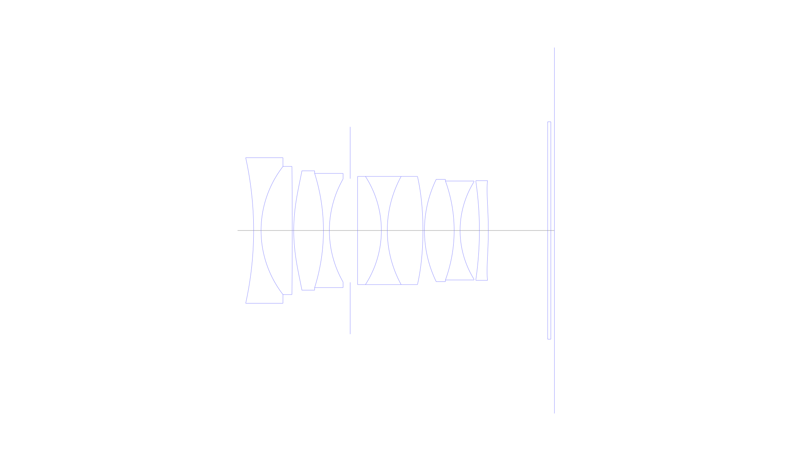
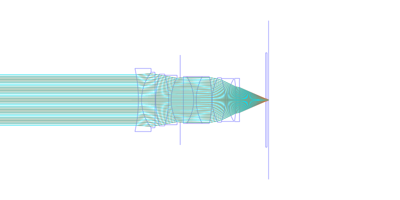
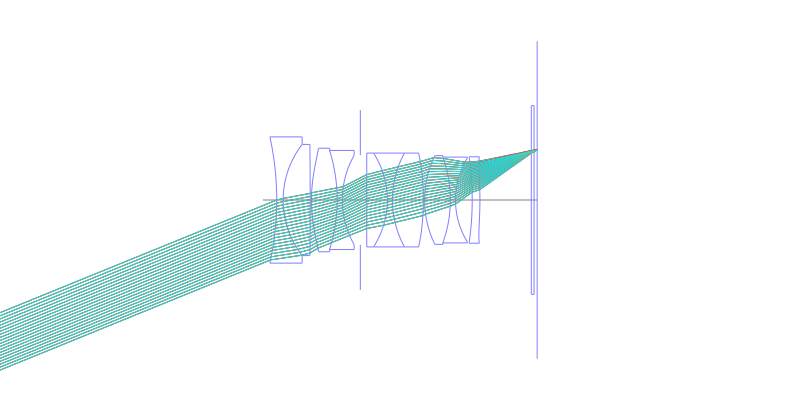
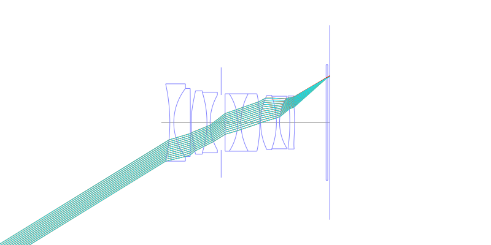
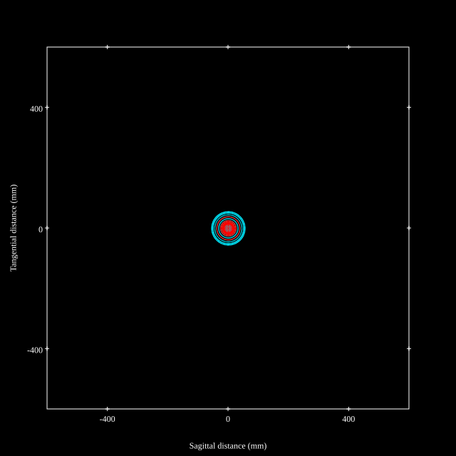
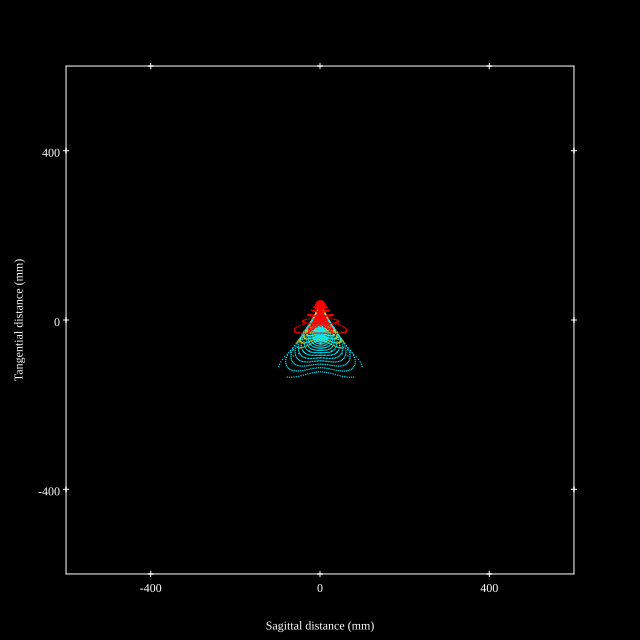
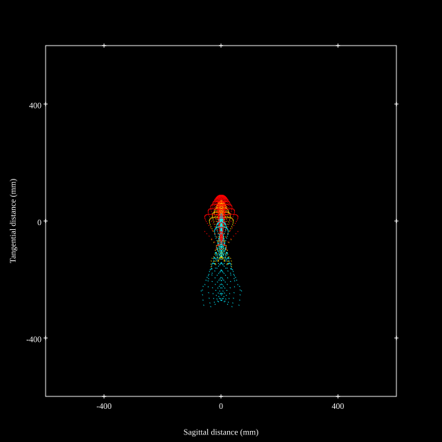
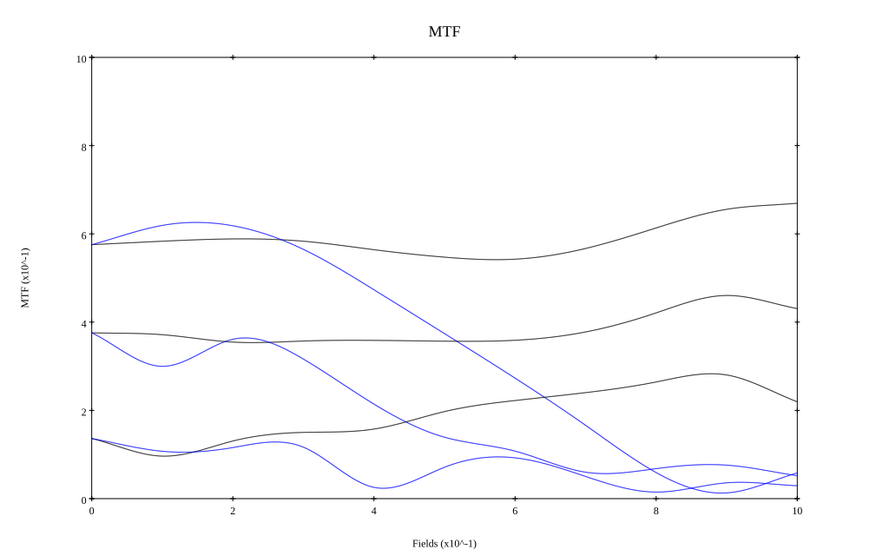
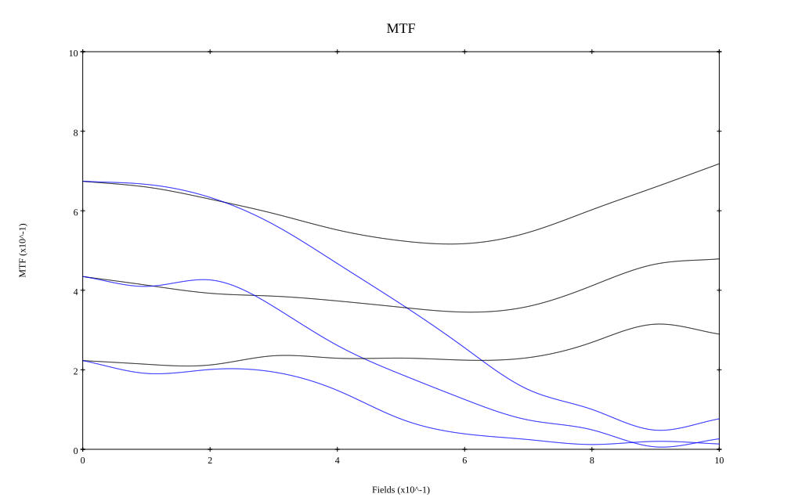

## Surface Data
Note that where glass types are shown the refractive index and abbe number is as per assigned glass type

| ID  | Radius | Thickness | Diameter | nd  | vd  | Glass Make | Glass |
| --- | ---    | ---       | ---      | --- | --- | ---        | ---   |
| 1 | -79.88628787771422 | 1.75 | 34.36 | 1.60342 | 38.03 | Ohara | S-TIM5 |
| 2 | 24.734985808216603 | 7.35 | 30.26 | 2.001 | 29.14 | Ohara | S-LAH99 |
| 3 | -1577.3296640242688 | 0.35 | 30.26 |  |  |  |
| 4 | 41.125 | 7.0 | 28.18 | 1.7432 | 49.34 | Ohara | S-LAM60 |
| 5 | -44.90370907194489 | 1.4 | 26.96 | 1.7552 | 27.51 | Ohara | S-TIH4 |
| 6 | 24.57107767072802 | 4.9 | 24.34 |  |  |  |
| 7 | AS | 1.75 | 24.472 |  |  |  |
| 8 | 0.0 | 5.6 | 25.54 | 1.883 | 40.77 | Ohara | S-LAH58 |
| 9 | -23.60092421441597 | 1.4 | 25.54 | 1.738 | 32.26 | Ohara | S-NBH53 |
| 10 | 26.676563128535513 | 8.4 | 25.54 | 1.7432 | 49.34 | Ohara | S-LAM60 |
| 11 | -70.96570633014973 | 0.35 | 25.54 |  |  |  |
| 12 | 27.70251804353271 | 7.0 | 24.14 | 1.95375 | 32.32 | Ohara | S-LAH98 |
| 13 | -34.24542332096305 | 1.4 | 23.36 | 1.64769 | 33.79 | Ohara | S-TIM22 |
| 14 | 21.84004852252406 | 4.55 | 23.02 |  |  |  |
| 15 | -80.88029149608383 | 2.1 | 23.02 | 1.902 | 25.1 | Ohara | L-NBH54 |
| 16 | -89.42552132417053 | 13.98 | 23.54 |  |  |  |
| 17 | 0.0 | 0.75 | 51.34 | 1.51633 | 64.14 | Ohara | S-BSL7 |
| 18 | 0.0 | 0.85 | 51.34 |  |  |  |
## Aspherical Data
| ID  | Type | k   | P1 | P2 | P3 | P4 | P5 | P6 |
| --- | --- | --- | --- | --- | --- | --- | --- | --- |
| 4| EVEN | 0.0 | 0.0 | -1.0420323936617725E-5 | -1.8470028519182792E-8 | -6.498191689485364E-12 | 0.0 | 0  |
| 11| EVEN | 0.0 | 0.0 | -3.616199620397022E-6 | -1.2939574001522898E-8 | 2.1797026754282937E-11 | 0.0 | 0  |
| 16| EVEN | 0.0 | 0.0 | 2.2615324260216188E-5 | -2.1151901289517616E-8 | 1.0805825366922407E-9 | -5.734824357131524E-12 | 1.594888178329319E-14 |
## Layouts

## Spot Diagrams

## Paraxial Parameters
| parameter | value |
| ---       | ---   |
| effective_focal_length |34.599
| back_focal_length | 0.964
| optical_invariant | 8.649
| object_distance | 1.0E10
| image_distance | 0.964
| power | 0.029
| pp1_H | 20.718
| ppk_H' | -33.635
| ffl_F | -13.881
| fno | 1.233
| enp_dist_P | 17.946
| enp_radius | 14.031
| exp_dist_P' | -36.535
| exp_radius | 15.253
| m | -0
| red | -2.8902701192895955E8
| n_obj | 1
| n_img | 1
| img_ht | 21.327
| obj_ang | 31.65
| obj_na | 0
| img_na | -0.376|
## Spot Analysis
| Field | Spot Mean Radius | Spot Max Radius |
| ---   | ---              | ---             |
 | Field(x=0.0, y=0.0) | 25.094 | 55.382|
 | Field(x=0.0, y=0.1) | 25.818 | 88.249|
 | Field(x=0.0, y=0.2) | 26.86 | 93.64|
 | Field(x=0.0, y=0.3) | 29.598 | 104.249|
 | Field(x=0.0, y=0.4) | 32.685 | 115.747|
 | Field(x=0.0, y=0.5) | 35.976 | 128.835|
 | Field(x=0.0, y=0.6) | 39.487 | 140.682|
 | Field(x=0.0, y=0.7) | 43.464 | 154.824|
 | Field(x=0.0, y=0.8) | 51.826 | 168.567|
 | Field(x=0.0, y=0.9) | 68.004 | 199.968|
 | Field(x=0.0, y=1.0) | 79.974 | 293.94|
## Polychromatic Geometric MTF

* 10,30,50 cycles/mm
* Black lines represent sagittal, blue tangential
* To generate above, MTFs for wavelengths 587.5618(d), 486.1327(F), 656.2725(C) were calculated across 10 fields, and then averaged
## Polychromatic Geometric MTF (Weighted)

* 10,30,50 cycles/mm
* Black lines represent sagittal, blue tangential
* To generate above, MTFs for wavelengths 587.5618(d) wt(1.0), 656.2725(C) wt(0.475), 546.074(e) wt(0.98), 486.1327(F) wt(0.49), 435.8343(g) wt(0.15) were calculated across 10 fields, and then combined using weighted average
## Resources
* [OpticalBench Compatible Data File, tab delimited](./prescription.txt)
* [Zemax file](./US20250271647_Example02h-optim.zmx)

Report / Zemax file generated using [Beam42](https://github.com/BeamFour/Beam42) on 2026-03-06
