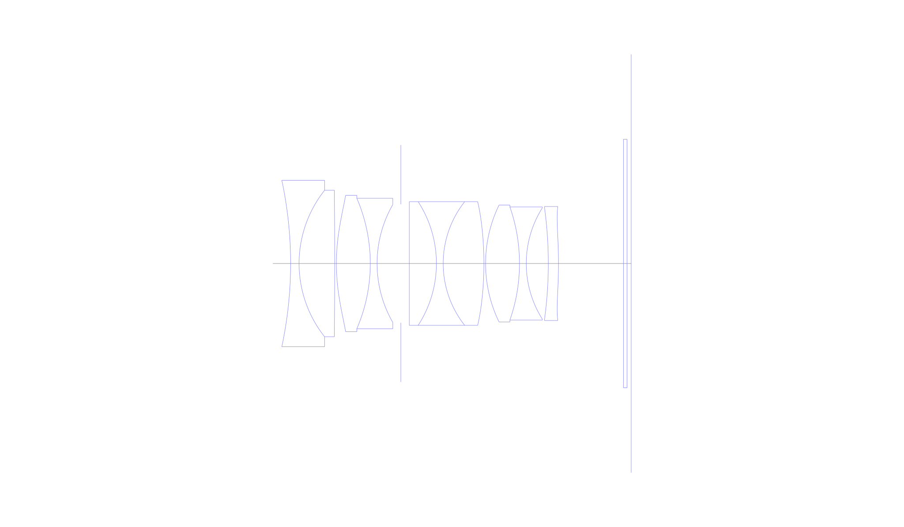
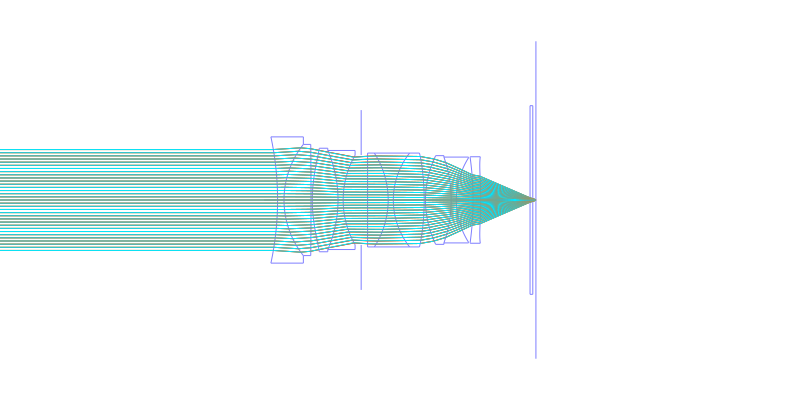
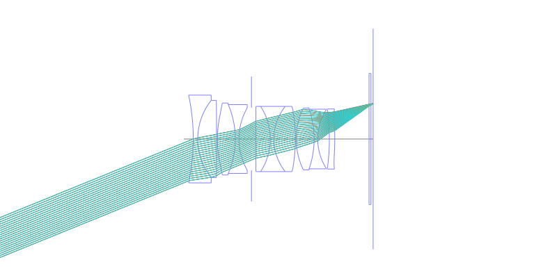
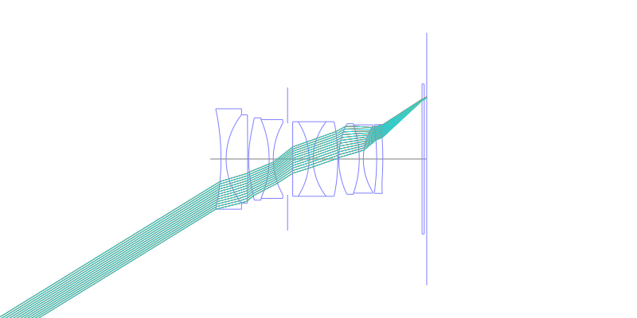
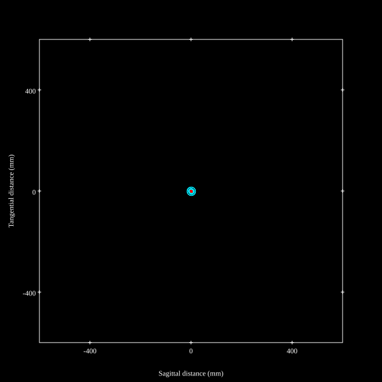
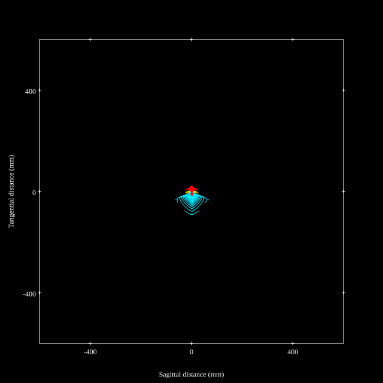
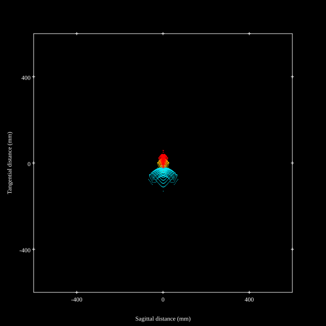
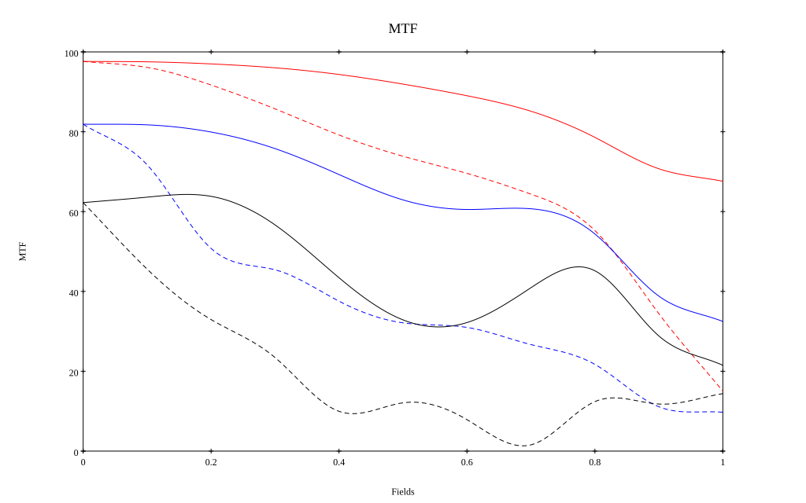
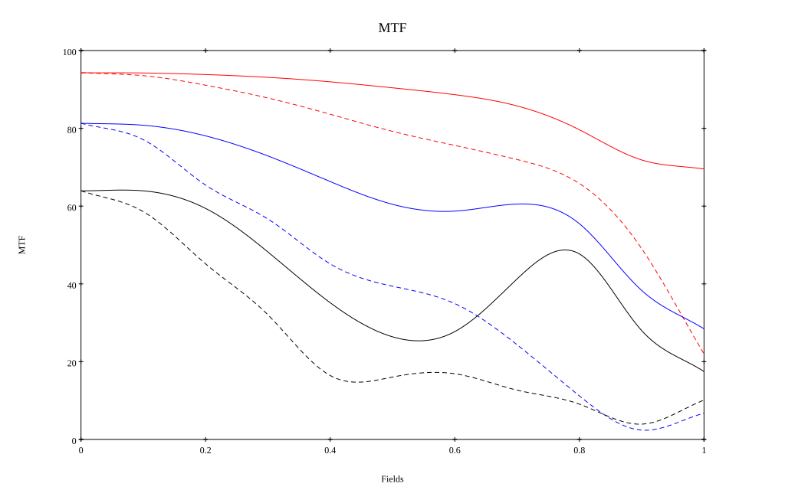

## Surface Data
Note that where glass types are shown the refractive index and abbe number is as per assigned glass type

| ID  | Radius | Thickness | Diameter | nd  | vd  | Glass Make | Glass |
| --- | ---    | ---       | ---      | --- | --- | ---        | ---   |
| 1 | -82.20822642738366 | 1.75 | 34.36 | 1.59551 | 39.21 | Hikari | J-F8 |
| 2 | 24.37114462027162 | 7.35 | 30.26 | 2.001 | 29.14 | Ohara | S-LAH99 |
| 3 | -1507.7948022228466 | 0.35 | 30.26 |  |  |  |
| 4 | 41.125 | 7.0 | 28.18 | 1.7432 | 49.34 | Ohara | S-LAM60 |
| 5 | -34.03066808946261 | 1.4 | 26.96 | 1.7552 | 27.51 | Ohara | S-TIH4 |
| 6 | 24.451823683300166 | 4.9 | 24.34 |  |  |  |
| 7 | AS | 1.75 | 24.472 |  |  |  |
| 8 | 0.0 | 5.6 | 25.54 | 1.883 | 40.77 | Ohara | S-LAH58 |
| 9 | -23.527282353033122 | 1.4 | 25.54 | 1.738 | 32.26 | Ohara | S-NBH53 |
| 10 | 20.615422019674988 | 8.4 | 25.54 | 1.7432 | 49.34 | Ohara | S-LAM60 |
| 11 | -72.1110511401108 | 0.35 | 25.54 |  |  |  |
| 12 | 27.609853189479292 | 7.0 | 24.14 | 1.95375 | 32.32 | Ohara | S-LAH98 |
| 13 | -35.43880633899774 | 1.4 | 23.36 | 1.64769 | 33.79 | Ohara | S-TIM22 |
| 14 | 21.574316699821438 | 4.55 | 23.02 |  |  |  |
| 15 | -85.2130008219762 | 2.1 | 23.02 | 1.92286 | 18.9 | Ohara | S-NPH2 |
| 16 | -91.40272673324627 | 13.41 | 23.54 |  |  |  |
| 17 | 0.0 | 0.75 | 51.34 | 1.51633 | 64.14 | Ohara | S-BSL7 |
| 18 | 0.0 | 0.85 | 51.34 |  |  |  |
## Aspherical Data
| ID  | Type | k   | P1 | P2 | P3 | P4 | P5 | P6 |
| --- | --- | --- | --- | --- | --- | --- | --- | --- |
| 4| EVEN | 0.0 | 0.0 | -1.0891201424496888E-5 | -1.84684929432758E-8 | -1.7058208674517347E-13 | 0.0 | 0  |
| 11| EVEN | 0.0 | 0.0 | -3.6694396859346397E-6 | -1.3357457630668004E-8 | 2.1478458289032857E-11 | 0.0 | 0  |
| 16| EVEN | 0.0 | 0.0 | 2.377112247679613E-5 | -2.0043934657579652E-8 | 1.0909755029372182E-9 | -5.727529456546964E-12 | 1.6018595200042385E-14 |
## Layouts

## Spot Diagrams

## Paraxial Parameters
| parameter | value |
| ---       | ---   |
| effective_focal_length |34.562
| back_focal_length | 0.85
| optical_invariant | 8.765
| object_distance | 1.0E10
| image_distance | 0.85
| power | 0.029
| pp1_H | 20.383
| ppk_H' | -33.713
| ffl_F | -14.179
| fno | 1.215
| enp_dist_P | 18.213
| enp_radius | 14.22
| exp_dist_P' | -36.029
| exp_radius | 15.172
| m | -0
| red | -2.893313515934937E8
| n_obj | 1
| n_img | 1
| img_ht | 21.305
| obj_ang | 31.65
| obj_na | 0
| img_na | -0.38|
## Spot Analysis
| Field | Spot Mean Radius | Spot Max Radius |
| ---   | ---              | ---             |
 | Field(x=0.0, y=0.0) | 5.292 | 16.412|
 | Field(x=0.0, y=0.1) | 5.789 | 18.324|
 | Field(x=0.0, y=0.2) | 7.771 | 21.807|
 | Field(x=0.0, y=0.3) | 10.061 | 31.444|
 | Field(x=0.0, y=0.4) | 12.962 | 48.613|
 | Field(x=0.0, y=0.5) | 15.928 | 66.982|
 | Field(x=0.0, y=0.6) | 18.588 | 81.426|
 | Field(x=0.0, y=0.7) | 21.261 | 89.563|
 | Field(x=0.0, y=0.8) | 24.389 | 94.516|
 | Field(x=0.0, y=0.9) | 29.058 | 100.693|
 | Field(x=0.0, y=1.0) | 38.295 | 129.361|
## Polychromatic Geometric MTF

* 10=red,30=blue,50=black cycles/mm
* Solid lines represent sagittal, dashed lines tangential
* To generate above, MTFs for wavelengths 587.5618(d), 486.1327(F), 656.2725(C) were calculated across 10 fields, and then averaged
## Polychromatic Geometric MTF (Weighted)

* 10=red,30=blue,50=black cycles/mm
* Solid lines represent sagittal, dashed lines tangential
* To generate above, MTFs for wavelengths 587.5618(d) wt(1.0), 656.2725(C) wt(0.475), 546.074(e) wt(0.98), 486.1327(F) wt(0.49), 435.8343(g) wt(0.15) were calculated across 10 fields, and then combined using weighted average
## Resources
* [OpticalBench Compatible Data File, tab delimited](./prescription.txt)
* [Zemax file](./specs.zmx)

Report / Zemax file generated using [Beam42](https://github.com/BeamFour/Beam42) on 2026-07-07
