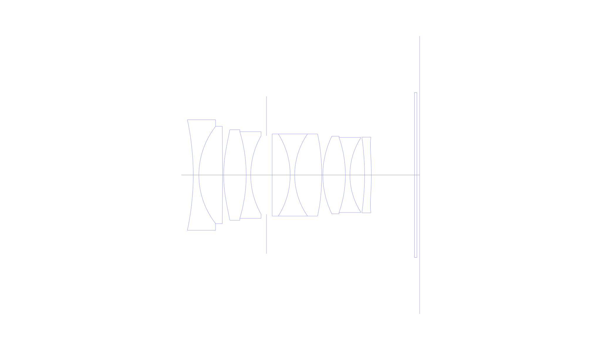
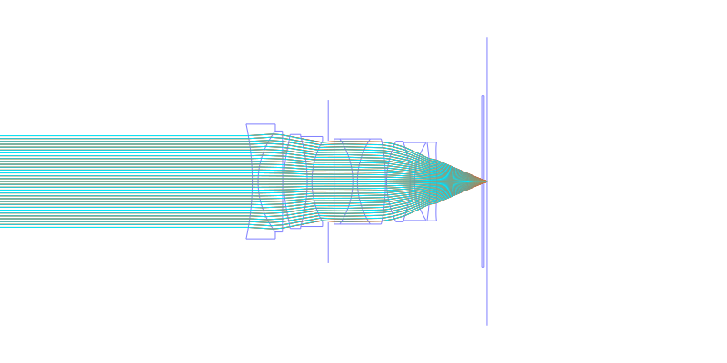
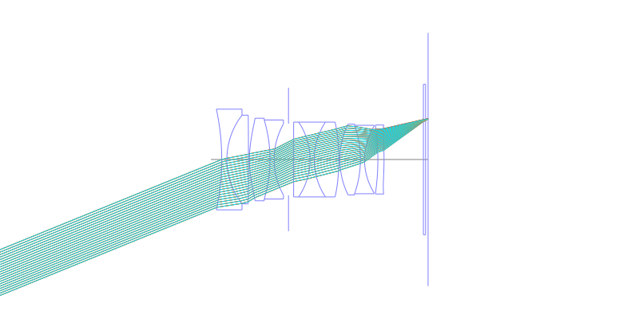
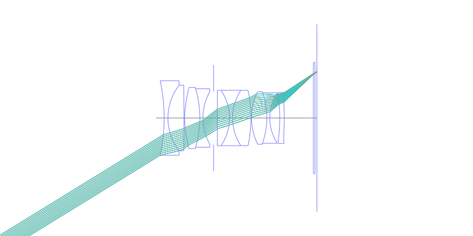
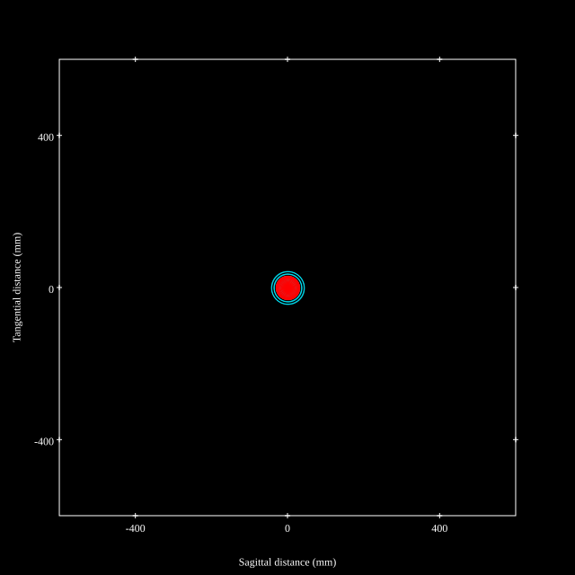
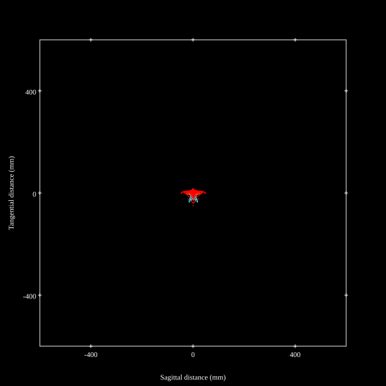
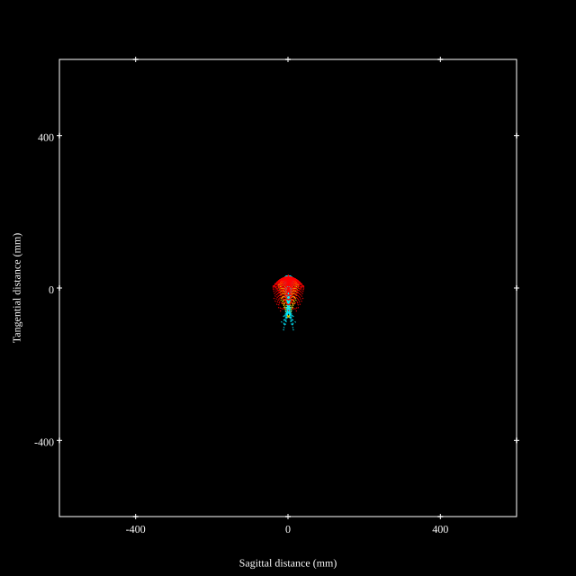
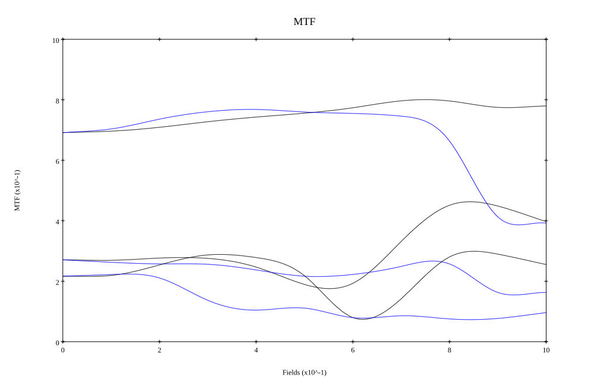
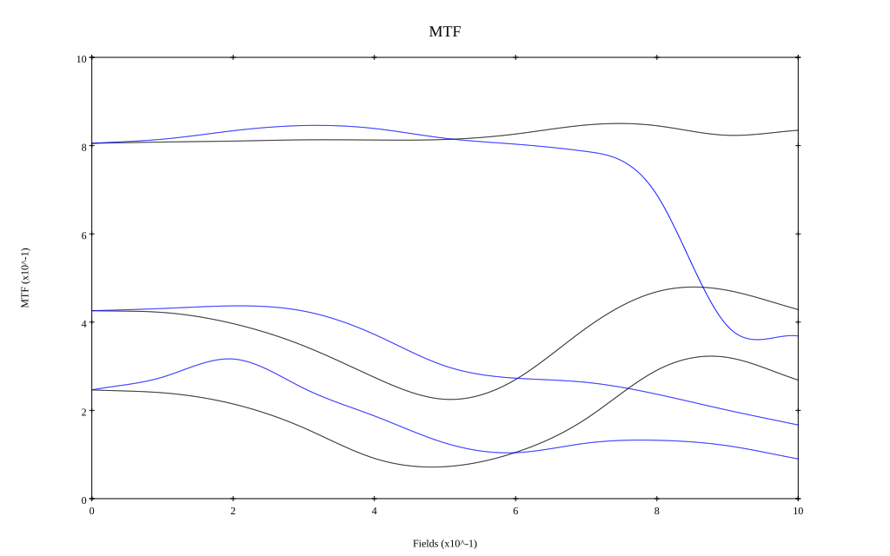

## Surface Data
Note that where glass types are shown the refractive index and abbe number is as per assigned glass type

| ID  | Radius | Thickness | Diameter | nd  | vd  | Glass Make | Glass |
| --- | ---    | ---       | ---      | --- | --- | ---        | ---   |
| 1 | -81.75261386289162 | 1.75 | 34.36 | 1.59551 | 39.21 | Hikari | J-F8 |
| 2 | 24.58257999120171 | 7.35 | 30.26 | 2.001 | 29.14 | Ohara | S-LAH99 |
| 3 | -1577.3731448592396 | 0.35 | 30.26 |  |  |  |
| 4 | 41.125 | 7.0 | 28.18 | 1.7432 | 49.34 | Ohara | S-LAM60 |
| 5 | -46.62265052284911 | 1.4 | 26.96 | 1.7552 | 27.51 | Ohara | S-TIH4 |
| 6 | 24.629863083910227 | 4.9 | 24.34 |  |  |  |
| 7 | AS | 1.75 | 24.472 |  |  |  |
| 8 | 0.0 | 5.6 | 25.54 | 1.883 | 40.77 | Ohara | S-LAH58 |
| 9 | -23.93245722087554 | 1.4 | 25.54 | 1.738 | 32.26 | Ohara | S-NBH53 |
| 10 | 22.3755424334783 | 8.4 | 25.54 | 1.7432 | 49.34 | Ohara | S-LAM60 |
| 11 | -70.33717479185258 | 0.35 | 25.54 |  |  |  |
| 12 | 27.51369464572788 | 7.0 | 24.14 | 1.95375 | 32.32 | Ohara | S-LAH98 |
| 13 | -35.418808641215094 | 1.4 | 23.36 | 1.64769 | 33.79 | Ohara | S-TIM22 |
| 14 | 21.408230530518335 | 4.55 | 23.02 |  |  |  |
| 15 | -82.57247691080225 | 2.1 | 23.02 | 1.92286 | 18.9 | Ohara | S-NPH2 |
| 16 | -91.6568428322665 | 13.41 | 23.54 |  |  |  |
| 17 | 0.0 | 0.75 | 51.34 | 1.51633 | 64.14 | Ohara | S-BSL7 |
| 18 | 0.0 | 0.85 | 51.34 |  |  |  |
## Aspherical Data
| ID  | Type | k   | P1 | P2 | P3 | P4 | P5 | P6 |
| --- | --- | --- | --- | --- | --- | --- | --- | --- |
| 4| EVEN | 0.0 | 0.0 | -1.098653210089511E-5 | -1.7819971629187337E-8 | -8.830557420289717E-13 | 0.0 | 0  |
| 11| EVEN | 0.0 | 0.0 | -3.735676169538647E-6 | -1.27525006491516E-8 | 1.9461193022176903E-11 | 0.0 | 0  |
| 16| EVEN | 0.0 | 0.0 | 2.462928129770691E-5 | -2.0834923460040332E-8 | 1.0812374881458236E-9 | -5.736728661371674E-12 | 1.5949904265644258E-14 |
## Layouts

## Spot Diagrams

## Paraxial Parameters
| parameter | value |
| ---       | ---   |
| effective_focal_length |34.566
| back_focal_length | 0.841
| optical_invariant | 8.744
| object_distance | 1.0E10
| image_distance | 0.841
| power | 0.029
| pp1_H | 20.182
| ppk_H' | -33.725
| ffl_F | -14.383
| fno | 1.218
| enp_dist_P | 18.164
| enp_radius | 14.186
| exp_dist_P' | -35.877
| exp_radius | 15.066
| m | -0
| red | -2.893041440203399E8
| n_obj | 1
| n_img | 1
| img_ht | 21.307
| obj_ang | 31.65
| obj_na | 0
| img_na | -0.38|
## Spot Analysis
| Field | Spot Mean Radius | Spot Max Radius |
| ---   | ---              | ---             |
 | Field(x=0.0, y=0.0) | 18.944 | 45.108|
 | Field(x=0.0, y=0.1) | 18.514 | 45.806|
 | Field(x=0.0, y=0.2) | 17.38 | 42.298|
 | Field(x=0.0, y=0.3) | 16.301 | 38.899|
 | Field(x=0.0, y=0.4) | 15.473 | 39.466|
 | Field(x=0.0, y=0.5) | 14.853 | 41.693|
 | Field(x=0.0, y=0.6) | 14.341 | 48.54|
 | Field(x=0.0, y=0.7) | 14.282 | 49.809|
 | Field(x=0.0, y=0.8) | 16.993 | 53.707|
 | Field(x=0.0, y=0.9) | 25.814 | 70.319|
 | Field(x=0.0, y=1.0) | 34.86 | 124.946|
## Polychromatic Geometric MTF

* 10,30,50 cycles/mm
* Black lines represent sagittal, blue tangential
* To generate above, MTFs for wavelengths 587.5618(d), 486.1327(F), 656.2725(C) were calculated across 10 fields, and then averaged
## Polychromatic Geometric MTF (Weighted)

* 10,30,50 cycles/mm
* Black lines represent sagittal, blue tangential
* To generate above, MTFs for wavelengths 587.5618(d) wt(1.0), 656.2725(C) wt(0.475), 546.074(e) wt(0.98), 486.1327(F) wt(0.49), 435.8343(g) wt(0.15) were calculated across 10 fields, and then combined using weighted average
## Resources
* [OpticalBench Compatible Data File, tab delimited](./prescription.txt)
* [Zemax file](./US20250271647_Example02i-optim2.zmx)

Report / Zemax file generated using [Beam42](https://github.com/BeamFour/Beam42) on 2026-03-06
