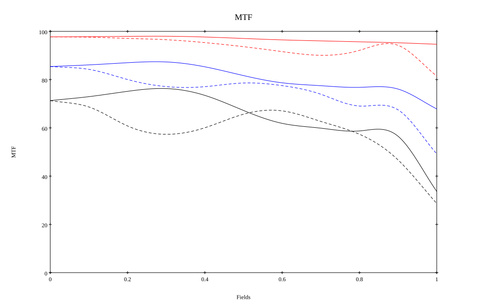

# Leica APO-Summicron-M 35mm f/2 Asph
## Patent Information
| Country | Patent Number | Example | Year of Application | Inventors | Organisation | Link |
| ---     | ---           | ---     | ---                 | ---       | ---          | ---  |
|US | US12181644B2 | EX 1 | 2018 |     Stefan Roth,Kathrin Keller | Leica Camera AG | [link](https://patents.google.com/patent/US12181644B2/en) |
## Surface Data
Note that where glass types are shown the refractive index and abbe number is as per assigned glass type

| ID  | Radius | Thickness | Diameter | nd  | vd  | Glass Make | Glass |
| --- | ---    | ---       | ---      | --- | --- | ---        | ---   |
| 1 | 54.11 | 5.95 | 24.36 | 1.8515 | 40.78 | Ohara | S-LAH89 |
| 2 | -21.98 | 1.05 | 23.36 | 1.65412 | 39.68 | Ohara | S-NBH5 |
| 3 | 25.97 | 3.5 | 17.55 |  |  |  |
| 4 | -27.65 | 2.1 | 16.38 | 1.65412 | 39.68 | Ohara | S-NBH5 |
| 5 | 22.68 | 4.55 | 18.06 | 1.883 | 40.76 | Schott | N-LASF31A |
| 6 | -37.835 | 1.4 | 18.06 |  |  |  |
| 7 | AS | 1.4 | 17.618 |  |  |  |
| 8 | 182.315 | 6.65 | 17.55 | 1.497 | 81.61 | Schott | N-PK52A |
| 9 | -30.66 | 1.05 | 17.55 | 1.65412 | 39.68 | Ohara | S-NBH5 |
| 10 | 22.435 | 5.25 | 18.53 | 1.497 | 81.61 | Schott | N-PK52A |
| 11 | -28.315 | 0.35 | 18.94 |  |  |  |
| 12 | 28.07 | 7.7 | 23.37 | 1.8515 | 40.78 | Ohara | S-LAH89 |
| 13 | -21.56 | 1.05 | 23.37 | 1.65412 | 39.68 | Ohara | S-NBH5 |
| 14 | 22.855 | 6.65 | 22.3 |  |  |  |
| 15 | -52.15 | 1.05 | 23.28 | 1.58313 | 59.37 | Ohara | S-BAL42 |
| 16 | -235.97 | 14.3308 | 24.26 |  |  |  |
## Aspherical Data
| ID  | k   | P1  | P2  | P3  | P3 | P5 | P6 | P7 | P8 | P9 | P10 |
| --- | --- | --- | --- | --- | --- | --- | --- | --- | --- | --- | --- |
| 1 | 0.0 | 0.0 | -1.6863630526268195E-5 | -3.676551002328882E-8 | -2.189535823806555E-11 | 0.0 | 0.0 | 0.0 | 0.0 | 0.0 | 0.0 |
| 12 | 0.0 | 0.0 | -8.273540201933614E-7 | -1.6808081568892715E-8 | -9.042280206078677E-12 | 0.0 | 0.0 | 0.0 | 0.0 | 0.0 | 0.0 |
| 15 | 0.0 | 0.0 | -1.2018849181156513E-4 | 9.122416546784742E-7 | -2.271077905636712E-9 | 5.416016844582869E-12 | -2.86198256433574E-14 | 0.0 | 0.0 | 0.0 | 0.0 |
| 16 | 0.0 | 0.0 | -8.843173522903211E-5 | 8.953144403793292E-7 | -1.99212580252123E-9 | 0.0 | 0.0 | 0.0 | 0.0 | 0.0 | 0.0 |
## Layouts

## Spot Diagrams

## Paraxial Parameters
| parameter | value |
| ---       | ---   |
| effective_focal_length |34.75
| back_focal_length | 14.394
| optical_invariant | 5.241
| object_distance | 1.0E10
| image_distance | 14.394
| power | 0.029
| pp1_H | 12.754
| ppk_H' | -20.356
| ffl_F | -21.996
| fno | 2
| enp_dist_P | 13.563
| enp_radius | 8.688
| exp_dist_P' | -19.503
| exp_radius | 8.49
| m | -0
| red | -2.87768521880726E8
| n_obj | 1
| n_img | 1
| img_ht | 20.963
| obj_ang | 31.1
| obj_na | 0
| img_na | -0.243|
## Spot Analysis
| Field | Spot Mean Radius | Spot Max Radius |
| ---   | ---              | ---             |
 | Field(x=0.0, y=0.0) | 3.651 | 6.584|
 | Field(x=0.0, y=0.1) | 4.092 | 12.158|
 | Field(x=0.0, y=0.2) | 4.493 | 17.368|
 | Field(x=0.0, y=0.3) | 4.989 | 23.298|
 | Field(x=0.0, y=0.4) | 6.121 | 32.833|
 | Field(x=0.0, y=0.5) | 7.689 | 40.488|
 | Field(x=0.0, y=0.6) | 8.943 | 43.308|
 | Field(x=0.0, y=0.7) | 9.462 | 40.967|
 | Field(x=0.0, y=0.8) | 8.087 | 35.089|
 | Field(x=0.0, y=0.9) | 7.38 | 27.787|
 | Field(x=0.0, y=1.0) | 13.021 | 57.157|
## Geometric MTF

* 10,30,50 cycles/mm
* Black lines represent sagittal, blue tangential
* Wavelengths 587.5618(d), 486.1327(F), 656.2725(C) equal weight
## Geometric MTF (Weighted)

* 10,30,50 cycles/mm
* Black lines represent sagittal, blue tangential
* Wavelengths 587.5618(d), 656.2725(C), 546.074(e), 486.1327(F), 435.8343(g) weighted 1.0,0.475,0.98,0.49,0.15
## Resources
* [OpticalBench Compatible Data File, tab delimited](./US20220066176_Example01.txt)
* [Zemax file](./US20220066176_Example01.zmx)
