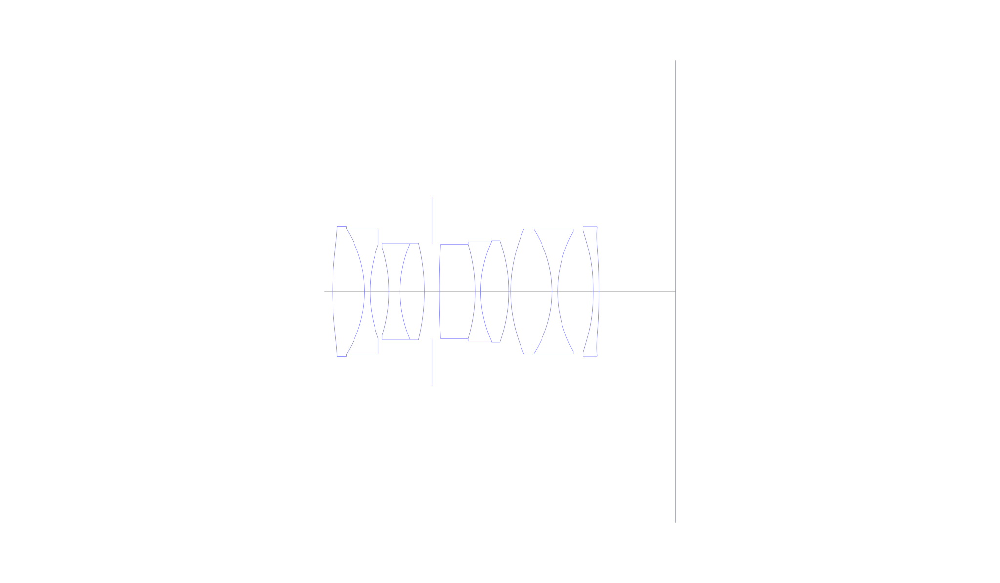
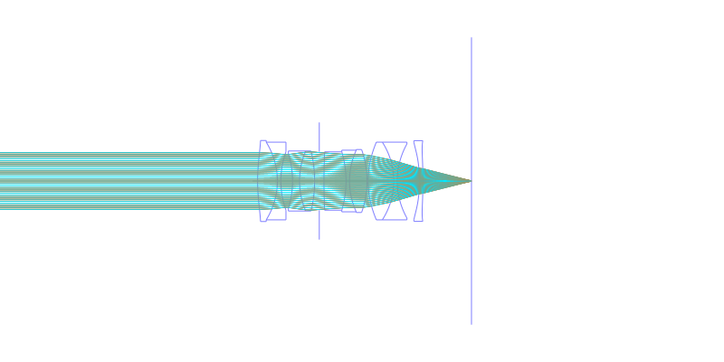
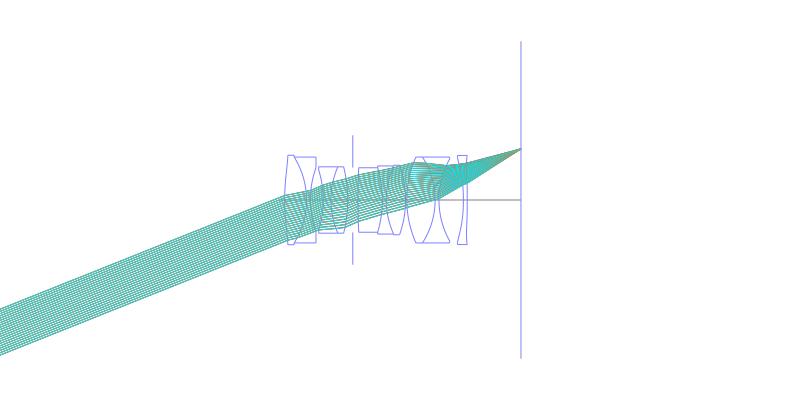
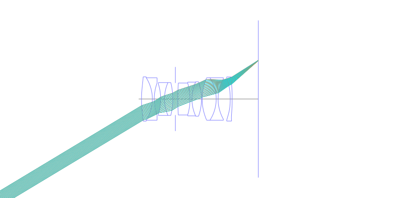
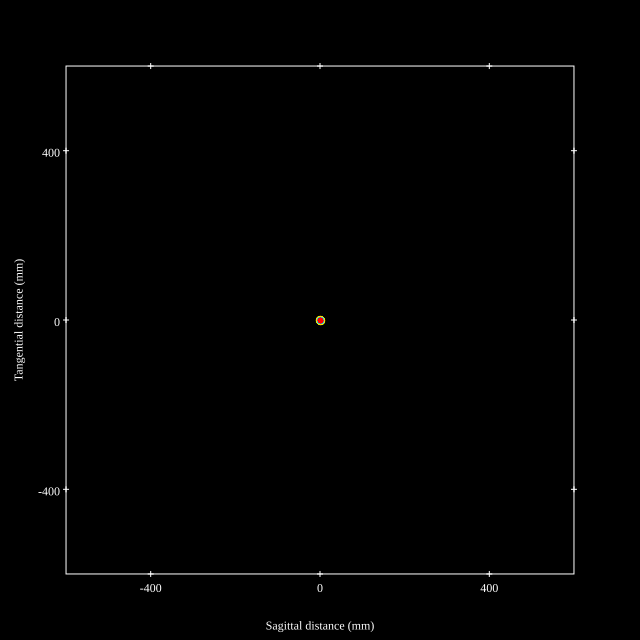
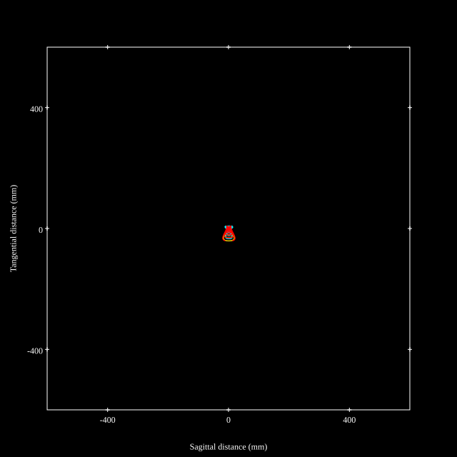
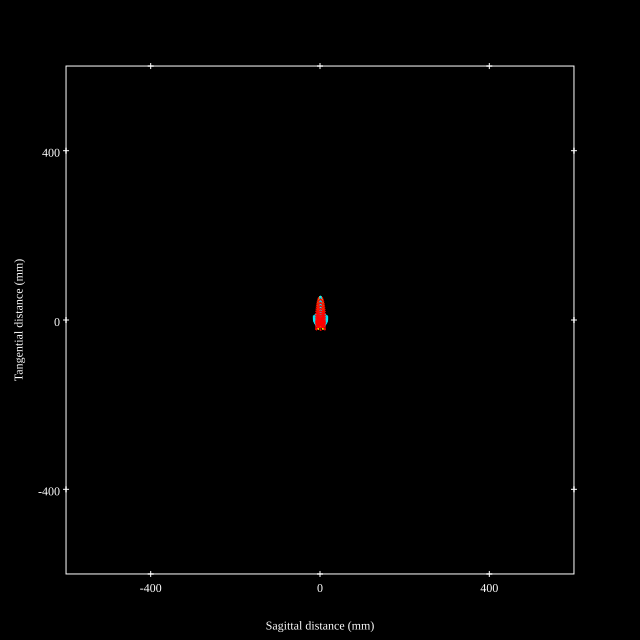
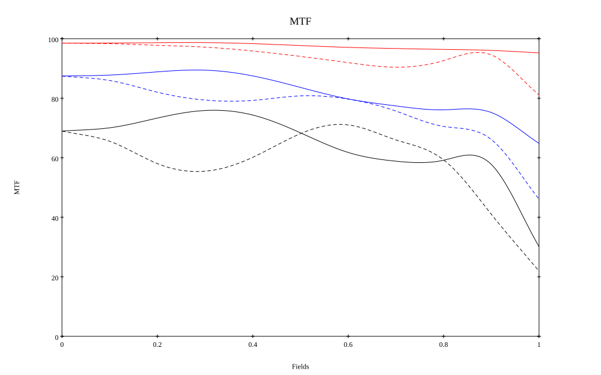

# Leica APO-Summicron-M 35mm f/2 Asph
## Patent Information
| Country | Patent Number | Example | Year of Application | Inventors | Organisation | Link |
| ---     | ---           | ---     | ---                 | ---       | ---          | ---  |
|US | US2022006617 | EX 1 | 2018 |     Stefan Roth,Kathrin Keller | Leica Camera AG | [link](https://patents.google.com/patent/US20220066176A1/en) |
## Surface Data
Note that where glass types are shown the refractive index and abbe number is as per assigned glass type

| ID  | Radius | Thickness | Diameter | nd  | vd  | Glass Make | Glass |
| --- | ---    | ---       | ---      | --- | --- | ---        | ---   |
| 1 | 54.11 | 5.95 | 24.36 | 1.85135 | 40.1 | Hoya | M-TAFD305 |
| 2 | -21.98 | 1.05 | 23.36 | 1.65412 | 39.68 | Ohara | S-NBH5 |
| 3 | 25.97 | 3.5 | 17.55 |  |  |  |
| 4 | -27.65 | 2.1 | 16.38 | 1.65412 | 39.68 | Ohara | S-NBH5 |
| 5 | 22.68 | 4.55 | 18.06 | 1.883 | 40.77 | Ohara | S-LAH58 |
| 6 | -37.835 | 1.4 | 18.06 |  |  |  |
| 7 | AS | 1.4 | 17.618 |  |  |  |
| 8 | 182.315 | 6.65 | 17.55 | 1.497 | 81.61 | Ohara | FPL51 |
| 9 | -30.66 | 1.05 | 17.55 | 1.65412 | 39.68 | Ohara | S-NBH5 |
| 10 | 22.435 | 5.25 | 18.53 | 1.497 | 81.61 | Ohara | FPL51 |
| 11 | -28.315 | 0.35 | 18.94 |  |  |  |
| 12 | 28.07 | 7.7 | 23.37 | 1.85135 | 40.1 | Hoya | M-TAFD305 |
| 13 | -21.56 | 1.05 | 23.37 | 1.65412 | 39.68 | Ohara | S-NBH5 |
| 14 | 22.855 | 6.65 | 22.3 |  |  |  |
| 15 | -52.15 | 1.05 | 23.28 | 1.58313 | 59.39 | Ohara | L-BAL42 |
| 16 | -235.97 | 14.62 | 24.26 |  |  |  |
## Aspherical Data
| ID  | k   | P1  | P2  | P3  | P3 | P5 | P6 | P7 | P8 | P9 | P10 |
| --- | --- | --- | --- | --- | --- | --- | --- | --- | --- | --- | --- |
| 1 | 0.0 | 0.0 | -1.786321194272855E-5 | -2.998045894052994E-8 | -3.352585939808561E-11 | 0.0 | 0.0 | 0.0 | 0.0 | 0.0 | 0.0 |
| 12 | 0.0 | 0.0 | -5.052886673564222E-6 | 3.195094836489884E-8 | -2.296090799697492E-10 | 0.0 | 0.0 | 0.0 | 0.0 | 0.0 | 0.0 |
| 15 | 0.0 | 0.0 | -6.741271638979324E-5 | 4.633468561255707E-7 | -1.124194395274643E-9 | 3.433986838100732E-12 | 0.0 | 0.0 | 0.0 | 0.0 | 0.0 |
| 16 | 0.0 | 0.0 | -3.710782810920104E-5 | 4.458831372811221E-7 | -6.639554902403866E-10 | 0.0 | 0.0 | 0.0 | 0.0 | 0.0 | 0.0 |
## Layouts

## Spot Diagrams

## Paraxial Parameters
| parameter | value |
| ---       | ---   |
| effective_focal_length |34.77
| back_focal_length | 14.412
| optical_invariant | 5.244
| object_distance | 1.0E10
| image_distance | 14.412
| power | 0.029
| pp1_H | 12.75
| ppk_H' | -20.358
| ffl_F | -22.02
| fno | 2
| enp_dist_P | 13.562
| enp_radius | 8.693
| exp_dist_P' | -19.772
| exp_radius | 8.494
| m | -0
| red | -2.876025904501733E8
| n_obj | 1
| n_img | 1
| img_ht | 20.975
| obj_ang | 31.1
| obj_na | 0
| img_na | -0.243|
## Spot Analysis
| Field | Spot Mean Radius | Spot Max Radius |
| ---   | ---              | ---             |
 | Field(x=0.0, y=0.0) | 7.009 | 13.146|
 | Field(x=0.0, y=0.1) | 6.945 | 13.288|
 | Field(x=0.0, y=0.2) | 6.812 | 17.459|
 | Field(x=0.0, y=0.3) | 6.93 | 20.38|
 | Field(x=0.0, y=0.4) | 7.601 | 21.912|
 | Field(x=0.0, y=0.5) | 8.302 | 19.344|
 | Field(x=0.0, y=0.6) | 9.194 | 18.301|
 | Field(x=0.0, y=0.7) | 10.579 | 27.624|
 | Field(x=0.0, y=0.8) | 12.446 | 35.053|
 | Field(x=0.0, y=0.9) | 15.54 | 38.909|
 | Field(x=0.0, y=1.0) | 22.027 | 51.604|
## Geometric MTF

* 10,30,50 cycles/mm
* Black lines represent sagittal, blue tangential
## Resources
* [OpticalBench Compatible Data File, tab delimited](./US20220066176_Example01.txt)
* [Zemax file](./US20220066176_Example01.zmx)
