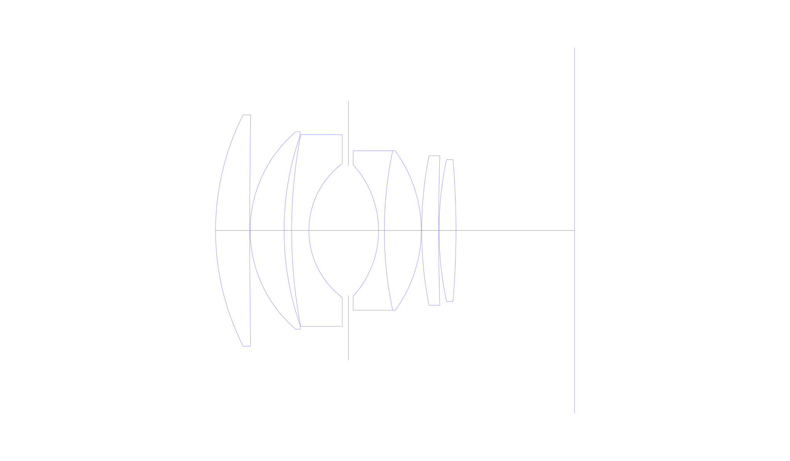
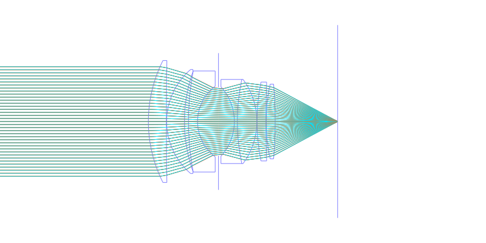
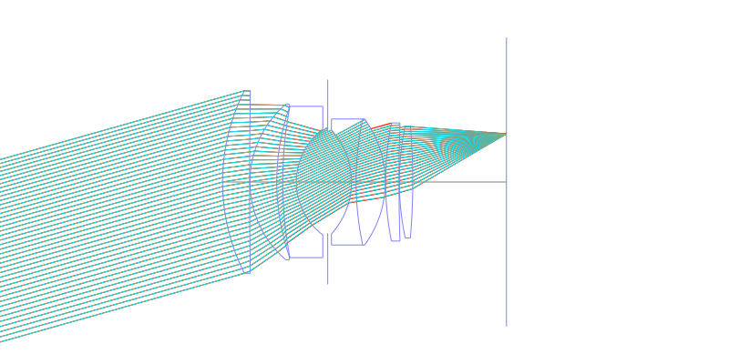
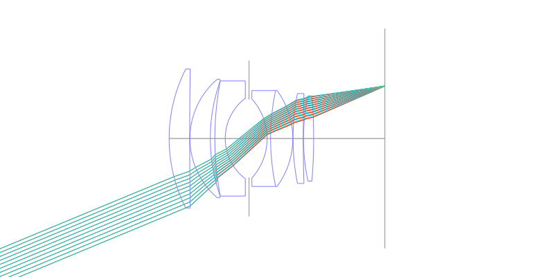
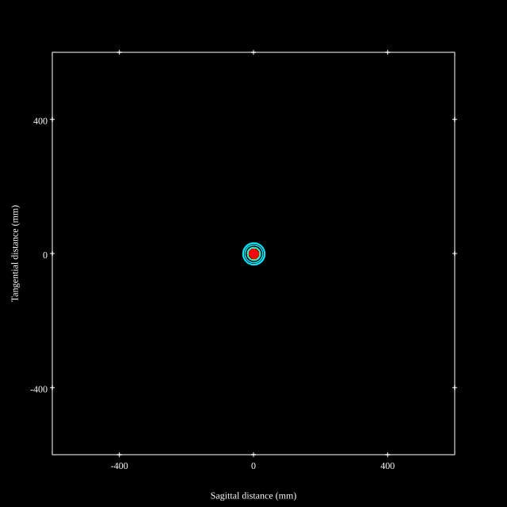
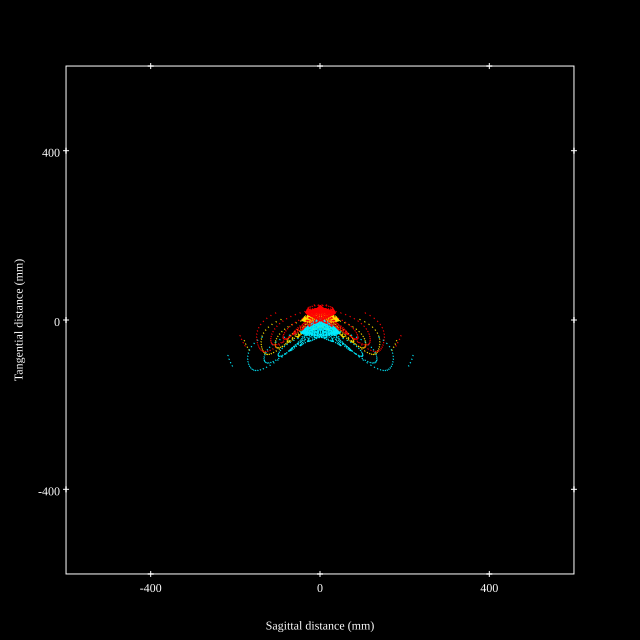
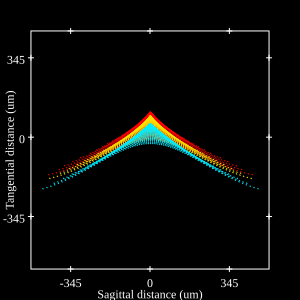
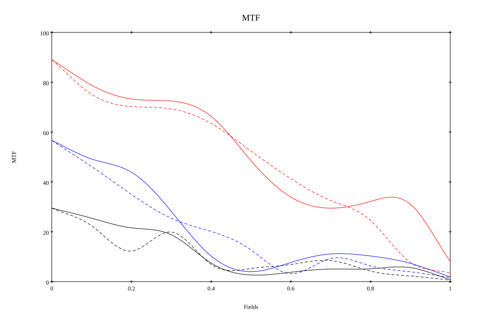
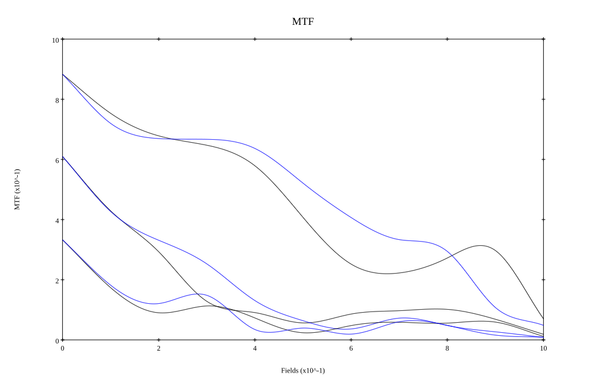

# Leica 50mm Noctilux-M f/1.0 Reverse Engineered
## Surface Data
Note that where glass types are shown the refractive index and abbe number is as per assigned glass type

| ID  | Radius | Thickness | Diameter | nd  | vd  | Glass Make | Glass |
| --- | ---    | ---       | ---      | --- | --- | ---        | ---   |
| 1 | 60.3967 | 8.071 | 54.57 | 1.6779 | 55.34 | Ohara | S-LAL12 |
| 2 | 1756.45 | 0.1 | 54.57 |  |  |  |
| 3 | 30.595 | 8.0 | 46.571 | 1.883 | 40.77 | Ohara | S-LAH58 |
| 4 | 67.879 | 1.7857 | 44.644 |  |  |  |
| 5 | 120.79 | 4.0714 | 45.214 | 1.7847 | 26.29 | Ohara | S-TIH23 |
| 6 | 19.787 | 9.35 | 31.6 |  |  |  |
| 7 | AS | 7.1 | 30.6 |  |  |  |
| 8 | -23.04 | 1.357 | 31.0 | 1.72825 | 28.46 | Ohara | S-TIH10 |
| 9 | 90.5275 | 8.7143 | 37.643 | 1.883 | 40.77 | Ohara | S-LAH58 |
| 10 | -31.779 | 0.1 | 37.714 |  |  |  |
| 11 | 90.4594 | 4.0 | 35.286 | 1.788 | 47.37 | Ohara | S-LAH64 |
| 12 | 549.4488 | 0.1 | 35.286 |  |  |  |
| 13 | 80.26486 | 4.0 | 33.429 | 1.788 | 47.37 | Ohara | S-LAH64 |
| 14 | -197.008 | 27.9565 | 33.429 |  |  |  |
## Layouts

## Spot Diagrams

## Paraxial Parameters
| parameter | value |
| ---       | ---   |
| effective_focal_length |52.177
| back_focal_length | 28
| optical_invariant | 10.806
| object_distance | 1.0E10
| image_distance | 28
| power | 0.019
| pp1_H | 49.716
| ppk_H' | -24.177
| ffl_F | -2.46
| fno | 1
| enp_dist_P | 42.576
| enp_radius | 26.088
| exp_dist_P' | -32.406
| exp_radius | 30.225
| m | -0
| red | -1.9165704016781798E8
| n_obj | 1
| n_img | 1
| img_ht | 21.612
| obj_ang | 22.5
| obj_na | 0
| img_na | -0.447|
## Spot Analysis
| Field | Spot Mean Radius | Spot Max Radius |
| ---   | ---              | ---             |
 | Field(x=0.0, y=0.0) | 11.695 | 32.944|
 | Field(x=0.0, y=0.1) | 23.429 | 114.662|
 | Field(x=0.0, y=0.2) | 33.047 | 149.254|
 | Field(x=0.0, y=0.3) | 28.166 | 147.211|
 | Field(x=0.0, y=0.4) | 27.31 | 113.656|
 | Field(x=0.0, y=0.5) | 30.284 | 108.443|
 | Field(x=0.0, y=0.6) | 39.294 | 162.359|
 | Field(x=0.0, y=0.7) | 53.504 | 233.993|
 | Field(x=0.0, y=0.8) | 73.035 | 337.388|
 | Field(x=0.0, y=0.9) | 101.835 | 438.751|
 | Field(x=0.0, y=1.0) | 137.628 | 500.881|
## Polychromatic Geometric MTF

* 10,30,50 cycles/mm
* Black lines represent sagittal, blue tangential
* To generate above, MTFs for wavelengths 587.5618(d), 486.1327(F), 656.2725(C) were calculated across 10 fields, and then averaged
## Polychromatic Geometric MTF (Weighted)

* 10,30,50 cycles/mm
* Black lines represent sagittal, blue tangential
* To generate above, MTFs for wavelengths 587.5618(d) wt(1.0), 656.2725(C) wt(0.475), 546.074(e) wt(0.98), 486.1327(F) wt(0.49), 435.8343(g) wt(0.15) were calculated across 10 fields, and then combined using weighted average
## Resources
* [OpticalBench Compatible Data File, tab delimited](./leica-noctilux-50mm-f1-11a.txt)
* [Zemax file](./leica-noctilux-50mm-f1-11a.zmx)
