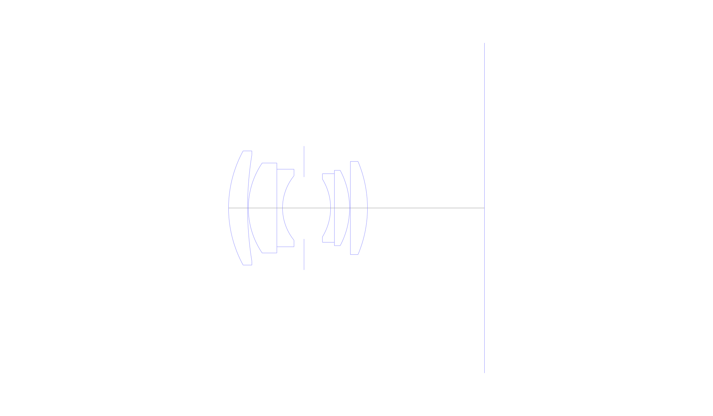
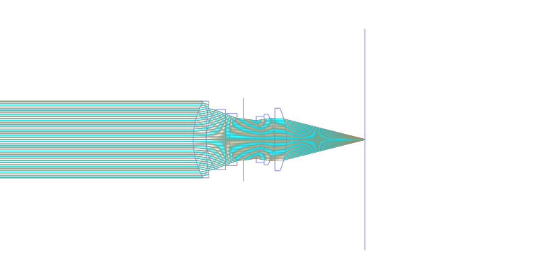
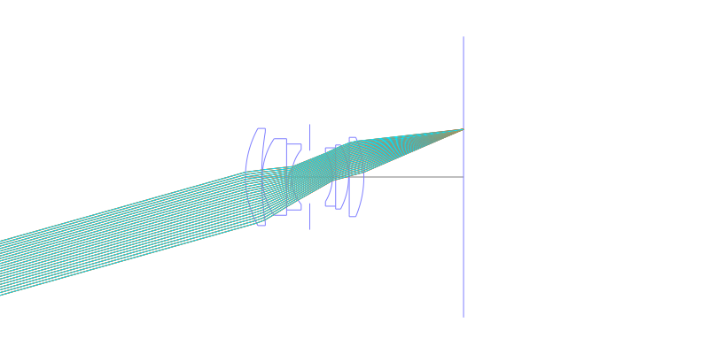
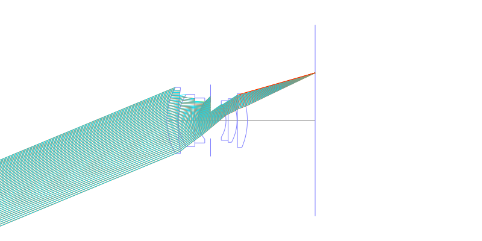
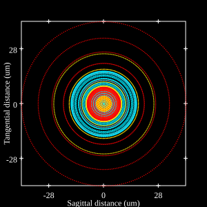
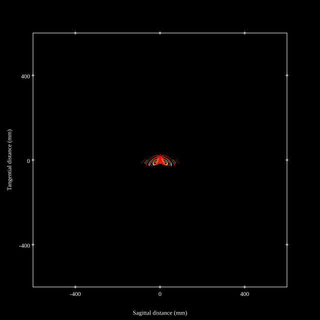
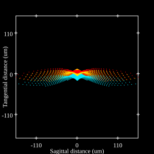
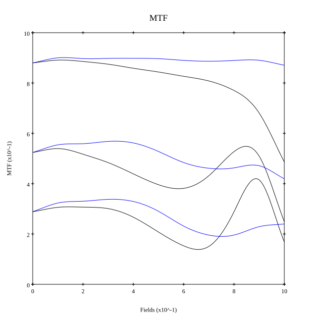

# Leica Summicron-M 50mm F2 v5
## Patent Information
| Country | Patent Number | Example | Year of Application | Inventors | Organisation | Link |
| ---     | ---           | ---     | ---                 | ---       | ---          | ---  |
|US | US4123144 | EX 9 | 1976 | Walter Mandler,Garry Edwards,Erich Wagner | Ernst Leitz Wetzlar GmbH | [link](https://patents.google.com/patent/US4123144A/en) |
## Surface Data
Note that where glass types are shown the refractive index and abbe number is as per assigned glass type

| ID  | Radius | Thickness | Diameter | nd  | vd  | Glass Make | Glass |
| --- | ---    | ---       | ---      | --- | --- | ---        | ---   |
| 1 | 31.17 | 4.98 | 29.88 | 1.788 | 47.49 | Schott | N-LAF21 |
| 2 | 87.0 | 0.2 | 27.8 |  |  |  |
| 3 | 20.96 | 7.46 | 23.54 | 1.66755 | 41.87 | Hikari | J-BASF6 |
| 4 | 0.0 | 1.49 | 20.29 | 1.72828 | 28.53 | Schott | N-SF10 |
| 5 | 13.35 | 5.62 | 16.85 |  |  |  |
| 6 | AS | 6.96 | 16.208 |  |  |  |
| 7 | -14.4 | 0.99 | 15.11 | 1.62588 | 35.72 | Hikari | J-F1 |
| 8 | 0.0 | 3.98 | 17.94 | 1.717 | 47.97 | Hikari | J-LAF3 |
| 9 | -20.96 | 0.2 | 19.7 |  |  |  |
| 10 | 0.0 | 4.48 | 23.12 | 1.717 | 47.97 | Hikari | J-LAF3 |
| 11 | -31.17 | 30.62 | 24.38 |  |  |  |
## Layouts

## Spot Diagrams

## Paraxial Parameters
| parameter | value |
| ---       | ---   |
| effective_focal_length |52.066
| back_focal_length | 30.709
| optical_invariant | 5.392
| object_distance | 1.0E10
| image_distance | 30.709
| power | 0.019
| pp1_H | 24.978
| ppk_H' | -21.357
| ffl_F | -27.088
| fno | 2
| enp_dist_P | 24.93
| enp_radius | 13.016
| exp_dist_P' | -21.315
| exp_radius | 13.028
| m | -0
| red | -1.9206501462489292E8
| n_obj | 1
| n_img | 1
| img_ht | 21.566
| obj_ang | 22.5
| obj_na | 0
| img_na | -0.243|
## Spot Analysis
| Field | Spot Mean Radius | Spot Max Radius |
| ---   | ---              | ---             |
 | Field(x=0.0, y=0.0) | 11.484 | 29.535|
 | Field(x=0.0, y=0.1) | 9.929 | 33.003|
 | Field(x=0.0, y=0.2) | 10.429 | 37.45|
 | Field(x=0.0, y=0.3) | 11.011 | 42.424|
 | Field(x=0.0, y=0.4) | 11.702 | 56.126|
 | Field(x=0.0, y=0.5) | 11.877 | 62.935|
 | Field(x=0.0, y=0.6) | 12.798 | 73.236|
 | Field(x=0.0, y=0.7) | 14.771 | 87.075|
 | Field(x=0.0, y=0.8) | 18.569 | 104.38|
 | Field(x=0.0, y=0.9) | 25.472 | 123.334|
 | Field(x=0.0, y=1.0) | 34.6 | 142.974|
## Geometric MTF

* 10,30,50 cycles/mm
* Black lines represent sagittal, blue tangential
## Resources
* [OpticalBench Compatible Data File, tab delimited](./US004123144_Example09P.txt)
* [Zemax file](./US004123144_Example09P.zmx)
