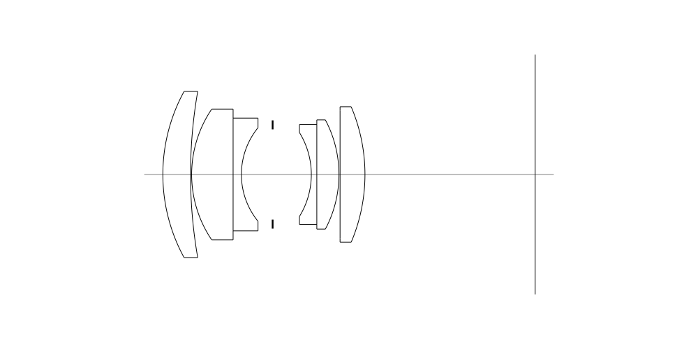
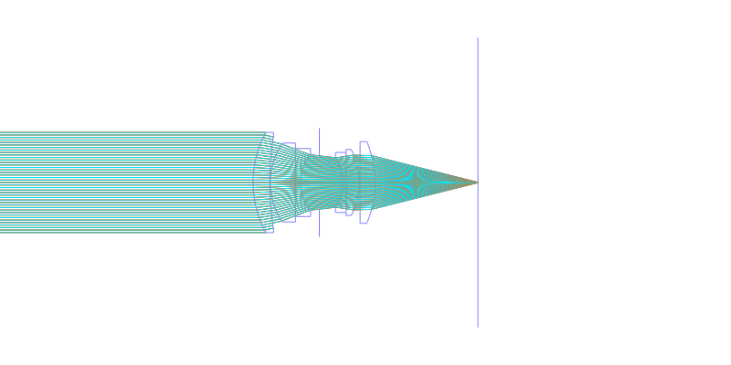
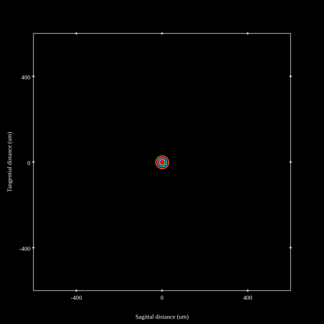
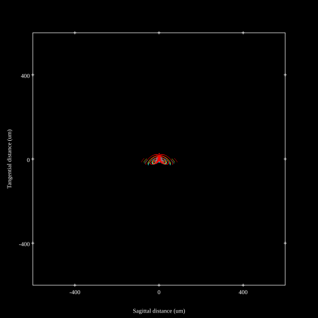
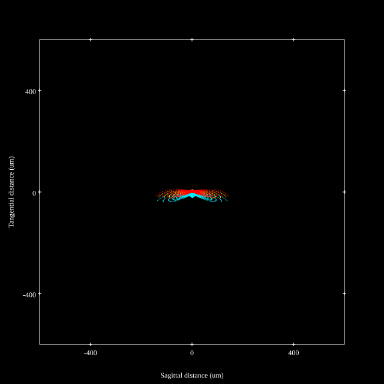
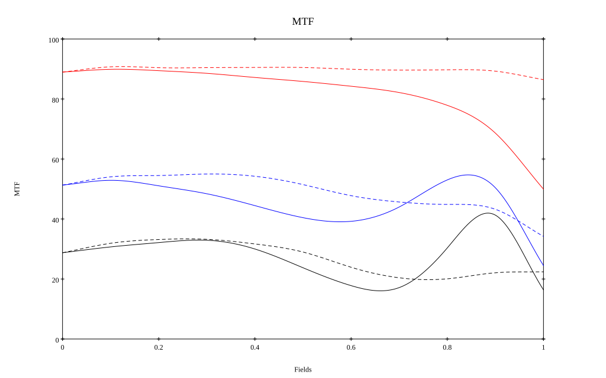
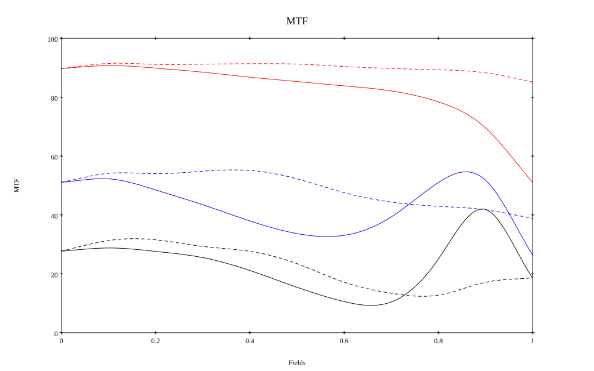

# Leica Summicron-M 50mm F2 v5
## Patent Information
| Country | Patent Number | Example | Year of Application | Inventors | Organisation | Link |
| ---     | ---           | ---     | ---                 | ---       | ---          | ---  |
|US | US4123144 | EX 9 | 1976 | Walter Mandler,Garry Edwards,Erich Wagner | Ernst Leitz Wetzlar GmbH | [link](https://patents.google.com/patent/US4123144A/en) |
## Surface Data
Note that where glass types are shown the refractive index and abbe number is as per assigned glass type

| ID  | Radius | Thickness | Diameter | nd  | vd  | Glass Make | Glass |
| --- | ---    | ---       | ---      | --- | --- | ---        | ---   |
| 1 | 31.17 | 4.98 | 29.88 | 1.788 | 47.49 | Schott | N-LAF21 |
| 2 | 87.0 | 0.2 | 27.7346 |  |  |  |
| 3 | 20.96 | 7.46 | 23.54 | 1.66755 | 41.93 | Hoya | BAFD6 |
| 4 | 0.0 | 1.49 | 20.29 | 1.72825 | 28.46 | Ohara | S-TIH10 |
| 5 | 13.35 | 5.62 | 16.8417 |  |  |  |
| 6 | AS | 6.96 | 16.2234 |  |  |  |
| 7 | -14.4 | 0.99 | 15.11 | 1.62588 | 35.74 | Hoya | E-F1 |
| 8 | 0.0 | 3.98 | 17.94 | 1.717 | 47.96 | Schott | LAF3 |
| 9 | -20.96 | 0.2 | 19.6339 |  |  |  |
| 10 | 0.0 | 4.48 | 23.0203 | 1.717 | 47.96 | Schott | LAF3 |
| 11 | -31.17 | 30.6176 | 24.38 |  |  |  |
## Layouts

## Spot Diagrams

## Paraxial Parameters
| parameter | value |
| ---       | ---   |
| effective_focal_length |52.064
| back_focal_length | 30.706
| optical_invariant | 5.391
| object_distance | 1.0E10
| image_distance | 30.706
| power | 0.019
| pp1_H | 24.977
| ppk_H' | -21.357
| ffl_F | -27.086
| fno | 2
| enp_dist_P | 24.93
| enp_radius | 13.016
| exp_dist_P' | -21.316
| exp_radius | 13.028
| m | -0
| red | -1.920727758380879E8
| n_obj | 1
| n_img | 1
| img_ht | 21.565
| obj_ang | 22.5
| obj_na | 0
| img_na | -0.25|
## Spot Analysis
| Field | Spot Mean Radius (µm) | Spot Max Radius (µm) |
| ---   | ---              | ---             |
 | Field(x=0.0, y=0.0) | 11.262 | 38.744|
 | Field(x=0.0, y=0.1) | 10.496 | 43.303|
 | Field(x=0.0, y=0.2) | 10.718 | 46.874|
 | Field(x=0.0, y=0.3) | 10.96 | 49.147|
 | Field(x=0.0, y=0.4) | 11.343 | 55.679|
 | Field(x=0.0, y=0.5) | 11.801 | 62.576|
 | Field(x=0.0, y=0.6) | 12.76 | 72.565|
 | Field(x=0.0, y=0.7) | 14.487 | 86.084|
 | Field(x=0.0, y=0.8) | 18.056 | 103.141|
 | Field(x=0.0, y=0.9) | 24.389 | 122.692|
 | Field(x=0.0, y=1.0) | 33.693 | 142.122|
## Polychromatic Geometric MTF

* 10=red,30=blue,50=black cycles/mm
* Solid lines represent sagittal, dashed lines tangential
* To generate above, MTFs for wavelengths 587.5618(d), 486.1327(F), 656.2725(C) were calculated across 10 fields, and then averaged
## Polychromatic Geometric MTF (Weighted)

* 10=red,30=blue,50=black cycles/mm
* Solid lines represent sagittal, dashed lines tangential
* To generate above, MTFs for wavelengths 587.5618(d) wt(1.0), 656.2725(C) wt(0.475), 546.074(e) wt(0.98), 486.1327(F) wt(0.49), 435.8343(g) wt(0.15) were calculated across 10 fields, and then combined using weighted average
## Resources
* [OpticalBench Compatible Data File, tab delimited](./prescription.txt)
* [Zemax file](./US004123144_Example09P.zmx)

Generated from `US004123144_Example09P.txt`, status **Accepted**

Report / Zemax file generated using [Beam42](https://github.com/BeamFour/Beam42) on 2026-10-04
