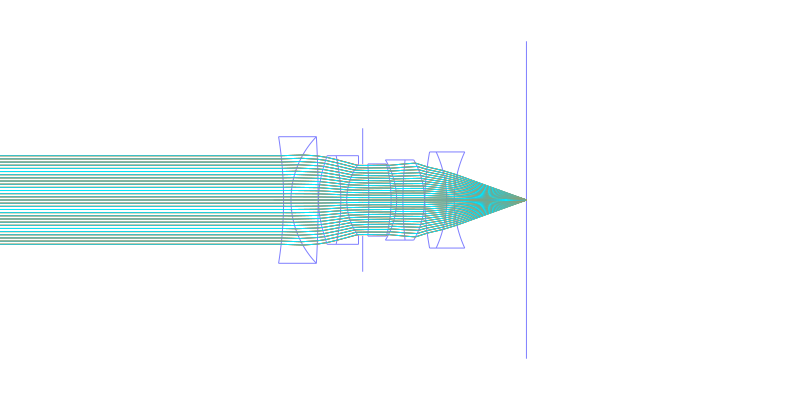
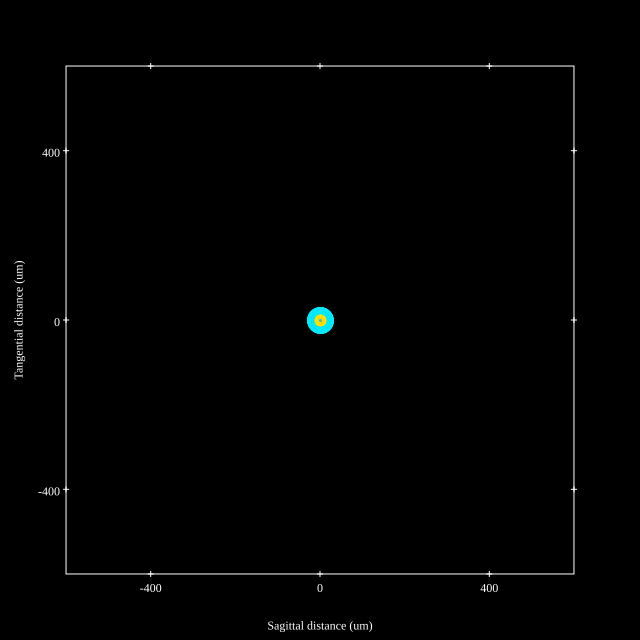
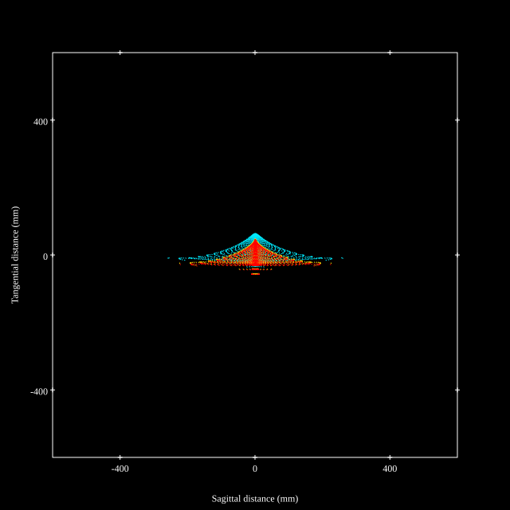
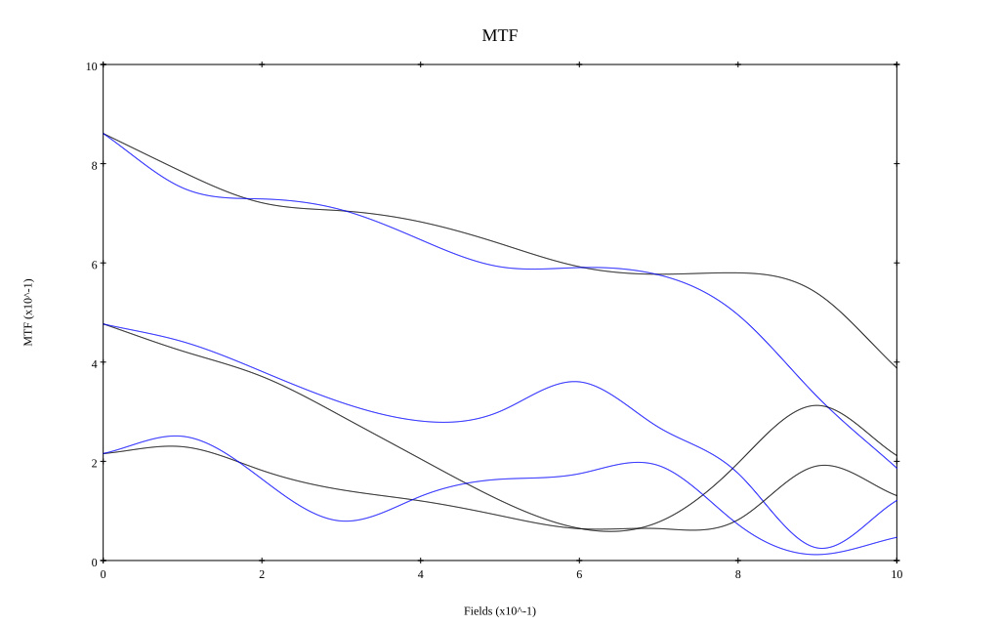
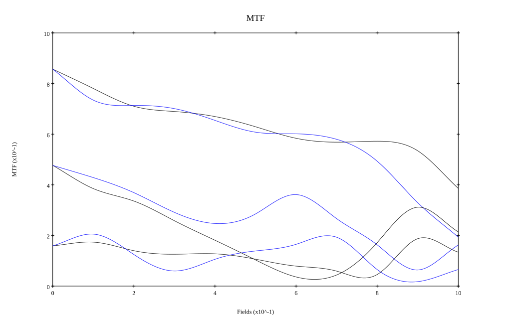

# Leica Summilux-M 35mm F1.4 Asph v1
## Patent Information
| Country | Patent Number | Example | Year of Application | Inventors | Organisation | Link |
| ---     | ---           | ---     | ---                 | ---       | ---          | ---  |
|US | US5161060A | EX 1 | 1990 | Walter Watz | Leica Camera AG | [link](https://patents.google.com/patent/US5161060A/en) |
## Surface Data
Note that where glass types are shown the refractive index and abbe number is as per assigned glass type

| ID  | Radius | Thickness | Diameter | nd  | vd  | Glass Make | Glass |
| --- | ---    | ---       | ---      | --- | --- | ---        | ---   |
| 1 | -110.114 | 2.01 | 34.45 | 1.50137 | 56.42 | Ohara | S-FTL10 |
| 2 | 24.92 | 7.4 | 34.45 | 1.816 | 46.62 | Ohara | S-LAH59 |
| 3 | -305.0 | 0.1 | 34.45 |  |  |  |
| 4 | 28.346 | 6.07 | 24.12 | 1.816 | 46.62 | Ohara | S-LAH59 |
| 5 | -57.56 | 1.61 | 24.12 | 1.68893 | 31.08 | Ohara | S-TIM28 |
| 6 | 16.624 | 4.34 | 19.61 |  |  |  |
| 7 | AS | 1.66 | 19.521 |  |  |  |
| 8 | -197.204 | 6.07 | 19.64 | 1.78831 | 47.47 | Schott | LAFN21 |
| 9 | -38.628 | 1.5 | 19.64 |  |  |  |
| 10 | -21.142 | 1.72 | 21.82 | 1.64769 | 33.79 | Ohara | S-TIM22 |
| 11 | 101.985 | 5.86 | 21.82 | 1.816 | 46.62 | Ohara | S-LAH59 |
| 12 | -21.905 | 0.11 | 21.82 |  |  |  |
| 13 | 60.026 | 5.94 | 26.16 | 1.816 | 46.62 | Ohara | S-LAH59 |
| 14 | -31.325 | 2.05 | 26.16 | 1.62004 | 36.26 | Ohara | S-TIM2 |
| 15 | 31.325 | 19.659 | 26.16 |  |  |  |
## Aspherical Data
| ID  | k   | P1  | P2  | P3  | P3 | P5 | P6 | P7 | P8 | P9 | P10 |
| --- | --- | --- | --- | --- | --- | --- | --- | --- | --- | --- | --- |
| 4 | 0.0 | 0.0 | -1.01662E-5 | -3.85859E-8 | -5.57379E-12 | 0.0 | 0.0 | 0.0 | 0.0 | 0.0 | 0.0 |
| 13 | 0.0 | 0.0 | -5.31166E-6 | -6.51374E-9 | 3.61001E-11 | 0.0 | 0.0 | 0.0 | 0.0 | 0.0 | 0.0 |
## Layouts

## Spot Diagrams

## Paraxial Parameters
| parameter | value |
| ---       | ---   |
| effective_focal_length |35.423
| back_focal_length | 19.654
| optical_invariant | 7.905
| object_distance | 1.0E10
| image_distance | 19.654
| power | 0.028
| pp1_H | 21.022
| ppk_H' | -15.768
| ffl_F | -14.4
| fno | 1.4
| enp_dist_P | 18.085
| enp_radius | 12.651
| exp_dist_P' | -18.976
| exp_radius | 13.795
| m | -0
| red | -2.8230590056645954E8
| n_obj | 1
| n_img | 1
| img_ht | 22.134
| obj_ang | 32
| obj_na | 0
| img_na | -0.336|
## Spot Analysis
| Field | Spot Mean Radius | Spot Max Radius |
| ---   | ---              | ---             |
 | Field(x=0.0, y=0.0) | 11.931 | 29.68|
 | Field(x=0.0, y=0.1) | 17.594 | 88.45|
 | Field(x=0.0, y=0.2) | 22.237 | 112.464|
 | Field(x=0.0, y=0.3) | 23.464 | 104.591|
 | Field(x=0.0, y=0.4) | 24.689 | 105.975|
 | Field(x=0.0, y=0.5) | 26.726 | 116.319|
 | Field(x=0.0, y=0.6) | 29.77 | 130.097|
 | Field(x=0.0, y=0.7) | 33.011 | 148.973|
 | Field(x=0.0, y=0.8) | 39.933 | 175.251|
 | Field(x=0.0, y=0.9) | 50.753 | 231.001|
 | Field(x=0.0, y=1.0) | 65.041 | 258.946|
## Polychromatic Geometric MTF

* 10,30,50 cycles/mm
* Black lines represent sagittal, blue tangential
* To generate above, MTFs for wavelengths 587.5618(d), 486.1327(F), 656.2725(C) were calculated across 10 fields, and then averaged
## Polychromatic Geometric MTF (Weighted)

* 10,30,50 cycles/mm
* Black lines represent sagittal, blue tangential
* To generate above, MTFs for wavelengths 587.5618(d) wt(1.0), 656.2725(C) wt(0.475), 546.074(e) wt(0.98), 486.1327(F) wt(0.49), 435.8343(g) wt(0.15) were calculated across 10 fields, and then combined using weighted average
## Resources
* [OpticalBench Compatible Data File, tab delimited](./US005161060_Example01.txt)
* [Zemax file](./US005161060_Example01.zmx)
