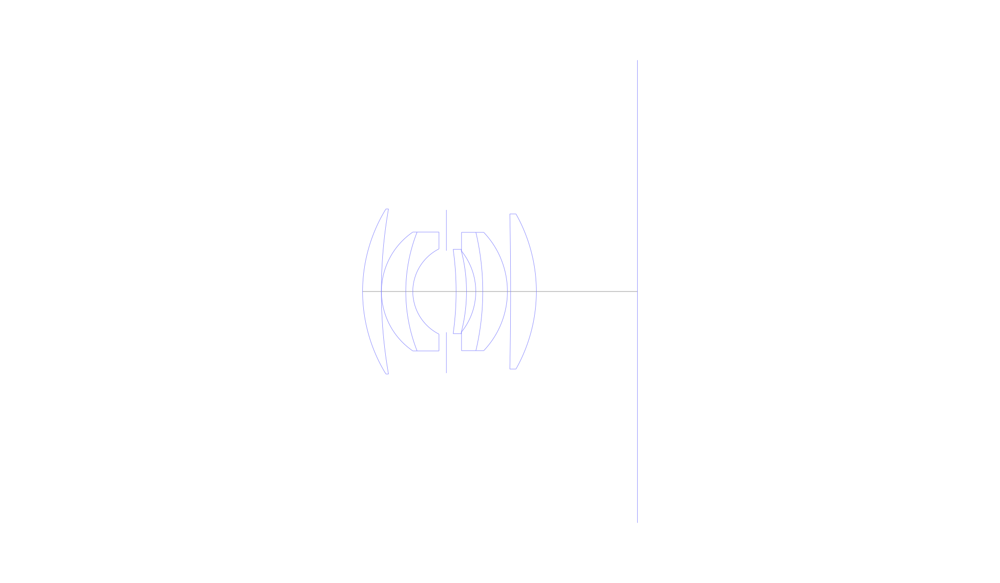
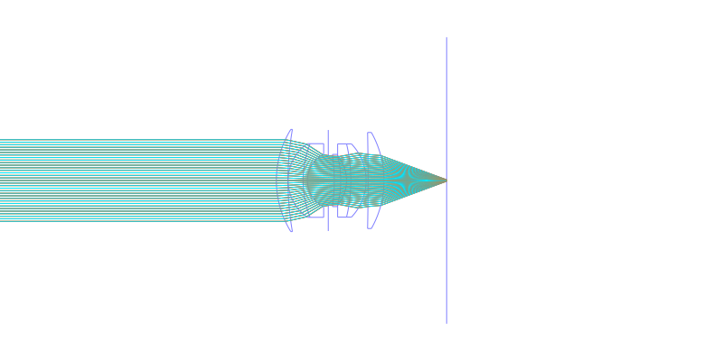
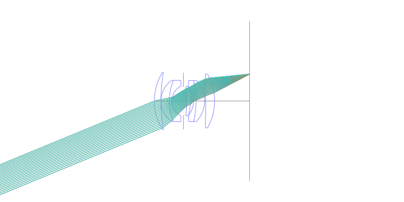
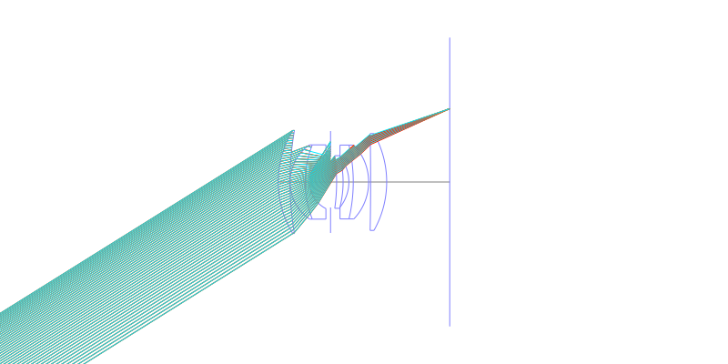
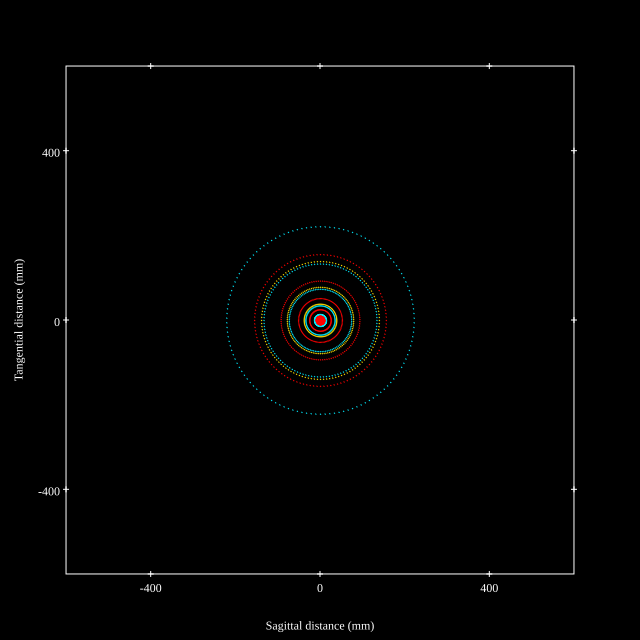
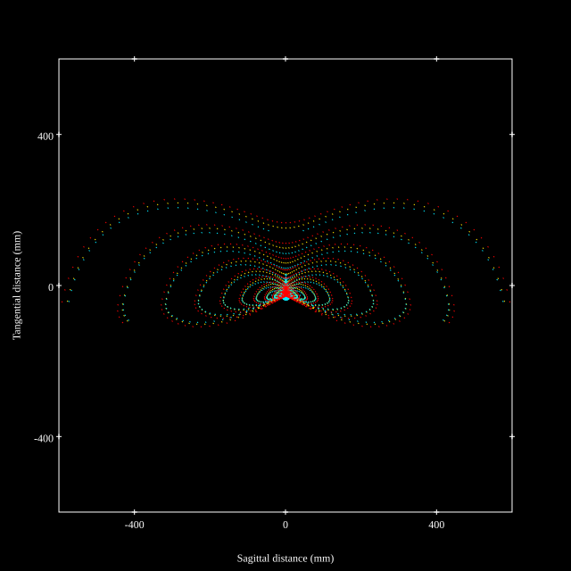
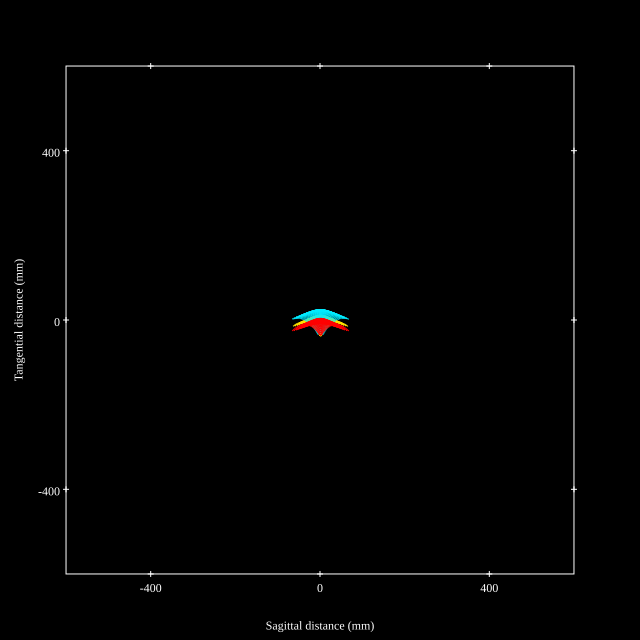
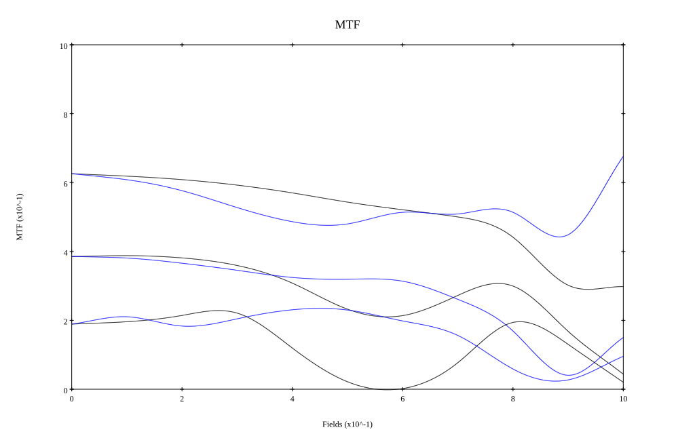
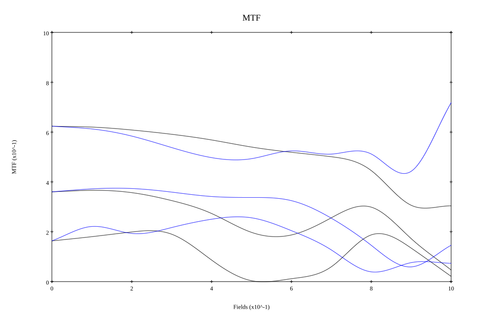

# Leica Summilux-M 35mm f1.4 v1 Pre-asph
## Patent Information
| Country | Patent Number | Example | Year of Application | Inventors | Organisation | Link |
| ---     | ---           | ---     | ---                 | ---       | ---          | ---  |
|US | US2975673A | EX 1 | 1959 | Walter Mandler | Ernst Leitz Canada Ltd   | [link](https://patents.google.com/patent/US2975673A/en) |
## Surface Data
Note that where glass types are shown the refractive index and abbe number is as per assigned glass type

| ID  | Radius | Thickness | Diameter | nd  | vd  | Glass Make | Glass |
| --- | ---    | ---       | ---      | --- | --- | ---        | ---   |
| 1 | 29.45985 | 3.5 | 30.82 | 1.72003 | 50.62 | Schott | N-LAK10 |
| 2 | 89.9115 | 0.021 | 30.82 |  |  |  |
| 3 | 13.447 | 4.5395 | 22.21 | 1.788 | 47.49 | Schott | N-LAF21 |
| 4 | 30.2365 | 1.309 | 22.21 | 1.69895 | 30.07 | Schott | SF15 |
| 5 | 8.932 | 6.269 | 15.92 |  |  |  |
| 6 | AS | 1.8125 | 15.232 |  |  |  |
| 7 | -56.2695 | 1.939 | 15.74 | 1.788 | 47.49 | Schott | N-LAF21 |
| 8 | -30.2365 | 1.729 | 15.12 |  |  |  |
| 9 | -12.068 | 1.309 | 15.12 | 1.7552 | 27.51 | Ohara | S-TIH4 |
| 10 | -47.999 | 4.599 | 22.09 | 1.788 | 47.49 | Schott | N-LAF21 |
| 11 | -16.0125 | 0.5985 | 22.09 |  |  |  |
| 12 | -700.0 | 4.7985 | 28.97 | 1.717 | 47.93 | Ohara | S-LAM3 |
| 13 | -29.4595 | 18.86 | 28.97 |  |  |  |
## Layouts

## Spot Diagrams

## Paraxial Parameters
| parameter | value |
| ---       | ---   |
| effective_focal_length |35.048
| back_focal_length | 18.979
| optical_invariant | 7.822
| object_distance | 1.0E10
| image_distance | 18.979
| power | 0.029
| pp1_H | 25.672
| ppk_H' | -16.069
| ffl_F | -9.376
| fno | 1.4
| enp_dist_P | 21.262
| enp_radius | 12.517
| exp_dist_P' | -20.995
| exp_radius | 14.319
| m | -0
| red | -2.853237083795918E8
| n_obj | 1
| n_img | 1
| img_ht | 21.9
| obj_ang | 32
| obj_na | 0
| img_na | -0.336|
## Spot Analysis
| Field | Spot Mean Radius | Spot Max Radius |
| ---   | ---              | ---             |
 | Field(x=0.0, y=0.0) | 65.256 | 221.419|
 | Field(x=0.0, y=0.1) | 82.051 | 331.404|
 | Field(x=0.0, y=0.2) | 101.215 | 396.487|
 | Field(x=0.0, y=0.3) | 117.456 | 445.705|
 | Field(x=0.0, y=0.4) | 130.269 | 471.852|
 | Field(x=0.0, y=0.5) | 139.111 | 489.795|
 | Field(x=0.0, y=0.6) | 141.041 | 548.484|
 | Field(x=0.0, y=0.7) | 136.992 | 594.29|
 | Field(x=0.0, y=0.8) | 129.729 | 585.758|
 | Field(x=0.0, y=0.9) | 113.987 | 480.985|
 | Field(x=0.0, y=1.0) | 27.021 | 69.791|
## Polychromatic Geometric MTF

* 10,30,50 cycles/mm
* Black lines represent sagittal, blue tangential
* To generate above, MTFs for wavelengths 587.5618(d), 486.1327(F), 656.2725(C) were calculated across 10 fields, and then averaged
## Polychromatic Geometric MTF (Weighted)

* 10,30,50 cycles/mm
* Black lines represent sagittal, blue tangential
* To generate above, MTFs for wavelengths 587.5618(d) wt(1.0), 656.2725(C) wt(0.475), 546.074(e) wt(0.98), 486.1327(F) wt(0.49), 435.8343(g) wt(0.15) were calculated across 10 fields, and then combined using weighted average
## Resources
* [OpticalBench Compatible Data File, tab delimited](./FR1233449_Example01.txt)
* [Zemax file](./FR1233449_Example01.zmx)
