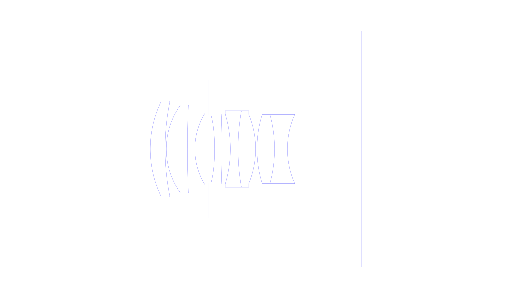
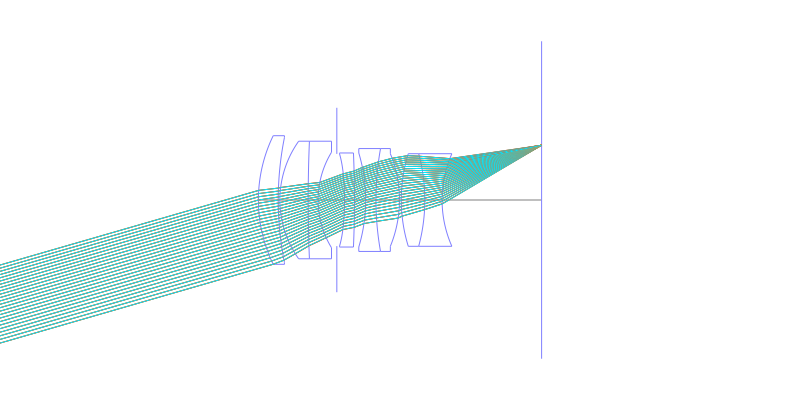
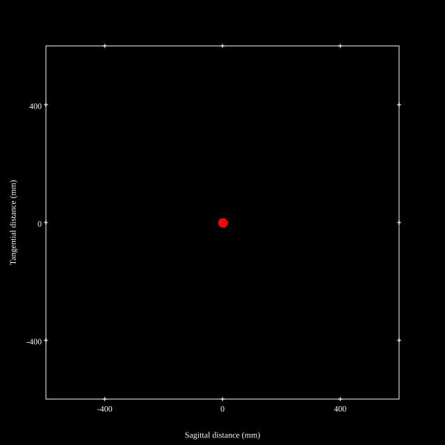
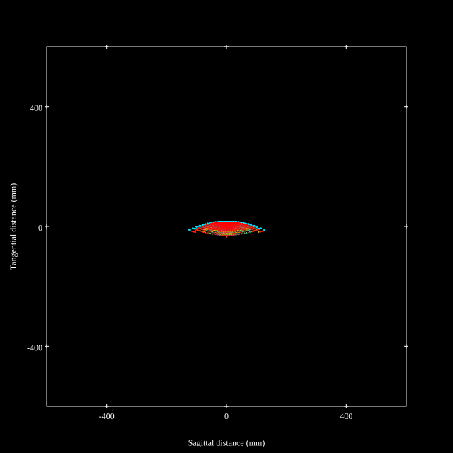
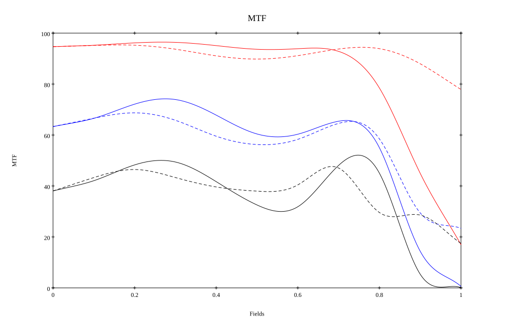
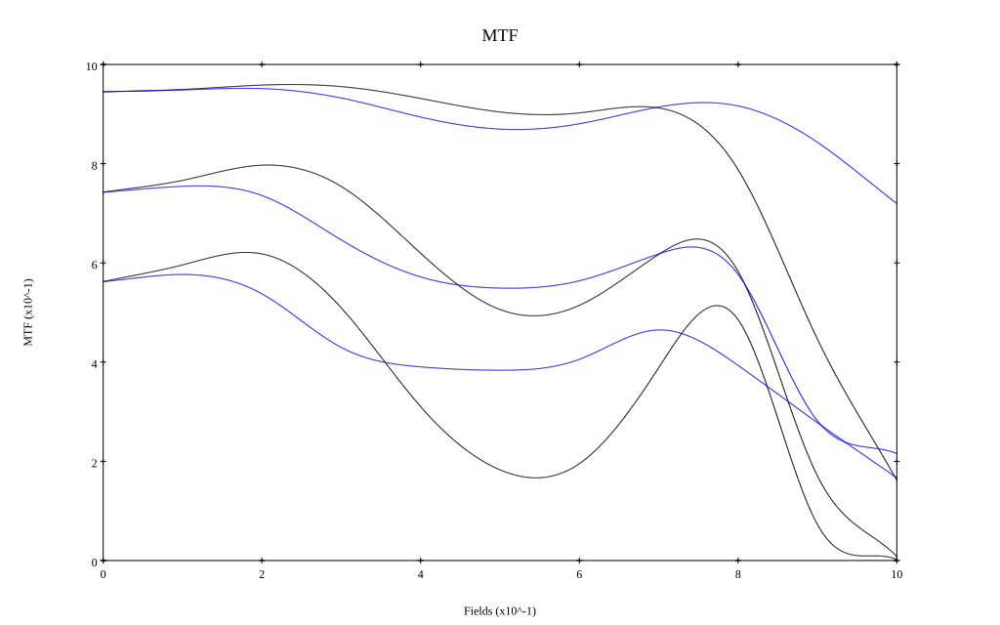

# Leica Summilux M 50mm f/1.4 ASPH Reverse Engineered by [Zhong Fu](https://zhuanlan.zhihu.com/p/1993381678270415416)
## Patent Information
| Country | Patent Number | Example | Year of Application | Inventors | Organisation | Link |
| ---     | ---           | ---     | ---                 | ---       | ---          | ---  |
|US | US7102834B2 | EX 2 | 2004 | Peter Karbe | Leica Camera AG | [link](https://patents.google.com/patent/US7102834B2/en) |
## Surface Data
Note that where glass types are shown the refractive index and abbe number is as per assigned glass type

| ID  | Radius | Thickness | Diameter | nd  | vd  | Glass Make | Glass |
| --- | ---    | ---       | ---      | --- | --- | ---        | ---   |
| 1 | 40.0 | 5.4 | 35.0 | 1.883 | 40.77 | Ohara | S-LAH58 |
| 2 | 86.535 | 0.45 | 34.0 |  |  |  |
| 3 | 27.604 | 7.7 | 32.0 | 1.43875 | 94.95 | Ohara | S-FPL53 |
| 4 | 377.865 | 2.7 | 32.0 | 1.738 | 32.26 | Ohara | S-NBH53 |
| 5 | 24.98 | 5.096 | 26.0 |  |  |  |
| 6 | AS | 2.098 | 25.097 |  |  |  |
| 7 | -82.758 | 2.7 | 25.2 | 1.68948 | 31.02 | Ohara | L-TIM28 |
| 8 | -300.0 | 3.05 | 25.6 |  |  |  |
| 9 | -44.718 | 2.8 | 25.6 | 1.57501 | 41.51 | Ohara | S-TIL27 |
| 10 | 79.408 | 6.4 | 27.5 | 1.883 | 40.77 | Ohara | S-LAH58 |
| 11 | -33.217 | 0.5 | 28.0 |  |  |  |
| 12 | 42.758 | 6.4 | 25.2 | 1.883 | 40.77 | Ohara | S-LAH58 |
| 13 | -48.287 | 4.7 | 25.2 | 1.72151 | 29.23 | Ohara | S-TIH18 |
| 14 | 31.181 | 27.086 | 25.2 |  |  |  |
## Aspherical Data
| ID  | Type | k   | P1 | P2 | P3 | P4 |
| --- | --- | --- | --- | --- | --- | --- |
| 7| EVEN | 0.0 | 0.0 | -1.421206138330734E-5 | -1.084455811486651E-8 | -4.952809894726529E-12 |
## Layouts

## Spot Diagrams

## Paraxial Parameters
| parameter | value |
| ---       | ---   |
| effective_focal_length |51.638
| back_focal_length | 27.154
| optical_invariant | 7.305
| object_distance | 1.0E10
| image_distance | 27.154
| power | 0.019
| pp1_H | 18.11
| ppk_H' | -24.484
| ffl_F | -33.528
| fno | 1.5
| enp_dist_P | 23.241
| enp_radius | 17.21
| exp_dist_P' | -19.749
| exp_radius | 15.654
| m | -0
| red | -1.9365569327809468E8
| n_obj | 1
| n_img | 1
| img_ht | 21.919
| obj_ang | 23
| obj_na | 0
| img_na | -0.316|
## Spot Analysis
| Field | Spot Mean Radius | Spot Max Radius |
| ---   | ---              | ---             |
 | Field(x=0.0, y=0.0) | 7.528 | 13.412|
 | Field(x=0.0, y=0.1) | 7.036 | 19.141|
 | Field(x=0.0, y=0.2) | 6.402 | 26.971|
 | Field(x=0.0, y=0.3) | 6.966 | 33.933|
 | Field(x=0.0, y=0.4) | 8.474 | 37.38|
 | Field(x=0.0, y=0.5) | 9.494 | 36.28|
 | Field(x=0.0, y=0.6) | 8.882 | 33.469|
 | Field(x=0.0, y=0.7) | 8.458 | 29.25|
 | Field(x=0.0, y=0.8) | 13.778 | 55.028|
 | Field(x=0.0, y=0.9) | 26.288 | 88.294|
 | Field(x=0.0, y=1.0) | 44.183 | 127.826|
## Polychromatic Geometric MTF

* 10=red,30=blue,50=black cycles/mm
* Solid lines represent sagittal, dashed lines tangential
* To generate above, MTFs for wavelengths 587.5618(d), 486.1327(F), 656.2725(C) were calculated across 10 fields, and then averaged
## Polychromatic Geometric MTF (Weighted)

* 10=red,30=blue,50=black cycles/mm
* Solid lines represent sagittal, dashed lines tangential
* To generate above, MTFs for wavelengths 587.5618(d) wt(1.0), 656.2725(C) wt(0.475), 546.074(e) wt(0.98), 486.1327(F) wt(0.49), 435.8343(g) wt(0.15) were calculated across 10 fields, and then combined using weighted average
## Resources
* [OpticalBench Compatible Data File, tab delimited](./prescription.txt)
* [Zemax file](./specs.zmx)

Report / Zemax file generated using [Beam42](https://github.com/BeamFour/Beam42) on 2026-07-08
