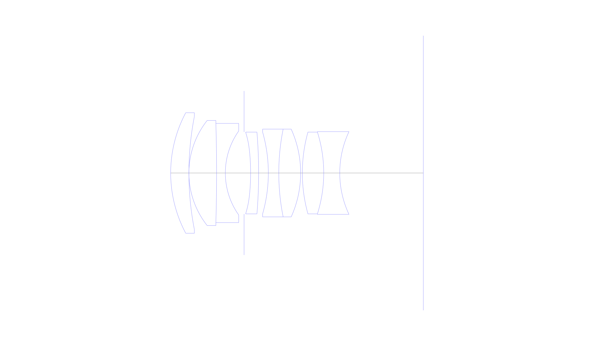
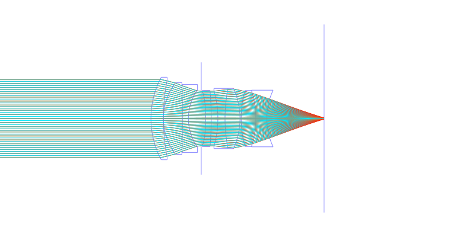
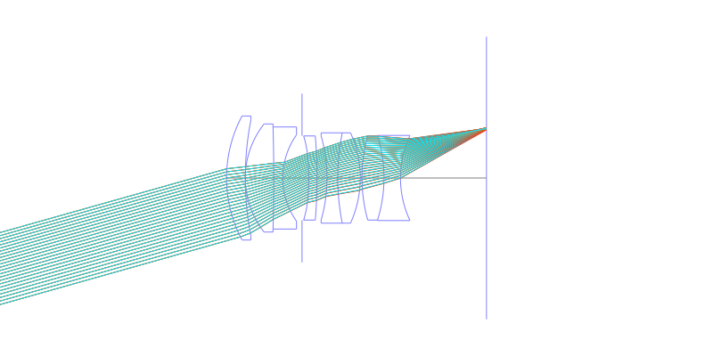
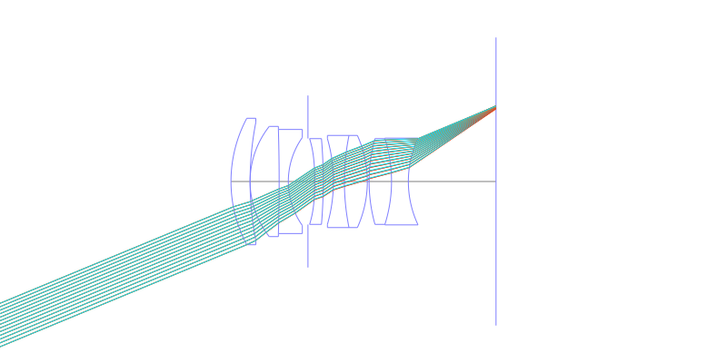
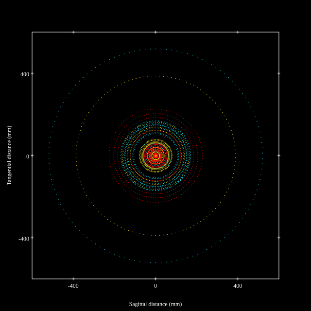
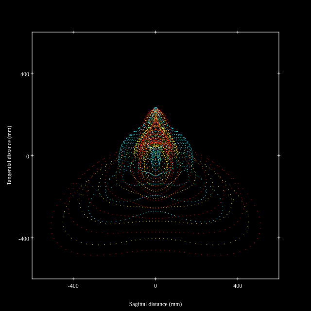
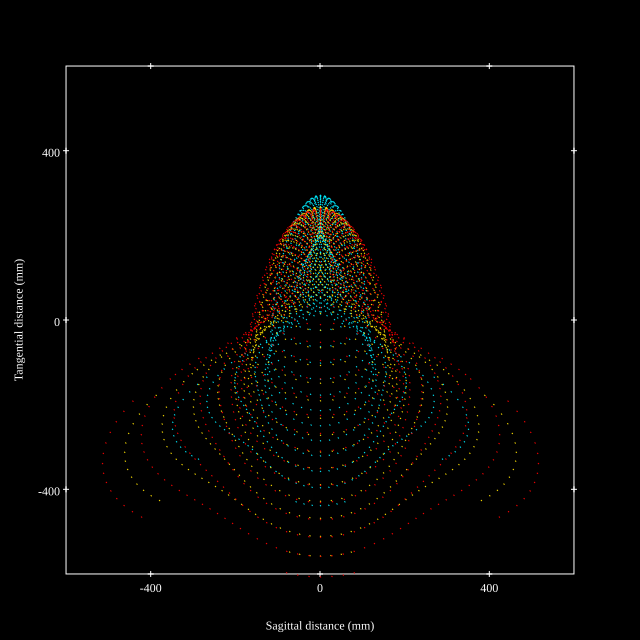
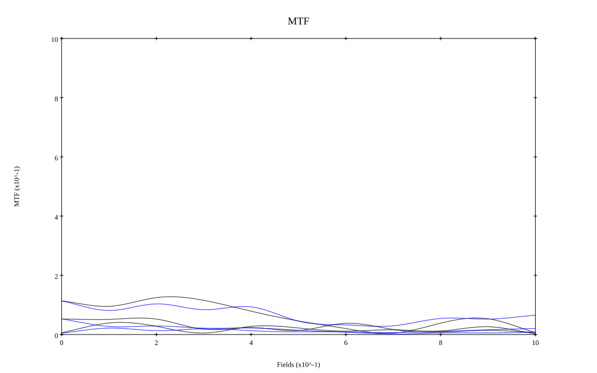

## Surface Data
Note that where glass types are shown the refractive index and abbe number is as per assigned glass type

| ID  | Radius | Thickness | Diameter | nd  | vd  | Glass Make | Glass |
| --- | ---    | ---       | ---      | --- | --- | ---        | ---   |
| 1 | 40.35 | 5.725 | 37.93 | 1.883 | 40.77 | Ohara | S-LAH58 |
| 2 | 92.64 | 0.0 | 35.49 |  |  |  |
| 3 | 26.68 | 8.7 | 33.05 | 1.497 | 81.55 | Ohara | S-FPL51 |
| 4 | -532.104 | 2.748 | 31.217 | 1.755 | 52.32 | Ohara | S-LAH97 |
| 5 | 22.866 | 5.88 | 26.4 |  |  |  |
| 6 | AS | 2.06 | 25.798 |  |  |  |
| 7 | -68.33 | 2.5187 | 25.722 | 1.59201 | 67.02 | Hoya | M-PCD51 |
| 8 | -155.056 | 3.05 | 25.722 |  |  |  |
| 9 | -46.9 | 3.282 | 25.722 | 1.64769 | 33.79 | Ohara | S-TIM22 |
| 10 | 70.145 | 6.869 | 27.63 | 1.816 | 46.62 | Ohara | S-LAH59 |
| 11 | -33.546 | 0.534 | 27.63 |  |  |  |
| 12 | 47.987 | 6.716 | 25.722 | 1.883 | 40.77 | Ohara | S-LAH58 |
| 13 | -42.666 | 5.037 | 25.722 | 1.62588 | 35.7 | Ohara | S-TIM1 |
| 14 | 30.645 | 26.256 | 26.026 |  |  |  |
## Aspherical Data
| ID  | k   | P1  | P2  | P3  | P3 | P5 | P6 | P7 | P8 | P9 | P10 |
| --- | --- | --- | --- | --- | --- | --- | --- | --- | --- | --- | --- |
| 7 | -3.597218355277422 | 0.0 | 6.661312905859716E-6 | -2.516750911152532E-7 | 7.694444188966551E-10 | 0.0 | 0.0 | 0.0 | 0.0 | 0.0 | 0.0 |
## Layouts

## Spot Diagrams

## Paraxial Parameters
| parameter | value |
| ---       | ---   |
| effective_focal_length |55.288
| back_focal_length | 27.13
| optical_invariant | 8.179
| object_distance | 1.0E10
| image_distance | 27.13
| power | 0.018
| pp1_H | 19.516
| ppk_H' | -28.158
| ffl_F | -35.772
| fno | 1.4
| enp_dist_P | 26.733
| enp_radius | 19.746
| exp_dist_P' | -20.9
| exp_radius | 17.466
| m | -0
| red | -1.8087042361937463E8
| n_obj | 1
| n_img | 1
| img_ht | 22.901
| obj_ang | 22.5
| obj_na | 0
| img_na | -0.336|
## Spot Analysis
| Field | Spot Mean Radius | Spot Max Radius |
| ---   | ---              | ---             |
 | Field(x=0.0, y=0.0) | 151.332 | 519.349|
 | Field(x=0.0, y=0.1) | 120.557 | 516.358|
 | Field(x=0.0, y=0.2) | 125.385 | 486.222|
 | Field(x=0.0, y=0.3) | 140.027 | 482.688|
 | Field(x=0.0, y=0.4) | 154.104 | 538.863|
 | Field(x=0.0, y=0.5) | 168.456 | 621.557|
 | Field(x=0.0, y=0.6) | 178.165 | 617.826|
 | Field(x=0.0, y=0.7) | 189.64 | 639.321|
 | Field(x=0.0, y=0.8) | 204.861 | 660.152|
 | Field(x=0.0, y=0.9) | 223.896 | 724.957|
 | Field(x=0.0, y=1.0) | 242.725 | 639.274|
## Geometric MTF

* 10,30,50 cycles/mm
* Black lines represent sagittal, blue tangential
## Resources
* [OpticalBench Compatible Data File, tab delimited](specs.txt)
* [Zemax file](specs.zmx)
