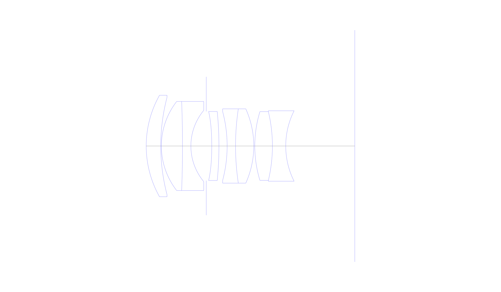
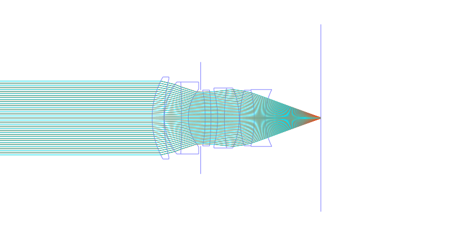
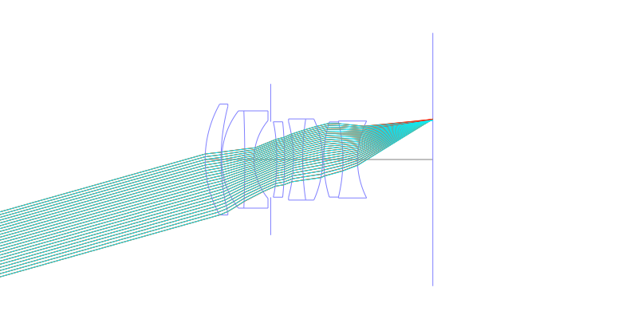
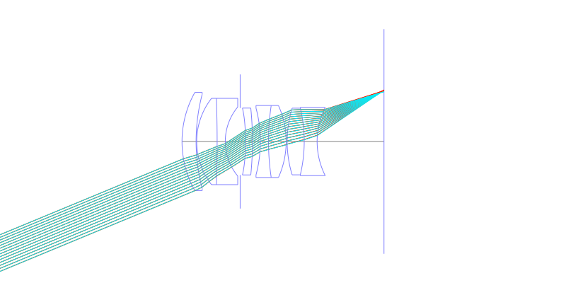
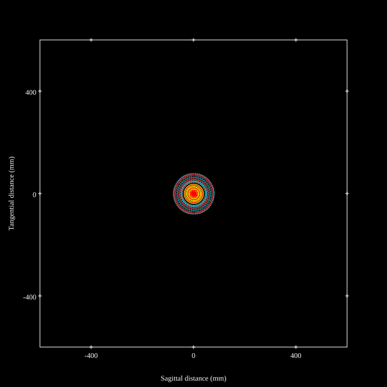
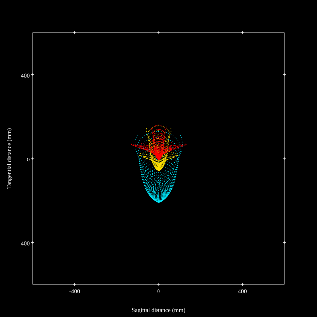
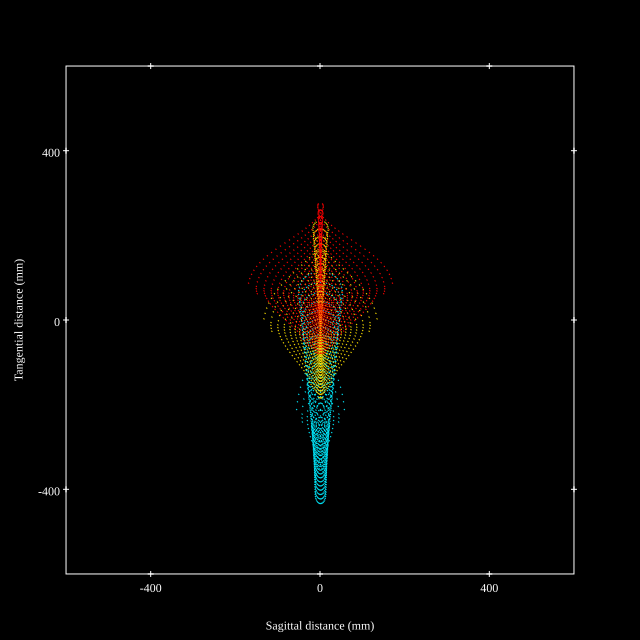
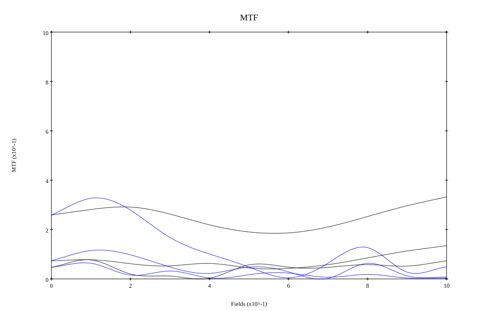

## Surface Data
Note that where glass types are shown the refractive index and abbe number is as per assigned glass type

| ID  | Radius | Thickness | Diameter | nd  | vd  | Glass Make | Glass |
| --- | ---    | ---       | ---      | --- | --- | ---        | ---   |
| 1 | 38.61175089649498 | 5.419 | 37.86 | 2.001 | 29.14 | Ohara | S-LAH99 |
| 2 | 71.67484973973518 | 0.229 | 36.25 |  |  |  |
| 3 | 27.034556728043963 | 7.86 | 33.2 | 1.55032 | 75.5 | Hoya | FCD705 |
| 4 | -451.4837532253834 | 3.13 | 33.2 | 1.80518 | 25.43 | Ohara | S-TIH6 |
| 5 | 20.780753000422255 | 5.724 | 26.56 |  |  |  |
| 6 | AS | 2.06 | 25.798 |  |  |  |
| 7 | -95.7484048443491 | 2.67 | 25.722 | 1.77377 | 47.17 | Hoya | M-TAF401 |
| 8 | -129.54767219620743 | 3.05 | 25.722 |  |  |  |
| 9 | -49.99151111906672 | 3.13 | 25.722 | 1.65412 | 39.7 | Schott | N-KZFS5 |
| 10 | 93.00230355415377 | 6.793 | 27.7 | 1.7725 | 49.6 | Ohara | S-LAH66 |
| 11 | -33.68364128620546 | 0.382 | 27.7 |  |  |  |
| 12 | 43.96353405327512 | 6.564 | 25.645 | 2.001 | 29.14 | Ohara | S-LAH99 |
| 13 | -55.02868625271962 | 4.961 | 25.645 | 1.60342 | 38.03 | Ohara | S-TIM5 |
| 14 | 29.20123758836076 | 25.722 | 26.256 |  |  |  |
## Aspherical Data
| ID  | k   | P1  | P2  | P3  | P3 | P5 | P6 | P7 | P8 | P9 | P10 |
| --- | --- | --- | --- | --- | --- | --- | --- | --- | --- | --- | --- |
| 7 | 2.6359255895449847 | 0.0 | -1.0453548542009024E-5 | -5.493324717818398E-9 | 1.281850884658716E-11 | 1.4557965556884694E-14 | 3.064259271481833E-16 | 4.816768447913648E-20 | 0.0 | 0.0 | 0.0 |
## Layouts

## Spot Diagrams

## Paraxial Parameters
| parameter | value |
| ---       | ---   |
| effective_focal_length |48.835
| back_focal_length | 25.473
| optical_invariant | 7.224
| object_distance | 1.0E10
| image_distance | 25.473
| power | 0.02
| pp1_H | 24.36
| ppk_H' | -23.362
| ffl_F | -24.475
| fno | 1.4
| enp_dist_P | 25.184
| enp_radius | 17.441
| exp_dist_P' | -22.8
| exp_radius | 17.151
| m | -0
| red | -2.0477255021575314E8
| n_obj | 1
| n_img | 1
| img_ht | 20.228
| obj_ang | 22.5
| obj_na | 0
| img_na | -0.336|
## Spot Analysis
| Field | Spot Mean Radius | Spot Max Radius |
| ---   | ---              | ---             |
 | Field(x=0.0, y=0.0) | 46.748 | 79.812|
 | Field(x=0.0, y=0.1) | 50.903 | 133.989|
 | Field(x=0.0, y=0.2) | 57.413 | 156.637|
 | Field(x=0.0, y=0.3) | 65.137 | 175.054|
 | Field(x=0.0, y=0.4) | 72.514 | 178.391|
 | Field(x=0.0, y=0.5) | 78.792 | 173.898|
 | Field(x=0.0, y=0.6) | 86.541 | 174.04|
 | Field(x=0.0, y=0.7) | 97.207 | 207.436|
 | Field(x=0.0, y=0.8) | 114.032 | 271.942|
 | Field(x=0.0, y=0.9) | 136.27 | 347.415|
 | Field(x=0.0, y=1.0) | 167.83 | 432.441|
## Geometric MTF

* 10,30,50 cycles/mm
* Black lines represent sagittal, blue tangential
## Resources
* [OpticalBench Compatible Data File, tab delimited](./specs2.txt)
* [Zemax file](./specs2.zmx)
