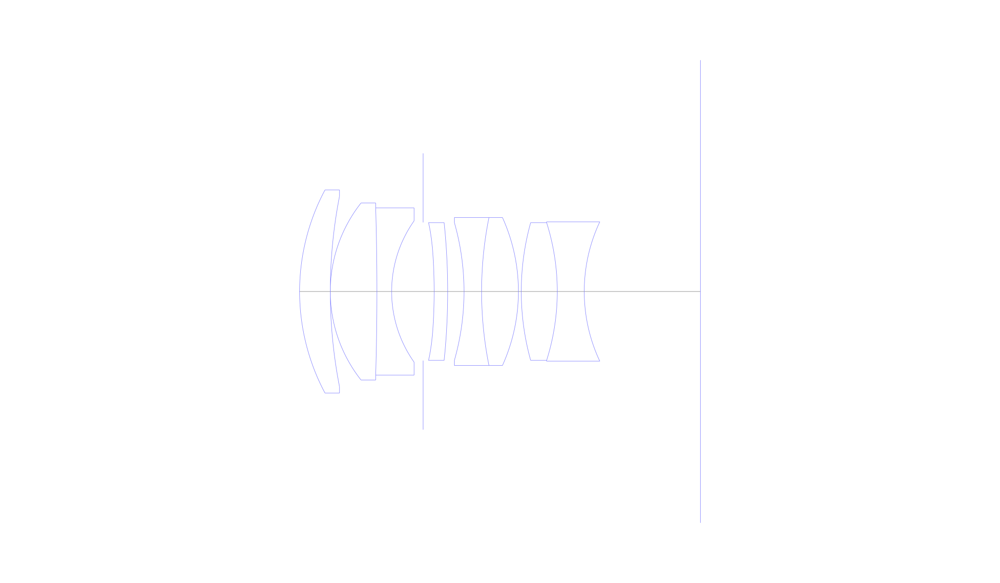
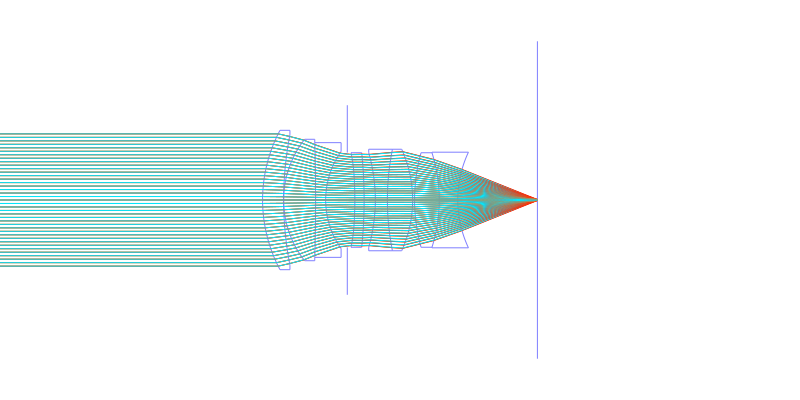
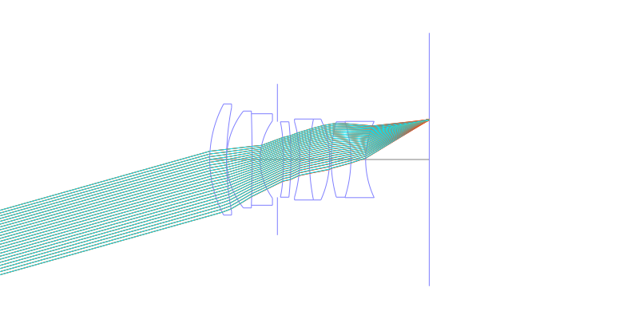
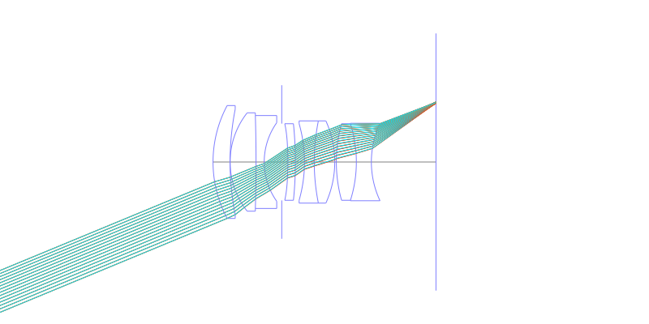
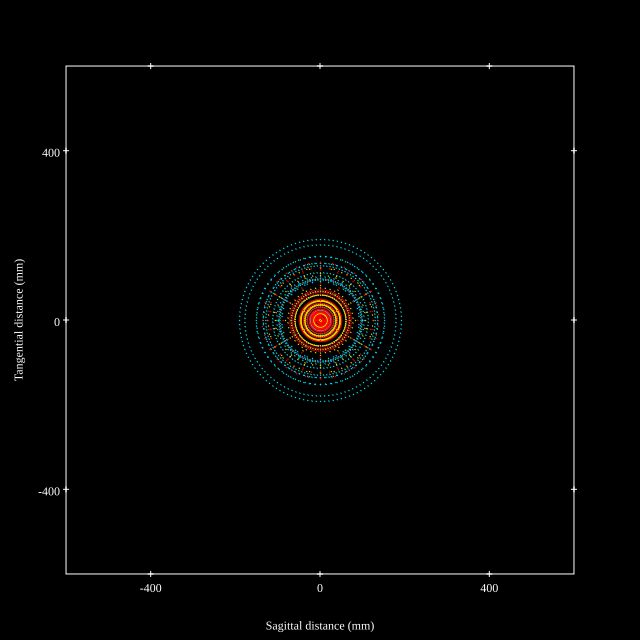
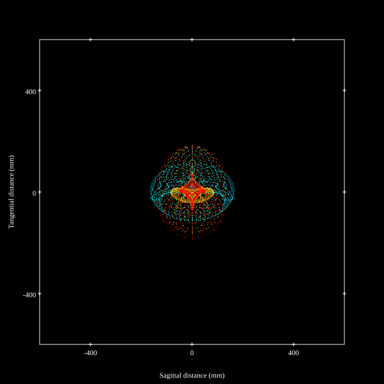
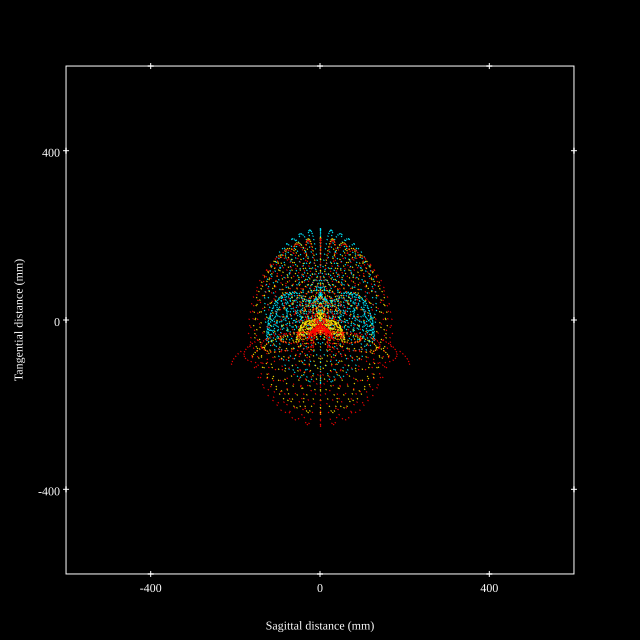
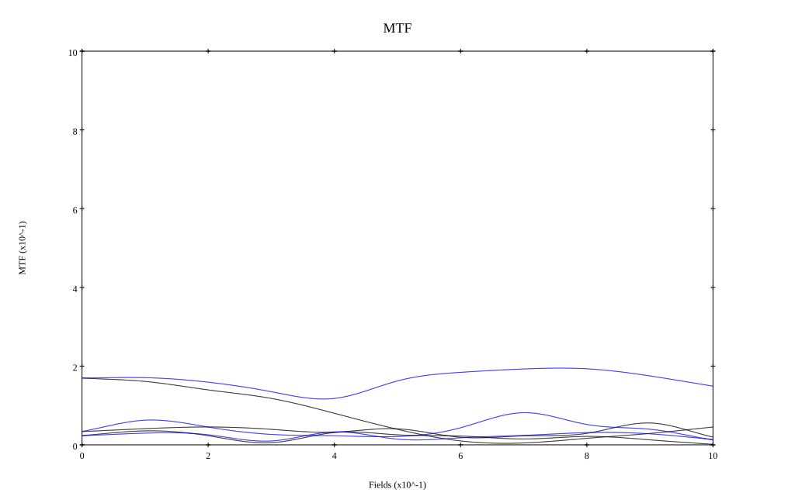

## Surface Data
Note that where glass types are shown the refractive index and abbe number is as per assigned glass type

| ID  | Radius | Thickness | Diameter | nd  | vd  | Glass Make | Glass |
| --- | ---    | ---       | ---      | --- | --- | ---        | ---   |
| 1 | 40.35 | 5.725 | 37.93 | 1.883 | 40.77 | Ohara | S-LAH58 |
| 2 | 92.64 | 0.0 | 35.49 |  |  |  |
| 3 | 26.68 | 8.7 | 33.05 | 1.497 | 81.55 | Ohara | S-FPL51 |
| 4 | -532.104 | 2.748 | 31.217 | 1.755 | 52.32 | Ohara | S-LAH97 |
| 5 | 22.866 | 5.88 | 26.4 |  |  |  |
| 6 | AS | 2.06 | 25.798 |  |  |  |
| 7 | -88.62839389403705 | 2.5187 | 25.722 | 1.77377 | 47.17 | Hoya | M-TAF401 |
| 8 | -125.95506028486257 | 3.05 | 25.722 |  |  |  |
| 9 | -46.9 | 3.282 | 25.722 | 1.64769 | 33.79 | Ohara | S-TIM22 |
| 10 | 70.145 | 6.869 | 27.63 | 1.816 | 46.62 | Ohara | S-LAH59 |
| 11 | -33.546 | 0.534 | 27.63 |  |  |  |
| 12 | 47.987 | 6.716 | 25.722 | 1.883 | 40.77 | Ohara | S-LAH58 |
| 13 | -42.666 | 5.037 | 25.722 | 1.62588 | 35.7 | Ohara | S-TIM1 |
| 14 | 30.645 | 21.675215031972712 | 26.026 |  |  |  |
## Aspherical Data
| ID  | k   | P1  | P2  | P3  | P3 | P5 | P6 | P7 | P8 | P9 | P10 |
| --- | --- | --- | --- | --- | --- | --- | --- | --- | --- | --- | --- |
| 7 | 15.967868547800492 | 0.0 | 4.263726732281783E-5 | -6.954564338933783E-7 | 4.0973668704829E-9 | -8.910489456002431E-12 | 0.0 | 0.0 | 0.0 | 0.0 | 0.0 |
## Layouts

## Spot Diagrams

## Paraxial Parameters
| parameter | value |
| ---       | ---   |
| effective_focal_length |51.707
| back_focal_length | 24.348
| optical_invariant | 7.649
| object_distance | 1.0E10
| image_distance | 24.348
| power | 0.019
| pp1_H | 20.167
| ppk_H' | -27.36
| ffl_F | -31.541
| fno | 1.4
| enp_dist_P | 26.733
| enp_radius | 18.467
| exp_dist_P' | -18.861
| exp_radius | 16.386
| m | -0
| red | -1.9339683008931732E8
| n_obj | 1
| n_img | 1
| img_ht | 21.418
| obj_ang | 22.5
| obj_na | 0
| img_na | -0.336|
## Spot Analysis
| Field | Spot Mean Radius | Spot Max Radius |
| ---   | ---              | ---             |
 | Field(x=0.0, y=0.0) | 85.412 | 191.288|
 | Field(x=0.0, y=0.1) | 88.951 | 222.02|
 | Field(x=0.0, y=0.2) | 88.947 | 220.919|
 | Field(x=0.0, y=0.3) | 89.727 | 241.45|
 | Field(x=0.0, y=0.4) | 89.071 | 240.847|
 | Field(x=0.0, y=0.5) | 88.376 | 206.763|
 | Field(x=0.0, y=0.6) | 89.738 | 190.679|
 | Field(x=0.0, y=0.7) | 92.061 | 185.604|
 | Field(x=0.0, y=0.8) | 95.746 | 202.65|
 | Field(x=0.0, y=0.9) | 101.857 | 225.908|
 | Field(x=0.0, y=1.0) | 111.728 | 249.859|
## Geometric MTF

* 10,30,50 cycles/mm
* Black lines represent sagittal, blue tangential
## Resources
* [OpticalBench Compatible Data File, tab delimited](./specs2.txt)
* [Zemax file](./specs2.zmx)
