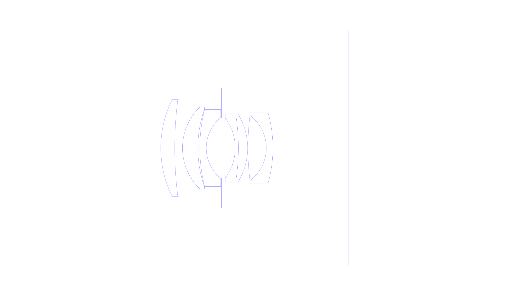
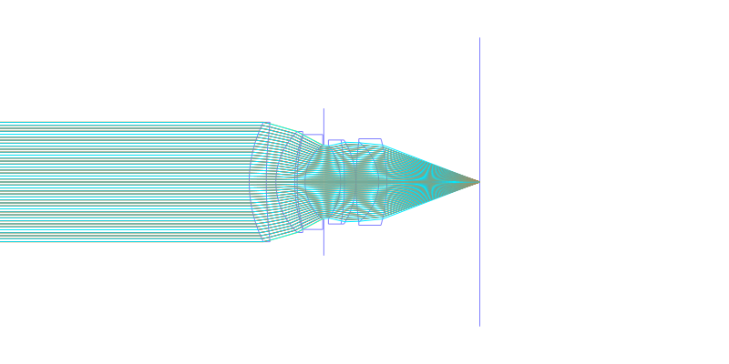
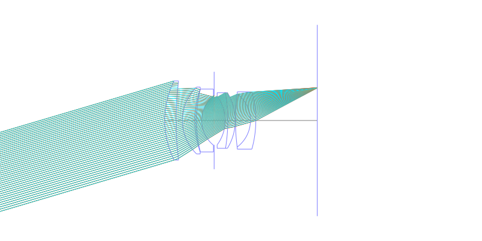
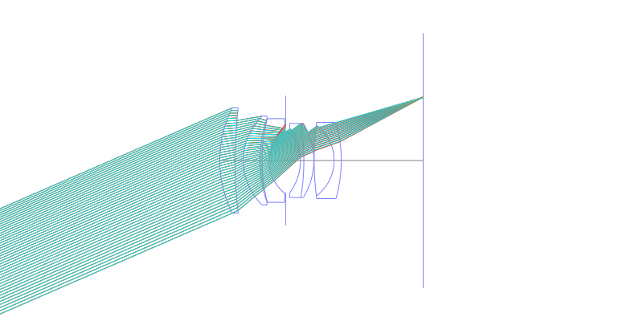
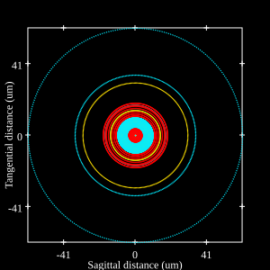
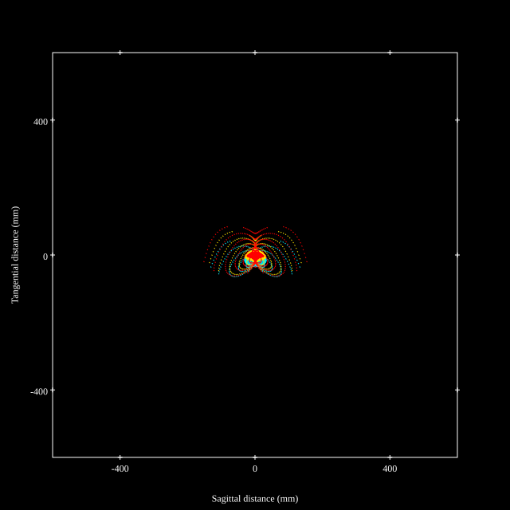
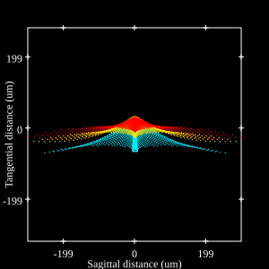
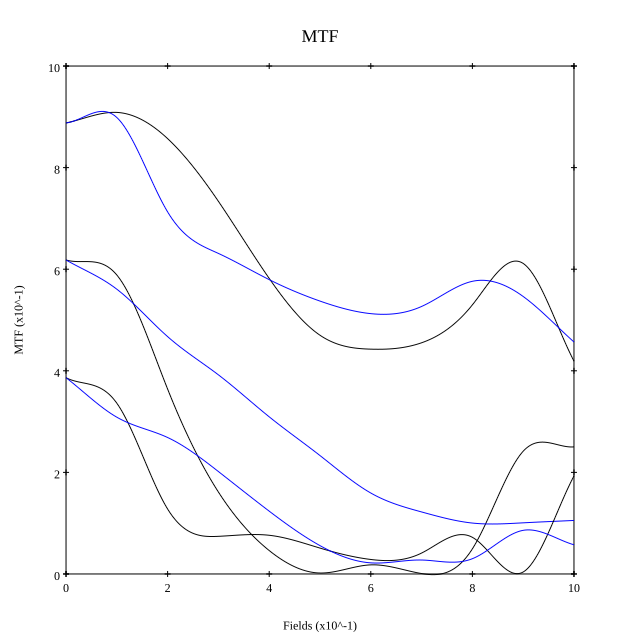

# Leica Summilux-M 50mm f1.4 Pre-asph
## Patent Information
| Country | Patent Number | Example | Year of Application | Inventors | Organisation | Link |
| ---     | ---           | ---     | ---                 | ---       | ---          | ---  |
|US | US3552829 | EX 1 | 1961 | Mandler Walter | Ernst Leitz Wetzlar GmbH  | [link](https://patents.google.com/patent/US3291553A/en) |
## Surface Data
Note that where glass types are shown the refractive index and abbe number is as per assigned glass type

| ID  | Radius | Thickness | Diameter | nd  | vd  | Glass Make | Glass |
| --- | ---    | ---       | ---      | --- | --- | ---        | ---   |
| 1 | 39.99 | 5.11 | 35.75 | 1.788 | 47.49 | Schott | N-LAF21 |
| 2 | 140.1 | 2.86 | 35.08 |  |  |  |
| 3 | 21.01 | 5.62 | 30.2 | 1.788 | 47.49 | Schott | N-LAF21 |
| 4 | 43.2 | 0.73 | 28.38 |  |  |  |
| 5 | 57.84 | 2.35 | 28.38 | 1.76182 | 26.53 | Schott | N-SF14 |
| 6 | 14.34 | 5.62 | 22.28 |  |  |  |
| 7 | AS | 5.01 | 22.008 |  |  |  |
| 8 | -18.45 | 1.16 | 22.03 | 1.72151 | 29.23 | Ohara | S-TIH18 |
| 9 | -77.27 | 3.38 | 25.11 | 1.788 | 47.49 | Schott | N-LAF21 |
| 10 | -23.99 | 0.1 | 25.11 |  |  |  |
| 11 | 94.23 | 6.76 | 23.91 | 1.74397 | 44.85 | Schott | N-LAF2 |
| 12 | -14.97 | 2.42 | 23.91 | 1.717 | 47.97 | Hikari | J-LAF3 |
| 13 | -47.83 | 27.75 | 25.85 |  |  |  |
## Layouts

## Spot Diagrams

## Paraxial Parameters
| parameter | value |
| ---       | ---   |
| effective_focal_length |50.234
| back_focal_length | 27.768
| optical_invariant | 7.801
| object_distance | 1.0E10
| image_distance | 27.768
| power | 0.02
| pp1_H | 25.447
| ppk_H' | -22.466
| ffl_F | -24.787
| fno | 1.4
| enp_dist_P | 28.759
| enp_radius | 17.941
| exp_dist_P' | -19.341
| exp_radius | 16.831
| m | -0
| red | -1.990676297463651E8
| n_obj | 1
| n_img | 1
| img_ht | 21.842
| obj_ang | 23.5
| obj_na | 0
| img_na | -0.336|
## Spot Analysis
| Field | Spot Mean Radius | Spot Max Radius |
| ---   | ---              | ---             |
 | Field(x=0.0, y=0.0) | 15.377 | 57.483|
 | Field(x=0.0, y=0.1) | 11.136 | 55.57|
 | Field(x=0.0, y=0.2) | 17.611 | 75.189|
 | Field(x=0.0, y=0.3) | 23.959 | 91.403|
 | Field(x=0.0, y=0.4) | 30.41 | 139.635|
 | Field(x=0.0, y=0.5) | 32.474 | 105.473|
 | Field(x=0.0, y=0.6) | 34.217 | 127.536|
 | Field(x=0.0, y=0.7) | 36.96 | 153.647|
 | Field(x=0.0, y=0.8) | 39.866 | 190.417|
 | Field(x=0.0, y=0.9) | 45.393 | 216.543|
 | Field(x=0.0, y=1.0) | 56.101 | 222.635|
## Geometric MTF

* 10,30,50 cycles/mm
* Black lines represent sagittal, blue tangential
## Resources
* [OpticalBench Compatible Data File, tab delimited](./US003291553_Example01.txt)
* [Zemax file](./US003291553_Example01.zmx)
