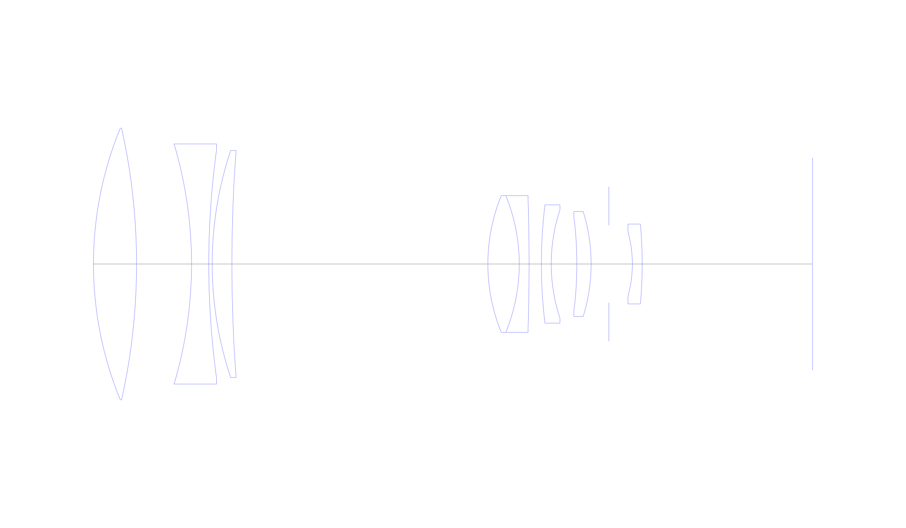
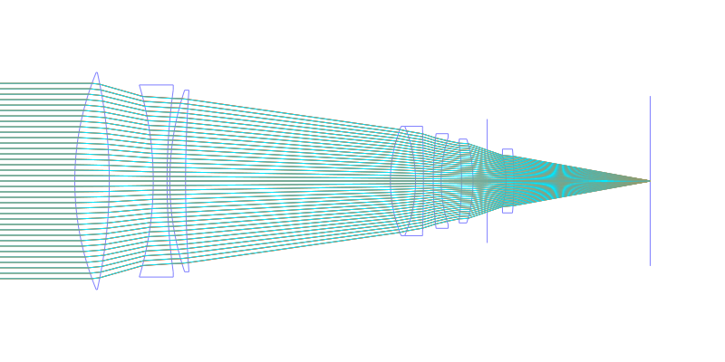
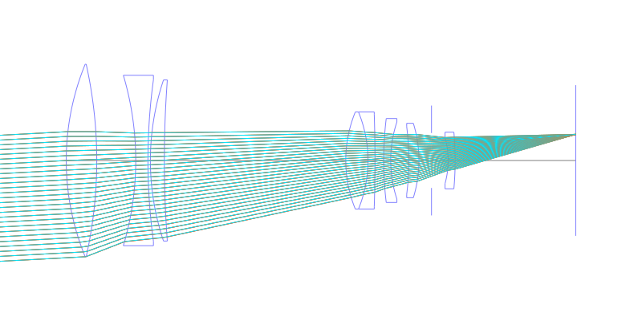
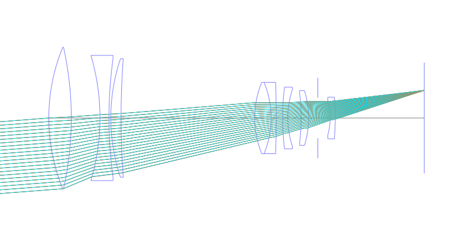
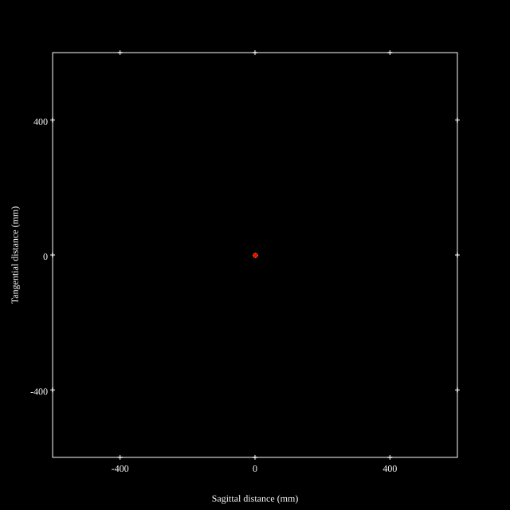
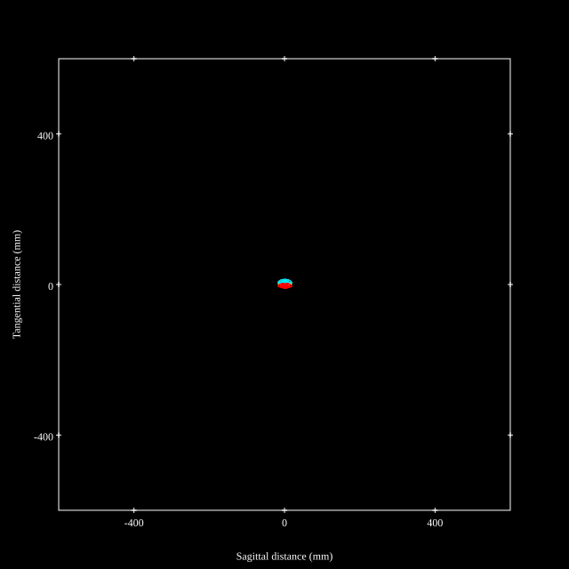
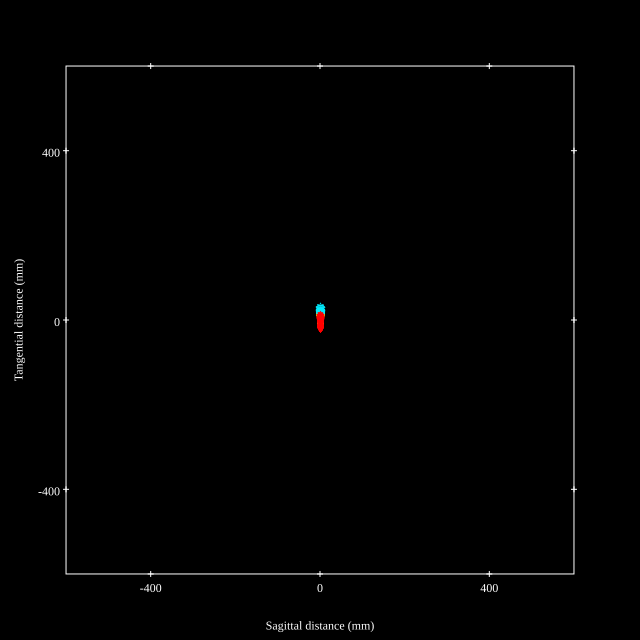
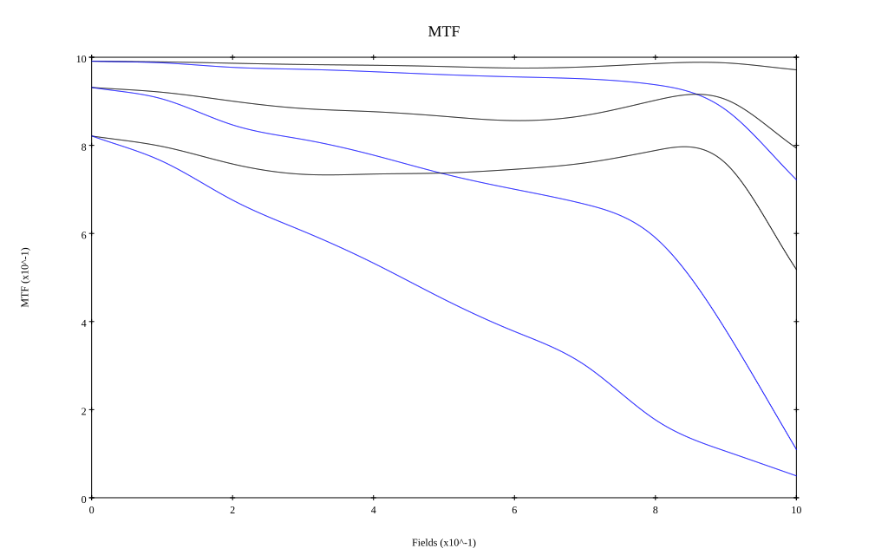
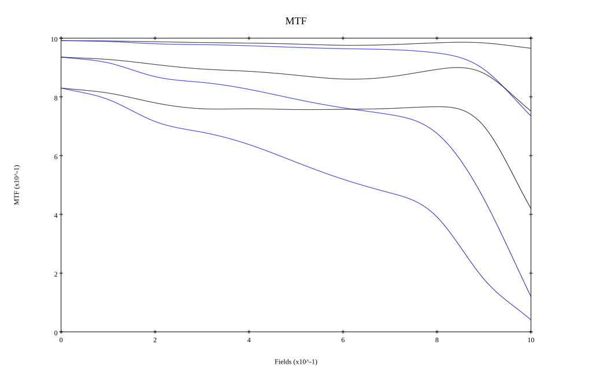

# Leica APO-Telyt-R 280mm F2.8
## Patent Information
| Country | Patent Number | Example | Year of Application | Inventors | Organisation | Link |
| ---     | ---           | ---     | ---                 | ---       | ---          | ---  |
|US | US5388006 | FR1F01 | 1991 | Lothar Koelsch | Leica Camera AG | [link](https://patents.google.com/patent/US5388006A/en) |
## Surface Data
Note that where glass types are shown the refractive index and abbe number is as per assigned glass type

| ID  | Radius | Thickness | Diameter | nd  | vd  | Glass Make | Glass |
| --- | ---    | ---       | ---      | --- | --- | ---        | ---   |
| 1 | 145.575 | 17.5 | 110.44 | 1.48605 | 81.8 | Schott | FK52 |
| 2 | -253.984 | 22.34 | 110.44 |  |  |  |
| 3 | -171.552 | 7.0 | 97.66 | 1.6134 | 44.29 | Schott | KZFSN4 |
| 4 | 342.012 | 1.4 | 92.61 |  |  |  |
| 5 | 145.575 | 8.0 | 92.33 | 1.48605 | 81.8 | Schott | FK52 |
| 6 | 622.693 | 104.0 | 92.33 |  |  |  |
| 7 | 73.518 | 12.75 | 55.64 | 1.55232 | 67.0 |  |
| 8 | -73.518 | 4.0 | 55.64 | 1.6865 | 42.86 | Hoya | ADF8 |
| 9 | -831.4 | 5.0 | 52.63 |  |  |  |
| 10 | 201.034 | 4.0 | 48.13 | 1.6134 | 44.29 | Schott | KZFSN4 |
| 11 | 70.365 | 10.4 | 44.18 |  |  |  |
| 12 | -154.315 | 5.8 | 38.79 | 1.7847 | 26.08 | Schott | SF56A |
| 13 | -72.386 | 7.2 | 42.65 |  |  |  |
| 14 | AS | 9.55 | 31.487 |  |  |  |
| 15 | -49.563 | 4.0 | 26.45 | 1.65113 | 55.89 | Schott | N-LAK22 |
| 16 | -181.867 | 69.15 | 32.45 |  |  |  |
## Layouts

## Spot Diagrams

## Paraxial Parameters
| parameter | value |
| ---       | ---   |
| effective_focal_length |279.037
| back_focal_length | 69.234
| optical_invariant | 3.816
| object_distance | 1.0E10
| image_distance | 69.234
| power | 0.004
| pp1_H | -142.616
| ppk_H' | -209.802
| ffl_F | -421.652
| fno | 2.797
| enp_dist_P | 544.542
| enp_radius | 49.881
| exp_dist_P' | -11.267
| exp_radius | 14.406
| m | -0
| red | -3.583758862164174E7
| n_obj | 1
| n_img | 1
| img_ht | 21.348
| obj_ang | 4.375
| obj_na | 0
| img_na | -0.176|
## Spot Analysis
| Field | Spot Mean Radius | Spot Max Radius |
| ---   | ---              | ---             |
 | Field(x=0.0, y=0.0) | 2.676 | 5.831|
 | Field(x=0.0, y=0.1) | 3.265 | 11.553|
 | Field(x=0.0, y=0.2) | 4.304 | 18.15|
 | Field(x=0.0, y=0.3) | 4.486 | 16.673|
 | Field(x=0.0, y=0.4) | 4.715 | 16.318|
 | Field(x=0.0, y=0.5) | 5.172 | 18.491|
 | Field(x=0.0, y=0.6) | 5.536 | 20.953|
 | Field(x=0.0, y=0.7) | 5.993 | 19.564|
 | Field(x=0.0, y=0.8) | 6.067 | 20.08|
 | Field(x=0.0, y=0.9) | 7.928 | 28.827|
 | Field(x=0.0, y=1.0) | 12.467 | 40.248|
## Polychromatic Geometric MTF

* 10,30,50 cycles/mm
* Black lines represent sagittal, blue tangential
* To generate above, MTFs for wavelengths 587.5618(d), 486.1327(F), 656.2725(C) were calculated across 10 fields, and then averaged
## Polychromatic Geometric MTF (Weighted)

* 10,30,50 cycles/mm
* Black lines represent sagittal, blue tangential
* To generate above, MTFs for wavelengths 587.5618(d) wt(1.0), 656.2725(C) wt(0.475), 546.074(e) wt(0.98), 486.1327(F) wt(0.49), 435.8343(g) wt(0.15) were calculated across 10 fields, and then combined using weighted average
## Resources
* [OpticalBench Compatible Data File, tab delimited](./prescription.txt)
* [Zemax file](./US005388006_ExampleFR1F01P.zmx)

Report / Zemax file generated using [Beam42](https://github.com/BeamFour/Beam42) on 2026-04-18
