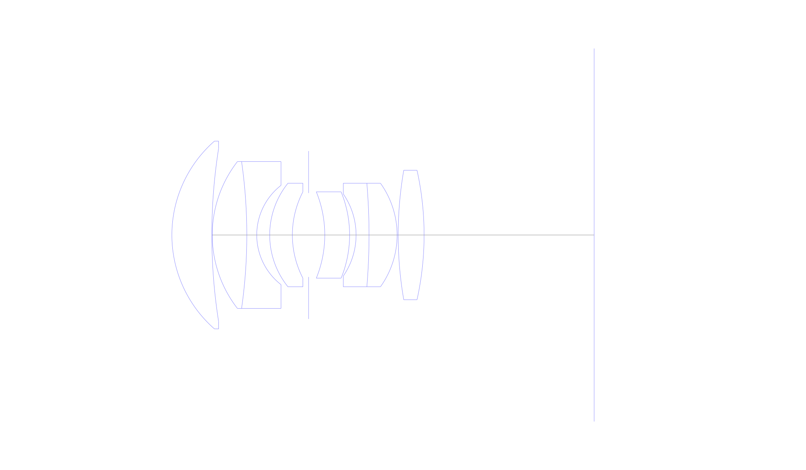
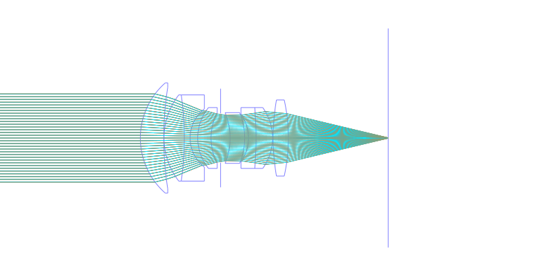
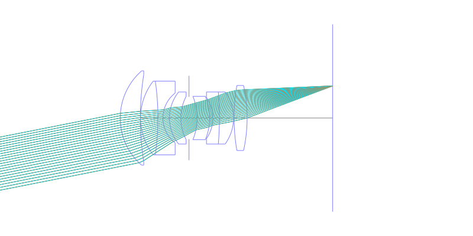
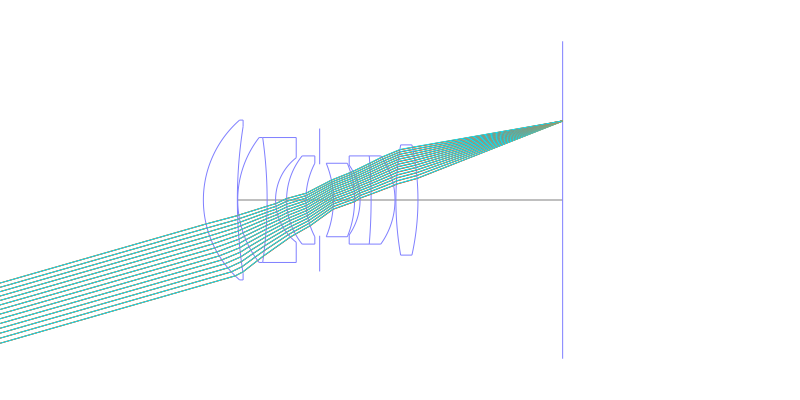
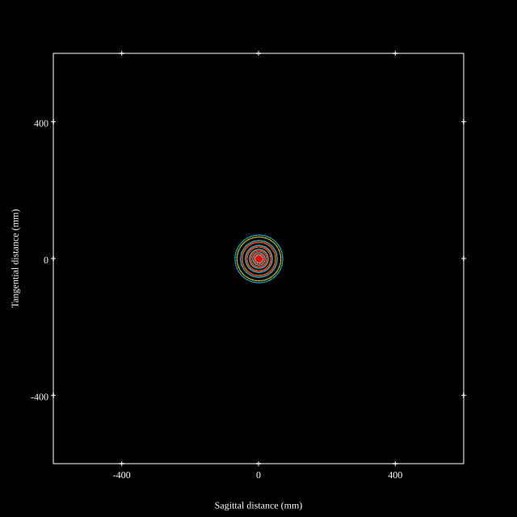
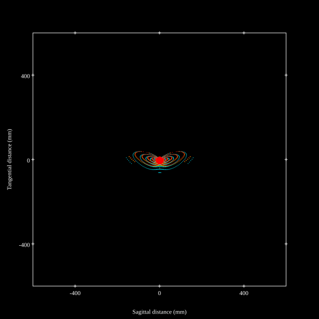
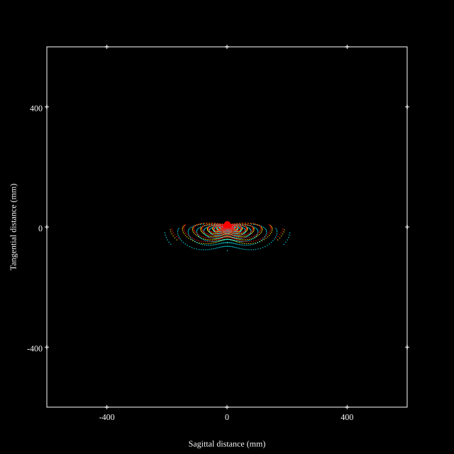
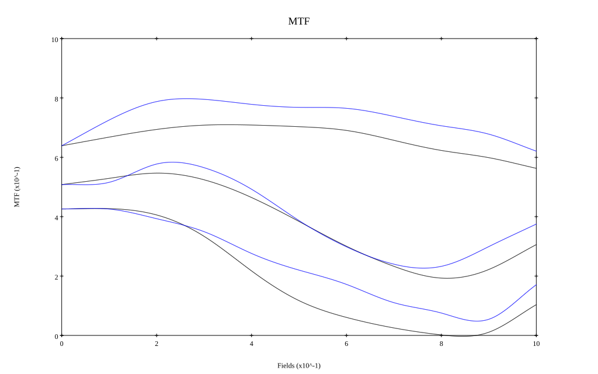
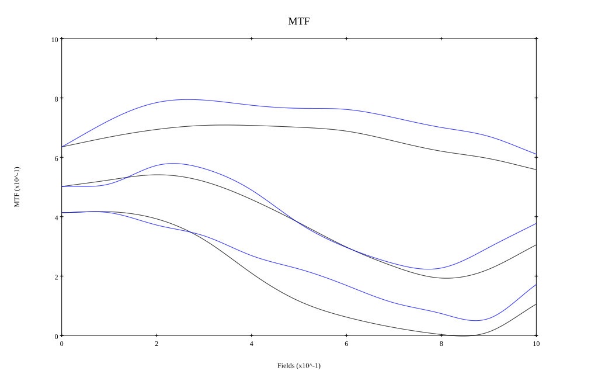

# Leica APO 75mm F2 Walter Mandler
## Surface Data
Note that where glass types are shown the refractive index and abbe number is as per assigned glass type

| ID  | Radius | Thickness | Diameter | nd  | vd  | Glass Make | Glass |
| --- | ---    | ---       | ---      | --- | --- | ---        | ---   |
| 1 | 28.927 | 9.25 | 43.5 | 1.5522 | 67.06 | CORNING | B52-67 |
| 2 | 128.702 | 0.1 | 40.0 |  |  |  |
| 3 | 27.737 | 8.0 | 34.0 | 1.5522 | 67.06 | CORNING | B52-67 |
| 4 | -120.0 | 2.3 | 34.0 | 1.6134 | 44.29 | Schott | KZFSN4 |
| 5 | 14.576 | 3.0 | 23.0 |  |  |  |
| 6 | 19.138 | 5.25 | 24.0 | 1.5522 | 67.06 | CORNING | B52-67 |
| 7 | 21.746 | 3.75 | 20.0 |  |  |  |
| 8 | AS | 3.75 | 19.446 |  |  |  |
| 9 | -26.515 | 5.75 | 20.0 | 1.5522 | 67.06 | CORNING | B52-67 |
| 10 | -26.408 | 1.5 | 20.0 |  |  |  |
| 11 | -16.712 | 3.0 | 19.0 | 1.6134 | 44.29 | Schott | KZFSN4 |
| 12 | -142.0 | 6.5 | 24.0 | 1.5522 | 67.06 | CORNING | B52-67 |
| 13 | -20.575 | 0.25 | 24.0 |  |  |  |
| 14 | 87.709 | 6.0 | 30.0 | 1.5522 | 67.06 | CORNING | B52-67 |
| 15 | -69.357 | 39.38 | 30.0 |  |  |  |
## Layouts

## Spot Diagrams

## Paraxial Parameters
| parameter | value |
| ---       | ---   |
| effective_focal_length |74.746
| back_focal_length | 39.371
| optical_invariant | 5.253
| object_distance | 1.0E10
| image_distance | 39.371
| power | 0.013
| pp1_H | 46.705
| ppk_H' | -35.375
| ffl_F | -28.041
| fno | 2.04
| enp_dist_P | 45.712
| enp_radius | 18.318
| exp_dist_P' | -36.39
| exp_radius | 18.564
| m | -0
| red | -1.337864501674783E8
| n_obj | 1
| n_img | 1
| img_ht | 21.433
| obj_ang | 16
| obj_na | 0
| img_na | -0.238|
## Spot Analysis
| Field | Spot Mean Radius | Spot Max Radius |
| ---   | ---              | ---             |
 | Field(x=0.0, y=0.0) | 26.494 | 69.63|
 | Field(x=0.0, y=0.1) | 23.433 | 90.638|
 | Field(x=0.0, y=0.2) | 23.408 | 99.117|
 | Field(x=0.0, y=0.3) | 24.056 | 95.242|
 | Field(x=0.0, y=0.4) | 25.097 | 94.549|
 | Field(x=0.0, y=0.5) | 25.708 | 110.964|
 | Field(x=0.0, y=0.6) | 28.161 | 132.153|
 | Field(x=0.0, y=0.7) | 32.072 | 158.728|
 | Field(x=0.0, y=0.8) | 36.078 | 191.507|
 | Field(x=0.0, y=0.9) | 41.18 | 209.023|
 | Field(x=0.0, y=1.0) | 45.374 | 208.741|
## Polychromatic Geometric MTF

* 10,30,50 cycles/mm
* Black lines represent sagittal, blue tangential
* To generate above, MTFs for wavelengths 587.5618(d), 486.1327(F), 656.2725(C) were calculated across 10 fields, and then averaged
## Polychromatic Geometric MTF (Weighted)

* 10,30,50 cycles/mm
* Black lines represent sagittal, blue tangential
* To generate above, MTFs for wavelengths 587.5618(d) wt(1.0), 656.2725(C) wt(0.475), 546.074(e) wt(0.98), 486.1327(F) wt(0.49), 435.8343(g) wt(0.15) were calculated across 10 fields, and then combined using weighted average
## Resources
* [OpticalBench Compatible Data File, tab delimited](./prescription.txt)
* [Zemax file](./specs.zmx)

Report / Zemax file generated using [Beam42](https://github.com/BeamFour/Beam42) on 2026-04-25
