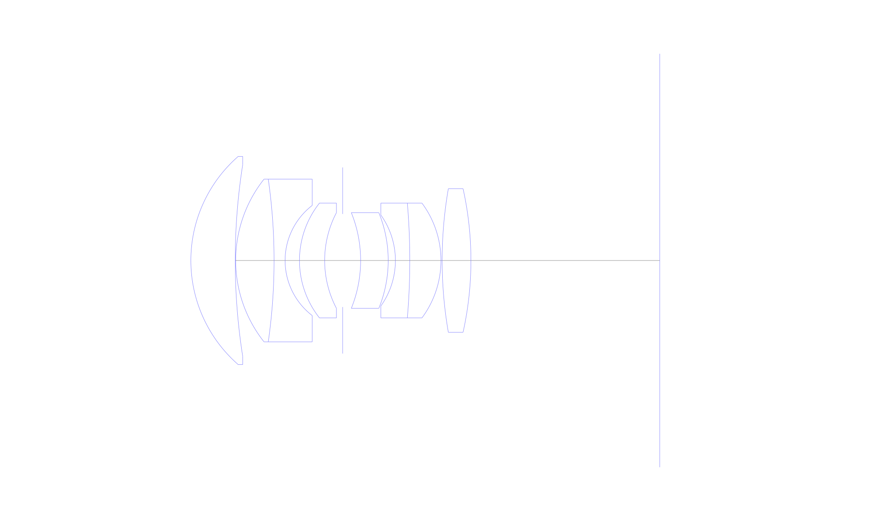
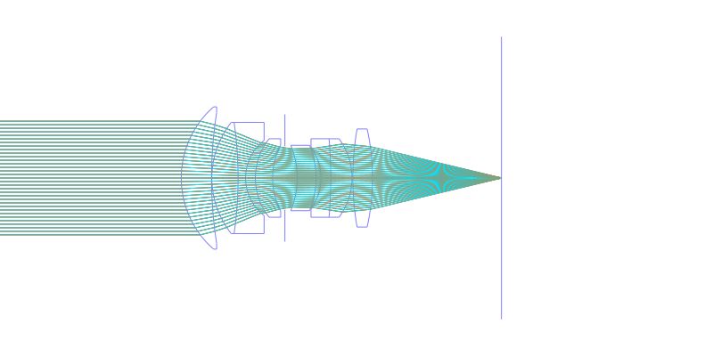
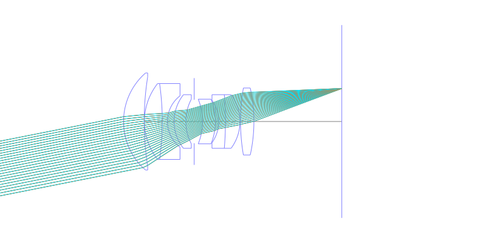
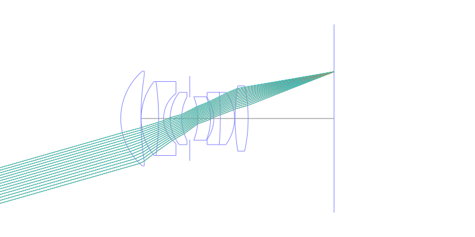
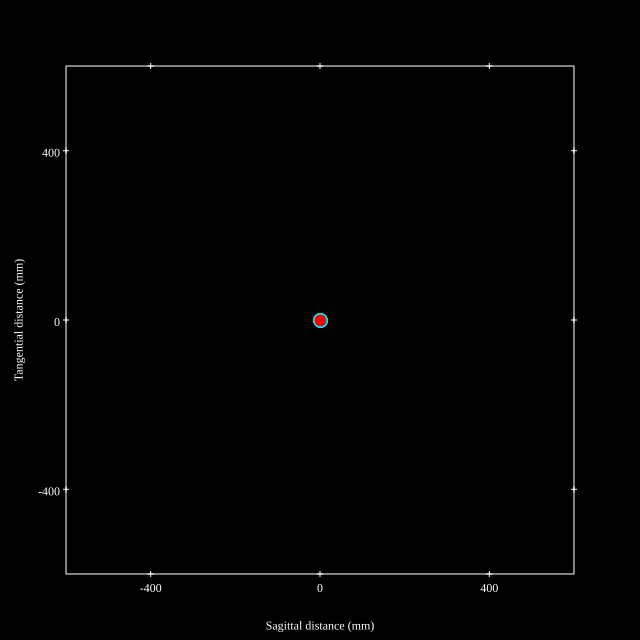
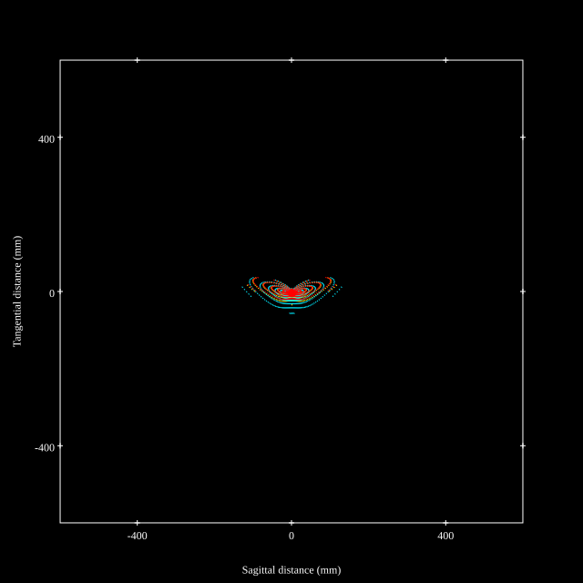
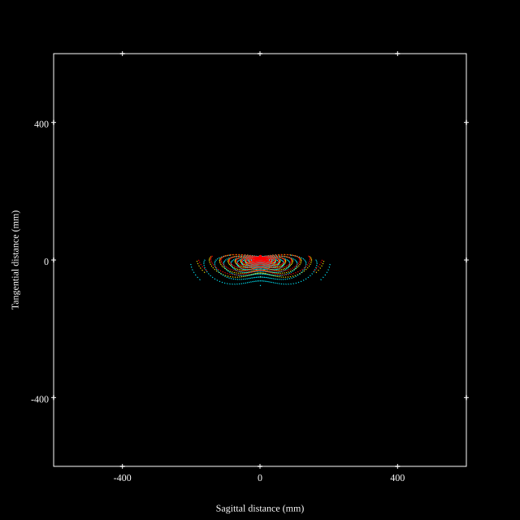
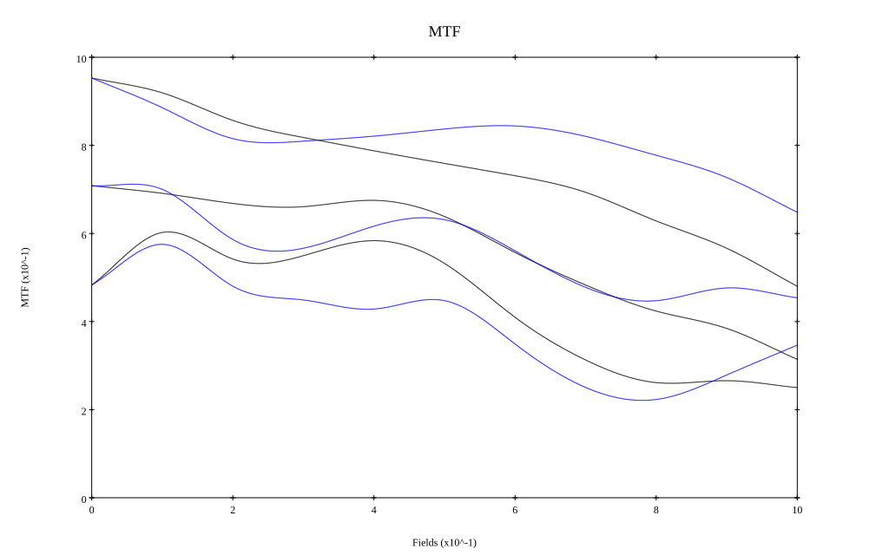

# Leica APO 75mm F2 Walter Mandler
## Surface Data
Note that where glass types are shown the refractive index and abbe number is as per assigned glass type

| ID  | Radius | Thickness | Diameter | nd  | vd  | Glass Make | Glass |
| --- | ---    | ---       | ---      | --- | --- | ---        | ---   |
| 1 | 28.89871285350578 | 9.25 | 43.5 | 1.5522 | 67.06 | CORNING | B52-67 |
| 2 | 129.17681730149656 | 0.1 | 40.0 |  |  |  |
| 3 | 27.4202842069933 | 8.0 | 34.0 | 1.5522 | 67.06 | CORNING | B52-67 |
| 4 | -120.1024225789314 | 2.3 | 34.0 | 1.6134 | 44.29 | Schott | KZFSN4 |
| 5 | 14.534091343143485 | 3.0 | 23.0 |  |  |  |
| 6 | 19.350502585509695 | 5.25 | 24.0 | 1.5522 | 67.06 | CORNING | B52-67 |
| 7 | 21.57220396270357 | 3.75 | 20.0 |  |  |  |
| 8 | AS | 3.75 | 19.446 |  |  |  |
| 9 | -26.682064350593112 | 5.75 | 20.0 | 1.5522 | 67.06 | CORNING | B52-67 |
| 10 | -26.50220171311065 | 1.5 | 20.0 |  |  |  |
| 11 | -16.411195785297803 | 3.0 | 19.0 | 1.6134 | 44.29 | Schott | KZFSN4 |
| 12 | -141.99178116686952 | 6.5 | 24.0 | 1.5522 | 67.06 | CORNING | B52-67 |
| 13 | -20.11941122524723 | 0.25 | 24.0 |  |  |  |
| 14 | 87.8708934621426 | 6.0 | 30.0 | 1.5522 | 67.06 | CORNING | B52-67 |
| 15 | -69.39991998026615 | 39.38 | 30.0 |  |  |  |
## Layouts

## Spot Diagrams

## Paraxial Parameters
| parameter | value |
| ---       | ---   |
| effective_focal_length |74.739
| back_focal_length | 39.458
| optical_invariant | 5.281
| object_distance | 1.0E10
| image_distance | 39.458
| power | 0.013
| pp1_H | 47.373
| ppk_H' | -35.281
| ffl_F | -27.366
| fno | 2.029
| enp_dist_P | 45.933
| enp_radius | 18.416
| exp_dist_P' | -36.671
| exp_radius | 18.778
| m | -0
| red | -1.3379845332616356E8
| n_obj | 1
| n_img | 1
| img_ht | 21.431
| obj_ang | 16
| obj_na | 0
| img_na | -0.239|
## Spot Analysis
| Field | Spot Mean Radius | Spot Max Radius |
| ---   | ---              | ---             |
 | Field(x=0.0, y=0.0) | 6.68 | 15.835|
 | Field(x=0.0, y=0.1) | 9.698 | 47.244|
 | Field(x=0.0, y=0.2) | 13.69 | 67.366|
 | Field(x=0.0, y=0.3) | 15.911 | 75.45|
 | Field(x=0.0, y=0.4) | 17.338 | 71.393|
 | Field(x=0.0, y=0.5) | 18.841 | 81.336|
 | Field(x=0.0, y=0.6) | 22.329 | 96.461|
 | Field(x=0.0, y=0.7) | 26.986 | 129.065|
 | Field(x=0.0, y=0.8) | 33.442 | 168.598|
 | Field(x=0.0, y=0.9) | 40.165 | 191.967|
 | Field(x=0.0, y=1.0) | 46.897 | 202.523|
## Polychromatic Geometric MTF

* 10,30,50 cycles/mm
* Black lines represent sagittal, blue tangential
* To generate above, MTFs for wavelengths 587.5618(d), 486.1327(F), 656.2725(C) were calculated across 10 fields, and then averaged
## Polychromatic Geometric MTF (Weighted)

* 10,30,50 cycles/mm
* Black lines represent sagittal, blue tangential
* To generate above, MTFs for wavelengths 587.5618(d) wt(1.0), 656.2725(C) wt(0.475), 546.074(e) wt(0.98), 486.1327(F) wt(0.49), 435.8343(g) wt(0.15) were calculated across 10 fields, and then combined using weighted average
## Resources
* [OpticalBench Compatible Data File, tab delimited](./prescription.txt)
* [Zemax file](./specs.zmx)

Report / Zemax file generated using [Beam42](https://github.com/BeamFour/Beam42) on 2026-04-25
