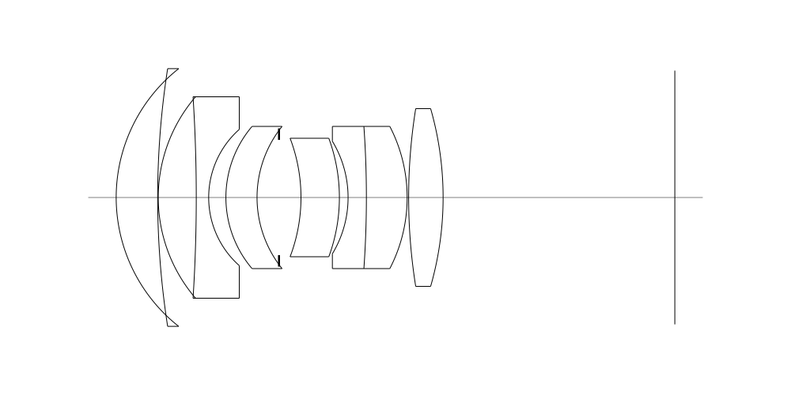
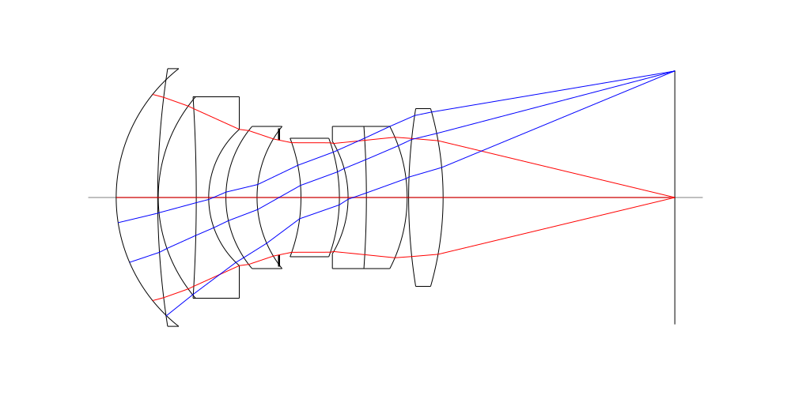
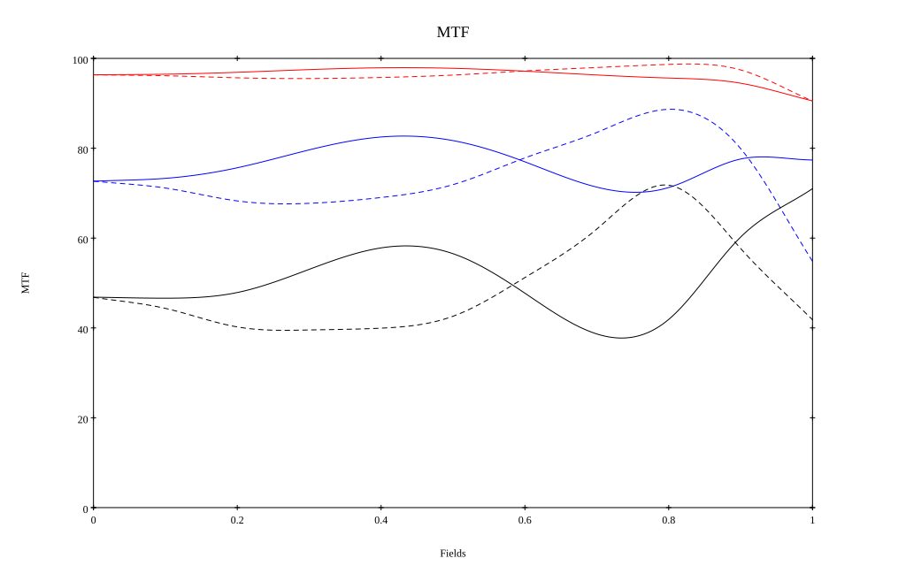
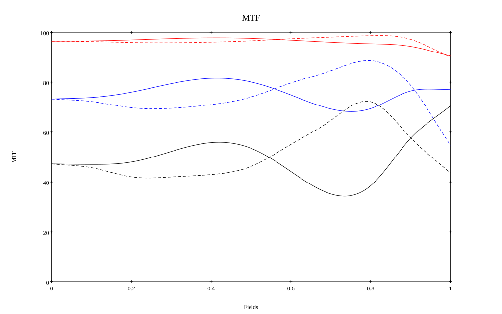

# Leica APO 75mm F2 Walter Mandler
## Surface Data
Note that where glass types are shown the refractive index and abbe number is as per assigned glass type

| ID  | Radius | Thickness | Diameter | nd  | vd  | Glass Make | Glass |
| --- | ---    | ---       | ---      | --- | --- | ---        | ---   |
| 1 | 27.729003666980997 | 6.994075423564698 | 43.5 | 1.5522 | 67.06 | CORNING | B52-67 |
| 2 | 141.6045776655993 | 0.09989673951459749 | 40.0 |  |  |  |
| 3 | 26.134707498166474 | 6.407446823710268 | 34.0 | 1.5522 | 67.06 | CORNING | B52-67 |
| 4 | -266.9411247300388 | 2.092440695534465 | 34.0 | 1.6134 | 44.29 | Schott | KZFSN4 |
| 5 | 15.392044516238133 | 2.9037325379117718 | 23.0 |  |  |  |
| 6 | 18.544703341905187 | 5.249349010845343 | 24.0 | 1.5522 | 67.06 | CORNING | B52-67 |
| 7 | 19.18461935650805 | 3.7049472957786045 | 20.0 |  |  |  |
| 8 | AS | 3.7027850324018847 | 19.446 |  |  |  |
| 9 | -28.168276151539477 | 6.474945295514794 | 20.0 | 1.5522 | 67.06 | CORNING | B52-67 |
| 10 | -28.9055792338474 | 1.4649005336998604 | 20.0 |  |  |  |
| 11 | -18.37290350200972 | 3.088012493230493 | 19.0 | 1.6134 | 44.29 | Schott | KZFSN4 |
| 12 | -170.40668050688478 | 6.872052850248955 | 24.0 | 1.5522 | 67.06 | CORNING | B52-67 |
| 13 | -26.09172525474704 | 0.24975380776144956 | 24.0 |  |  |  |
| 14 | 95.061301218387 | 5.811149521386315 | 30.0 | 1.5522 | 67.06 | CORNING | B52-67 |
| 15 | -54.58216739372063 | 39.0643544544142 | 30.0 |  |  |  |
## Layouts

## Spot Diagrams

## Paraxial Parameters
| parameter | value |
| ---       | ---   |
| effective_focal_length |74.689
| back_focal_length | 39.267
| optical_invariant | 5.009
| object_distance | 1.0E10
| image_distance | 39.267
| power | 0.013
| pp1_H | 39.481
| ppk_H' | -35.422
| ffl_F | -35.208
| fno | 2.138
| enp_dist_P | 38.183
| enp_radius | 17.468
| exp_dist_P' | -36.54
| exp_radius | 17.777
| m | -0
| red | -1.338883443596009E8
| n_obj | 1
| n_img | 1
| img_ht | 21.417
| obj_ang | 16
| obj_na | 0
| img_na | -0.228|
## Spot Analysis
| Field | Spot Mean Radius | Spot Max Radius |
| ---   | ---              | ---             |
 | Field(x=0.0, y=0.0) | 6.143 | 12.003|
 | Field(x=0.0, y=0.1) | 6.165 | 12.796|
 | Field(x=0.0, y=0.2) | 6.175 | 16.42|
 | Field(x=0.0, y=0.3) | 5.988 | 19.038|
 | Field(x=0.0, y=0.4) | 5.713 | 19.244|
 | Field(x=0.0, y=0.5) | 5.507 | 18.747|
 | Field(x=0.0, y=0.6) | 5.37 | 17.48|
 | Field(x=0.0, y=0.7) | 5.419 | 21.085|
 | Field(x=0.0, y=0.8) | 5.489 | 29.712|
 | Field(x=0.0, y=0.9) | 6.798 | 41.978|
 | Field(x=0.0, y=1.0) | 10.733 | 47.49|
## Polychromatic Geometric MTF

* 10=red,30=blue,50=black cycles/mm
* Solid lines represent sagittal, dashed lines tangential
* To generate above, MTFs for wavelengths 587.5618(d), 486.1327(F), 656.2725(C) were calculated across 10 fields, and then averaged
## Polychromatic Geometric MTF (Weighted)

* 10=red,30=blue,50=black cycles/mm
* Solid lines represent sagittal, dashed lines tangential
* To generate above, MTFs for wavelengths 587.5618(d) wt(1.0), 656.2725(C) wt(0.475), 546.074(e) wt(0.98), 486.1327(F) wt(0.49), 435.8343(g) wt(0.15) were calculated across 10 fields, and then combined using weighted average
## Resources
* [OpticalBench Compatible Data File, tab delimited](./prescription.txt)
* [Zemax file](./specs.zmx)

Report / Zemax file generated using [Beam42](https://github.com/BeamFour/Beam42) on 2026-08-15
