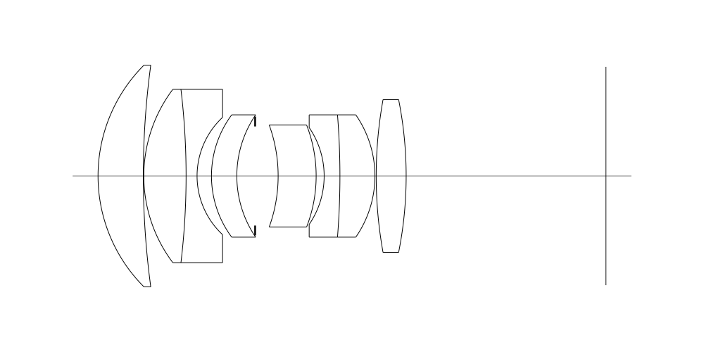
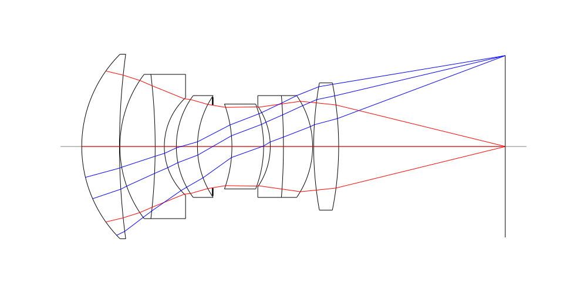
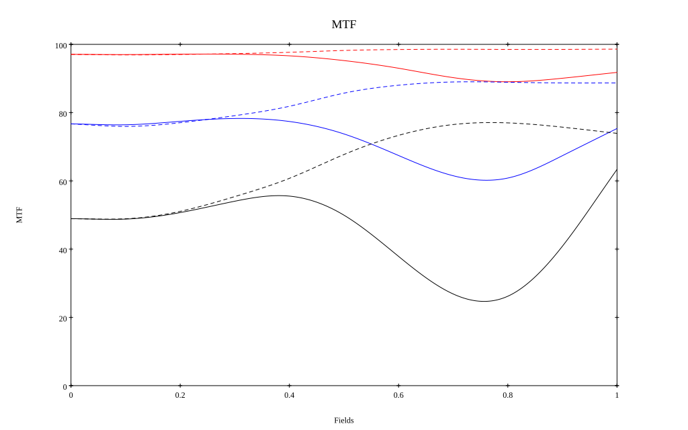
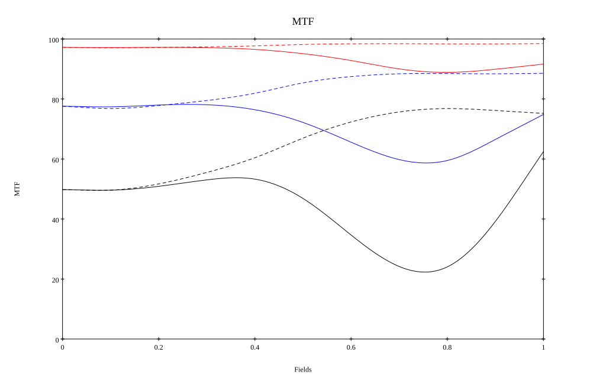

# Leica APO 75mm F2 Walter Mandler
## Surface Data
Note that where glass types are shown the refractive index and abbe number is as per assigned glass type

| ID  | Radius | Thickness | Diameter | nd  | vd  | Glass Make | Glass |
| --- | ---    | ---       | ---      | --- | --- | ---        | ---   |
| 1 | 30.76005715416928 | 8.881436619019174 | 43.5 | 1.5522 | 67.06 | CORNING | B52-67 |
| 2 | 162.42559814964565 | 0.10022677946748809 | 40.0 |  |  |  |
| 3 | 28.230601089802214 | 8.295299918964872 | 34.0 | 1.5522 | 67.06 | CORNING | B52-67 |
| 4 | -143.56812153977765 | 2.1538360664023597 | 34.0 | 1.6134 | 44.29 | Schott | KZFSN4 |
| 5 | 15.726471981990922 | 2.8258204256889465 | 23.0 |  |  |  |
| 6 | 20.12171396105688 | 4.9742896536225265 | 24.0 | 1.5522 | 67.06 | CORNING | B52-67 |
| 7 | 21.360950005782964 | 3.5905214453763277 | 20.0 |  |  |  |
| 8 | AS | 4.5167210342729405 | 19.446 |  |  |  |
| 9 | -29.42069434450977 | 7.457291015060013 | 20.0 | 1.5522 | 67.06 | CORNING | B52-67 |
| 10 | -27.629677873742622 | 1.5685598238430998 | 20.0 |  |  |  |
| 11 | -16.830456568815162 | 3.096220177111588 | 19.0 | 1.6134 | 44.29 | Schott | KZFSN4 |
| 12 | -150.95362477976417 | 6.8653347308371755 | 24.0 | 1.5522 | 67.06 | CORNING | B52-67 |
| 13 | -21.05339804402541 | 0.24912597298307712 | 24.0 |  |  |  |
| 14 | 84.12075430680765 | 5.881203181505518 | 30.0 | 1.5522 | 67.06 | CORNING | B52-67 |
| 15 | -76.6257015332639 | 39.20225088573588 | 30.0 |  |  |  |
## Layouts

## Spot Diagrams

## Paraxial Parameters
| parameter | value |
| ---       | ---   |
| effective_focal_length |74.701
| back_focal_length | 39.377
| optical_invariant | 5.101
| object_distance | 1.0E10
| image_distance | 39.377
| power | 0.013
| pp1_H | 50.927
| ppk_H' | -35.324
| ffl_F | -23.774
| fno | 2.1
| enp_dist_P | 42.943
| enp_radius | 17.79
| exp_dist_P' | -44.088
| exp_radius | 19.919
| m | -0
| red | -1.338666829553691E8
| n_obj | 1
| n_img | 1
| img_ht | 21.42
| obj_ang | 16
| obj_na | 0
| img_na | -0.232|
## Spot Analysis
| Field | Spot Mean Radius | Spot Max Radius |
| ---   | ---              | ---             |
 | Field(x=0.0, y=0.0) | 5.458 | 10.765|
 | Field(x=0.0, y=0.1) | 5.577 | 17.237|
 | Field(x=0.0, y=0.2) | 5.465 | 19.061|
 | Field(x=0.0, y=0.3) | 5.365 | 22.279|
 | Field(x=0.0, y=0.4) | 5.439 | 25.149|
 | Field(x=0.0, y=0.5) | 5.939 | 34.947|
 | Field(x=0.0, y=0.6) | 6.992 | 42.862|
 | Field(x=0.0, y=0.7) | 8.452 | 54.358|
 | Field(x=0.0, y=0.8) | 9.219 | 60.578|
 | Field(x=0.0, y=0.9) | 8.641 | 55.589|
 | Field(x=0.0, y=1.0) | 7.685 | 46.519|
## Polychromatic Geometric MTF

* 10=red,30=blue,50=black cycles/mm
* Solid lines represent sagittal, dashed lines tangential
* To generate above, MTFs for wavelengths 587.5618(d), 486.1327(F), 656.2725(C) were calculated across 10 fields, and then averaged
## Polychromatic Geometric MTF (Weighted)

* 10=red,30=blue,50=black cycles/mm
* Solid lines represent sagittal, dashed lines tangential
* To generate above, MTFs for wavelengths 587.5618(d) wt(1.0), 656.2725(C) wt(0.475), 546.074(e) wt(0.98), 486.1327(F) wt(0.49), 435.8343(g) wt(0.15) were calculated across 10 fields, and then combined using weighted average
## Resources
* [OpticalBench Compatible Data File, tab delimited](./prescription.txt)
* [Zemax file](./specs.zmx)

Report / Zemax file generated using [Beam42](https://github.com/BeamFour/Beam42) on 2026-08-14
