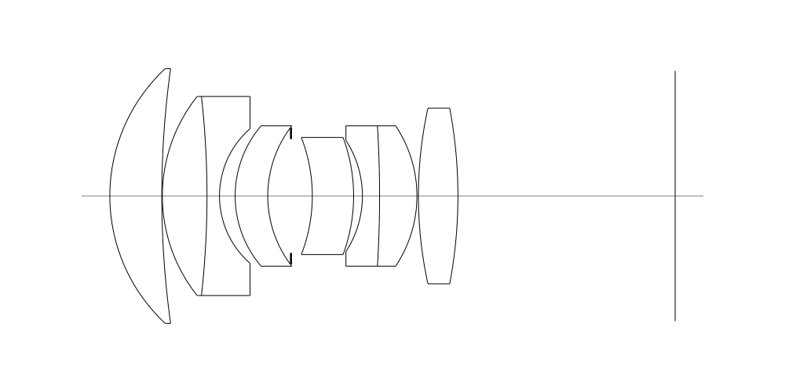
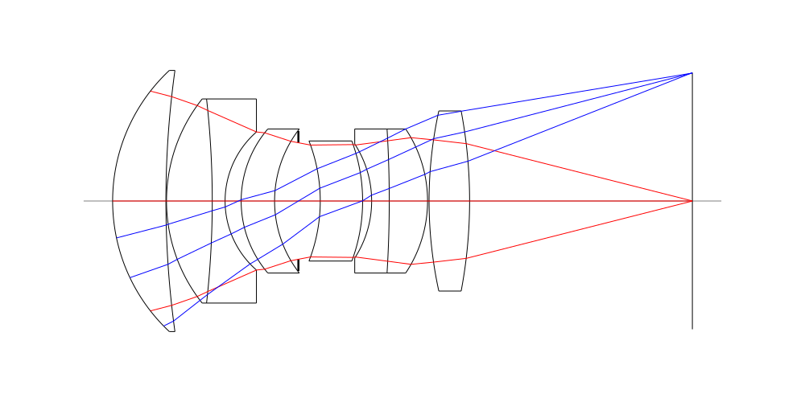
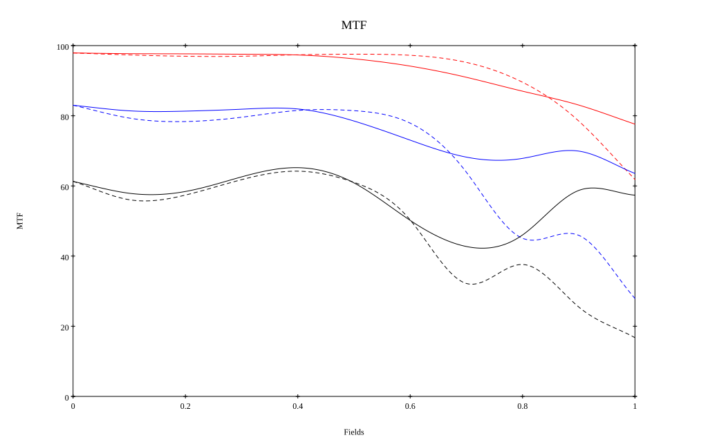
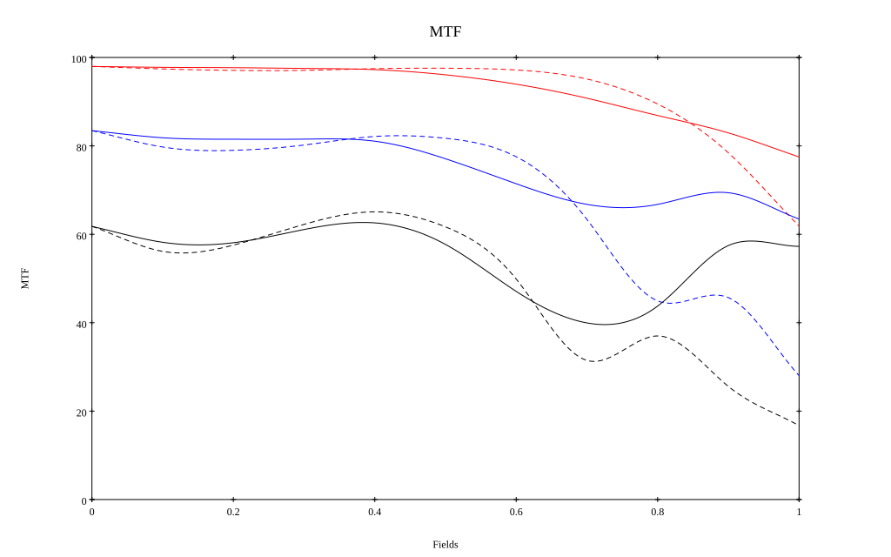

# Leica APO 75mm F2 Walter Mandler
## Surface Data
Note that where glass types are shown the refractive index and abbe number is as per assigned glass type

| ID  | Radius | Thickness | Diameter | nd  | vd  | Glass Make | Glass |
| --- | ---    | ---       | ---      | --- | --- | ---        | ---   |
| 1 | 29.799634943406662 | 8.86509021108287 | 43.5 | 1.5522 | 67.06 | CORNING | B52-67 |
| 2 | 158.42401061106827 | 0.09919892449573932 | 40.0 |  |  |  |
| 3 | 27.3361077987668 | 7.610071309981694 | 34.0 | 1.5522 | 67.06 | CORNING | B52-67 |
| 4 | -153.0052327375608 | 2.1345705702861455 | 34.0 | 1.6134 | 44.29 | Schott | KZFSN4 |
| 5 | 15.28777987790487 | 2.6750840929046906 | 23.0 |  |  |  |
| 6 | 18.451871053459246 | 5.560046130121414 | 24.0 | 1.5522 | 67.06 | CORNING | B52-67 |
| 7 | 19.559170761323486 | 3.9608742681409357 | 20.0 |  |  |  |
| 8 | AS | 3.636087497265689 | 19.446 |  |  |  |
| 9 | -27.612442155192078 | 7.048578463734745 | 20.0 | 1.5522 | 67.06 | CORNING | B52-67 |
| 10 | -28.75224984459082 | 1.5011064658480993 | 20.0 |  |  |  |
| 11 | -17.448750460815734 | 2.9305710627030335 | 19.0 | 1.6134 | 44.29 | Schott | KZFSN4 |
| 12 | -195.60648225125286 | 6.371726250326885 | 24.0 | 1.5522 | 67.06 | CORNING | B52-67 |
| 13 | -21.58940670465875 | 0.25318938460274154 | 24.0 |  |  |  |
| 14 | 70.23151035303151 | 6.741197951360493 | 30.0 | 1.5522 | 67.06 | CORNING | B52-67 |
| 15 | -80.754972127572 | 37.06233781953977 | 30.0 |  |  |  |
## Layouts

## Spot Diagrams

## Paraxial Parameters
| parameter | value |
| ---       | ---   |
| effective_focal_length |74.526
| back_focal_length | 37.223
| optical_invariant | 5.26
| object_distance | 1.0E10
| image_distance | 37.223
| power | 0.013
| pp1_H | 45.498
| ppk_H' | -37.303
| ffl_F | -29.028
| fno | 2.031
| enp_dist_P | 44.494
| enp_radius | 18.344
| exp_dist_P' | -38.16
| exp_radius | 18.594
| m | -0
| red | -1.341819730849422E8
| n_obj | 1
| n_img | 1
| img_ht | 21.37
| obj_ang | 16
| obj_na | 0
| img_na | -0.239|
## Spot Analysis
| Field | Spot Mean Radius | Spot Max Radius |
| ---   | ---              | ---             |
 | Field(x=0.0, y=0.0) | 4.598 | 9.658|
 | Field(x=0.0, y=0.1) | 5.028 | 15.064|
 | Field(x=0.0, y=0.2) | 5.268 | 20.401|
 | Field(x=0.0, y=0.3) | 5.34 | 23.172|
 | Field(x=0.0, y=0.4) | 5.256 | 23.751|
 | Field(x=0.0, y=0.5) | 5.749 | 29.006|
 | Field(x=0.0, y=0.6) | 6.902 | 39.521|
 | Field(x=0.0, y=0.7) | 9.121 | 54.406|
 | Field(x=0.0, y=0.8) | 12.773 | 73.801|
 | Field(x=0.0, y=0.9) | 17.674 | 89.746|
 | Field(x=0.0, y=1.0) | 22.632 | 89.867|
## Polychromatic Geometric MTF

* 10=red,30=blue,50=black cycles/mm
* Solid lines represent sagittal, dashed lines tangential
* To generate above, MTFs for wavelengths 587.5618(d), 486.1327(F), 656.2725(C) were calculated across 10 fields, and then averaged
## Polychromatic Geometric MTF (Weighted)

* 10=red,30=blue,50=black cycles/mm
* Solid lines represent sagittal, dashed lines tangential
* To generate above, MTFs for wavelengths 587.5618(d) wt(1.0), 656.2725(C) wt(0.475), 546.074(e) wt(0.98), 486.1327(F) wt(0.49), 435.8343(g) wt(0.15) were calculated across 10 fields, and then combined using weighted average
## Resources
* [OpticalBench Compatible Data File, tab delimited](./prescription.txt)
* [Zemax file](./specs.zmx)

Report / Zemax file generated using [Beam42](https://github.com/BeamFour/Beam42) on 2026-08-16
