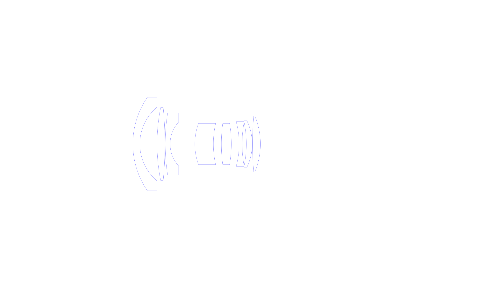
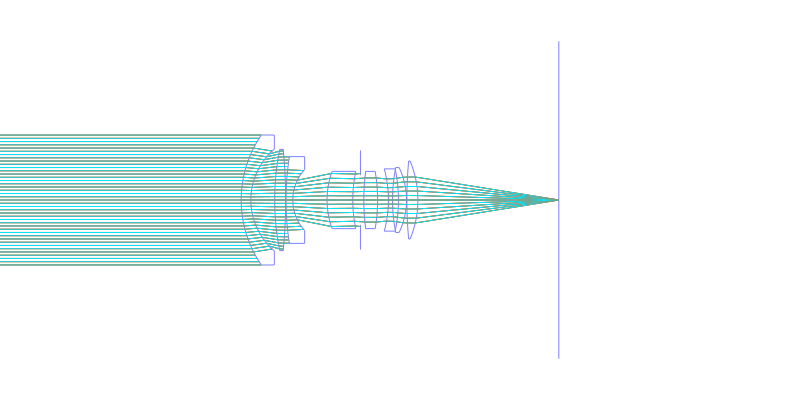
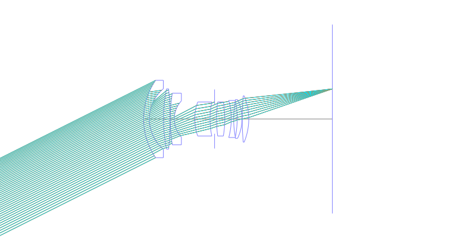
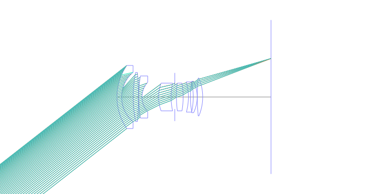
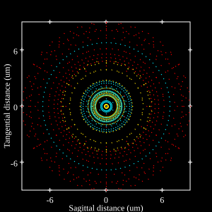
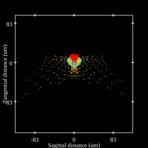
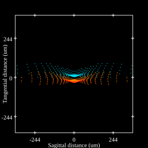

# Leica Elmarit-R f/2.8 (v1)
## Patent Information
| Country | Patent Number | Example | Year of Application | Inventors | Organisation | Link |
| ---     | ---           | ---     | ---                 | ---       | ---          | ---  |
|US | US3740120 | EX 3 | 1971 | R Ruhl | Ernst Leitz Wetzlar GmbH | [link](https://patents.google.com/patent/US3740120A/en) |
## Surface Data
Note that where glass types are shown the refractive index and abbe number is as per assigned glass type

| ID  | Radius | Thickness | Diameter | nd  | vd  | Glass Make | Glass |
| --- | ---    | ---       | ---      | --- | --- | ---        | ---   |
| 1 | 31.2704 | 2.6264 | 35.38 | 1.48749 | 70.44 | Hoya | FC5 |
| 2 | 18.2056 | 6.496 | 27.7 |  |  |  |
| 3 | 70.3752 | 2.9764 | 27.54 | 1.66755 | 41.87 | Hikari | J-BASF6 |
| 4 | -144.9868 | 0.1008 | 27.54 |  |  |  |
| 5 | 75.3648 | 1.8452 | 23.6 | 1.48749 | 70.44 | Hoya | FC5 |
| 6 | 12.2808 | 9.324 | 16.6 |  |  |  |
| 7 | 22.582 | 6.9972 | 15.58 | 1.67003 | 47.2 | Hoya | BAF10 |
| 8 | 36.7584 | 2.093 | 15.58 |  |  |  |
| 9 | AS | 0.9142 | 13.502 |  |  |  |
| 10 | 60.0908 | 3.7604 | 15.58 | 1.691 | 54.7 | Hoya | LAC9 |
| 11 | -45.1836 | 2.9484 | 15.58 |  |  |  |
| 12 | -32.0208 | 1.1032 | 16.94 | 1.78472 | 25.72 | Hoya | FD110 |
| 13 | 44.9736 | 1.6044 | 16.51 |  |  |  |
| 14 | -41.1516 | 2.2064 | 16.51 | 1.691 | 54.7 | Hoya | LAC9 |
| 15 | -20.398 | 0.1008 | 17.64 |  |  |  |
| 16 | 117.3928 | 2.9988 | 21.22 | 1.691 | 54.7 | Hoya | LAC9 |
| 17 | -27.4904 | 38.35 | 21.22 |  |  |  |
## Layouts

## Spot Diagrams

## Paraxial Parameters
| parameter | value |
| ---       | ---   |
| effective_focal_length |28.033
| back_focal_length | 38.479
| optical_invariant | 3.911
| object_distance | 1.0E10
| image_distance | 38.35
| power | 0.036
| pp1_H | 36.235
| ppk_H' | -10.445
| ffl_F | 8.202
| fno | 2.8
| enp_dist_P | 21.889
| enp_radius | 5.006
| exp_dist_P' | -18.936
| exp_radius | 10.253
| m | 0.005
| red | -3.5671625057207316E8
| n_obj | 1
| n_img | 1
| img_ht | 21.902
| obj_ang | 38
| obj_na | 0
| img_na | -0.176|
## Spot Analysis
| Field | Spot Mean Radius | Spot Max Radius |
| ---   | ---              | ---             |
 | 0.0 | 5.015 | 9.748|
 | 0.7 | 24.021 | 125.141|
 | 1.0 | 106.411 | 370.458|
## Resources
* [OpticalBench Compatible Data File, tab delimited](./US003740120_Example03.txt)
* [Zemax file](./US003740120_Example03.zmx)
