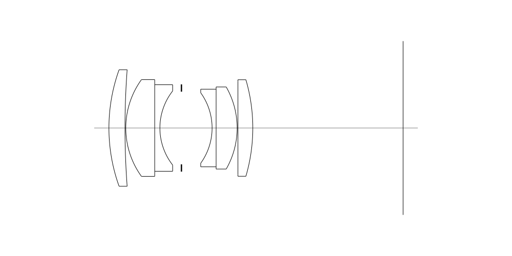
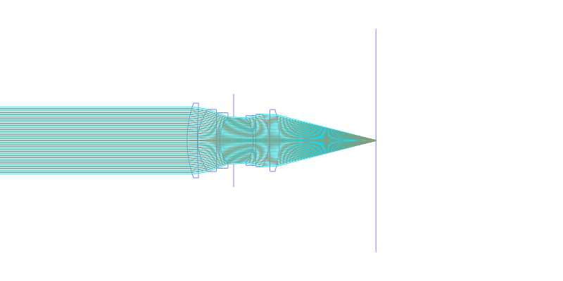
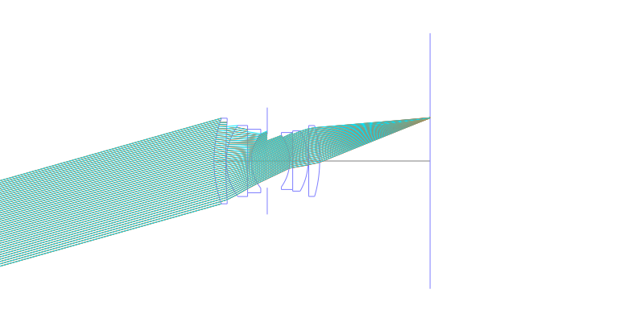
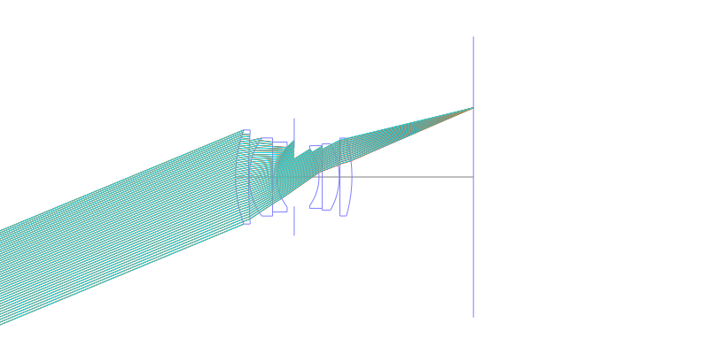
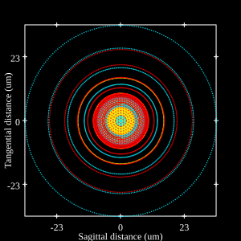
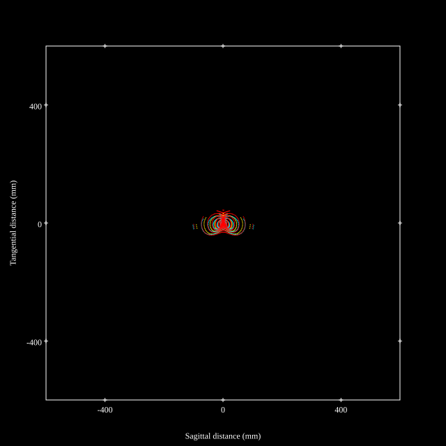
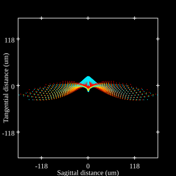
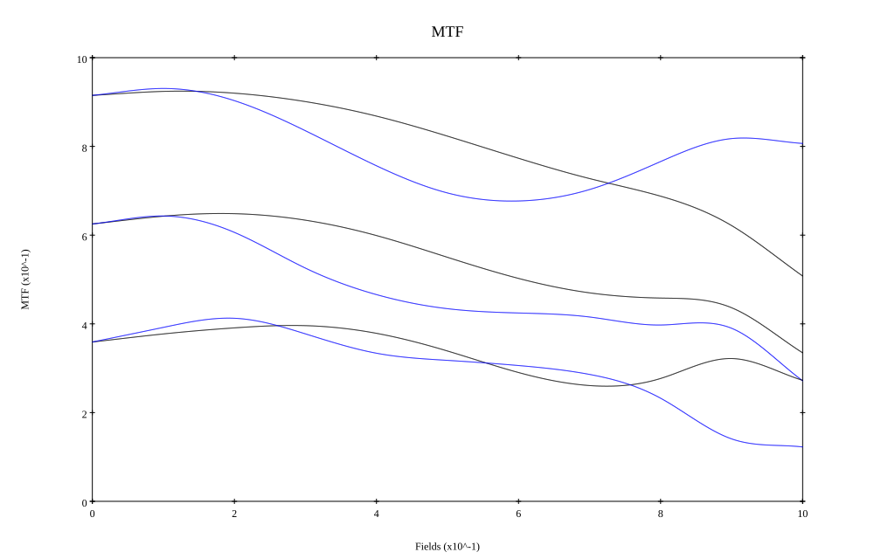

# Leica Summicron R 50mm f/2
## Patent Information
| Country | Patent Number | Example | Year of Application | Inventors | Organisation | Link |
| ---     | ---           | ---     | ---                 | ---       | ---          | ---  |
|US | US4123144 | EX 8 | 1976 | Walter Mandler,Garry Edwards,Erich Wagner | Ernst Leitz Wetzlar GmbH | [link](https://patents.google.com/patent/US4123144A/en) |
## Surface Data
Note that where glass types are shown the refractive index and abbe number is as per assigned glass type

| ID  | Radius | Thickness | Diameter | nd  | vd  | Glass Make | Glass |
| --- | ---    | ---       | ---      | --- | --- | ---        | ---   |
| 1 | 42.71 | 3.99 | 28.94 | 1.72828 | 28.53 | Schott | N-SF10 |
| 2 | 195.38 | 0.2 | 27.06 |  |  |  |
| 3 | 20.5 | 7.18 | 24.02 | 1.66755 | 41.87 | Hikari | J-BASF6 |
| 4 | 0.0 | 1.29 | 21.49 | 1.78472 | 25.68 | Schott | N-SF11 |
| 5 | 14.94 | 5.35 | 18.39 |  |  |  |
| 6 | AS | 7.61 | 18.059 |  |  |  |
| 7 | -14.94 | 1.0 | 17.5 | 1.64769 | 33.82 | Schott | N-SF2 |
| 8 | 0.0 | 5.22 | 19.27 | 1.788 | 47.49 | Schott | N-LAF21 |
| 9 | -20.5 | 0.2 | 20.38 |  |  |  |
| 10 | 0.0 | 3.69 | 22.96 | 1.788 | 47.49 | Schott | N-LAF21 |
| 11 | -42.71 | 37.32 | 23.97 |  |  |  |
## Layouts

## Spot Diagrams

## Paraxial Parameters
| parameter | value |
| ---       | ---   |
| effective_focal_length |52.087
| back_focal_length | 37.424
| optical_invariant | 5.394
| object_distance | 1.0E10
| image_distance | 37.424
| power | 0.019
| pp1_H | 28.081
| ppk_H' | -14.663
| ffl_F | -24.006
| fno | 2
| enp_dist_P | 20.194
| enp_radius | 13.022
| exp_dist_P' | -23.853
| exp_radius | 15.345
| m | -0
| red | -1.9198646219643754E8
| n_obj | 1
| n_img | 1
| img_ht | 21.575
| obj_ang | 22.5
| obj_na | 0
| img_na | -0.243|
## Spot Analysis
| Field | Spot Mean Radius | Spot Max Radius |
| ---   | ---              | ---             |
 | Field(x=0.0, y=0.0) | 9.415 | 33.563|
 | Field(x=0.0, y=0.1) | 7.426 | 35.386|
 | Field(x=0.0, y=0.2) | 8.493 | 39.754|
 | Field(x=0.0, y=0.3) | 11.193 | 47.079|
 | Field(x=0.0, y=0.4) | 14.361 | 55.706|
 | Field(x=0.0, y=0.5) | 17.591 | 68.61|
 | Field(x=0.0, y=0.6) | 19.506 | 84.682|
 | Field(x=0.0, y=0.7) | 21.969 | 102.951|
 | Field(x=0.0, y=0.8) | 25.944 | 122.073|
 | Field(x=0.0, y=0.9) | 31.225 | 142.099|
 | Field(x=0.0, y=1.0) | 37.242 | 155.299|
## Geometric MTF

* 10,30,50 cycles/mm
* Black lines represent sagittal, blue tangential
## Resources
* [OpticalBench Compatible Data File, tab delimited](./US004123144_Example08P.txt)
* [Zemax file](./US004123144_Example08P.zmx)
